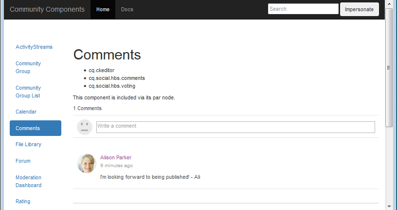

# Så här konfigurerar du MongoDB för demo {#how-to-setup-mongodb-for-demo}

>[!CAUTION]
>
>AEM 6.4 har nått slutet på den utökade supporten och denna dokumentation är inte längre uppdaterad. Mer information finns i [teknisk supportperiod](https://helpx.adobe.com/support/programs/eol-matrix.html). Hitta de versioner som stöds [här](https://experienceleague.adobe.com/docs/).

## Introduktion {#introduction}

I den här självstudiekursen beskrivs hur du konfigurerar [MSRP](msrp.md) for *en författare* instans och *en publicering* -instans.

Med den här konfigurationen är communityinnehållet tillgängligt både från författare- och publiceringsmiljöer utan att behöva vidarebefordra eller omvända replikera användargenererat innehåll (UGC).

Den här konfigurationen är lämplig för *icke-produktion* miljöer som utveckling och/eller demonstration.

**A *produktion* miljön bör:**

* Kör MongoDB med en replikuppsättning
* Använd SolrCloud
* Innehåller flera utgivarinstanser

## MongoDB {#mongodb}

### Installera MongoDB {#install-mongodb}

* Hämta MongoDB från [https://www.mongodb.org/](https://www.mongodb.org/)

   * Val av operativsystem:

      * Linux
      * Mac 10.8
      * Windows 7
   * Val av version:

      * Använd minst version 2.6

* Grundkonfiguration

   * Följ installationsanvisningarna för MongoDB
   * Konfigurera för mongod

      * Du behöver inte konfigurera mongor eller delningar
   * Den installerade MongoDB-mappen kallas &lt;mongo-install>
   * Den definierade datakatalogsökvägen kallas &lt;mongo-dbpath>

* MongoDB kan köras på samma värd som AEM eller fjärrköras

### Starta MongoDB {#start-mongodb}

* &lt;mongo-install>/bin/mongod —dbpath &lt;mongo-dbpath>

Detta startar en MongoDB-server med standardport 27017.

* För Mac ökar du ulimit med start arg &#39;ulimit -n 2048&#39;

>[!NOTE]
>
>Om MongoDB startas *efter* AEM, **starta** alla **AEM** -instanser så att de kan ansluta till MongoDB.

### Demo Production Option: Konfigurera MongoDB-replikuppsättning {#demo-production-option-setup-mongodb-replica-set}

Följande kommandon är ett exempel på hur du konfigurerar en replikuppsättning med 3 noder på localhost:

* bin/mongod —port 27017 —dbpath data —replSet rs0&amp;
* bin/mongo

   * cfg = {&quot;_id&quot;: &quot;rs0&quot;,&quot;version&quot;: 1,&quot;medlemmar&quot;: [{&quot;_id&quot;: 0,&quot;värd&quot;: &quot;127.0.0.1:27017&quot;}]}
   * rs.initiate(cfg)

* bin/mongod —port 27018 —dbpath data1 —replSet rs0&amp;
* bin/mongod —port 27019 —dbpath data2 —replSet rs0&amp;
* bin/mongo

   * rs.add(&quot;127.0.0.1:27018&quot;)
   * rs.add(&quot;127.0.0.1:27019&quot;)
   * rs.status()

## Solr {#solr}

### Installera Solr {#install-solr}

* Hämta Solr från [Apache Lucene](https://archive.apache.org/dist/lucene/solr/):

   * Passar alla operativsystem
   * Använd version 4.10 eller version 5
   * Solr kräver Java 1.7 eller senare

* Grundkonfiguration

   * Följ exempelinställningarna för Solr
   * Ingen tjänst behövs
   * Den installerade Solr-mappen kallas &lt;solr-install>

### Konfigurera Solr för AEM Communities {#configure-solr-for-aem-communities}

Om du vill konfigurera en Solr-samling för MSRP för demo måste du fatta två beslut (markera länkarna till huvuddokumentationen för mer information):

1. Kör Solr i fristående eller [SolrCloud-läge](msrp.md#solrcloudmode)
1. Installera [standard](msrp.md#installingstandardmls) eller [avancerat](msrp.md#installingadvancedmls) flerspråkig sökning (MLS)

### Fristående solr {#standalone-solr}

Metoden för att köra Solr kan variera beroende på version och installationssätt. The [Referenshandbok för solenergi](https://archive.apache.org/dist/lucene/solr/ref-guide/) är den officiella dokumentationen.

Om du till exempel använder version 4.10 kan du enkelt starta Solr i fristående läge:

* cd till &lt;solrinstall>/example
* java -jar start.jar

Detta startar en Solr HTTP-server med standardport 8983. Du kan bläddra till Solr Console för att få en Solr-konsol för testning.

* standardSolr-konsol: [http://localhost:8983/solr/](http://localhost:8983/solr/)

>[!NOTE]
>
>Om Solr Console inte är tillgänglig kontrollerar du loggarna under &lt;solrinstall>/example/logs. Kontrollera om SOLR försöker binda till ett specifikt värdnamn som inte kan matchas (t.ex. &quot;user-macbook-pro&quot;).
Om så är fallet kan du uppdatera etc/hosts-filen med en ny post för detta värdnamn (t.ex. 127.0.0.1 user-macbook-pro) och Solr startas korrekt.

### SolrCloud {#solrcloud}

Om du vill köra en mycket grundläggande (inte produktion) solrCloud-installation börjar du med:

* java -Dbootstrap_confidir=./solr/collection1/conf -Dbootstrap_conf=true -DzkRun -jar start.jar

## Identifiera MongoDB som Common Store {#identify-mongodb-as-common-store}

Starta författaren och publicera AEM om det behövs.

Om AEM kördes innan MongoDB startades måste AEM startas om.

Följ instruktionerna på huvuddokumentationssidan: [MSRP - MongoDB Common Store](msrp.md)

## Testa {#test}

Om du vill testa och verifiera den gemensamma lagringsplatsen för MongoDB skickar du en kommentar på publiceringsinstansen och visar den på författarinstansen, samt UGC:n i MongoDB och Solr:

1. I publiceringsinstansen bläddrar du till [Community Components Guide](http://localhost:4503/content/community-components/en/comments.html) och väljer kommentarkomponenten.
1. Logga in för att publicera en kommentar:
1. Ange text i kommentartextrutan och klicka på **[!UICONTROL Post]**

   

1. Visa bara kommentaren i [författarinstans](http://localhost:4502/content/community-components/en/comments.html) (troligen fortfarande inloggad som administratör/administratör).

   

   Obs! medan det finns JCR-noder under *asipath* på författaren är dessa för SCF-ramverket. Den faktiska UGC:n finns inte i JCR, utan i MongoDB.

1. Se användargenerationen i mongudb **[!UICONTROL Communities > Collections > Content]**

   

1. Visa användargenererat innehåll i Solr:

   * Bläddra till Solr-instrumentpanelen: [http://localhost:8983/solr/](http://localhost:8983/solr/)
   * Användare `core selector` för att markera `collection1`
   * Välj `Query`
   * Välj `Execute Query`

   

## Felsökning {#troubleshooting}

### Ingen UGC visas {#no-ugc-appears}

1. Kontrollera att MongoDB är installerat och körs korrekt.

1. Kontrollera att MSRP har konfigurerats som standardprovider:

   * Om du skriver och publicerar AEM kan du gå till [Konsol för lagringskonfiguration](srp-config.md)

   eller kontrollera AEM:

   * I JCR, om [/etc/socialconfig](http://localhost:4502/crx/de/index.jsp#/etc/socialconfig/)

      * Innehåller inte [srpc](http://localhost:4502/crx/de/index.jsp#/etc/socialconfig/srpc) nod, det betyder att lagringsprovidern är JSRP
      * Om srpc-noden finns och innehåller nod [defaultconfiguration](http://localhost:4502/crx/de/index.jsp#/etc/socialconfig/srpc/defaultconfiguration)ska standardkonfigurationens egenskaper definiera att MSRP ska vara standardprovider

1. Se till att AEM startades om när MSRP har valts.
