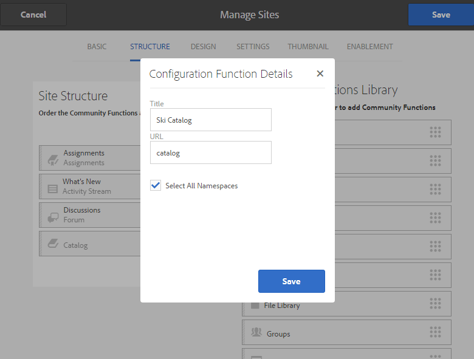

# Skapa en ny communitywebbplats för aktivering {#author-a-new-community-site-for-enablement}

## Skapa communitywebbplats {#create-community-site}

[Community Site ](sites-console.md) creationanvänder en guide som vägleder dig genom de olika stegen för att skapa en community-webbplats. Du kan gå vidare till `Next`steget eller `Back`till föregående steg innan du implementerar platsen i det sista steget.

Så här kommer du igång med att skapa en ny community-webbplats:

Använda [författarinstansen](http://localhost:4502/)

* Logga in med administratörsbehörighet
* Navigera till **[!UICONTROL Communities > Sites]**

* Välj **[!UICONTROL Create]**

### Steg 1: Platsmall {#step-site-template}

I steget **Webbplatsmall** anger du en titel, beskrivning, namn för webbadressen och väljer en mall för en community-webbplats, till exempel:

* **Webbplatstitel** för communityn:  `Enablement Tutorial`

* **Beskrivning** av communityplats:  `A site for enabling the community to learn.`

* **Rotadress** för communityplats: (lämna tomt för standardroten  `/content/sites`)

* **Molnkonfigurationer**: (lämna tomt om ingen molnkonfiguration har angetts) ange sökvägen till de angivna molnkonfigurationerna.
* **Grundspråk** för communitywebbplats: (lämnas orört för ett enda språk: På engelska) använder du listrutan för att välja ett  *eller* flera språk bland de tillgängliga språken - tyska, italienska, franska, japanska, spanska, portugisiska (Brasilien), kinesiska (traditionell) och kinesiska (förenklad). En communityplats skapas för varje språk som läggs till och finns i samma webbplatsmapp enligt den bästa praxis som beskrivs i [Översätta innehåll för flerspråkiga platser](../../help/sites-administering/translation.md). Rotsidan för varje webbplats kommer att innehålla en underordnad sida med språkkoden för ett av de valda språken, till exempel &quot;en&quot; för engelska eller &quot;fr&quot; för franska.

* **[!UICONTROL Community Site Name]**: `enable`

   * den inledande URL:en visas under namnet på communityplatsen
   * för en giltig URL, lägg till en baskod + &quot;.html&quot;

      *till exempel* http://localhost:4502/content/sites/  `enable/en.html`

* **[!UICONTROL Reference Site Template]**: dra nedåt för att välja  `Reference Structured Learning Site Template`

Välj **[!UICONTROL Next]**

### Steg 2: Design {#step-design}

Designsteget presenteras i två avsnitt där du kan välja tema och varumärkesbanderoll:

#### TEMA FÖR GEMENSKAPENS WEBBPLATS {#community-site-theme}

Välj det format som du vill använda på mallen. När du väljer det här alternativet överlagras temat med en bockmarkering.

#### GEMENSKAPENS WEBBPLATSVARNING {#community-site-branding}

(valfritt) Ladda upp en banderollbild som ska visas på webbplatsens sidor. Banderollen är fäst vid webbläsarens vänstra kant, mellan communitywebbplatsens sidhuvud och meny (navigeringslänkar). Banderollhöjden beskärs till 120 pixlar. Banderollens storlek ändras inte så att den passar webbläsarens bredd och höjden 120 pixlar.

 

Välj **[!UICONTROL Next]**.

### Steg 3: Inställningar {#step-settings}

Innan du väljer `Next` i steget Inställningar finns det sju avsnitt som ger åtkomst till konfigurationer som användarhantering, taggning, roller, moderering, analys, översättning och aktivering.

#### ANVÄNDARHANTERING {#user-management}

Vi rekommenderar att [aktiveringsgrupper](overview.md#enablement-community) är privata.

En communitywebbplats är privat när anonyma besökare på webbplatsen nekas åtkomst, inte får registrera sig själv och inte får använda social inloggning.

Kontrollera att de flesta kryssrutor är avmarkerade för [Användarhantering](sites-console.md#user-management):

* Tillåt INTE webbplatsbesökare att registrera sig själva
* Tillåt INTE anonyma webbplatsbesökare att visa webbplatsen
* Valfritt om meddelanden ska tillåtas bland communitymedlemmar eller inte
* Tillåt INTE inloggning med Facebook
* Tillåt INTE inloggning med Twitter

#### TAGGAR {#tagging}

De taggar som kan användas för communityinnehåll kontrolleras genom att AEM namnutrymmen som tidigare definierats via [taggningskonsolen](../../help/sites-administering/tags.md#tagging-console) (till exempel namnutrymmet [Tutorial](enablement-setup.md#create-tutorial-tags)) väljs.

Om du väljer Taggnamnutrymmen för communitywebbplatsen begränsas dessutom det urval som visas när du definierar kataloger och aktiveringsresurser. Se [Tagga aktiveringsresurser](tag-resources.md) för viktig information.

Det är enkelt att hitta namnutrymmen med typsnittssökning. Till exempel,

* Skriv tut
* Välj `Tutorial`

### ROLLER {#roles}

[Gruppmedlemsroller ](users.md) tilldelas via inställningarna i avsnittet Roller.

Om du vill att en community-medlem (eller grupp av medlemmar) ska kunna uppleva webbplatsen som community-hanterare använder du typsnittssökningen och väljer medlemmens eller gruppens namn bland alternativen i listrutan.

Till exempel,

* Skriv &quot;q&quot;
* Välj [Quinn Harper](enablement-setup.md#publishcreateenablementmembers)

>[!NOTE]
>
>[Tunneltjänsten ](deploy-communities.md#tunnel-service-on-author) gör det möjligt att välja medlemmar och grupper som finns endast i publiceringsmiljön.

#### MODERATION {#moderation}

Acceptera de globala standardinställningarna för [moderering](sites-console.md#moderation) användargenererat innehåll (UGC).

#### ANALYTIK {#analytics}

I listrutan väljer du Analytics-molntjänstramverket som är konfigurerat för den här communitywebbplatsen.

Markeringen som visas på skärmbilden `Communities` är ett ramverksexempel från [konfigurationsdokumentationen.](analytics.md#aem-analytics-framework-configuration)

#### TRANSLATION {#translation}

[Översättningsinställningarna](sites-console.md#translation) anger om UGC kan översättas eller inte och till vilket språk, om så är fallet.

* Kontroll **[!UICONTROL Allow Machine Translation]**
* Använd standardinställningarna

#### AKTIVERA {#enablement}

För en aktiveringscommunity måste du identifiera en eller flera aktiveringsansvariga i communityn.

* **[!UICONTROL Enablement Managers]**
(obligatoriskt) Medlemmar i 
`Community Enablement Managers` gruppen är tillgänglig för att väljas för att hantera den här communitywebbplatsen.

   * Skriv &quot;s&quot;
   * Välj `Sirius Nilson`

* **[!UICONTROL Marketing Cloud Org Id]**
(valfritt) ID:t för ett Adobe Analytics-konto som är nödvändigt när  [Video Heartbeat ](analytics.md#video-heartbeat-analytics) Analytics inkluderas i aktiveringsrapporteringen.

Välj **[!UICONTROL Next]**.

### Steg 4: Skapa communitywebbplats {#step-create-community-site}

Välj **[!UICONTROL Create]**.

När processen är klar visas mappen för den nya platsen i konsolen Communities - Sites.

### Publicera den nya communitywebbplatsen {#publish-the-new-community-site}

Den skapade webbplatsen bör hanteras från konsolen Communities - Sites, samma konsol som nya platser kan skapas från.

När du har valt communityplatsens mapp för du muspekaren över platsikonen så att fyra åtgärdsikoner visas:

När du väljer ellipsikonen (ikonen Fler åtgärder) visas alternativen Exportera plats och Ta bort plats.

Från vänster till höger är de:

* **Öppna**
webbplatsVälj pennikonen om du vill öppna communitywebbplatsen i redigeringsläge, lägga till och/eller konfigurera sidkomponenter

* **Redigera**
webbplatsVälj egenskapsikonen om du vill öppna communitywebbplatsen för ändring av egenskaper, till exempel titeln, eller om du vill ändra temat

* **Publicera**
webbplatsVälj ikonen world för att publicera communitywebbplatsen (till localhost:4503 som standard)

* **Exportera**
platsVälj exportikonen för att skapa ett paket för communitywebbplatsen som både lagras i  [pakethanteraren ](../../help/sites-administering/package-manager.md) och hämtas.

   Observera att UGC inte ingår i platspaketet.

* **Ta bort**
platsOm du vill ta bort communitywebbplatsen väljer du ikonen Ta bort plats som visas när du håller muspekaren över webbplatsen i Webbplatskonsol. Den här åtgärden tar bort alla objekt som är associerade med platsen, till exempel UGC, användargrupper, resurser och databasposter.

#### Välj Publicera {#select-publish}

Välj världsikonen för att publicera communitywebbplatsen.

Det kommer att finnas en indikation på att webbplatsen har publicerats.

## Community-användare och användargrupper {#community-users-user-groups}

### Meddelande om nya användargrupper i användargruppen {#notice-new-community-user-groups}

Tillsammans med den nya communitywebbplatsen skapas nya användargrupper som har rätt behörigheter för olika administrativa funktioner. Mer information finns i [Användargrupper för Community Sites](users.md#usergroupsforcommunitysites).

Med tanke på webbplatsens namn &quot;enable&quot; i steg 1 kan de nya användargrupperna som finns i publiceringsmiljön ses från [webbgruppskonsolen](members.md#groups-console):

### Tilldela medlemmar till gruppen Aktivera medlemmar {#assign-members-to-community-enable-members-group}

Om tunneltjänsten är aktiverad för författaren kan du tilldela [användarna som skapades under den första konfigurationen](enablement-setup.md#publishcreateenablementmembers) till communitymedlemsgruppen för den nyligen skapade communitywebbplatsen.

Med hjälp av gruppkonsolen kan medlemmar läggas till individuellt eller genom medlemskap i en grupp.

I det här exemplet läggs gruppen `Community Ski Class` till som medlem i gruppen `Community Enable Members` och medlem `Quinn Harper`.

* Navigera till **[!UICONTROL Communities > Groups]**-konsolen
* Välj gruppen **[!UICONTROL Community Enable Members]**
* Ange `ski` i sökrutan **[!UICONTROL Add Members To Group]**
* Välj **[!UICONTROL Community Ski Class]** (grupp av elever)
* Ange `quinn` i sökrutan
* Välj **[!UICONTROL Quinn Harper]** (aktivera resurskontakt)

* Välj **[!UICONTROL Save]**

## Konfigurationer vid publicering {#configurations-on-publish}

### http://localhost:4503/content/sites/enable/en.html {#http-localhost-content-sites-enable-en-html}

### Konfigurera för autentiseringsfel {#configure-for-authentication-error}

När en webbplats har konfigurerats och publicerats konfigurerar [du inloggningsmappningen](sites-console.md#configure-for-authentication-error) ( `Adobe Granite Login Selector Authentication Handler`) på publiceringsinstansen. Fördelen är att när inloggningsuppgifter inte anges korrekt kommer autentiseringsfelet att visa inloggningssidan för communitywebbplatsen igen med ett felmeddelande.

Lägg till en `Login Page Mapping` som

* /content/sites/enable/en/signin:/content/sites/enable/en

### (Valfritt) Ändra standardstartsidan {#optional-change-the-default-home-page}

När du arbetar med publiceringswebbplatsen i demonstrationssyfte kan det vara praktiskt att ändra standardhemsidan till den nya webbplatsen.

Om du vill göra det måste du använda [CRX|DE](http://localhost:4503/crx/de) Lite för att redigera resursmappningstabellen [vid publicering.](../../help/sites-deploying/resource-mapping.md)

För att komma igång

1. Vid publicering får du åtkomst till CRXDE och loggar in med administratörsbehörighet

   * Bläddra till exempel till [http://localhost:4503/crx/de](http://localhost:4503/crx/de) och logga in med `admin/admin`

1. Expandera `/etc/map` i projektwebbläsaren
1. Välj noden `http`

   * Välj **[!UICONTROL Create Node]**

      * **** Namelocalhost.4503

         (Använd *inte* `:`)

      * **** [typbestämning:mappning](https://sling.apache.org/documentation/the-sling-engine/mappings-for-resource-resolution.html)

1. Med den nyskapade `localhost.4503`-noden markerad

   * Lägg till egenskap

      * **** namngivning:matchning
      * **** TypeString
      * **** Valuelocalhost.4503/\$

         (Måste sluta med tecknet &#39;$&#39;)
   * Lägg till egenskap

      * **** namngivning:internalRedirect
      * **** TypeString
      * **Värde** /content/sites/enable/en.html

1. Välj **[!UICONTROL Save All]**
1. (valfritt) Ta bort webbläsarhistoriken
1. Gå till http://localhost:4503/

   * Ankomst till http://localhost:4503/content/sites/enable/en.html

>[!NOTE]
>
>Lägg bara till egenskapsvärdet `sling:match` med x - `xlocalhost.4503/$` - och **[!UICONTROL Save All]** för att inaktivera.

#### Felsökning: Det gick inte att spara kartan {#troubleshooting-error-saving-map}

Om det inte går att spara ändringarna måste du kontrollera att nodnamnet är `localhost.4503`, har en punktavgränsare och inte `localhost:4503` med en kolonavgränsare, eftersom `localhost`inte är ett giltigt namnområdesprefix.

#### Felsökning: Det gick inte att omdirigera {#troubleshooting-fail-to-redirect}

&#39;**$**&#39; i slutet av det reguljära uttrycket `sling:match`strängen är avgörande, så att endast exakt `http://localhost:4503/` mappas, annars läggs omdirigeringsvärdet till alla sökvägar som kan finnas efter server:port i URL:en. När AEM försöker dirigera om till inloggningssidan misslyckas den alltså.

## Ändra communityplatsen {#modifying-the-community-site}

När webbplatsen har skapats kan författare använda ikonen [Öppna plats](sites-console.md#authoring-site-content) för att utföra AEM.

Dessutom kan administratörer använda ikonen [Redigera plats](sites-console.md#modifying-site-properties) för att ändra egenskaper för platsen, till exempel titeln.

När du har ändrat något bör du komma ihåg att **spara** och göra om-**Publicera** webbplatsen.

>[!NOTE]
>
>Om du inte känner till AEM kan du läsa dokumentationen om [grundläggande hantering](../../help/sites-authoring/basic-handling.md) och en [snabbguide till redigeringssidor](../../help/sites-authoring/qg-page-authoring.md).

### Lägg till en katalog {#add-a-catalog}

Den communityplatsmall som valts för den här communitywebbplatsen bör innehålla katalogfunktionen.

Om inte kan du enkelt lägga till katalogfunktionen. På så sätt kan andra medlemmar i communityn, som inte är tilldelade till aktiveringsresurser eller en utbildningsväg, välja aktiveringsresurser från en katalog.

Om platsstrukturen redan innehåller katalogfunktionen kan dess namn ändras.

Om du vill ändra platsens struktur går du till **[!UICONTROL Communities, Sites]**-konsolen, öppnar mappen `enable` och väljer ikonen **Redigera plats** för att komma åt egenskaperna för `Enablement Tutorial`.

Välj STRUKTURpanelen om du vill lägga till en katalog eller ändra en befintlig katalog:

* **Titel**:  `Ski Catalog`

* **URL**:  `catalog`

* **Markera alla namnutrymmen**: lämna som standard.
* Välj **[!UICONTROL Save]**

Använd placeringsikonen för att flytta katalogfunktionen till den andra positionen, efter tilldelningar.

Välj **[!UICONTROL Save]** i det övre högra hörnet för att spara ändringarna på communitywebbplatsen.

Gör sedan om -**Publicera** webbplatsen.