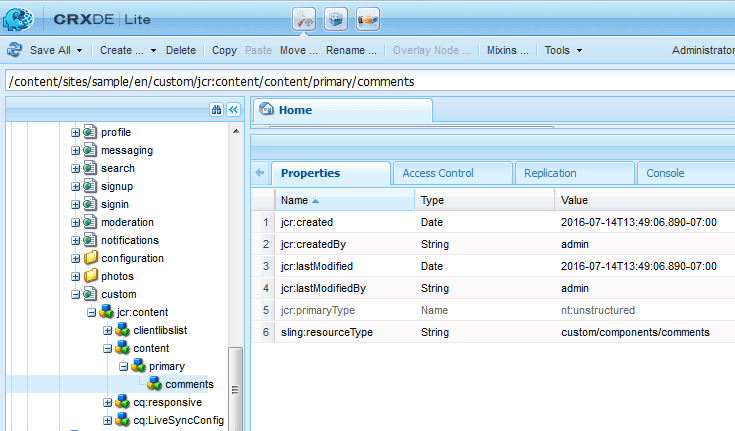

# Lägg till kommentar på exempelsida {#add-comment-to-sample-page}

>[!CAUTION]
>
>AEM 6.4 har nått slutet på den utökade supporten och denna dokumentation är inte längre uppdaterad. Mer information finns i [teknisk supportperiod](https://helpx.adobe.com/support/programs/eol-matrix.html). Hitta de versioner som stöds [här](https://experienceleague.adobe.com/docs/).

Nu när komponenterna för det anpassade kommentarsystemet finns på plats i programkatalogen (/apps) är det möjligt att använda den utökade komponenten. Instansen av kommentarsystemet på en webbplats som ska påverkas måste ange att dess resourceType ska vara det anpassade kommentarsystemet och innehålla alla nödvändiga klientbibliotek.

## Identifiera nödvändiga klienter {#identify-required-clientlibs}

Klientbiblioteken som är nödvändiga för att standardkommentarerna ska fungera är också nödvändiga för utökade kommentarer.

The [Community Components Guide](components-guide.md) identifierar nödvändiga klientbibliotek. Bläddra till komponentguiden och visa komponenten Kommentarer, till exempel:

[http://localhost:4502/content/community-components/en/comments.html](http://localhost:4502/content/community-components/en/comments.html)

Observera de tre klientbiblioteken som krävs för att kommentarerna ska kunna återges och fungera korrekt. Dessa måste inkluderas där de utökade kommentarerna refereras, samt [extended Comments klientbibliotek](extend-create-components.md#create-a-client-library-folder) ( `apps.custom.comments`).

## Lägga till anpassade kommentarer på en sida {#add-custom-comments-to-a-page}

Eftersom det bara kan finnas ett kommentarsystem per sida är det enklare att skapa en exempelsida enligt beskrivningen i det korta [Skapa en exempelsida](create-sample-page.md) självstudiekurs.

När du har skapat programmet går du till designläge och gör den anpassade komponentgruppen tillgänglig så att `Alt Comments` -komponent som ska läggas till på sidan.

För att kommentaren ska visas och fungera på rätt sätt måste klientbiblioteken för kommentarer läggas till i klientlistorlistan för sidan (se [Clientlibs for Communities Components](clientlibs.md)).

### Kommentarsklipp på exempelsida {#comments-clientlibs-on-sample-page}

### Författare: Alt-kommentar på exempelsida {#author-alt-comment-on-sample-page}

### Författare: Exempelnod för sidkommentarer {#author-sample-page-comments-node}

Du kan verifiera resourceType i CRXDE genom att visa egenskaperna för kommentarnoden för exempelsidan på `/content/sites/sample/en/jcr:content/content/primary/comments`.

### Publicera exempelsida {#publish-sample-page}

När den anpassade komponenten har lagts till på sidan är det också nödvändigt att (re) [publicera sidan](sites-console.md#publishing-the-site).

### Publicera: Alt-kommentar på exempelsida {#publish-alt-comment-on-sample-page}

När du har publicerat både det anpassade programmet och exempelsidan bör det vara möjligt att ange en kommentar. Vid inloggning, antingen med [demoanvändare](tutorials.md#demo-users) eller admin, kan du publicera en kommentar.

Här är aaron.mcdonald@mailinator.com som publicerar en kommentar:

 

Nu när den utökade komponenten ser ut som den ska med standardutseendet är det dags att ändra utseendet.
