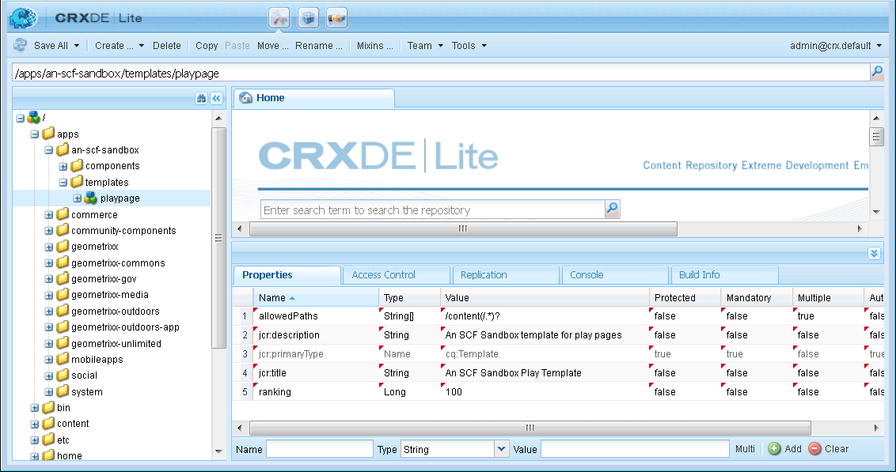

# Ursprungligt sandlådeprogram {#initial-sandbox-application}

I det här avsnittet skapar du följande:

* Den **[mall](#createthepagetemplate)** som ska användas för att skapa innehållssidor på exempelwebbplatsen
* **[komponenten och skriptet](#create-the-template-s-rendering-component)** som ska användas för att återge webbplatssidorna

## Skapa innehållsmallen {#create-the-content-template}

En mall definierar standardinnehållet för en ny sida. Komplexa webbplatser kan använda flera mallar för att skapa olika typer av sidor på webbplatsen. Dessutom kan malluppsättningen bli en plan som används för att göra ändringar i ett kluster med servrar.

I den här övningen är alla sidor baserade på en enkel mall.

1. I utforskarfönstret i CRXDE Lite

   * select `/apps/an-scf-sandbox/templates`
   * **[!UICONTROL Create > Create Template]**

1. I dialogrutan Skapa mall skriver du följande värden och klickar sedan på **[!UICONTROL Next]**:

   * Etikett: `playpage`
   * Titel: `An SCF Sandbox Play Template`
   * Beskrivning: `An SCF Sandbox template for play pages`
   * Resurstyp: `an-scf-sandbox/components/playpage`
   * Rankning: &lt;lämna som standard>

   Etiketten används som nodnamn.

   Resurstypen visas på noden jcr:content för `playpage` som egenskapen `sling:resourceType`. Den identifierar komponenten (resursen) som återger innehållet när det begärs av en webbläsare.

   I det här fallet återges alla sidor som skapas med `playpage`mallen av `an-scf-sandbox/components/playpage`-komponenten. Sökvägen till komponenten är relativ, vilket innebär att Sling kan söka efter resursen först i mappen `/apps` och, om den inte hittas, i mappen `/libs`.

   

1. Om du använder kopiera/klistra in ska du kontrollera att värdet för Resurstyp inte har några inledande eller avslutande blanksteg.

   Klicka på **[!UICONTROL Next]**.

1. &quot;Tillåtna sökvägar&quot; avser sökvägarna till sidor som använder den här mallen, så att mallen visas för dialogrutan **[!UICONTROL New Page]**.

   Om du vill lägga till en sökväg klickar du på plusknappen `+` och skriver `/content(/.&ast;)?` i textrutan som visas. Om du använder kopiera/klistra in ska du se till att det inte finns några inledande eller avslutande blanksteg.

   Obs! Värdet för den tillåtna sökvägsegenskapen är ett *reguljärt uttryck.* Innehållssidor som har en sökväg som matchar uttrycket kan använda mallen. I det här fallet matchar det reguljära uttrycket sökvägen för mappen **/content** och alla dess undersidor.

   När en författare skapar en sida under `/content` visas mallen `playpage`En SCF Sandbox-sidmall i en lista med tillgängliga mallar som ska användas.

   När rotsidan har skapats från mallen kan åtkomsten till mallen begränsas till den här webbplatsen genom att ändra egenskapen så att den inkluderar rotsökvägen i det reguljära uttrycket, d.v.s..

   `/content/an-scf-sandbox(/.&ast;)?`

   

1. Klicka på **[!UICONTROL Next]**.

   Klicka på **[!UICONTROL Next]** på panelen **[!UICONTROL Allowed Parents]**.

   Klicka på **[!UICONTROL Next]** i panelerna **[!UICONTROL Allowed Children]**.

   Klicka på **[!UICONTROL OK]**.

1. När du har klickat på OK och skapat mallen visas röda trianglar i hörnen på egenskapsflikens värden för den nya `playpage`mallen. Dessa röda trianglar anger redigeringar som inte har sparats.

   Klicka på **[!UICONTROL Save All]** för att spara den nya mallen i databasen.

   

### Skapa mallens återgivningskomponent {#create-the-template-s-rendering-component}

Skapa *komponenten* som definierar innehållet och återger alla sidor som skapats baserat på [spelningssidmallen](#createthepagetemplate).

1. Högerklicka på **`/apps/an-scf-sandbox/components`** i CRXDE Lite och klicka på **[!UICONTROL Create > Component]**.
1. Genom att ställa in nodens namn (Label) på *playpage* är sökvägen till komponenten

   `/apps/an-scf-sandbox/components/playpage`

   som motsvarar uppspelningssidmallens resurstyp (eventuellt minus den inledande **`/apps/`** delen av sökvägen).

   Ange följande egenskapsvärden i dialogrutan **[!UICONTROL Create Component]**:

   * Etikett: **playpage**
   * Titel: **En SCF-sandlåda spelar upp komponent**
   * Beskrivning: **Det här är den komponent som återger innehåll för en SCF-sandlådesida.**
   * Supertyp: *&lt;lämna tomt>*
   * Grupp:

   

1. Klicka på **[!UICONTROL Next]** tills panelen **[!UICONTROL Allowed Children]** i dialogrutan visas

   * Klicka på **[!UICONTROL OK]**
   * Klicka på **[!UICONTROL Save All]**

1. Kontrollera att sökvägen till komponenten och resourceType för mallen matchar.

   >[!CAUTION]
   >
   >Korrespondensen mellan sökvägen till spelsideskomponenten och egenskapen sling:resourceType för spelningssidmallen är avgörande för att webbplatsen ska fungera korrekt.

   