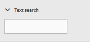

# Modereringskonsol {#moderation-console}

>[!CAUTION]
>
>AEM 6.4 har nått slutet på den utökade supporten och denna dokumentation är inte längre uppdaterad. Mer information finns i [teknisk supportperiod](https://helpx.adobe.com/support/programs/eol-matrix.html). Hitta de versioner som stöds [här](https://experienceleague.adobe.com/docs/).

I AEM Communities: bulk [moderering av communityinnehåll](moderate-ugc.md) är möjligt både från författaren och publiceringsmiljöer av administratörer och community moderators (betrodda communitymedlemmar som tilldelats som moderatorer).

Administratörer och community-moderatorer kan även utföra [sammanhangsbaserad moderering](in-context.md) i publiceringsmiljön.

En funktion i alla [communitysajter](sites-console.md) är en `Administration`menyalternativ som är tillgängliga för användare som loggar in med administratörsbehörighet. The `Administration`-länken ger åtkomst till modereringskonsolen.

Från modereringskonsolen har administratörer och moderatorer åtkomst till allt användargenererat innehåll (UGC) som de har behörighet att moderera. Om du tillåter att flera webbplatser modereras kan du visa inlägg på alla webbplatser eller filtrera efter utvalda communityplatser.

Mer detaljerad information finns på [Hantera användare och användargrupper](users.md).

Moderationskonsolen har stöd för:
* Utföra flera modereringsuppgifter samtidigt
* Söker i UGC
* Visa UGC-information
* Visa information om UGC-författare

Endast när du är inloggad som administratör eller som medlem med ` [moderator permissions](in-context.md#identifyingtrustedmembers)`kan modereringsuppgifter utföras.

## Publiceringsmiljöåtkomst {#publish-environment-access}

Åtkomst till moderationskonsolen från en publicerad communitywebbplats sker via en administrationslänk som visas när en community-moderator är inloggad.

Genom att välja administrationslänken visas modereringskonsolen:

## Åtkomst till författarmiljö {#author-environment-access}

I författarmiljön kan du nå Kontrollen för moderering

* Från global navigering: **[!UICONTROL Navigation > Communities > Moderation]**

Endast när du är inloggad som administratör eller som medlem med ` [moderator permissions](in-context.md#identifyingtrustedmembers)`kan modereringsuppgifter utföras. Det enda communityinnehåll som visas är det som den inloggade medlemmen får moderera.

>[!NOTE]
>
>UGC från publiceringsmiljön visas bara för författaren om den valda SRP implementerar en gemensam butik. Som standard är exempelvis lagringen JSRP, som inte är en gemensam butik för författare och publicering. Se [Community-innehåll](working-with-srp.md).

## Användargränssnitt för modereringskonsol {#moderation-console-ui}

Bortsett från den vänstra navigeringslisten (som visas på författaren men inte vid publicering) har modereringsgränssnittet följande huvudområden:

* **[Övre navigeringsfältet](#top-navigation-bar)**
* **[Verktygsfält](#toolbar)**
* **[Innehållsområde](#content-area)**

### Övre navigeringsfält {#top-navigation-bar}

Det övre navigeringsfältet är konstant för alla konsoler. Mer information finns i [Grundläggande hantering](../../help/sites-authoring/basic-handling.md).

### Verktygsfält {#toolbar}

Verktygsfältet, som finns under det övre navigeringsfältet, har följande växlingsknapp till vänster:

* [Filterspår](moderation.md#filter-rail) öppnar en räl som gör det möjligt att välja vilka egenskaper som innehållet ska filtreras efter.

Verktygsfältet, som finns under det övre navigeringsfältet, har följande växlingsknapp till vänster:

[Filterspår](moderation.md#filter-rail)\
Öppnar ett spår när du väljer Sök, vilket gör att du kan välja vilka egenskaper som innehållet ska filtreras efter.

### Innehållsområde {#content-area}

Innehållsområdet innehåller information för publicerad UGC:

* UGC har bokförts
* Medlemsnamn
* Medlem avatar
* Postens plats
* När den bokförs
* Antal svar i posten
* [Sentiment](moderate-ugc.md#sentiment) associerat med inlägget
* Om det godkänns visas en bock
* Om det finns en bifogad fil visas ett gem

>[!NOTE]
>
>Innehållsområdet har en *oändlig rullning*, vilket innebär att du kan fortsätta rulla tills du har nått slutet av innehållet. Verktygsfältet ligger kvar på en fast, synlig plats ovanför innehållsområdet även när du bläddrar.

### Filterspår {#filter-rail}

Ikonen för sidopanelen öppnar filterlisten. Filtercirkeln, som visas till vänster om innehållsområdet, innehåller olika filter, som båda har en omedelbar effekt på den refererade UGC:n som visas i innehållsområdet.

Filtren inom varje kategori är **ELLER** och filtren i olika kategorier är **OCH** tillsammans.

Om du till exempel markerar båda **Fråga** och **Svar** kommer du att se innehåll som antingen **Fråga** *eller* en **Svar**.

Om du markerar **Fråga** och **Väntande**, kommer du bara att se innehåll som **Fråga** och är **Väntande**.

>[!NOTE]
>
>Moderatorer för communityn kan skapa bokmärken för fördefinierade filter i modereringskonsolens användargränssnitt. När dessa filter läggs till i slutet av URL:en (som frågesträngsparametrar) kan moderatorerna senare gå tillbaka till bokmärkesfiltren och även dela dessa länkar.

När filterlisten är öppen växlar ikonen Sök och sidopanelen stängs. Om du vill stänga filterfältet och bara visa det innehåll som användaren skapat klickar du på ikonen Sök och väljer alternativet Endast innehåll.

#### Innehållsbana {#content-path}

Innehållssökväg begränsar den UGC-referens som visas för inlägg i den angivna innehållsdatabasen.

#### Textsökning {#text-search}

Textsökning begränsar den refererade UGC som visas till inlägg som innehåller den angivna texten.

#### Plats {#site}

Webbplatsen begränsar den refererade UGC som visas till inlägg på valda communitywebbplatser. Om inga platser är markerade visas alla referenser till UGC.

>[!NOTE]
>
>När en administratör öppnar konsolen för gruppmoderering visas alla referenser till UGC, även webbplatser som inte skapats med [guide för att skapa webbplatser](sites-console.md), t.ex. Geometrixx.
>
>När gruppmodereringskonsolen öppnas vid publicering av en betrodd community-medlem visas endast referenser till UGC som skapats för communitywebbplatser som medlemmen har behörighet att moderera och kan filtreras med platsfiltret.

#### Innehållstyp {#content-type}

Innehållstyp begränsar den refererade UGC-enheten som visas till inlägg av den valda resurstypen. Du kan välja en eller flera av följande typer. Alla typer visas om inget är markerat.

* **Kommentar**
* **Forum**
* **Forum Reply**
* **QnA-fråga**
* **QnA-svar**
* **Bloggartikel**
* **Bloggkommentar**
* **Kalenderhändelse**
* **Kalenderkommentar**
* **Filbiblioteksmapp**
* **Filbiblioteksdokument**
* **Idea**
* **Idékommentar**

#### Ytterligare innehållstyper {#additional-content-types}

Så här lägger du till ytterligare resurser att filtrera:

* På en författarinstans
* Logga in som administratör
* Öppna [Webbkonsol](http://localhost:4502/system/console/configMgr)
* Sök `AEM Communities Moderation Dashboard Filters`
* Välj konfigurationen som ska öppnas i redigeringsläge
* Ange den ResourceType för en komponent som ska filtreras
   * Om du till exempel vill filtrera på de medföljande röstkomponenterna anger du:\
      `Voting=social/tally/components/hbs/voting`

* Välj Spara
* Uppdatera webbgrupperna - modereringskonsolen

Resultatet är ett nytt valbart filter för `Voting`under `Content Type` filtergrupp.

När det filtret är markerat visar kontrollpanelens innehåll UGC som matchar någon av de ResourceTypes som har angetts.

#### Status {#status}

Status begränsar den refererade UGC:n som visas till inlägg med den valda statusen, som kan vara en eller flera av Väntande, Godkänd, Nekad eller Stängd, samt Utkast eller Schemalagt för Blog-artiklar samt Svarat eller Inte besvarat för QnA-frågor. Om ingen är markerad visas alla.

>[!NOTE]
>
>Om du bara väljer statusen Inte besvarat visas allt innehåll (för alla innehållstyper) utom de besvarade frågorna. Det beror på att den egenskap som ansvarar för den besvarade frågan inte finns för frågor som inte besvarats och annat innehåll som forumämne, bloggartikel eller kommentarer.

#### Flaggning {#flagging}

Flaggning begränsar det refererade användargenererat innehåll som visas till inlägg som är flaggade eller dolda.

När ett innehåll har flaggats förblir det flaggat tills du bryter flaggan för det enskilda innehållet genom att markera **[!UICONTROL Flag]** igen. Observera att det inte finns några flaggningsnivåer, som important eller följup.

#### Medlemmar {#members}

Medlemmar begränsar den refererade UGC som visas för UGC som har bokförts av det angivna medlemsnamnet.

#### Anslaget senast {#posted-in-the-last}

Bokförd i sista begränsa hur den refererade UGC:n visas för inlägg gjorda i sista timmen, dagen, veckan, månaden eller året.

#### Sentiment {#sentiment}

[Sentiment](moderate-ugc.md#sentiment) begränsar den refererade UGC som visas till inlägg med ett känslomässigt värde som är antingen positivt, negativt eller neutralt.

## Modereringsåtgärder {#moderation-actions}

[Modereringsåtgärder](moderate-ugc.md#moderation-actions) kan utföras på en eller flera markeringar som gjorts i innehållsområdet eller när du visar innehållsdetaljer.

Om du vill moderera inläggen i stor skala klickar du på Välj ( ) på ett inlägg, som visas när du hovrar över det med musen (skrivbordet) eller när du trycker och håller ett finger på inlägget (mobilen). Genom att göra detta aktiverar du flervalsläget och kan nu välja de efterföljande inlägg som ska gruppmodereras genom att klicka på dem. Använd de knappar som visas i verktygsfältet för att utföra modereringsåtgärder för de valda inläggen. Alla åtgärder uppmanas att bekräfta.

Om du vill ändra ett inlägg i innehållsområdet till en viss nivå håller du pekaren över det med musen (skrivbordet) eller trycker och håller ned ett finger på posten (mobilen) så att knapparna visas på posten. När du arbetar med en enskild innehållsdetalj uppmanas du bara att bekräfta borttagningsåtgärden.

### Moderering av flera inlägg {#moderating-multiple-posts}

Ange gruppmarkeringsläget genom att klicka på `Select` ikon i ett inlägg:

Om du vill avsluta gruppmarkeringsläget väljer du ikonen Avbryt (x) i verktygsfältet:

Modereringsåtgärderna som kan utföras på flera inlägg är:

* Neka
* Ta bort
* Stäng/öppna inlägg igen

Ikonerna som tillåter dessa åtgärder visas bara i verktygsfältet när flera inlägg är markerade.

### Moderera ett enstaka inlägg {#moderating-a-single-post}

I läget för en markering är det möjligt att

* Visa användarinformation genom att välja användarens namn
* Visa inlägget i sitt sammanhang genom att markera länken till inlägget
* [Svara](#reply)
* [Tillåt](#allow)
* [Neka](#deny)
* [Ta bort](#delete)
* [Stäng](#close)
* Visa [Modereringshistorik](#moderation-history)
* [Visa detaljer](#viewdetails)

Visas på kortvyn ovanför ikonerna för modereringsåtgärder är texten i inlägget och nedan är data som indikerar

* Om har svar, och om så är fallet, föregås av antalet svar
* Om har flaggats
* Om har godkänts
* När användargenererat innehåll bokfördes

#### Svara {#reply}

När du arbetar med ett enstaka inlägg visas en svarsikon om UGC-typen stöder svar och är konfigurerad för att tillåta svar.

#### Tillåt {#allow}

När du arbetar med ett enstaka inlägg visas ikonen Tillåt när inlägget antingen har flaggats eller nekats. Om du väljer Tillåt kommer alla flaggor att tas bort.

#### Neka {#deny}

The **Neka** modereringsåtgärden är bara tillgänglig för innehåll som är modererat och inte visas på omodererat innehåll förutom i flervalsläge.

Innehåll som inte är modererat godkänns alltid.

Innehåll som modereras från början försätts i ett väntande läge och kan senare ändras för att godkännas eller nekas.

Innehåll som lämnar det väntande läget kan aldrig återgå till ett väntande läge. Innehåll som markerats som godkänt eller nekat kan när som helst ändras till ett annat läge.

#### Ta bort {#delete}

I envalsläge eller gruppläge kan du markera objekt och ta bort dem. Borttagningsåtgärden resulterar i en bekräftelsedialogruta. När de har tagits bort försvinner dessa objekt omedelbart från innehållsområdet. **När UGC har tagits bort tas den bort permanent från databasen och kan inte hämtas senare.**

#### Stäng {#close}

När du arbetar med ett enstaka inlägg visas en stängningsikon om UGC-typen stöder möjligheten att förhindra fler inlägg för den resursen.

#### Modereringshistorik {#moderation-history}

När du arbetar med ett enstaka inlägg visas en ikon för historik för moderering när du hovrar över det. Om du väljer ikonen visas en ruta med en historik över åtgärder som har vidtagits för UGC-inlägget.

Om du vill återgå till visning av flera UGC-inlägg i innehållsområdet markerar du X:et i det övre högra hörnet av rutan med vydetaljer.

Till exempel:

#### Visa detaljer {#view-detail}

När du arbetar med ett enstaka inlägg kan du visa mer information genom att öppna UGC i detaljerat läge.

Om du vill göra det håller du pekaren över inlägget för att visa `View Detail` och markera den för att visa en panel med mer information om inlägget.

Om du vill återgå till visning av flera UGC-inlägg i innehållsområdet markerar du X:et i det övre högra hörnet av rutan med vydetaljer.

Till exempel:

