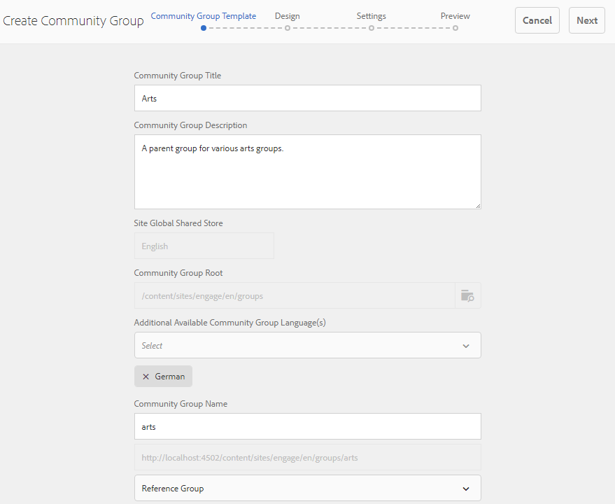

# Skapar kapslade grupper {#authoring-nested-groups}

## Skapar grupper på författare {#creating-groups-on-author}

Från global navigering

* Välj **[!UICONTROL Communities > Sites]**
* Välj **[!UICONTROL en mapp]** som ska öppnas
* Välj kort för den engelska webbplatsen **[!UICONTROL Komma igång-självstudiekursen]**
   * Välj kortbilden
   * Markera *inte* en ikon

Resultatet blir att [gruppkonsolen](groups.md)nås:

Gruppfunktionen visas som en mapp där instanser av grupper skapas. Markera mappen Grupper för att öppna den. Gruppen som skapades vid publicering visas.

## Skapa huvudkonst {#create-main-arts-group}

Den här gruppen kan skapas eftersom webbplatsstrukturen för interaktion innehåller en gruppfunktion. Konfigurationen av funktionen i platsens `Reference Template` standardinställningar tillåter val av aktiverad gruppmall. Därför kommer mallen som väljs för den nya gruppen att vara `Reference Group`.

De här konsolerna liknar konsolen Webbplatser i Communities.

* Välj **[!UICONTROL Skapa grupp]**
* `1 Community Group Template`:
   * Gruppnamn: Konstnärliga
   * Beskrivning av communitygrupp: En överordnad grupp för olika konstnärliga grupper.
   * Rotgrupp: *lämna som standard*
   * Fler tillgängliga språk för communitygrupper:använd listrutan för att välja tillgängliga språk för communitygrupper. Menyn innehåller alla språk som den överordnade communitywebbplatsen skapas i. Användarna kan välja mellan dessa språk för att skapa grupper i flera språkområden i det här steget. Samma grupp skapas på flera angivna språk i gruppkonsolen för respektive communityplats.
   * Gruppnamn: konst
   * Mall: dra nedåt för att välja `Reference Group`
   * Välj `Next`
      

Fortsätt genom de andra panelerna med följande inställningar:

* **2 Design**
   * Du kan ändra designen eller tillåta att den överordnade platsens design används som standard
   * Markera **[!UICONTROL nästa]**
* **3 inställningar**
   * **Moderering**
      * Lämna tom (ärv från överordnad plats)
   * **medlemskap**
      * använd som standard `Optional Membership`
   * **Miniatyrbild**
      * `optional`
   * Välj `Next`
* Välj **[!UICONTROL Skapa]**

### Kapslade grupper inom konst {#nesting-groups-within-arts-group}

Mappen bör nu innehålla två grupper (du kan behöva uppdatera sidan). `groups`

#### Publicera grupp {#publish-group}

Innan du skapar grupper som är kapslade i `arts`gruppen håller du pekaren över `arts` kortet och väljer publiceringsikonen för att publicera det.

Vänta på bekräftelse på att gruppen publicerades.

Gruppen bör också innehålla en `arts` `groups` mapp, men en som är tom och där nya grupper kan skapas. Navigera till gruppmappen för konst och skapa 3 kapslade grupper, där var och en har olika medlemsinställningar:

1. Visuell
   * Titel: `Visual Arts`
   * Namn: `visual`
   * Mall: `Reference Group`
   * Medlemskap: välj `Optional Membership`en offentlig grupp, öppen för alla medlemmar
1. Revisoriska
   * Titel: `Auditory Arts`
   * Namn: `auditory`
   * Mall: `Reference Group`
   * Medlemskap: välj `Required Membership`en öppen grupp, tillgänglig för medlemmar att gå med i

1. Historik

   * Titel: `Art History`
   * Namn: `history`
   * Mall: `Reference Group`
   * Medlemskap: välj `Restricted Membership`en hemlig grupp, som bara är synlig för inbjudna medlemmar som exempel, bjuda in [demoanvändare](tutorials.md#demo-users)`emily.andrews@mailinator.com`

Uppdatera sidan om du vill se alla tre kapslade grupper (undergrupper).

Om det behövs kan du navigera till de kapslade grupperna från konsolen Webbplatser för Communities:

* Välj **[!UICONTROL mapp]**
* Välj **[!UICONTROL Komma igång-självstudiekurskort]**
* Markera **[!UICONTROL gruppmappen]**
* Välj **[!UICONTROL grafikkort]**
* Markera **[!UICONTROL gruppmappen]**

## Förlagskoncern {#publishing-groups}

Efter publiceringen av den huvudsakliga communitywebbplatsen är det nödvändigt att

* Publicera varje grupp individuellt
   * Väntar på bekräftelse på att gruppen publicerades
* Publicera överordnad grupp innan någon grupp som är kapslad i publiceras
   * Alla grupper måste publiceras uppifrån och ned.

## Experience on Publish {#experience-on-publish}

Det går att uppleva de olika grupperna när de loggas in, till exempel med de [demoanvändare](tutorials.md#demo-users) som används för

* Medlem i konst-/historikgrupp: emily.andrews@mailinator.com/lösenord
   * Den begränsade (hemliga) gruppen, konst/historik, visas
   * Kan se valfria (publika) grupper
   * Kan förena begränsade (öppna) grupper
* Gruppansvarig: aaron.mcdonald@mailinator.com/lösenord
   * Kan se valfria (publika) grupper
   * kan förena begränsade (öppna) grupper
   * Hittar inte hämtade (hemliga) grupper

Gå till konsolerna [Communities](members.md) Members and Groups för författare om du vill lägga till andra användare i olika medlemsgrupper som motsvarar communitygrupperna.
