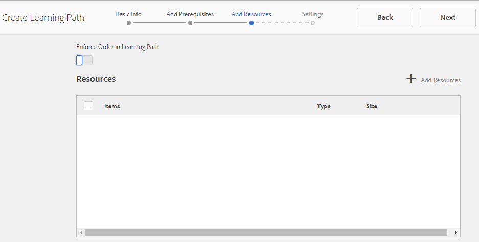

# Aktivera resurskonsolen {#enablement-resources-console}

För AEM Communities är resurskonsolen där [Enablement Managers](users.md) skapar, hanterar och tilldelar resurser till medlemmar på en community-webbplats för aktivering.

## Krav {#requirements}

Innan du lägger till aktiveringsresurser för en communityplats måste AEM instanser vara korrekt konfigurerade, inklusive:

* SCORM
* FFmpeg

Mer information finns i [Konfigurera aktivering](enablement.md).

>[!CAUTION]
>
>Om SCORM har installerats efter att en community-webbplats har skapats måste eventuella aktiveringsresurser som finns innan SCORM har installerats återskapas.

>[!NOTE]
>
>I och med att [AEM 6.3](deploy-communities.md#latestfeaturepack) och motsvarande funktionspaket för Communities [AEM 6.2 FP3](deploy-communities.md#latestfeaturepack) och [AEM 6.1 FP7](https://docs.adobe.com/content/docs/en/aem/6-1/deploy/communities.html#Latest Feature Pack) behöver inte längre aktiveringsfunktionen en [MySQL-databas](mysql.md).

## Terminologi {#terminology}

### Resurs {#resource}

Resurser är nödvändiga för en [aktiveringscommunity](overview.md#enablement-community). Det är det material som medlemmarna tilldelas för att förbättra sina färdigheter.

En resurs egenskaper:

* Kan vara av typen
   * Bild (JPG, PNG, GIF, BMP)
   * Video (MP4)
   * Flash (SWF)
   * Dokument (PDF)
   * Quiz (SCORM)
* Kan refereras från en eller flera utbildningsvägar

### Utbildningssökväg {#learning-path}

En inlärningsväg är en logisk uppsättning aktiveringsresurser som grupperats tillsammans för att det ska vara enkelt att tilldela medlemmar.

### Medlemsgrupp {#members-group}

När en communitywebbplats skapas används det namn som tilldelats webbplatsen för URL:en när de [platsspecifika användargrupperna](users.md) skapas, konfigurerade med olika behörigheter för olika roller. Alla automatiskt skapade grupper har `Community *<site-name>*` som prefix.

En sådan användargrupp är `Community *<site-name>* Members`-gruppen som identifierar registrerade användare i publiceringsmiljön som communitymedlemmar. Se självstudiekursen [Komma igång med AEM Communities för Enablement](getting-started-enablement.md) för ett exempel.

För [engagemangscommunityn](overview.md#egagementcommunity) är det rimligt att tillåta webbplatsbesökare att självregistrera sig eller använda social inloggning, och då läggs de automatiskt till i medlemsgruppen.

För [aktiveringsgrupper](overview.md#enablement-community) bör du göra webbplatsen privat, vilket kräver att en administratör lägger till användare i medlemsgruppen.

## Åtkomst till aktiveringsresurser för en community-webbplats {#accessing-a-community-site-s-enablement-resources}

### Navigera till Communities Resources {#navigate-to-communities-resources}

För att nå Resurskonsolen i redigeringsmiljön

* Från global navigering: **[!UICONTROL Navigation > Communities > Resources]**

### Välj en community-webbplats {#select-a-community-site}

Webbkonsolen Communities Resources visar alla communitysajter.

Aktiveringsresurser skapas för en specifik community-webbplats efter att du har valt webbplatsen från resurskonsolen.

När en specifik communitywebbplats har valts är alla befintliga aktiveringsresurser och utbildningsvägar tillgängliga för hantering och ändring, och nya aktiveringsresurser och inlärningsvägar kan skapas.

#### Sökning {#search-features}

Välj växlingsikonen för sidopanelen för att söka efter en aktiveringsresurs eller utbildningsväg. När du väljer det här alternativet öppnas en sökpanel till vänster i konsolen och innehåller en textruta där sökord kan anges.

#### Markeringsläge {#selection-mode}

Om du vill markera flera aktiveringsresurser, markerar du den första genom att hålla markören över kortet och sedan markera kryssmarkeringsikonen. När du har valt ett annat kort läggs det till i markeringsgruppen. Om du väljer en andra gång avmarkeras kortet.

## Skapa en resurs {#create-a-resource}

Lägga till en ny aktiveringsresurs på communitywebbplatsen

* Välj ikonen `Create`
* Välj `Resource` på den undermeny som visas

Detta startar en stegvis process för

* Beskriver resursen (namn, kortbild och text)
* Välja resursinnehåll
* Välja en omslagsbild för resursen
* Identifiera resurskontakter
* Tilldela resurser till medlemmar

När resursen är en del av en kurs, en inlärningsväg, ska medlemmar endast tilldelas inlärningsvägen. Tilldelningar kan läggas till efter att aktiveringsresursen har skapats.

### 1 grundläggande information {#basic-info}

* **[!UICONTROL Add Image]**

   (*optional*) En bild som ska visas på kortet för aktiveringsresursen på uppdragssidan samt på resurskonsolen. Bilden väljs från serverns lokala filsystem. Om ingen bild anges skapas en miniatyrbild för den överförda resursen.

   ***Obs***: den rekommenderade bildstorleken är inte bara 480 x 480 pixlar. På grund av kortens responsiva design för olika webbläsardimensioner varierar visningsstorleken mellan 220 x 165 pixlar och 400 x 165 pixlar.

* **[!UICONTROL Site Name]**

   (*skrivskyddad*) Den community-plats som resursen läggs till i.

* **[!UICONTROL Resource Name&ast;]**

   (*required*) Resursens visningsnamn. Ett giltigt nodnamn skapas från visningsnamnet.

* **[!UICONTROL Tags]**

   (*optional*) Du kan välja en eller flera taggar som associerar aktiveringsresursen med en eller flera kataloger. Se [Tagga aktiveringsresurser](tag-resources.md).

* **[!UICONTROL Show in Catalog]**

   Om alternativet inte är markerat visas inte aktiveringsresursen i någon katalog. Om det här alternativet är markerat visas aktiveringsresursen i alla kataloger, såvida inte [förfiltrerat](catalog-developer-essentials.md#pre-filters) eller medlemsfiltren från användargränssnittet. Standard är avmarkerat.

* **[!UICONTROL Description]**

   (*optional*) Beskrivning som ska visas för aktiveringsresursen.

* **[!UICONTROL Small Asset]**

   (*valfri*) Markerad från AEM Assets. En miniatyrbild som representerar resursen i publiceringsmiljön, t.ex. i en katalog.

* **[!UICONTROL Large Asset]**

   (*valfri*) Markerad från AEM Assets. En stor bild som representerar resursen i publiceringsmiljön, till exempel på huvudsidan för en resurs.

* **[!UICONTROL Content Fragment Asset]**

   (*valfri*) Markerad från AEM Assets. Ett innehållsfragment som kan refereras i publiceringsmiljön, men som inte används som standard.

* Välj **[!UICONTROL Next]**

### 2 Lägg till innehåll {#add-content}

Det ser ut som om flera aktiveringsresurser kan väljas, men bara en är tillåten.

Välj `'+' icon` i det övre högra hörnet för att börja välja resursen genom att identifiera källan.

* **[!UICONTROL Upload from my local files]**
Vid överföring från det lokala filsystemet används den inbyggda filläsaren för att välja och överföra en fil. Filtyper som stöds är SCORM.zip (HTML5 eller SWF), MP4-video, SWF, PDF och bildtyper (JPG, PNG, GIF, BMP). Filnamnet blir namnet på resursen som läggs till i resursbiblioteket.

* **[!UICONTROL Browse Asset Library]**
Välj från Resursbibliotek. Markeringen begränsas till de som visas på communitywebbplatsen.

* **[!UICONTROL Add an external URL]**

   Ange en länk till utbildningsmaterialet.

   I den dialogruta som öppnas anger du:

   * **[!UICONTROL Title]**

      Namnet på resursen för aktiveringsresursen.

   * **[!UICONTROL URL]**

      URL:en till en resurs.

* **[!UICONTROL Add an Adobe Connect URL]**

   Ange en länk till en Adobe Connect-session.

   I den dialogruta som öppnas anger du:

   * **[!UICONTROL Title]**

      Namnet på resursen för aktiveringsresursen.

   * **[!UICONTROL URL]**

      URL:en till en Adobe Connect-session.

* **[!UICONTROL Define an External Resource]**

   Ange den plats där materialet ska presenteras. Värdena för slutförandestatus och poängställning anges manuellt (se [Rapporter](reports.md)). En överförd omslagsbild kan användas för att ge ytterligare information.

   I den dialogruta som öppnas anger du:

   * **[!UICONTROL Title]**

      Namnet på resursen för aktiveringsresursen.

   * **[!UICONTROL Location]**

      Platsen för en fysisk plats, till exempel ett klassrum.

#### Exempel på en tillagd videoresurs {#example-of-an-added-video-resource}

* **[!UICONTROL Resource Cover Image]**

   Omslagsbilden är en bild som visas när aktiveringsresursen visas för första gången. Omslagsbilden visas t.ex. när en videoresurs ännu inte spelas upp. Om en anpassad bild inte överförs visas en standardbild. För videoresurser kan det vara möjligt att [generera en miniatyrbild](enablement.md#ffmpeg), men bara när den har överförts och inte när videon refereras till som en URL. För platsresurser kan bilden användas för att ge ytterligare information.

   Den rekommenderade storleken för omslagsbilden är 640 x 360 px.

* Välj **[!UICONTROL Next]**

### 3 inställningar {#settings}

>[!NOTE]
>
>Lärare ska inte registreras direkt i aktiveringsresurser som ska refereras från en inlärningsväg. Eleverna behöver bara vara inskrivna i kursen.
>
>Om en medlem är registrerad i både en resurs och en utbildningsväg som refererar till den resursen, kommer deras tilldelningar att visa både den enskilda resursen och resursen i utbildningsvägen.

* **[!UICONTROL Social Settings]**

   Inställningarna styr om eleverna kan ange indata för aktiveringsresursen eller inte. [modereringsinställningarna](sites-console.md#moderation) är inställningarna för den överordnade communitywebbplatsen.

   * **[!UICONTROL Allow Commenting]**

      Om det här alternativet är markerat kan medlemmar kommentera resursen. Standard är markerat.

   * **[!UICONTROL Allow Ratings]**

      Om det här alternativet är markerat kan medlemmar betygsätta resursen. Standard är markerat.

   * **[!UICONTROL Allow Anonymous Access]**

      Om det här alternativet är markerat kan anonyma webbplatsbesökare visa resursen i en katalog när communitywebbplatsen även tillåter anonym åtkomst. Standard är avmarkerat.

* **[!UICONTROL Due Date]**

   *(Valfritt)*  Ett datum då uppdraget ska vara slutfört kan väljas.

* **[!UICONTROL Resource Author]**
   *(Valfritt)* Författaren till aktiveringsresursen. Använd listrutan för att välja bland de användare som är medlemmar i [medlemsgruppen](#members-group).

* **[!UICONTROL Resource Contact&ast;]**
   *(Obligatoriskt)* En person som medlemmen kan kontakta angående aktiveringsresursen. Använd listrutan för att välja bland de användare som är medlemmar i [medlemsgruppen](#members-group).

* **[!UICONTROL Resource Expert]**
   *(Valfritt)* En person som medlemmen kan kontakta har expertkunskaper om aktiveringsresursen. Använd listrutan för att välja bland användare som är medlemmar i [medlemsgruppen](#members-group).

### 4 uppdrag {#assignments}

* **[!UICONTROL Add Assignees]**
Använd listrutan för att välja bland  [medlemmar](#members-group)  - användare och användargrupper (med fet stil) - som ska registreras som elev. När medlemmar loggar in på communitywebbplatsen visas de aktiveringsresurser (och utbildningssökvägar) som de är registrerade i på deras [uppdragssida](functions.md#assignments-function).

* select **[!UICONTROL Create]**

Aktiveringsresursen har skapats och återgår till resurskonsolen med den nyligen skapade resursen markerad. Från den här konsolen går det att [hantera resursen](#managing-a-resource).

## Skapa en utbildningssökväg {#create-a-learning-path}

Lägga till en ny utbildningsväg till communitywebbplatsen

* Välj ikonen `Create`
* Välj `Learning Path` på den undermeny som visas

Detta startar en stegvis process för

* Identifiera inlärningsvägen
* Erbjuda en kortbild som representerar inlärningsvägen för eleverna
* Referera till aktiveringsresurser som ska ingå i utbildningsvägen
* Om du vill kan du beställa resurserna
* Möjlighet att identifiera inlärningsvägar som krävs
* Identifiera en kontaktperson för utbildningsvägar
* Registrerar medlemmar

För aktiveringsresurser som ingår i en inlärningsväg ska tilldelningarna endast göras för inlärningsvägen och inte för de enskilda resurserna.

### Grundläggande information {#basic-info-1}

* **[!UICONTROL Add Image]**

   (*optional*) En bild som ska visas på kortet för utbildningssökvägen på uppdragssidan samt på resurskonsolen. Bilden väljs från serverns lokala filsystem. Om ingen bild anges skapas en miniatyrbild för den överförda resursen.

   ***Obs***: den rekommenderade bildstorleken inte längre bara är 480 x 480 pixlar. På grund av kortens responsiva design för olika webbläsardimensioner varierar visningsstorleken mellan 220 x 165 pixlar och 400 x 165 pixlar.

* **[!UICONTROL Site Name]**

   (*skrivskyddad*) Den community-plats som resursen läggs till i.

* **[!UICONTROL Learning Path Name]**

   (*required*) Visningsnamnet för utbildningssökvägen. Ett giltigt nodnamn skapas från visningsnamnet.

* **[!UICONTROL Tags]**

   (*optional*) Du kan välja en eller flera taggar som associerar utbildningssökvägen med en eller flera kataloger. Se [Tagga aktiveringsresurser](tag-resources.md).

* **[!UICONTROL Show in Catalog]**

   Om du inte markerar det här alternativet visas inte utbildningssökvägen i någon katalog. Om det här alternativet är markerat visas utbildningssökvägen i alla kataloger, såvida inte [förfiltrerat](catalog-developer-essentials.md#pre-filters) eller medlemsfiltren från användargränssnittet. Om du visar inlärningsvägen i en katalog får READ indirekt åtkomst till alla resurser som finns i den. Standard är avmarkerat.

* **[!UICONTROL Description]**

   (*optional*) Beskrivning som ska visas för aktiveringsresursen.

* **[!UICONTROL Small Asset]**

   (*valfri*) Markerad från AEM Assets. En miniatyrbild som representerar resursen i publiceringsmiljön, t.ex. i en katalog.

* **[!UICONTROL Large Asset]**

   (*valfri*) Markerad från AEM Assets. En stor bild som representerar resursen i publiceringsmiljön, till exempel på huvudsidan för en resurs.

* **[!UICONTROL Content Fragment Asset]**

   (*valfri*) Markerad från AEM Assets. Ett innehållsfragment som kan refereras i publiceringsmiljön, men som inte används som standard.

* Välj **[!UICONTROL Next]**

### Lägg till krav {#add-prerequisites}

* **[!UICONTROL Prerequisite Learning Paths]**
(
*(valfritt*) När andra publicerade utbildningsvägar har valts måste de vara slutförda innan en elev kan välja den här utbildningsvägen.

* Välj **[!UICONTROL Next]**

### Lägg till resurser {#add-resources}

* **[!UICONTROL Enforce Order in Learning Path]**

   (*optional*) if set to On, then the order in which the enable resources are added is the order in which learners are required to continue through the learning path. Standardvärdet är Av.

* **[!UICONTROL Resources]**

   En eller flera resurser som valts bland *publicerade *aktiveringsresurser som skapats för den aktuella communitywebbplatsen.

>[!NOTE]
>
>Du kan bara välja resurser på samma nivå som utbildningsvägen. För en inlärningsväg som skapats i en grupp är t.ex. endast resurserna på gruppnivå tillgängliga. för en inlärningsväg som skapats på en community-webbplats finns resurserna på den webbplatsen tillgängliga för tillägg till inlärningsvägen.

* Välj **[!UICONTROL Next]**.

### Inställningar {#settings-1}

* **[!UICONTROL Add Enrollments]**

   Använd listrutan för att välja bland de medlemmar och medlemsgrupper (med fet stil) som är medlemmar i communityplatsens [medlemsgrupp](#members-group). Du behöver inte lägga till uppdrag när du först skapar inlärningsbanan. Du kan ändra egenskaperna för utbildningsvägar för att lägga till deltagare vid ett senare tillfälle.

* **[!UICONTROL Learning Path Contact&ast;]**

   *(Obligatoriskt)* En person som medlemmen kan kontakta angående utbildningsvägen. Använd listrutan för att välja bland de användare som är medlemmar i community-platsens [medlemsgrupp](#members-group).

* Välj **[!UICONTROL Create]**

>[!NOTE]
>
>Aktiveringsresurser som refereras från inlärningssökvägen ska inte innehålla samma uppgifter (inlärningsresurser), om det finns några.
>
>Om en medlem är registrerad i både en aktiveringsresurs och en utbildningsväg som refererar till den resursen, kommer deras tilldelningar att visa både den enskilda resursen och resursen i utbildningsvägen.

## Hantera en resurs {#managing-a-resource}

Hantera en enda aktiveringsresurs

* Från Resurskonsolen
* Välj den community-webbplats som innehåller resursen
* Välj resurs

För den valda aktiveringsresursen är det möjligt att:

* Visa egenskaper (standard)
* Redigera egenskaper
* Ta bort
* Publicera
* Avpublicera

Om du vill överföra en ny version av aktiveringsresursen rekommenderar vi att du skapar en ny resurs och sedan avregistrerar medlemmar från den gamla versionen och registrerar dem i den nya versionen.

### Redigera resurs {#edit-resource}

Om du väljer pennikonen blir de steg som visas för att skapa en aktiveringsresurs tillgängliga så att all information som anges kan ändras.

Om den enda ändringen är att ändra uppdrag i steget Inställningar, kommer ändringarna att publiceras om du sparar dem. Om några andra ändringar görs måste resursen uttryckligen publiceras innan sparandet börjar.

### Ta bort resurs {#delete-resource}

Genom att markera kontrollkanarikonen kommer aktiveringsresursen att vara `Delete`d efter bekräftelse.

### Publicera {#publish}

Innan eleverna kan se en tilldelad aktiveringskurs måste den publiceras:

* Välj världsikonen till `Publish`
* Välj **[!UICONTROL Publish]** igen i den dialogruta som öppnas
* Välj **[!UICONTROL Close]**

Även om det står i dialogrutan att åtgärden står i kö publiceras den ofta omedelbart.

### Avpublicera {#unpublish}

Om du tillfälligt vill göra aktiveringsresurserna oåtkomliga för medlemmar i publiceringsmiljön utan att ta bort dem använder du världsikonen för att `Unpublish`använda resursen.

### Rapport {#report}

Ikonen Rapport ger åtkomst till de rapporter som skapas när eleverna interagerar med sina tilldelade aktiveringsresurser i publiceringsmiljön. Rapporten varierar beroende på resurstypen.

För alla utbildningsvägar är det möjligt att visa en rapport som baseras antingen på resurser eller studerande ( `User Report`).

Den här rapporten gäller specifikt för den aktuella aktiveringsresursen eller utbildningsvägen. Hur detaljerad rapportering som ges beror på om [Adobe Analytics](analytics.md) är licensierad och aktiverad för communitywebbplatsen eller inte. Rapporterna [Tidslinje](#timeline), [Viewer Engagement](#viewer-engagement) och [Engagement by Device](#engagement-by-device) importeras från Adobe Analytics baserat på [avsökningsintervallet](analytics.md#report-importer).

För alla aktiveringsresurser, oavsett om Adobe Analytics är aktiverat eller inte, finns det rapporter om [Tilldelningsstatus](#assignee-status) och [graderingar](#ratings) samt en [rapportsammanfattningstabell](#report-summary).

#### Tidslinje {#timeline}

Analysens tidslinjerapport visar när händelser inträffar över tid för den här aktiveringsresursen:

* **Vyer**

   En vy är när en elev besöker sidan med resursinformation

* **Spelar**

   En uppspelning är när alLearner interagerar med resursen, till exempel spelar upp en video eller öppnar en PDF-fil

* **Klassificeringar**

   En klassificering är när en studerande ger en resurs en stjärngradering

* **Kommentarer**

   En kommentar är när alLearner lägger till en kommentar

Den lodräta axeln är antalet händelser.

Den vågräta axeln är kalendertid.

[Adobe Analytics krävs](sites-console.md#analytics).

#### Visningsprogramengagemang {#viewer-engagement}

Analytics Viewer Engagement-rapporten visar, för videoresurser, antalet studerande som har tittat på resursen och, om de inte har spelats upp till slutet, vid vilken tidpunkt eleverna slutade spela upp den.

Den lodräta axeln är antalet deltagare som har tittat på resursen.

Den vågräta axeln är varaktigheten för den här resursen.

[Marketing Cloud organisation-ID krävs](sites-console.md#enablement).

#### Engagemang efter enhet {#engagement-by-device}

Analytics Engagement by Device-rapporten beskriver, för videoresurser, hur många visningar som spelats upp från både dator och mobil.

[Marketing Cloud organisation-ID krävs](sites-console.md#enablement).

#### Tilldelningsstatus {#assignee-status}

Statusrapporten för den tilldelade personen, som baseras på antalet studerande, beskriver hur många som har

* **Inte startat**
* **Pågår**
* **Slutförd**

#### Klassificeringar {#ratings}

Klassificeringsrapporten baseras på antalet studerande som har klassificerat aktiveringsresursen och visar antalet stjärngraderingar följt av en sammanfattning av det totala antalet betyg och det genomsnittliga omdömet.

#### Rapportsammanfattning {#report-summary}

Rapportsammanfattningen är en tabelllista för en aktiveringsresurs

* Alla som interagerat med resursen
   * Deras status
   * Om de har tilldelats resursen
      * I stället för att hitta resursen i en katalog
   * Antal kommentarer
   * Den angivna klassificeringen, om sådan finns

Resursrapport för utbildningsvägar: Rapportsammanfattningen är en tabelllista

* Varje resurs som ingår i utbildningsvägen
   * Publiceringsstatus
   * Antal vyer
   * Antal uppspelningar
   * Genomsnittlig värdering
   * Format
   * Storlek
   * Namn på användarwebbplats

För utbildningsvägar Användarrapport är rapportsammanfattningen en tabelllista

* Varje studerande som har tilldelats en utbildningsväg
   * Antal slutförda resurser
   * Deras status

Det går att justera visningen av tabellen genom att markera kolumner med `Show / hide columns`-väljaren.

#### Hämta rapport som CSV {#download-report-as-csv}

Tabellen Rapportsammanfattning kan laddas ned i CSV-format med en knapp högst upp i konsolen.

* för en aktiveringsresurs: `Download Resource Report as CSV`-knapp
* för en inlärningsväg: `Download Learning Path Report as CSV`-knapp

Den fullständiga rapportsammanfattningen hämtas oavsett vilka kolumner som valts för visning.
