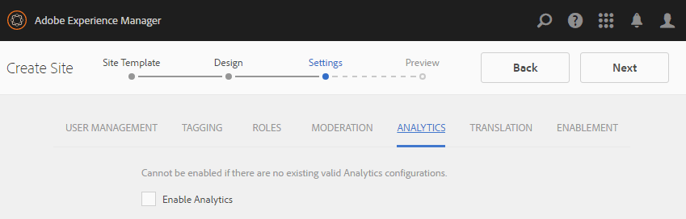
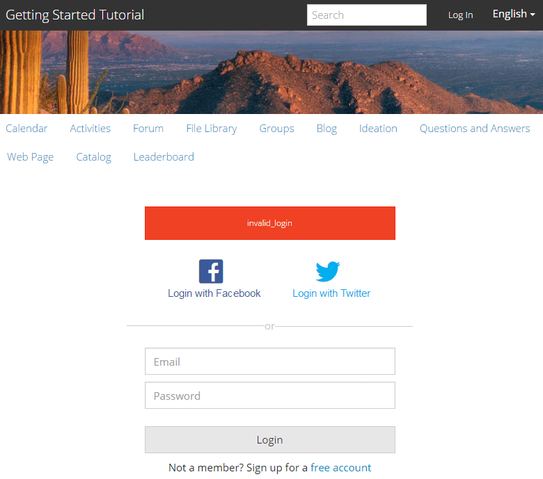

# Konsolen Webbplatser {#communities-sites-console}

Konsolen Communities Sites ger åtkomst till:

* Skapa webbplats
* Webbplatsredigering
* Platshantering
* [Skapa och redigera kapslade grupper](groups.md) (undergrupper)

Se [Komma igång med AEM Communities](getting-started.md) om du vill veta hur snabbt en communitywebbplats kan skapas i författarmiljön, samt hur du skapar communitygrupper från författaren och publiceringsmiljöer.

>[!NOTE]
>
>De viktigaste webbgruppsmenyerna för att skapa [communitysajter](sites-console.md), mallar [för](sites.md)communitysajter, mallar [för](tools-groups.md) communitygrupper [och](functions.md) communityfunktionerär endast avsedda att användas i författarmiljön.

## Förutsättningar {#prerequisites}

Innan du skapar en community-webbplats *måste* du:

* Kontrollera att en eller flera publiceringsinstanser körs
* Aktivera [tunneltjänsten](deploy-communities.md#tunnel-service-on-author) för att hantera medlemmar och medlemsgrupper
* Identifiera den [primära utgivaren](deploy-communities.md#primary-publisher)
* [Konfigurera replikering](deploy-communities.md#replication-agents-on-author) när den primära utgivarporten inte är standard (4503)

Det bästa sättet att se till att webbplatsen är förberedd för många funktioner är att utföra följande steg:

* Installera det [senaste funktionspaketet](deploy-communities.md#latestfeaturepack)
* Aktivera [Adobe Analytics](analytics.md) för AEM Communities
* Konfigurera [e-post](email.md)
* Identifiera [communityadministratörer](users.md#creating-community-members)
* [Aktivera OAuth-hanterare](social-login.md#adobe-granite-oauth-authentication-handler) för social inloggning

## Åtkomst till webbgruppskonsolen {#accessing-communities-sites-console}

För att nå konsolen Webbplatser i författarmiljön:

* Från global navigering: **[!UICONTROL Communities > Sites]**

Konsolen Communities Sites visar alla befintliga communityplatser. Från den här konsolen kan communitywebbplatser skapas, redigeras, hanteras och tas bort.

Om du vill skapa en ny community-webbplats väljer du ikonen **Skapa** .

Om du vill få åtkomst till en befintlig communitywebbplats och skapa, ändra, publicera, exportera eller lägga till en kapslad grupp, markerar du platsens mappikon.

Följande bild visar till exempel huvudkonsolen Webbplatser i Communities som visar mapparna för två communityplatser: [aktivera](getting-started-enablement.md) och [engagera](getting-started.md):

## Skapa webbplats {#site-creation}

Konsolen för att skapa webbplatser är en stegvis metod för att samla ihop funktioner på webbplatsen baserat på en vald mall [och inställningar för](sites.md) communitywebbplatsen.

Varje webbplats som skapas innehåller en inloggningsfunktion eftersom besökarna måste logga in innan de kan publicera innehåll, skicka meddelanden eller delta i en grupp. Andra funktioner som ingår är användarprofiler, meddelanden, meddelanden, webbplatsmenyer, sökning, teman och varumärken.

Processen startas genom att knappen som finns högst upp i konsolen Webbplatser i Communities väljs. `Create`

Skapandeprocessen är en serie steg som presenteras som paneler med en uppsättning funktioner som ska konfigureras (presenteras som underpaneler). Du kan gå vidare till **nästa** steg eller **Bakåt** till föregående steg innan du implementerar platsen i det sista steget.

### Steg 1: Webbplatsmall {#step-site-template}

På panelen Platsmall anges titel, beskrivning, platsrot, grundspråk, namn och platsmall:

* **[!UICONTROL Webbplatstitel]** för communityn: En visningsrubrik för webbplatsen.

   Titeln visas på den publicerade webbplatsen samt i användargränssnittet för webbplatsadministratörer.

* **[!UICONTROL Beskrivning]** av communityplats: En beskrivning av platsen.

   Beskrivningen visas inte på den publicerade webbplatsen.

* **[!UICONTROL Rotadress]** för communityplats: Rotsökvägen till platsen.

   Standardroten är `/content/sites`men den kan flyttas till valfri plats på webbplatsen.

* **[!UICONTROL Grundspråk]** för communitywebbplats: (lämnas orört för ett enda språk: På engelska) använder du listrutan för att välja ett *eller flera* basspråk bland de tillgängliga språken - tyska, italienska, franska, japanska, spanska, portugisiska (Brasilien), kinesiska (traditionell) och kinesiska (förenklad). En communitywebbplats kommer att skapas för varje språk som läggs till och kommer att finnas i samma webbplatsmapp enligt bästa praxis som beskrivs i [Översätta innehåll för flerspråkiga webbplatser](../../help/sites-administering/translation.md). Rotsidan för varje webbplats kommer att innehålla en underordnad sida med språkkoden för ett av de valda språken, till exempel &quot;en&quot; för engelska eller &quot;fr&quot; för franska.

* **[!UICONTROL Namn på]** communitywebbplats: Namnet på webbplatsens rotsida som visas i URL:en

   * Dubbelkontrollera namnet eftersom det inte är lätt att ändra efter att webbplatsen har skapats
   * Bas-URL:en ( `https://*server:port/site root/site name*)` visas under `Community Site Name`
   * Ange en giltig URL genom att lägga till en baskod + &quot;.html&quot;

      *Exempel*, `http://localhost:4502/content/sites/mysight/en.html`

* **[!UICONTROL Meny för]** communityplatsmall: Använd listrutan för att välja en tillgänglig mall för [communitywebbplats](tools.md).

Markera **[!UICONTROL nästa]**

### Steg 2:Design {#step-design}

Designpanelen innehåller två underpaneler för att välja tema och varumärkesbanderoll:

#### TEMA PÅ GEMENSKAPENS WEBBPLATS {#community-site-theme}

Ramverket använder [Twitter Bootstrap](https://twitterbootstrap.org/) för att ge webbplatsen en responsiv, flexibel design. Ett av de många förinlästa Bootstrap-temana kan väljas för att formatera den valda communitywebbplatsmallen, eller så kan ett Bootstrap-tema överföras.

När du väljer det här alternativet överlagras temat med en ogenomskinlig blå bockmarkering.

När communitywebbplatsen har publicerats går det att [redigera egenskaperna](#modifying-site-properties) och välja ett annat tema.

#### GEMENSKAPENS WEBBPLATSHANTERING {#community-site-branding}

Webbplatsmärkning är en bild som visas som en rubrik högst upp på varje sida.

Bilden bör storleksändras så att den blir lika bred som den förväntade visningen av sidan i webbläsaren och 120 pixlar hög.

Tänk på följande när du skapar eller markerar en bild:

* Bildens höjd beskärs till 120 pixlar från bildens övre kant
* Bilden är fäst vid webbläsarfönstrets vänstra kant
* Det finns ingen storleksändring av bilden, så att när bildbredden är...

   * Bilden upprepas vågrätt under webbläsarens bredd
   * Bilden blir större än webbläsarens bredd och ser ut att vara beskuren

Välj **[!UICONTROL Nästa]**.

### Steg 3: Inställningar {#step-settings}

Panelen Inställningar innehåller flera underpaneler med funktioner som ska konfigureras innan du går till det sista steget för att skapa webbplatsen.

* [ANVÄNDARHANTERING](#user-management)
* [TAGGNING](#tagging)
* [ROLLER](#roles)
* [MODERATION](#moderation)
* [ANALYS](#analytics)
* [ÖVERSÄTTNING](#translation)
* [AKTIVERING](#enablement)

>[!NOTE]
>
>**Aktivera tunneltjänsten**
>
>Flera av underpanelerna Inställningar tillåter tilldelning av en betrodd medlem till måttlig användargenererad kod, hantera grupper eller vara kontakter för aktiveringsresurser i publiceringsmiljön.
>
>Konventionen gäller för [användare på publiceringssidan och användargrupper](users.md) (medlemmar och medlemsgrupper) som inte ska dupliceras i författarmiljön.
>
>När du skapar en community-webbplats i författarmiljön och tilldelar betrodda medlemmar till olika roller måste du därför hämta medlemsdata från publiceringsmiljön.
>
>Detta uppnås genom att aktivera ` [AEM Communities Publish Tunnel Service](deploy-communities.md#tunnel-service-on-author)`för författarmiljön.

#### ANVÄNDARHANTERING {#user-management}

>[!NOTE]
>
>Vi rekommenderar att [aktiveringscommunitysajter](overview.md#enablement-community) är privata (kontakta din kontorepresentant för mer information).
>
>En communitywebbplats är privat när anonyma besökare på webbplatsen nekas åtkomst, inte får registrera sig själv och inte får använda social inloggning.

* **[!UICONTROL Tillåt användarregistrering]**

   Om det här alternativet är markerat kan besökarna bli communitymedlemmar genom självregistrering.

   Om alternativet inte är markerat är communitywebbplatsen *begränsad* och webbplatsbesökarna måste tilldelas medlemsgruppen för communitywebbplatsen, göra en begäran eller få en inbjudan via e-post. Om alternativet inte är markerat bör anonym åtkomst inte tillåtas.

   Avmarkera för en *privat* communitywebbplats. Standard är markerat.

* **[!UICONTROL Tillåt anonym åtkomst]**

   Om det här alternativet är markerat är communitywebbplatsen *öppen* och alla besökare kan komma åt webbplatsen.

   Om alternativet inte är markerat kan bara inloggade medlemmar få åtkomst till webbplatsen.

   Avmarkera för en *privat* communitywebbplats. Standard är markerat.

* **[!UICONTROL Tillåt meddelanden]**

   Om det här alternativet är markerat kan medlemmarna skicka meddelanden till varandra och till gruppen på communitywebbplatsen.

   Om alternativet inte är markerat är meddelanden inte konfigurerade för communityn.

   Standard är avmarkerat.

* **[!UICONTROL Tillåt sociala inloggningar:Facebook]**

   Om det här alternativet är markerat kan webbplatsbesökare logga in med sina Facebook-kontouppgifter. Den valda [Facebook-molnkonfigurationen](social-login.md#create-a-facebook-connect-cloud-service) bör konfigureras för att lägga till användare i communityplatsens medlemsgrupp när communitywebbplatsen har skapats.

   Om alternativet inte är markerat visas ingen Facebook-inloggning.

   Låt vara omarkerat för en *privat* communitywebbplats. Standard är avmarkerat.

* **[!UICONTROL Tillåt sociala inloggningar:Twitter]**

   Om det här alternativet är markerat tillåter du webbplatsbesökare att logga in med sina Twitter-kontouppgifter. Den valda [Twitter-molnkonfigurationen](social-login.md#create-a-twitter-connect-cloud-service) bör konfigureras för att lägga till användare i communityplatsens medlemsgrupp när communitywebbplatsen har skapats.

   Om alternativet inte är markerat visas ingen Twitter-inloggning.

   Låt vara omarkerat för en *privat* communitywebbplats. Standard är avmarkerat.

>[!NOTE]

**[!UICONTROL Tillåta sociala inloggningar]**
>Det kan finnas exempelkonfigurationer för Facebook och Twitter och de kan vara valbara, men för en [produktionsmiljö](../../help/sites-administering/production-ready.md)måste du skapa anpassade Facebook- och Twitter-program. Se [Social Login med Facebook och Twitter](social-login.md).
>
#### TAGGNING {#tagging}

De taggar som kan användas för communityinnehåll kontrolleras genom att du väljer Taggnamnutrymmen som tidigare definierats via [Taggningskonsolen](../../help/sites-administering/tags.md#tagging-console).

Om du väljer taggnamnutrymmen för communitywebbplatsen begränsas dessutom det urval som visas när du definierar kataloger och resurser. Viktig information finns i [Tagga aktiveringsresurser](tag-resources.md) .

* Textruta: börja skriva för att identifiera taggar som får användas på webbplatsen

#### ROLLER {#roles}

De här inställningarna används för att tilldela [roller till communitymedlemmar](users.md) .

Det är enkelt att hitta communitymedlemmar med hjälp av typsnittssökning.

* **[!UICONTROL Community Managers]**

   Börja skriva för att välja en eller flera community-medlemmar eller medlemsgrupper som kan hantera community-medlemmar och medlemsgrupper.

* **[!UICONTROL Community-moderatorer]**

   Börja skriva för att välja en eller flera communitymedlemmar eller medlemsgrupper som ska betraktas som pålitliga som moderatorer för användargenererat innehåll.

* **[!UICONTROL Medlemmar med behörighet i communityn]**

   Börja skriva för att välja en eller flera communitymedlemmar eller medlemsgrupper som ska kunna skapa nytt innehåll när `Allow Privileged Member` de har valts för en [communityfunktion](functions.md).

#### MODERATION {#moderation}

Den globala inställningen för moderering av användargenererat innehåll (UGC) styrs av dessa inställningar. Enskilda komponenter har ytterligare inställningar för att styra modereringen.

* **[!UICONTROL Innehållet är förmodererat]**

   Om det här alternativet är markerat visas inte publicerat communityinnehåll förrän det har godkänts av en moderator. Standard är avmarkerat. Mer information finns i [Moderera communityinnehåll](moderate-ugc.md#premoderation).

* **[!UICONTROL Tröskelvärde för flagga innan innehåll döljs]**

   Om värdet är större än 0 måste antalet gånger ett ämne eller ett inlägg flaggas innan det döljs för den offentliga vyn. Om värdet är -1 döljs aldrig det markerade ämnet eller inlägget från den offentliga vyn. Standardvärdet är 5.

#### ANALYS {#analytics}

* **[!UICONTROL Aktivera analys]**

   Endast tillgängligt när Adobe Analytics har [konfigurerats](analytics.md) för communityfunktioner.

   Standard är avmarkerat. När det här alternativet är markerat visas ytterligare en markeringsmeny:

* **[!UICONTROL Referens för Cloud Config Framework]**

   I listrutan väljer du Analytics-molntjänstramverket som är konfigurerat för den här communitywebbplatsen.

   `Communities`är ramverksexemplet från [Analytics Configuration for Communities Features](analytics.md#aem-analytics-framework-configuration) documentation.

#### ÖVERSÄTTNING {#translation}

* **[!UICONTROL Tillåt maskinöversättning]** När det här alternativet är markerat (standardinställningen är inte markerad) aktiveras maskinöversättning för UGC på platsen. Detta påverkar inte annat innehåll, t.ex. sidinnehåll, även om webbplatsen är konfigurerad som en flerspråkig webbplats. Mer information om hur du konfigurerar en licensierad översättningstjänst för AEM Communities finns i [Översätta användargenererat innehåll](translate-ugc.md) . En fullständig översikt finns i [Översätta innehåll för flerspråkiga webbplatser](../../help/sites-administering/translation.md) .

* **[!UICONTROL Aktivera maskinöversättning för valda språk]**

   Språken som är aktiverade för maskinöversättning är standardinställningen för den systeminställning som anges av [översättningsintegreringskonfigurationen](translate-ugc.md#translation-integration-configuration). Dessa standardinställningar kan åsidosättas för den här webbplatsen genom att standardinställningar tas bort och/eller genom att andra språk väljs i listrutan.

* **[!UICONTROL Välj översättningsleverantör]**

   Som standard är tjänsteleverantören en provtjänst som endast används `microsoft`för demonstrationer. Om ingen översättningstjänstprovider är licensierad ska **Tillåt maskinöversättning** avmarkeras.

* **[!UICONTROL Välj globalt delat arkiv]**

   För en webbplats med flera språkkopior innehåller ett globalt delat arkiv en enda konversationstråd som är synlig från varje språkkopia. Detta uppnås genom att välja ett av språken som ingår som en språkkopia. Standardvärdet är *Ingen global delad lagring*.

* **[!UICONTROL Välj konfiguration för översättningsprovider]**

   Välj ett ramverk [för](../../help/sites-administering/tc-tic.md) översättningsintegrering som skapats för den licensierade översättningsleverantören.

* **Välj översättningsalternativ för communitywebbplatsen**

   * **[!UICONTROL Översätt hela sidan]**

      Om du väljer det här alternativet översätts all UGC på en sida till sidans basspråk.

      Standard är *inte markerat*.

   * **[!UICONTROL Översätt endast markering]**

      Om du väljer det här alternativet visas ett översättningsalternativ intill varje inlägg som gör att enskilda inlägg kan översättas till sidans grundspråk.

      Standard är *valt*.

* **Välj alternativ för beständighet**

   * **[!UICONTROL Översätt avgifter på användarens begäran och fortsätt efteråt]**

      Om du väljer det här alternativet översätts inte innehållet förrän en begäran har gjorts. När översättningen är klar sparas översättningen i databasen.

      Standard är *inte markerat*.

   * **[!UICONTROL Behåll inte översättningar]**

      Om du väljer det här alternativet lagras inte översättningar i databasen.

      Om det inte är markerat bevaras översättningar.

      Standard är *inte markerat*.

* **[!UICONTROL Smart återgivning]** Välj en av

   * `Always show contributions in the original language` (standard)
   * `Always show contributions in user preferred language`
   * `Show contributions in user preferred language for only logged-in users`

#### AKTIVERING {#enablement}

Inställningarna `ENABLEMENT`gäller när den valda communityplatsmallen innehåller [tilldelningsfunktionen](functions.md#assignments-function), som är tillgänglig när aktiveringsfunktionerna är licensierade och [konfigurerade](enablement.md). Referensplatsmallen som innehåller tilldelningsfunktionen är `Reference Structured Learning Site Template.`

* **[!UICONTROL Aktivitetshanterare]**

   (obligatoriskt) Det går bara att välja medlemmar i `Community Enablementmanagers` gruppen för att hantera den här aktiveringscommunityn. Aktivitetshanterare ansvarar för att tilldela medlemmar till resurser. Se även [Hantera användare och användargrupper](users.md).

* **[!UICONTROL Organisations-ID för Marketing Cloud]**

   (valfritt) ID:t för en [Video Heartbeat Analytics](analytics.md#video-heartbeat-analytics) -licens.

Välj **[!UICONTROL Nästa]**.

### Steg 4: Skapa webbgruppsplats {#step-create-communities-site}

Om det behövs justeringar använder du knappen **Bakåt** för att göra dem.

När **Skapa** har valts och startats kan processen att skapa webbplatsen inte avbrytas.

När webbplatsen har skapats:

* Det går inte att ändra URL:en (nodnamn)
* Framtida ändringar av communitywebbplatsmallen kommer inte att påverka den skapade communitywebbplatsen
* Om du inaktiverar communityplatsmallen påverkas inte den skapade communitywebbplatsen
* Det går att redigera [strukturen](#modify-structure) för en community-webbplats genom att ändra dess egenskaper

När processen är klar visas mappen för den nya platsen i konsolen Webbplatser, där författare kan lägga till sidinnehåll eller administratören kan ändra platsens egenskaper.

Om du vill ändra en community-plats väljer du projektmappen för den:

När du hovrar över en webbplats med en mus eller vidrör ett platskort visas ikoner som gör att du kan [redigera webbplatsen i redigeringsläge](#authoring-site-content), [öppna webbplatsegenskaperna för ändring](#modifying-site-properties), [publicera webbplatsen](#publishing-the-site), [exportera webbplatsen](#exporting-the-site)och [ta bort webbplatsen](#deleting-the-site).

## Skapa webbplatsinnehåll {#authoring-site-content}

Innehållet på en webbplats kan redigeras med samma verktyg som andra AEM-webbplatser. Om du vill öppna webbplatsen för redigering väljer du den `Open Site` ikon som visas när du hovrar webbplatsen med musen. Webbplatsen öppnas på en ny flik så att konsolen Webbplatser fortfarande är tillgänglig.

>[!NOTE]
Om du inte känner till AEM läser du dokumentationen om [grundläggande hantering](../../help/sites-authoring/basic-handling.md) och en [snabbguide till redigeringssidorna](../../help/sites-authoring/qg-page-authoring.md).

## Ändra webbplatsegenskaper {#modifying-site-properties}

Egenskaperna för en befintlig plats, som anges när webbplatsen skapas, kan ändras genom att du markerar `Edit Site`ikonen som visas när du håller muspekaren.

`Details of the following properties match the descriptions provided in the` Avsnittet Skapa [webbplats](#site-creation) .

### Ändra grundläggande {#modify-basic}

På BASIC-panelen kan du ändra

* Rubrik för communitywebbplats
* Beskrivning av communityplats

Det går inte att ändra namnet på communityplatsen.

Om du väljer en annan mall för en community-webbplats påverkas inte en befintlig community-webbplats eftersom det inte finns någon koppling mellan mallar och webbplatser.

I stället kan [STRUKTUREN](#modify-structure) på communitywebbplatsen ändras.

### Ändra struktur {#modify-structure}

STRUKTURpanelen gör att du kan ändra den struktur som ursprungligen skapades från den valda mallen för communitywebbplatser. På panelen kan du

* Dra och släpp ytterligare [communityfunktioner](functions.md) i webbplatsstrukturen
* En instans av en communityfunktion i webbplatsstrukturen:

   * **`gear icon`**

      redigera inställningar, inklusive visningsrubrik och URL-namn&amp;stämpel;ast;

      samt [behöriga medlemsgrupper](users.md#privilegedmembersgroups)

   * **`trashcan icon`**

      
ta bort (ta bort) funktioner från platsstrukturen

   * **`grid icon`**

      
ändra ordningen på funktioner som visas i navigeringsfältet på den översta nivån

>[!NOTE]
Du kan ändra ordningen på alla funktioner i platsstrukturen förutom funktionen längst upp. Det innebär att det inte går att ändra startsidan för communitywebbplatsen.

>[!CAUTION]
Visningsrubriken kan ändras utan biverkningar, men du bör inte redigera URL-namnet för en community-funktion som tillhör en community-webbplats.
Om du t.ex. byter namn på URL:en flyttas inte den befintliga UGC:n, vilket resulterar i&quot;UGC-förlust&quot;.

>[!CAUTION]
Gruppfunktionen får *inte* vara den *första eller enda* funktionen i platsstrukturen.
Alla andra funktioner, till exempel [sidfunktionen](functions.md#page-function), måste inkluderas och listas först.

#### Exempel: Lägga till en katalogfunktion i en community-platsstruktur {#example-adding-a-catalog-function-to-a-community-site-structure}

### Ändra design {#modify-design}

På designpanelen kan du använda ett nytt tema:

* [Community Site Theme](#community-site-theme)
* [Varumärkning för communitysajter](#community-site-branding)
   * Bläddra till panelens nedre del för att ändra varumärkesbilden

### Ändra inställningar {#modify-settings}

Med hjälp av inställningspanelen får du tillgång till de flesta inställningarna under underpanelerna i steg 3 för att skapa en community-webbplats:

* [Användarhantering](#user-management)
* [Taggar](#tagging)
* [Moderering](#moderation)
* [Medlemsroller](#roles)
* [Analyser](#analytics)
* [Översättning](#translation)

### Ändra miniatyrbild {#modify-thumbnail}

På panelen MINIATYRBILD kan en bild överföras för att representera webbplatsen i webbgruppskonsolen.

### Ändra aktivering {#modify-enablement}

ENABLEMENT-panelen ger åtkomst till inställningarna som anges när en community-webbplats skapas.

Se [ENABLEMENT](#enablement) description.

## Publicera webbplatsen {#publishing-the-site}

När en communitywebbplats har skapats eller ändrats kan du publicera (aktivera) webbplatsen genom att markera `Publish Site` ikonen som visas när du hovrar musen över webbplatsen.

En indikation visas när webbplatsen har publicerats.

### Publicera med kapslade grupper {#publishing-with-nested-groups}

Efter publicering av en communitywebbplats är det nödvändigt att publicera varje undergrupp (kapslad grupp) som skapats med [gruppkonsolen](groups.md)separat.

## Exportera platsen {#exporting-the-site}

Välj exportikonen när du hovrar musen över webbplatsen för att skapa ett paket av communitywebbplatsen som både lagras i [pakethanteraren](../../help/sites-administering/package-manager.md) och hämtas.\
Observera att UGC inte ingår i platspaketet.

## Tar bort platsen {#deleting-the-site}

Om du vill ta bort communitywebbplatsen väljer du ikonen Ta bort plats som visas när du håller muspekaren över webbplatsen i Webbplatskonsolen. Den här åtgärden tar bort alla objekt som är associerade med platsen, till exempel UGC, användargrupper, resurser och databasposter.

## Skapade användargrupper i communityn {#created-community-user-groups}

När den nya communitywebbplatsen har publicerats skapas nya medlemsgrupper (användargrupper i publiceringsmiljön) som har rätt behörigheter för olika administrativa roller och medlemsroller.

Namnet som skapas för medlemsgrupperna omfattar det *platsnamn* som anges för webbplatsen i [steg 1](#step13asitetemplate) (namnet som visas i URL:en) samt ett unikt ID som undviker konflikter med communitywebbplatser och grupper som har samma platsnamn för olika rötter i communityn.

Om namnet till exempel är &quot;engage&quot; för en webbplats med namnet &quot;Getting Started Tutorial&quot; blir användargruppen för moderatorer:

* Titel: Moderatorer för communityengagemang
* Namn: community-*engage-uid*-moderators

Observera att alla medlemmar som tilldelats roller som moderatorer eller gruppadministratörer när platsen skapas, kommer att tilldelas till rätt grupp samt till medlemsgruppen. Dessa grupper och medlemstilldelningar skapas vid publicering när den nya webbplatsen publiceras.

Mer information finns i [Hantera användare och användargrupper](users.md).

>[!NOTE]
Om [Tillåt social inloggning: Facebook](#user-management) aktiveras när användargruppen har aktiverats
* community-*&lt;site-name>*-*&lt;uid>*-members

när den används, bör den använda [Facebook-molntjänsten](social-login.md#createafacebookcloudservice) konfigureras för att lägga till användare i den här gruppen.

## Konfigurera för autentiseringsfel {#configure-for-authentication-error}

Som standard dirigeras en communitywebbplats om till en exempelinloggningssida när användaren anger fel inloggningsuppgifter och inte kan logga in. Denna exempelinloggning kommer inte att finnas på en [produktionsserver](../../help/sites-administering/production-ready.md).

Om du vill omdirigera korrekt, när en webbplats har konfigurerats och publicerats, slutför du de här stegen för att få autentiseringsfel att omdirigera till communitywebbplatsen:

* På varje AEM-publiceringsinstans
* Första inloggningen med administratörsbehörighet
* Åtkomst till [webbkonsolen](../../help/sites-deploying/configuring-osgi.md)
   * Till exempel [http://localhost:4503/system/console/configMgr](http://localhost:4503/system/console/configMgr)

* Sök `Adobe Granite Login Selector Authentication Handler`
* Välj `pencil`ikonen för att öppna konfigurationen för redigering
* Ange **[!UICONTROL Inloggningssidmappningar]** enligt följande:

   `/content/sites/<site-name>/path/to/login/page:/content/sites/<site-name>`

    till exempel:

   `/content/sites/engage/en/signin:/content/sites/engage/en`

* Välj **[!UICONTROL Spara]**

### Testa autentiseringsomdirigering {#test-authentication-redirection}

På samma AEM-publiceringsinstans som konfigurerats med en inloggningssidmappning för communitywebbplatsen:

* Bläddra till startsidan för communitywebbplatsen
   * Till exempel [http://localhost:4503/content/sites/engage/en.html](http://localhost:4503/content/sites/engage/en.html)

* Välj Logga ut
* Välj inloggning
* Ange uppenbart felaktiga inloggningsuppgifter, till exempel användarnamnet &quot;x&quot; och lösenordet &quot;x&quot;
* Inloggningssidan ska visas med felmeddelandet&quot;ogiltig inloggning&quot;

## Åtkomst till communityplatser från huvudplatskonsolen {#accessing-community-sites-from-main-sites-console}

På den globala navigeringskonsolen finns communityplatser i `Community Sites` mappen.

Det går att komma åt en community-webbplats på det här sättet, men för administrativa uppgifter bör communitywebbplatsen nås från konsolen Webbplatser för communities.

