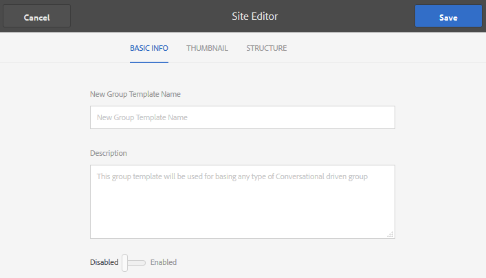

# Gruppmallar {#group-templates}

>[!CAUTION]
>
>AEM 6.4 har nått slutet på den utökade supporten och denna dokumentation är inte längre uppdaterad. Mer information finns i [teknisk supportperiod](https://helpx.adobe.com/support/programs/eol-matrix.html). Hitta de versioner som stöds [här](https://experienceleague.adobe.com/docs/).

Konsolen Gruppmallar liknar [Webbplatsmallar](sites.md) konsol. Båda är skisser för en uppsättning färdiga sidor och funktioner som utgör en communitysajt. Skillnaden är att en webbplatsmall är för huvudcommunityn och en gruppmall är för en community-grupp, en undercommunity som är kapslad i huvudcommunityn.

En community-grupp ingår i en webbplatsmall genom att inkludera [Funktionen Grupper](functions.md#groups-function) (som inte får vara den första eller enda funktionen i mallen).

Från och med Communities [funktionspaket 1](deploy-communities.md#latestfeaturepack)kan du kapsla in grupper genom att inkludera funktionen Grupper i en gruppmall.

När åtgärden utförs för att skapa en ny community-grupp väljs gruppens mall (struktur). Valet beror på hur funktionen Grupper konfigurerades när den lades till i plats- eller gruppmallen.

>[!NOTE]
>
>Konsolerna för att skapa [communitysajter](sites-console.md), [mallar för communitysajter](sites.md), [communitygruppsmallar](tools-groups.md) och [communityfunktioner](functions.md) används endast i författarmiljön.

## Konsolen Gruppmallar {#group-templates-console}

I författarmiljön kan du nå gruppmallskonsolen

* Från global navigering: **[!UICONTROL Tools > Communities > Group Templates]**

Den här konsolen visar mallarna från vilka en [communitywebbplats](sites-console.md) kan skapas och tillåter att nya gruppmallar skapas.

## Skapa gruppmall {#create-goup-template}

Om du vill börja skapa en ny gruppmall väljer du **[!UICONTROL Create]**

Då öppnas panelen Platsredigeraren som innehåller tre underpaneler:

### Grundläggande information {#basic-info}

På panelen Grundläggande information konfigureras ett namn, en beskrivning och huruvida mallen är aktiverad eller inaktiverad:

* **[!UICONTROL New Group Template Name]**
Mallens namn-ID

* **[!UICONTROL Description]**
Mallbeskrivningen

* **[!UICONTROL Disabled/Enabled]**
En växlingsväxling som styr om mallen kan refereras

### Miniatyrbild {#thumbnail}

(Valfritt) Markera ikonen Överför bild om du vill visa en miniatyrbild tillsammans med namnet och beskrivningen för användare som skapar communitywebbplatser.

### Struktur {#structure}

>[!CAUTION]
>
>Om du arbetar med AEM 6.1 Communities FP4 eller tidigare ska du inte lägga till en gruppfunktion i en gruppmall.
>
>Funktionen för kapslade grupper är tillgänglig från och med Communities [FP1](communities.md#latestfeaturepack).
>
>Det är fortfarande inte tillåtet att lägga till en gruppfunktion som den första eller enda funktionen i en mall.

Om du vill lägga till communityfunktioner drar du från höger sida till vänster i den ordning som länkarna på webbplatsmenyn ska visas. Format används på mallen när webbplatsen skapas.

Om du till exempel vill ha ett forum drar du forumfunktionen från biblioteket och släpper under mallverktyget. Detta resulterar i att dialogrutan för forumkonfiguration öppnas. Se [function console](functions.md) om du vill ha information om konfigurationsdialogrutorna.

Fortsätt att dra och släppa andra communityfunktioner som du vill använda för en undergruppswebbplats (grupp) som är baserad på den här mallen.

När alla önskade funktioner har släppts i mallbyggarområdet och konfigurerats väljer du **[!UICONTROL Save]** i det övre högra hörnet.

## Redigera gruppmall {#edit-group-template}

När du visar communitygrupper i huvudgruppen [Konsolen Gruppmallar](#group-templates-console)kan du välja en befintlig gruppmall för redigering.

Om du redigerar en gruppmall påverkas inte communitywebbplatser som redan skapats från mallen. Det går att direkt [redigera en communitywebbplats](sites-console.md#modify-structure)i stället.

Den här processen ger samma paneler som [skapa en gruppmall](#create-goup-template).
