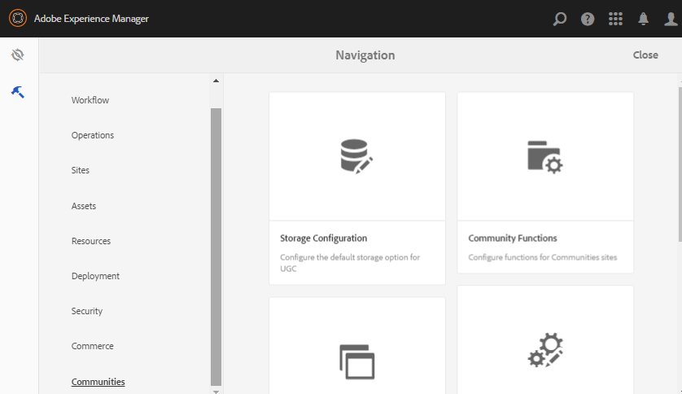

# Communities Tools {#communities-tools}

>[!CAUTION]
>
>AEM 6.4 har nått slutet på den utökade supporten och denna dokumentation är inte längre uppdaterad. Mer information finns i [teknisk supportperiod](https://helpx.adobe.com/support/programs/eol-matrix.html). Hitta de versioner som stöds [här](https://experienceleague.adobe.com/docs/).

Om du är författare kommer du åt verktygsgruppen Communities:

* Från global navigering: **[!UICONTROL Tools > Communities]**

* [Webbplatsmallar](sites.md) - Konsol för att skapa och hantera webbplatsmallar
* [Gruppmallar](tools-groups.md)- Konsol för att skapa och hantera gruppmallar
* [Community-funktioner](functions.md)- Konsol för att skapa och hantera communityfunktioner
* [Lagringskonfiguration](srp-config.md) - Konsol för konfiguration och val av [standard-SRP](working-with-srp.md)

* [Komponentguide](components-guide.md) - Öppnar en interaktiv plats som gör det möjligt att experimentera med hur SCF-komponenterna fungerar och hur de kan konfigureras eller anpassas.
* [Badges](badges.md) - Konsol varifrån anpassade märken kan läggas till för användning i [regler för poängsättning och märkning](implementing-scoring.md)
