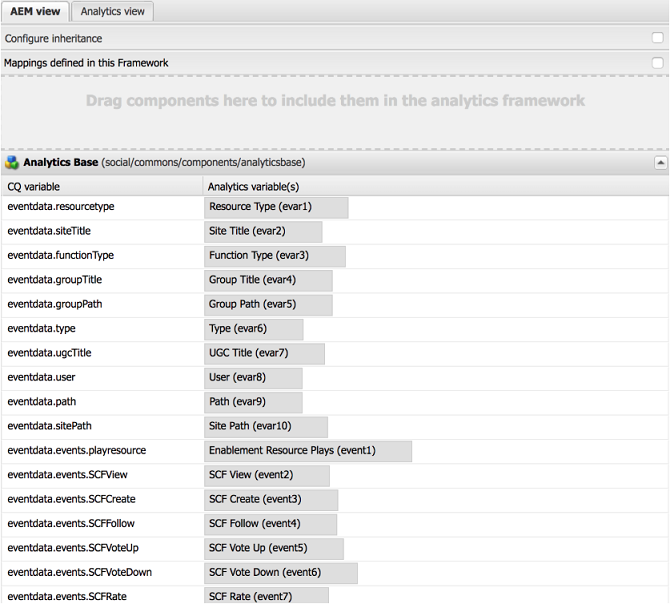

# Tjänsten för hantering av användare och användargenererat innehåll i AEM Communities {#user-and-ugc-management-service-in-aem-communities}

>[!CAUTION]
>
>AEM 6.4 har nått slutet på den utökade supporten och denna dokumentation är inte längre uppdaterad. Mer information finns i [teknisk supportperiod](https://helpx.adobe.com/support/programs/eol-matrix.html). Hitta de versioner som stöds [här](https://experienceleague.adobe.com/docs/).

>[!IMPORTANT]
>
>GDPR används som exempel i avsnitten nedan, men de ingående detaljerna är tillämpliga på alla dataskydds- och sekretessbestämmelser. såsom GDPR, CCPA osv.

AEM Communities visar användningsklara API:er för hantering av användarprofiler och grupphantering av användargenererat innehåll (UGC). När den är aktiverad visas **UserUgcManagement** Med kan behöriga användare (community-administratörer och moderatorer) inaktivera användarprofiler och massta bort eller massexportera UGC för specifika användare. Dessa API:er gör det även möjligt för personuppgiftsansvariga och personuppgiftsbiträden att följa EU:s allmänna dataskyddsförordningar (GDPR) och andra GDPR-inspirerade sekretessbestämmelser.

Mer information finns i [GDPR-sidan på Adobe Privacy Center](https://www.adobe.com/privacy/general-data-protection-regulation.html).

>[!NOTE]
>
>Om du konfigurerade [Adobe Analytics i AEM Communities](analytics.md) -platsen skickas inhämtade användardata till Adobe Analytics-servern. Adobe Analytics tillhandahåller API:er som gör att du kan komma åt, exportera och ta bort användardata och följa GDPR. Mer information finns i [Skicka in begäran om åtkomst och borttagning](https://experienceleague.adobe.com/docs/analytics/admin/data-governance/gdpr-submit-access-delete.html).

Om du vill använda dessa API:er måste du aktivera `/services/social/ugcmanagement` slutpunkten genom att aktivera tjänsten UserUgcManagement. Om du vill aktivera den här tjänsten installerar du [samplingsservlet](https://github.com/Adobe-Marketing-Cloud/aem-communities-ugc-migration/tree/main/bundles/communities-ugc-management-servlet) tillgänglig den [GitHub.com](https://github.com/Adobe-Marketing-Cloud/aem-communities-ugc-migration/tree/main/bundles/communities-ugc-management-servlet). Tryck sedan på slutpunkten för publiceringsinstansen av communitywebbplatsen med lämpliga parametrar med en http-begäran, som liknar följande:

`http://localhost:port/services/social/ugcmanagement?user=<authorizable ID>&operation<getUgc>`

Du kan även skapa ett användargränssnitt (användargränssnitt) för att hantera användarprofiler och användargenererat innehåll i systemet.

Dessa API:er gör det möjligt att utföra följande funktioner.

## Hämta användargenererat innehåll för en användare {#retrieve-the-ugc-of-a-user}

`getUserUgc(ResourceResolver resourceResolver, String user, OutputStream outputStream)` hjälper till att exportera all användargenererat innehåll från systemet.

* **användare**: användarens autentiserbara ID.
* **outputStream**: -resultatet returneras som utdataström, vilket är en zip-fil som innehåller det användargenererade innehållet (som json-fil) och bilagor (som innehåller bilder eller videor som överförts av användaren).

Om du till exempel vill exportera användargenererat innehåll för en användare med namnet Weston McCall, som använder weston.mccall@dodgit.com som auktoriseringsbart ID för att logga in på communitysajten, kan du skicka en http GET-begäran som ser ut så här:

`http://localhost:port/services/social/ugcmanagement?user=weston.mccall@dodgit.com&operation=getUgc`

## Ta bort användargränssnittets innehållsförteckning {#delete-the-ugc-of-a-user}

**deleteUserUgc(ResourceResolver resourceResolver, String user)** används för att ta bort all UGC för en användare från systemet.

* **användare**: användarens autentiserbara ID.

Om du till exempel vill ta bort användargränssnittskontrollen för en användare med ett auktoriserbart ID weston.mccall@dodgit.com genom en http-POST-begäran använder du följande parametrar:

* user= weston.mccall@dodgit.com
* operation= deleteUgc

### Ta bort användargenererat innehåll från Adobe Analytics {#delete-ugc-from-analytics}

Följ arbetsflödet i GDPR-analysen för att ta bort användardata från Adobe Analytics. eftersom API inte tar bort användardata från Adobe Analytics.

För Adobe Analytics-variabelmappningar som används av AEM Communities, se följande bild:

## Inaktivera ett användarkonto {#disable-a-user-account}

**deleteUserAccount(ResourceResolver resourceResolver, String user)** används för att inaktivera ett användarkonto.

* **användare**: användarens autentiserbara ID.

>[!NOTE]
>
>Om du inaktiverar en användare tas allt användargenererat innehåll som användaren har på servern bort.

Om du till exempel vill ta bort profilen för en användare med ett auktoriserbart ID weston.mccall@dodgit.com genom en http-POST-begäran använder du följande parametrar:

* user= weston.mccall@dodgit.com
* operation= deleteUser

>[!NOTE]
>
>deleteUserAccount() API inaktiverar bara en användarprofil i systemet och tar bort UGC. Om du vill ta bort en användarprofil från systemet går du till **CRXDE Lite**: [https://&lt;server>/crx/de](http://localhost:4502/crx/de), letar upp användarnoden och tar bort den.
