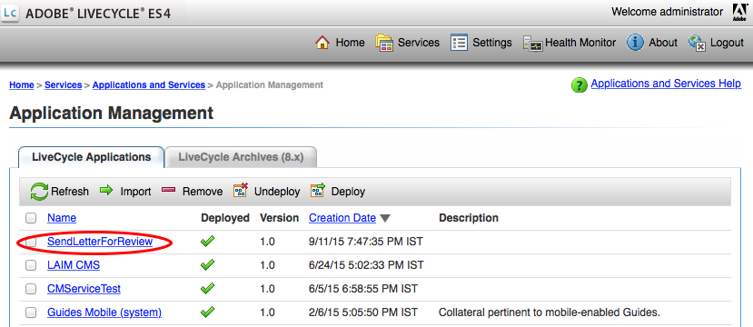
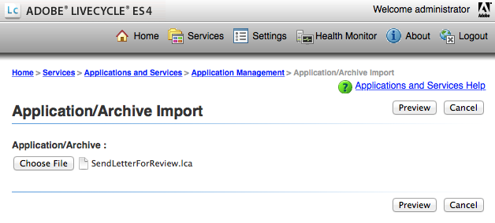

# Lägg till anpassad åtgärd/knapp i användargränssnittet Skapa korrespondens {#add-custom-action-button-in-create-correspondence-ui}

## Översikt {#overview}

Med Correspondence Management-lösningen kan du lägga till anpassade åtgärder i användargränssnittet Skapa korrespondens.

Scenariot i det här dokumentet förklarar hur du kan skapa en knapp i användargränssnittet Skapa korrespondens för att dela ett brev som en gransknings-PDF bifogad till ett e-postmeddelande.

### Förutsättningar {#prerequisites}

Du behöver följande för att slutföra det här scenariot:

* Kunskap om CRX och JavaScript
* LiveCycle Server

## Scenario: Skapa knappen i användargränssnittet Skapa korrespondens för att skicka ett brev för granskning {#scenario-create-the-button-in-the-create-correspondence-user-interface-to-send-a-letter-for-review}

Om du lägger till en knapp med en åtgärd (här skickar du ett brev för granskning) i användargränssnittet Skapa korrespondens innehåller följande:

1. Lägga till knappen i användargränssnittet Skapa korrespondens
1. Lägga till åtgärdshantering för knappen
1. Lägga till LiveCycle-processen för att aktivera åtgärdshanteringen

### Lägg till knappen i användargränssnittet Skapa korrespondens {#add-the-button-to-the-create-correspondence-user-interface}

1. Gå till `https://[server]:[port]/[ContextPath]/crx/de` och logga in som administratör.
1. I mappen apps skapar du en mapp med namnet `defaultApp` med sökvägen/strukturen som liknar defaultApp-mappen (som finns i config-mappen). Så här skapar du mappen:

   * Högerklicka på **[!UICONTROL defaultApp]** mappen i följande sökväg och välj **[!UICONTROL Overlay Node]**:

      /libs/fd/cm/config/defaultApp/

      

   * Kontrollera att dialogrutan Overlay Node har följande värden:

      **[!UICONTROL Path:]** /libs/fd/cm/config/defaultApp/

      **[!UICONTROL Overlay Location:]** /apps/

      **[!UICONTROL Match Node Types:]** Markerad

      

   * Klicka på **[!UICONTROL OK]**.
   * Klicka på **[!UICONTROL Save All]**.

1. Skapa en kopia av filen acmExtensionsConfig.xml (finns under grenen /libs) under grenen /apps.

   * Gå till&quot;/libs/fd/cm/config/defaultApp/acmExtensionsConfig.xml&quot;

   * Högerklicka på filen acmExtensionsConfig.xml och välj **[!UICONTROL Copy]**.

      

   * Högerklicka på **[!UICONTROL defaultApp]** mappen på &quot;/apps/fd/cm/config/defaultApp/&quot; och välj **[!UICONTROL Paste]**.
   * Klicka på **[!UICONTROL Save All]**.

1. Dubbelklicka på den kopia av acmExtentionsConfig.xml som du nyss skapade i mappen apps. Filen öppnas för redigering.
1. Leta reda på följande kod:

   ```xml
   <?xml version="1.0" encoding="utf-8"?>
   <extensionsConfig>
       <modelExtensions>
           <modelExtension type="LetterInstance">
     <customAction name="Preview" label="loc.letterInstance.preview.label" tooltip="loc.letterInstance.preview.tooltip" styleName="previewButton"/>
               <customAction name="Submit" label="loc.letterInstance.submit.label" tooltip="loc.letterInstance.submit.tooltip" styleName="submitButton" permissionName="forms-users"/>
               <customAction name="SaveAsDraft" label="loc.letterInstance.saveAsDraft.label" tooltip="loc.letterInstance.saveAsDraft.tooltip" styleName="submitButton" permissionName="forms-users"/>
               <customAction name="Close" label="loc.letterInstance.close.label" tooltip="loc.letterInstance.close.tooltip" styleName="closeButton"/>
           </modelExtension>
       </modelExtensions>
   </extensionsConfig> 
   ```

1. Om du vill skicka ett e-postbrev kan du använda Formens Workflow LiveCycle. Lägg till en customAction-tagg under taggen modelExtension i acmExtensionsConfig.xml enligt följande:

   ```xml
    <customAction name="Letter Review" label="Letter Review" tooltip="Letter Review" styleName="" permissionName="forms-users" actionHandler="CM.domain.CCRCustomActionHandler">
         <serviceName>Forms Workflow -> SendLetterForReview/SendLetterForReviewProcess</serviceName>
       </customAction>
   ```

   

   Taggen modelExtension har en uppsättning med customAction-underordnade taggar som konfigurerar åtgärden, behörigheterna och utseendet för åtgärdsknappen. Här följer en lista över konfigurationstaggar för customAction:

   | **Namn** | **Beskrivning** |
   |---|---|
   | name | Det alfanumeriska namnet på åtgärden som ska utföras. Värdet för den här taggen är obligatoriskt, måste vara unikt (inom taggen modelExtension) och måste börja med ett alfabet. |
   | label | Etiketten som ska visas på åtgärdsknappen |
   | funktionsbeskrivning | Knappens knappbeskrivning, som visas när användaren håller muspekaren över knappen. |
   | styleName | Namnet på det anpassade format som används på åtgärdsknappen. |
   | permissionName | Motsvarande åtgärd visas bara om användaren har den behörighet som anges av permissionName. När du anger permissionName som `forms-users`får alla användare åtkomst till det här alternativet. |
   | actionHandler | Fullständigt kvalificerat namn på ActionHandler-klassen som anropas när användaren klickar på knappen. |

   Förutom ovanstående parametrar kan det finnas ytterligare konfigurationer associerade med en customAction. Dessa ytterligare konfigurationer görs tillgängliga för hanteraren via objektet CustomAction.

   | **Namn** | **Beskrivning** |
   |---|---|
   | serviceName | Om en customAction innehåller en underordnad tagg med namnet serviceName anropas en process med namnet serviceName-taggen när du klickar på den relevanta knappen/länken. Se till att den här processen har samma signatur som PostProcess för brev. Lägg till prefixet &quot;Forms Workflow ->&quot; i tjänstnamnet. |
   | Parametrar som innehåller prefixet cm_ i taggnamnet | Om en customAction innehåller en underordnad tagg som börjar med namnet cm_ är de här parametrarna tillgängliga i post-processen (vare sig det är A4 Post Process eller den speciella process som representeras av serviceName-taggen) under den aktuella taggen med cm_-prefixet borttaget. |
   | actionName | När en inläggsprocess beror på ett klick innehåller inskickad XML en speciell tagg med namnet under taggen med namnet på användaråtgärden. |

1. Klicka på **[!UICONTROL Save All]**.

#### Skapa en lokal mapp med egenskapsfilen i grenen /apps {#create-a-locale-folder-with-properties-file-in-the-apps-branch}

Filen ACMExtensionsMessages.properties innehåller etiketter och knappbeskrivningsmeddelanden för olika fält i användargränssnittet Create Correspondence. Gör en kopia av den här filen i grenen /apps för att de anpassade åtgärderna/knapparna ska fungera.

1. Högerklicka på **[!UICONTROL locale]** mappen i följande sökväg och välj **[!UICONTROL Overlay Node]**:

   /libs/fd/cm/config/defaultApp/locale

1. Kontrollera att dialogrutan Overlay Node har följande värden:

   **[!UICONTROL Path:]** /libs/fd/cm/config/defaultApp/locale

   **[!UICONTROL Overlay Location:]** /apps/

   **[!UICONTROL Match Node Types:]** Markerad

1. Klicka på **[!UICONTROL OK]**.
1. Klicka på **[!UICONTROL Save All]**.
1. Högerklicka på följande fil och välj **[!UICONTROL Copy]**:

   `/libs/fd/cm/config/defaultApp/locale/ACMExtensionsMessages.properties`

1. Högerklicka på **[!UICONTROL locale]** mappen i följande sökväg och välj **[!UICONTROL Paste]**:

   `/apps/fd/cm/config/defaultApp/locale/`

   Filen ACMExtensionsMessages.properties kopieras i mappen locale.

1. Om du vill lokalisera etiketterna för den nya anpassade åtgärden/knappen skapar du filen ACMExtensionsMessages.properties för den aktuella språkinställningen i `/apps/fd/cm/config/defaultApp/locale/`.

   Om du till exempel vill lokalisera den anpassade åtgärd/knapp som skapas i den här artikeln skapar du en fil med namnet ACMExtensionsMessages_fr.properties med följande post:

   `loc.letterInstance.letterreview.label=Revue De Lettre`

   På samma sätt kan du lägga till fler egenskaper, t.ex. för verktygstips och format, i den här filen.

1. Klicka på **[!UICONTROL Save All]**.

#### Starta om paketet Adobe Asset Composer Building Block {#restart-the-adobe-asset-composer-building-block-bundle}

När du har gjort alla ändringar på serversidan startar du om paketet Adobe Asset Composer Building Block. I det här scenariot redigeras filerna acmExtensionsConfig.xml och ACMExtensionsMessages.properties på serversidan, och därför krävs en omstart av paketet Adobe Asset Composer Building Block.

>[!NOTE]
>
>Du kan behöva rensa webbläsarens cache.

1. Gå till `https://[host]:[port]/system/console/bundles`. Logga in som administratör om det behövs.

1. Leta reda på byggstenspaketet för Adobe Assets Composer. Starta om paketet: Klicka på Stopp och sedan på Start.

   

När du har startat om paketet Adobe Asset Composer Building Block visas den anpassade knappen i användargränssnittet Create Correspondence. Du kan öppna ett brev i Skapa korrespondensanvändargränssnitt om du vill förhandsgranska den anpassade knappen.

### Lägga till åtgärdshantering till knappen {#add-action-handling-to-the-button}

Användargränssnittet Create Correspondence har som standard implementering av ActionHandler i filen cm.domain.js på följande plats:

/libs/fd/cm/ccr/gui/components/admin/clientlibs/ccr/js/cm.domain.js

Om du vill hantera anpassade åtgärder skapar du en övertäckning av filen cm.domain.js i grenen /apps i CRX.

Hanteringen av åtgärd/knapp vid klickning innehåller logik för:

* Gör den nyligen tillagda åtgärden synlig/osynlig: klar genom att åsidosätta funktionen actionVisible().
* Aktivera/inaktivera nyligen tillagda åtgärder: klart genom att åsidosätta funktionen actionEnabled().
* Faktisk hantering av åtgärden när användaren klickar på knappen: utförd genom att åsidosätta implementeringen av funktionen handleAction().

1. Gå till `https://[server]:[port]/[ContextPath]/crx/de`. Logga in som administratör om det behövs.

1. I mappen apps skapar du en mapp med namnet `js` i grenen /apps i CRX med en struktur som liknar den i följande mapp:

   `/libs/fd/cm/ccr/gui/components/admin/clientlibs/ccrui/js`

   Så här skapar du mappen:

   1. Högerklicka på **[!UICONTROL js]** mappen i följande sökväg och välj **[!UICONTROL Overlay Node]**:

      `/libs/fd/cm/ccr/gui/components/admin/clientlibs/ccrui/js`

   1. Kontrollera att dialogrutan Overlay Node har följande värden:

      **[!UICONTROL Path:]** /libs/fd/cm/ccr/gui/components/admin/clientlibs/ccrui/js

      **[!UICONTROL Overlay Location:]** /apps/

      **[!UICONTROL Match Node Types:]** Markerad

   1. Klicka på **[!UICONTROL OK]**.
   1. Klicka på **[!UICONTROL Save All]**.

1. I mappen js skapar du en fil med namnet crcustomization.js med koden för knappens åtgärdshantering enligt följande:

   1. Högerklicka på **[!UICONTROL js]** mappen i följande sökväg och välj **[!UICONTROL Create > Create File]**:

      `/apps/fd/cm/ccr/gui/components/admin/clientlibs/ccrui/js`

      Ge filen namnet crcustomization.js.

   1. Dubbelklicka på filen crcustomization.js för att öppna den i CRX.
   1. Klistra in följande kod i filen och klicka på **[!UICONTROL Save All]**:

      ```
      /* for adding and handling custom actions in Extensible Toolbar.
        * One instance of handler will be created for each action.
        * CM.domain.CCRCustomActionHandler is actionHandler class.
        */
      var CCRCustomActionHandler;
          CCRCustomActionHandler = CM.domain.CCRCustomActionHandler = new Class({
              className: 'CCRCustomActionHandler',
              extend: CCRDefaultActionHandler,
              construct : function(action,model){
              }
          });
          /**
           * Called when user user click an action
           * @param extraParams additional arguments that may be passed to handler (For future use)
           */
          CCRCustomActionHandler.prototype.handleAction = function(extraParams){
              if (this.action.name == CCRCustomActionHandler.SEND_FOR_REVIEW) {
                  var sendForReview = function(){
                      var serviceName = this.action.actionConfig["serviceName"];
                      var inputParams = {};
                      inputParams["dataXML"] = this.model.iccData.data;
                      inputParams["letterId"] = this.letterVO.id;
                      inputParams["letterName"] = this.letterVO.name;
                      inputParams["mailId"] = $('#email').val();
                      /*function to invoke the LivecyleService */
                      ServiceDelegate.callJSONService(this,"lc.icc.renderlib.serviceInvoker.json","invokeProcess",[serviceName,inputParams],this.onProcessInvokeComplete,this.onProcessInvokeFail);
                      $('#ccraction').modal("hide");
                  }
                  if($('#ccraction').length == 0){
                      /*For first click adding popup & setting letterName.*/
                      $("body").append(popUp);
                      $("input[id*='letterName']").val(this.letterVO.name);   
                      $(document).on('click',"#submitLetter",$.proxy( sendForReview, this ));
                  }
                  $('#ccraction').modal("show");
              }
          };
          /**
           * Should the action be enabled in toolbar
           * @param extraParams additional arguements that may be passed to handler (For future use)
           * @return flag indicating whether the action should be enabled
           */
         CCRCustomActionHandler.prototype.actionEnabled = function(extraParams){
                  /*can be customized as per user requirement*/
                  return true;
          };
          /**
           * Should the action be visible in toolbar
           * @param extraParams additional arguments that may be passed to handler (For future use)
           * @return flag indicating whether the action should be enabled
           */
          CCRCustomActionHandler.prototype.actionVisible = function(extraParams){
              /*Check can be enabled for Non-Preview Mode.*/
              return true;
          };
          /*SuccessHandler*/
          CCRCustomActionHandler.prototype.onProcessInvokeComplete = function(response) {
              ErrorHandler.showSuccess("Letter Sent for Review");
          };
          /*FaultHandler*/
          CCRCustomActionHandler.prototype.onProcessInvokeFail = function(event) {
              ErrorHandler.showError(event.message);
          };
          CCRCustomActionHandler.SEND_FOR_REVIEW  = "Letter Review";
      /*For PopUp*/
          var popUp = '<div class="modal fade" id="ccraction" tabindex="-1" role="dialog" aria-hidden="true">'+
          '<div class="modal-dialog modal-sm">'+
              '<div class="modal-content">' +
                  '<div class="modal-header">'+
                      '<button type="button" class="close" data-dismiss="modal" aria-label="Close"><span aria-hidden="true">&times;</span></button>'+
                      '<h4 class="modal-title"> Send Review </h4>'+
                  '</div>'+
                  '<div class="modal-body">'+
                      '<form>'+
                          '<div class="form-group">'+
                              '<label class="control-label">Email Id</label>'+
                              '<input type="text" class="form-control" id="email">'+
                          '</div>'+
                          '<div class="form-group">'+
                              '<label  class="control-label">Letter Name</label>'+
                              '<input id="letterName" type="text" class="form-control" readonly>'+
                          '</div>'+
                          '<div class="form-group">'+
                              '<input id="letterData" type="text" class="form-control hide" readonly>'+
                          '</div>'+
                      '</form>'+
                  '</div>'+
                  '<div class="modal-footer">'+
                     '<button type="button" class="btn btn-default" data-dismiss="modal"> Cancel </button>'+
                     '<button type="button" class="btn btn-primary" id="submitLetter"> Submit </button>'+
                  '</div>'+
              '</div>'+
          '</div>'+
      '</div>';
      ```

### Lägg till LiveCycle-processen för att aktivera <span class="acrolinxCursorMarker"></span>åtgärdshantering {#add-the-livecycle-process-to-enable-action-span-class-acrolinxcursormarker-span-handling}

I det här scenariot aktiverar du följande komponenter, som är en del av den bifogade filen components.zip:

* DSC-komponent jar (`DSCSample.jar`)
* Skicka brev för granskning (LCA) (`SendLetterForReview.lca`)

Ladda ned och zippa upp `components.zip` filen för att hämta `DSCSample.jar` och `SendLetterForReview.lca` filer. Använd dessa filer enligt följande procedurer.

[Hämta fil](assets/components.zip)

#### Konfigurera LiveCycle Server för körning av LCA-processen {#configure-the-livecycle-server-to-run-the-lca-process}

>[!NOTE]
>
>Det här steget krävs bara om du använder en OSGI-konfiguration och LC-integrering krävs för den typ av anpassning som du implementerar.

LCA-processen körs på LiveCycle-servern och kräver serveradressen och inloggningsuppgifterna.

1. Gå till `https://[server]:[port]/system/console/configMgr` och logga in som administratör.
1. Leta reda på SDK-konfigurationen för Adobe-klienten och klicka på **[!UICONTROL Edit]** (redigeringsikonen). Panelen Konfigurationer öppnas.

1. Ange följande information och klicka på **[!UICONTROL Save]**:

   * **[!UICONTROL Server Url]**: URL för den LC-server vars Send for Review-tjänst åtgärdshanterarkoden använder.
   * **[!UICONTROL Username]**: Administratörsanvändarnamn för LC-servern
   * **[!UICONTROL Password]**: Lösenord för administratörens användarnamn

   

#### Installera LiveCycle Archive (LCA) {#install-livecycle-archive-lca}

Den obligatoriska LiveCycle-processen som möjliggör e-posttjänstprocessen.

>[!NOTE]
>
>Om du vill se vad den här processen gör eller skapa en egen liknande process behöver du Workbench.

1. Logga in som administratör för LiveCycle Server-administratörer på `https:/[lc server]/:[lc port]/adminui`.

1. Navigera till **[!UICONTROL Home > Services > Applications and Services > Application Management]**.

1. Om programmet SendLetterForReview redan finns hoppar du över de återstående stegen i den här proceduren, annars fortsätter du till nästa steg.

   

1. Klicka på **[!UICONTROL Import]**.

1. Klicka på **[!UICONTROL Choose File]** och välj **[!UICONTROL SendLetterForReview.lca]**.

   

1. Klicka på **[!UICONTROL Preview]**.

1. Välj **[!UICONTROL Deploy assets to runtime when import is complete]**.

1. Klicka på **[!UICONTROL Import]**.

#### Lägger till ServiceName i listan över Tillåtelselistad tjänster {#adding-servicename-to-the-allowlisted-service-list}

Ange de LiveCycle-tjänster som du vill få åtkomst till AEM på AEM server.

1. Logga in som administratör till `https:/[host]/:[port]/system/console/configMgr`.

1. Locate and click **[!UICONTROL Adobe LiveCycle Client SDK Configuration]**. Konfigurationspanelen för klient-SDK för Adobe visas.
1. Klicka på ikonen + i listan Tjänstnamn och lägg till ett tjänstnamn **[!UICONTROL SendLetterForReview/SendLetterForReviewProcess]**.

1. Klicka på **[!UICONTROL Save]**.

#### Konfigurera e-posttjänsten {#configure-the-email-service}

I det här fallet måste du konfigurera e-posttjänsten på LiveCycle-servern för att Correspondence Management ska kunna skicka ett e-postmeddelande.

1. Logga in med administratörsuppgifter för LiveCycle Server-administratörer på `https:/[lc server]:[lc port]/adminui`.

1. Navigera till **[!UICONTROL Home > Services > Applications and Services > Service Management]**.

1. Locate and click **[!UICONTROL EmailService]**.

1. Konfigurera e-posttjänsten **[!UICONTROL SMTP Host]** i.

1. Klicka på **[!UICONTROL Save]**.

#### Konfigurera DSC-tjänsten {#configure-the-dsc-service}

Om du vill använda Correspondence Management API hämtar du `DSCSample.jar` (som en del av `components.zip`) dokumentet och överför det till LiveCycle-servern. När `DSCSample.jar` filen har överförts till LiveCycle-servern använder AEM filen för att få åtkomst till API:t `DSCSample.jar` renderLetter.

Mer information finns i [Ansluta AEM Forms med Adobe LiveCycle](/help/forms/using/aem-livecycle-connector.md).

1. Uppdatera URL:en för AEM server i cmsa.properties i `DSCSample.jar`, som finns på följande plats:

   DSCSample.jar\com\adobe\livecycle\cmsa.properties

1. Ange följande parametrar i konfigurationsfilen:

   * **crx.serverUrl**=https:/[host]/:[port]/[kontextsökväg]/[AEM URL]
   * **crx.username**= AEM användarnamn
   * **crx.password**= AEM lösenord
   * **crx.appRoot**=/content/apps/cm

   >[!NOTE]
   >
   >Starta om LiveCycle Server varje gång du gör några ändringar på serversidan. Mer information om hur du skapar en egen LiveCycle-komponent finns i [Utöka LiveCycle ES via anpassad DSC-utveckling](https://www.adobe.com/devnet/livecycle/articles/dsc_development.html).

   Filen använder `DSCSample.jar` API:t `renderLetter` . Mer information om API:t renderLetter finns i [Interface LetterRenderService](https://helpx.adobe.com/aem-forms/6-2/javadocs/com/adobe/icc/ddg/api/LetterRenderService.html).

#### Importera DSC till LiveCyle {#import-dsc-to-livecyle}

`DSCSample.jar` filen använder API:t för att återge bokstaven som PDF-byte från XML-data som C anger som indata. `renderLetter` Mer information om renderLetter och andra API:er finns i [tjänsten](https://helpx.adobe.com/aem-forms/6-2/javadocs/com/adobe/icc/ddg/api/LetterRenderService.html)Letter Render.

1. Starta Workbench och logga in.
1. Välj **[!UICONTROL Window > Show Views > Components]**. Vyn Komponenter läggs till i Workbench ES2.

1. Högerklicka **[!UICONTROL Components]** och välj **[!UICONTROL Install Component]**.

1. Markera `DSCSample.jar` filen i filläsaren och klicka på **[!UICONTROL Open]**.
1. Högerklicka **[!UICONTROL RenderWrapper]** och välj **[!UICONTROL Start Component]**. Om komponenten startar visas en grön pil bredvid komponentnamnet.

## Skicka brev för granskning {#send-letter-for-review}

När du har konfigurerat åtgärden och knappen för att skicka brevet för granskning:

1. Rensa webbläsarcachen.

1. Klicka på **[!UICONTROL Letter Review]** och ange granskarens e-post-ID i användargränssnittet Skapa korrespondens.

1. Klicka på **[!UICONTROL Submit]**.


Granskaren får ett e-postmeddelande från systemet med brevet som en bifogad PDF-fil.
