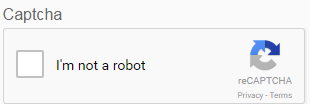

# Använda CAPTCHA i anpassningsbara formulär {#using-captcha-in-adaptive-forms}

CAPTCHA (Completely Automated Public Turing test to tell Computers and Humans Apart) är ett program som ofta används vid onlinetransaktioner för att skilja mellan människor och automatiserade program eller organ. Det utgör en utmaning och utvärderar användarens svar för att avgöra om det är en människa eller en robot som interagerar med webbplatsen. Det förhindrar användaren att fortsätta om testet misslyckas och gör onlinetransaktionerna säkra genom att förhindra att skräppost eller skadliga syften publiceras.

AEM Forms har stöd för CAPTCHA i anpassningsbara formulär. Du kan använda tjänsten reCAPTCHA av Google för att implementera CAPTCHA.

>[!NOTE] {grayBox=&quot;true&quot;}
>
>AEM Forms har endast stöd för reCaptcha v2. Andra versioner stöds inte.
>CAPTCHA i adaptiva formulär stöds inte i offlineläge i appen AEM Forms.

## Konfigurera ReCAPTCHA-tjänsten av Google {#google-recaptcha}

Formulärförfattare kan använda tjänsten reCAPTCHA av Google för att implementera CAPTCHA i anpassningsbara formulär. Den har avancerade CAPTCHA-funktioner för att skydda er webbplats. Mer information om hur reCAPTCHA fungerar finns i [Google reCAPTCHA](https://developers.google.com/recaptcha/).

Så här implementerar du tjänsten reCAPTCHA i AEM Forms:

1. Hämta [reCAPTCHA API-nyckelpar](https://www.google.com/recaptcha/admin) från Google. Den innehåller en webbplatsnyckel och hemlighet.
1. Skapa konfigurationsbehållare för molntjänster.

   1. Gå till **[!UICONTROL Verktyg > Allmänt > Konfigurationsläsaren]**.
   1. Gör följande för att aktivera den globala mappen för molnkonfigurationer eller hoppa över det här steget för att skapa och konfigurera en annan mapp för molntjänstkonfigurationer.

      1. Markera den **[!UICONTROL globala]** mappen i Configuration Browser och tryck på **[!UICONTROL Properties]**.
      1. Aktivera **[!UICONTROL molnkonfigurationer]** i dialogrutan Konfigurationsegenskaper.
      1. Tryck på **[!UICONTROL Spara och stäng]** för att spara konfigurationen och stänga dialogrutan.
   1. Tryck på **[!UICONTROL Skapa]** i Configuration Browser.
   1. I dialogrutan Skapa konfiguration anger du en rubrik för mappen och aktiverar **[!UICONTROL molnkonfigurationer]**.
   1. Tryck på **[!UICONTROL Skapa]** för att skapa den mapp som är aktiverad för molntjänstkonfigurationer.

1. Konfigurera molntjänsten för reCAPTCHA.

   1. Gå till  > **Cloud-tjänster** i din AEM-författarinstans.
   1. Tryck på **[!UICONTROL reCAPTCHA]**. Sidan Konfigurationer öppnas. Välj den konfigurationsbehållare som skapades i föregående steg och tryck sedan på **[!UICONTROL Skapa]**.
   1. Ange Namn, Webbplatsnyckel och Hemlig nyckel för reCAPTCHA-tjänsten och tryck på **[!UICONTROL Skapa]** för att skapa molntjänstkonfigurationen.
   1. I dialogrutan Redigera komponent anger du platsen och de hemliga nycklarna som fås i steg 1. Tryck på **[!UICONTROL Spara inställningar]** och tryck sedan på **[!UICONTROL OK]** för att slutföra konfigurationen.
   När reCAPTCHA-tjänsten har konfigurerats är den tillgänglig för användning i adaptiva formulär. Mer information finns i [Använda CAPTCHA i adaptiva formulär](#using-captcha).

## Använd CAPTCHA i anpassningsbara formulär {#using-captcha}

Så här använder du CAPTCHA i adaptiva former:

1. Öppna ett anpassat formulär i redigeringsläge.

   >[!NOTE]
   >
   >Kontrollera att den konfigurationsbehållare som valts när du skapar det adaptiva formuläret innehåller molntjänsten reCAPTCHA. Du kan också redigera adaptiva formuläregenskaper för att ändra konfigurationsbehållaren som är kopplad till formuläret.

1. Dra **[!UICONTROL Captcha]** -komponenten från komponentwebbläsaren till det adaptiva formuläret.

   >[!NOTE]
   >
   >Det går inte att använda mer än en Captcha-komponent i ett adaptivt formulär. Du bör inte heller använda CAPTCHA i en panel som är markerad för lazy loading eller i ett fragment.

   >[!NOTE]
   >
   >Captcha är tidskänsligt och upphör om ungefär en minut. Därför rekommenderar vi att du placerar Captcha-komponenten precis före Skicka-knappen i den anpassade formen.

1. Markera den Captcha-komponent som du har lagt till och tryck på  för att redigera dess egenskaper.
1. Ange en titel för CAPTCHA-widgeten. The default value is **Captcha**. Välj **[!UICONTROL Dölj rubrik]** om du inte vill att rubriken ska visas.
1. I listrutan **[!UICONTROL Captcha-tjänst]** väljer du **[!UICONTROL reCaptcha]** för att aktivera reCAPTCHA-tjänsten om du konfigurerat den enligt beskrivningen i tjänsten [ReCAPTCHA från Google](#google-recaptcha). Välj en konfiguration i listrutan Inställningar. Välj också storleken som **[!UICONTROL Normal]** eller **[!UICONTROL Compact]** för widgeten reCAPTCHA.

   >[!NOTE]
   >
   >Välj inte **[!UICONTROL Standard]** i listrutan Captcha-tjänst eftersom standardtjänsten AEM CAPTCHA är inaktuell.

1. Spara egenskaperna.

Tjänsten reCAPTCHA är aktiverad i det adaptiva formuläret. Du kan förhandsgranska formuläret och se hur CAPTCHA fungerar.
