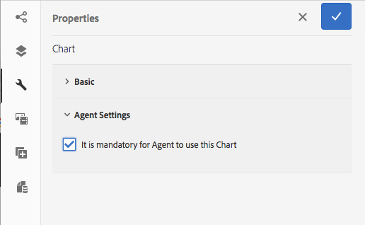

# Använda diagram i interaktiv kommunikation {#using-charts-in-interactive-communications}

Med diagram i en interaktiv kommunikation kan du komprimera stora mängder information till ett enkelt sätt att analysera och förstå visuellt format

Ett diagram eller diagram är en visuell representation av data. Det komprimerar stora mängder information till ett lättbegripligt visuellt format, vilket gör det möjligt för mottagarna av interaktiv kommunikation att bättre visualisera, tolka och analysera komplexa data.

När du skapar en interaktiv kommunikation kan du lägga till diagram som visuellt representerar tvådimensionella data från datamodellen i den interaktiva kommunikationen. Med diagramkomponenten kan du lägga till och konfigurera följande typer av diagram:

* Cirkel
* Kolumn
* Munk
* Bar (endast webbkanal)
* Linje
* Linje och punkt
* Punkt
* Yta

## Lägga till och konfigurera diagram i en interaktiv kommunikation {#add-and-configure-chart-in-an-interactive-communication}

Gör så här för att lägga till ett diagram i en interaktiv kommunikation:

1. Dra och släpp diagramkomponenten från komponenterna i sidofältet i AEM i någon av följande kanaler i en interaktiv kommunikation:

   * Utskriftskanal: Målområde och bildfält
   * Webbkanal: Panel- och målområde
   Den släppta diagramkomponenten skapar en platshållare för ett diagram.

1. Tryck på diagramkomponenten i redigeraren för interaktiv kommunikation och välj **[!UICONTROL Konfigurera (]** configure_icon ) i verktygsfältet Komponent.

   Sidlisten Egenskaper visas med de grundläggande egenskaperna för diagrammet i fokus.

   
   **** Bild: Grundläggande *egenskaper för ett linjetypsdiagram i en utskriftskanal*

   
   **** Bild: Grundläggande *egenskaper för ett linjetypsdiagram i webbkanalen*

1. Konfigurera diagrammets grundläggande egenskaper för utskriftskanaler och webbkanaler. Förutom de gemensamma egenskaperna finns det egenskaper som är specifika för utskrift, webbkanal och diagramtyp.

   * **[!UICONTROL Namn]**: Diagramobjektets namn. Namnet på diagrammet som du anger här visas inte i diagrammets utdata, men används i regler för att referera till diagrammet.
   * **[!UICONTROL Diagramtyp]**: Ange diagramtyp: Cirkel, Kolumn, Ring, Linje, Linje och Punkt, Punkt eller Yta.
   * **[!UICONTROL Dölj objekt]**:Välj det här alternativet om du vill dölja diagrammet i det slutliga resultatet.
   * Ange följande för **[!UICONTROL x-axel]** och **[!UICONTROL y-axel]**:

      * **[!UICONTROL Titel]**: Ange rubrikerna för X- och Y-axeln som ska visas i den interaktiva kommunikationen.
      * **[!UICONTROL Datamodellobjekt *]**: Bläddra och markera datamodellsobjekt för X- och Y-axeln i diagrammet från den formulärdatamodell som angavs när den interaktiva kommunikationen skapades. Välj två samlings-/arraytypegenskaper för samma överordnade datamodellsobjekt som är meningsfulla i förhållande till varandra för att rita på X- och Y-axeln i ett diagram.
      * **[!UICONTROL Funktion]**: Om du vill använda statistiska funktioner för att beräkna värdena på axeln väljer du funktionen för X-/Y-axeln. Mer information om funktioner finns i [Använda funktioner i diagram](#usefunction) och [exempel 2: Användning av summor- och medelfunktioner i ett linjediagram](#applicationsumfrequency).
   >[!NOTE]
   >
   >För utskriftskanaler på X-axeln ska datamodellobjektet som du binder vara av typen Number, String eller Date. På Y-axeln ska datamodellobjektet som du binder ha typen Number. Vi rekommenderar att du använder högersidesförklaringen i utskriftskanalen.

   Mer information om diagramegenskaper finns i [Grundläggande egenskaper i diagram](#basicpropertiescharts).

1. (Endast skrivarkanal) Ange om agenten måste använda det här diagrammet i agentinställningarna. Om alternativet **[!UICONTROL Det är obligatoriskt för agenten att använda det här diagrammet]** inte är markerat kan agenten trycka på ögonikonen för diagrammet på fliken Innehåll i agentanvändargränssnittet för att visa/dölja diagrammet.

   

1. Tryck på i sidofältet Egenskaper.

   Förhandsgranska om du vill se diagrammets utseende och data. Återgå till att konfigurera om egenskaperna för diagrammet, om det behövs.

1. Återgå till att göra andra ändringar i den interaktiva kommunikationen.

## Exempel 1: Diagramutdata för tryck och webb {#chartoutputprintweb}

På fliken Grundläggande definierar du diagramtyp, egenskaper för källformulärdatamodellen som innehåller data, etiketter som ska ritas på x- och y-axeln i diagrammet och eventuellt statistikfunktionen för att beräkna värdena för plottning i diagrammet.

Låt oss i detalj förstå vilken information som minst krävs i grundläggande egenskaper, med hjälp av ett kreditkortsutdrag som genererats med en interaktiv kommunikation. Tänk på att du vill generera ett diagram som avbildar beloppet för olika utgifter i utdraget. Du vill använda olika typer av diagram för utskrift och webb i den interaktiva kommunikationen.

För att uppnå detta måste du ange:

* **[!UICONTROL Diagramtyp]** - i det här exemplet kolumn för utskriftskanalen och Ring för webbkanalen
* **[!UICONTROL Datamodellsobjekt]** som källa för diagrammets X- och Y-axel - i det här exemplet Transaktionsbelopp för X-axeln och utgiftsnamn för Y-axeln
* **[!UICONTROL Rubrik]** för X- och Y-axeln (för stapeldiagram i utskriftskanalen endast i det här exemplet) - Mängd ($) för X-axeln och Utgift för Y-axeln.
* **[!UICONTROL Etikettriktning]** (för stapeldiagram i utskriftskanalen endast i det här exemplet) - i det här exemplet `Tilt Left`

* **[!UICONTROL Verktygstips]** som visas när muspekaren förs över en utgift (endast webbkanal) - i det här exemplet `${x}: $ ${y}`som visas som [utgiftsetikett: $ Belopp] (exempel: Theme Park Visit: $ 315)

 Kolumndiagram i tryckt utskrift av en interaktiv kommunikation ****: Stapeldiagram *i utskrift av interaktiv kommunikation*

******S. Y-axel - Mängd hämtad från formulärdatamodellens egenskap och Title-egenskapen har värdet Amount ($)** B. Etikettorientering för X-axel inställd på Lutning åt vänster **C.** X-axel - utgiftsbeskrivning hämtad från formulärdatamodellens egenskap och Title-egenskap inställd på Utgift

 Visa diagram i webbutdata från en interaktiv kommunikation ****: Ringdiagram *i webbutdata för interaktiv kommunikation*

******S. Egenskapen Innerradie för munstycket anges till** B. Egenskapen Visa förklaring är markerad och egenskapen Förklaringsposition är inställd på Höger **C.** Verktygstips visar detaljerna för objektet när muspekaren förs över - Funktionsbeskrivning är inställd på ${x}: $ ${y}

## Exempel 2: Användning av summerings- och frekvensfunktioner i ett linjediagram {#applicationsumfrequency}

Genom att använda funktioner i ett diagram kan du rita data som inte tillhandahålls direkt av formulärdatamodellen. I det här exemplet använder vi ett kreditkortsexempel för att förstå hur summerings- och frekvensfunktioner kan användas i diagrammet.

 Linjediagram utan funktion med tre&quot;Bed and Breakfast&quot;-transaktioner ****: Bild: *Linjediagram utan funktion med tre &quot;Bed and Breakfast&quot;-transaktioner*

### Summeringsfunktion {#sum-function}

Du kan använda summafunktionen för att lägga till värden för flera instanser av samma dataegenskap och bara visa den en gång. I följande diagram används funktionen Sum på Y-axeln för att lägga till beloppet för de tre Bed- och Frukost-transaktionerna ($99,45, $78 och $12) och bara visa en transaktion ($189.45).

Summeringsfunktionen kan göra diagrammet mer användbart när du vill sortera och visa summan för många förekomster av samma dataegenskap.


### Frekvensfunktion {#frequency-function}

Frekvensfunktionen returnerar antalet värden på X- eller Y-axeln för ett givet värde på den andra axeln. När funktionen Frekvens används på y-axeln (Belopp/TransAmount) visar diagrammet att det finns tre förekomster av Bed- och Breakfast-transaktioner och en förekomst av de övriga transaktionstyperna.


## Grundläggande egenskaper i diagram {#basicpropertiescharts}

På fliken Grundläggande kan du konfigurera följande egenskaper:

**Namn** En identifierare för diagramelementet. Namnet är inte synligt i diagrammet, men det är användbart när du refererar till elementet från andra komponenter, skript och SOM-uttryck.

**Titel (endast utskriftskanalen)** Anger diagrammets rubrik.

**Diagramtyp** Anger vilken typ av diagram du vill generera. De tillgängliga alternativen är Cirkel, Kolumn, Ring upp, Stapel (endast webbkanal), Linje, Linje och Punkt, Punkt och Yta. Mer information finns i exempel 1: Diagramutdata för tryck och webb.

**X-axel > Titel** Anger x-axelns rubrik.

**** X-axel > Datamodellobjekt&amp;stämpel;ast; Ange namnet på den formulärdatamodellsamling som ska ritas på x-axeln.

**X-axel > Funktion** Anger den statistiska/anpassade funktion som ska användas för att beräkna värdena på x-axeln. Mer information om funktioner finns i Använda funktioner i diagram och exempel 2: Användning av summor- och medelfunktioner i ett linjediagram.

**X-axel > Etikettorientering** för etiketten i diagrammet i utskriftskanalen. Om du väljer riktning för etiketten som Anpassad rotation visas fältet Anpassad rotationsvinkel (grader). I fältet Anpassad rotationsvinkel (grader) kan du välja rotationsvinkel i steg om 15 grader.

**Y-axel > Titel** Anger rubriken för y-axeln.

**** Y-axel > datamodellobjekt&amp;stämpel;ast; Anger det objekt i formulärdatamodellens samling som ska ritas på y-axeln. I utskriftskanalen ska datamodellobjektet för Y-axeln vara av typen Number.

**Y-axel > Funktion** Anger den statistiska/anpassade funktion som ska användas för att beräkna värdena på y-axeln. Mer information om funktioner finns i Använda funktioner i diagram och exempel 2: Användning av summor- och medelfunktioner i ett linjediagram.

**Visa förklaring** Visar en förklaring för cirkeldiagrammet eller mundiagrammet när det är aktiverat.

**Förklaringens position** Anger förklaringens position i förhållande till diagrammet. De tillgängliga alternativen är Höger, Vänster, Upptill och Nedtill.

**Höjd (endast utskriftskanalen)** Diagrammets höjd i pixlar.

**Diagrammets bredd i pixlar (endast utskriftskanalen)** .

>[!NOTE]
>
>Du kan styra diagrammets bredd i webbkanalen med hjälp av stillagret eller genom att använda ett tema.

**Verktygstips (endast webbkanal)** Anger i vilket format verktygstipset ska visas när användaren för musen över en datapunkt i diagrammet i webbkanalen. Standardvärdet är \${x}(\${y}). Beroende på diagramtyp ersätts variablerna \${x} och \${y} dynamiskt med motsvarande värden på x-axeln och y-axeln när du pekar med musen på en punkt, stapel eller segment i diagrammet, och visas i verktygstipset.

Om du vill inaktivera verktygstipset lämnar du fältet Verktygstips tomt. Det här alternativet gäller inte för linjediagram och ytdiagram. Se [exempel 1: Diagramutdata för tryck och webb](#chartoutputprintweb).

**CSS-klass (endast webbkanal)** Ange namnet på en CSS-klass i CSS-klassfältet för att använda anpassad formatering i diagrammet.

**Obligatorisk sidbrytning före (endast utskriftskanalen)** Välj att lägga till en obligatorisk sidbrytning före diagrammet och placera diagrammet ovanpå en ny sida.

**Obligatorisk sidbrytning efter (endast utskriftskanalen)** Välj att lägga till en obligatorisk sidbrytning efter diagrammet och placera innehållet efter diagrammet överst på en ny sida.

**Indrag (endast tryckkanal)** Ange indrag för diagrammet från sidans vänstra kant.

**Diagramspecifika konfigurationer** Förutom vanliga konfigurationer finns följande diagramspecifika konfigurationer:

* **Innerradie**: finns för Donut-diagram för att ange radien (i pixlar) för den inre cirkeln i diagrammet.
* **Linjefärg**: finns för linje-, linje- och punktdiagram samt ytdiagram för att ange det hexadecimala värdet för linjefärgen i diagrammet.
* **Punktfärg**: som är tillgängliga för Point-, Line- och Point-diagram för att ange det hexadecimala värdet på färgen för punkterna i diagrammet.

* **Områdesfärg**: som är tillgängliga för ytdiagram för att ange det hexadecimala värdet för färgen för området under raden i diagrammet.

## Använda funktioner i diagram {#usefunction}

Du kan konfigurera ett diagram så att statistiska funktioner används för att beräkna värden från källdata för plottning i diagrammet. Genom att använda funktioner i ett diagram kan du rita data som inte tillhandahålls direkt av formulärdatamodellen.

Även om diagramkomponenten innehåller vissa inbyggda funktioner kan du skriva egna funktioner och göra dem tillgängliga för användning i diagramkonfigurationen i webbkanalen.


>[!NOTE]
>
>Du kan använda funktioner för att beräkna värden för antingen X-axeln eller Y-axeln i ett diagram.

### Standardfunktioner {#default-functions}

Följande funktioner är tillgängliga som standard med komponenten Chart:

**Medel (medel)** Returnerar medelvärdet av värdena på X- eller Y-axeln för ett givet värde på den andra axeln.

**Summa** Returnerar summan av alla värden på X- eller Y-axeln för ett givet värde på den andra axeln.

**Maximum** Returnerar det maximala värdet på X- eller Y-axeln för ett givet värde på den andra axeln.

**Frekvens** Returnerar antalet värden på X- eller Y-axeln för ett givet värde på den andra axeln.

**Intervall** Returnerar skillnaden mellan det högsta och det lägsta värdet på X- eller Y-axeln för ett givet värde på den andra axeln.

**Median** Returnerar det värde som skiljer högre och lägre värden i halva X- eller Y-axeln från varandra för ett givet värde på den andra axeln.

**Minimum** Returnerar det minsta värdet på X- eller Y-axeln för ett givet värde på den andra axeln.

**Läge** Returnerar värdet med de flesta förekomster på X- eller Y-axeln för ett givet värde på den andra axeln

### Anpassade funktioner i webbkanalen {#custom-functions-in-web-channel}

Förutom att använda standardfunktionerna i diagram kan du skriva anpassade funktioner i JavaScript™ och göra dem tillgängliga i listan med funktioner i diagramkomponenten för webbkanalen.

En funktion tar en eller flera matriser och ett kategorinamn som indata och returnerar ett värde. Exempel:

```
Multiply(valueArray, category) {
 var val = 1;
 _.each(valueArray, function(value) {
 val = val * value;
 });
 return val;
}
```

När du har skrivit en anpassad funktion gör du följande för att göra den tillgänglig för användning i diagramkonfigurationen:

1. Lägg till den anpassade funktionen i klientbiblioteket som är kopplad till den relevanta interaktiva kommunikationen. Mer information finns i [Konfigurera åtgärden](/help/forms/using/configuring-submit-actions.md) Skicka och [Använda bibliotek](/help/sites-developing/clientlibs.md)på klientsidan.

1. Om du vill visa den anpassade funktionen i listrutan Funktion skapar du i CRXDe Lite en `nt:unstructured` nod i mappen apps med följande egenskaper:

   * Lägg till egenskap `guideComponentType` med värdet som `fd/af/reducer`. (mandatory)
   * Lägg till en egenskap `value` till ett fullständigt kvalificerat namn för den anpassade JavaScript™-funktionen. (obligatoriskt) och ange dess värde till namnet på den anpassade funktionen, till exempel Multiplicera.
   * Lägg till egenskap `jcr:description` med det värde som du vill visa som namnet på den anpassade funktionen som visas i listrutan Funktion. Till exempel **Multiplicera**.
   * Lägg till en egenskap `qtip` med ett värde som är en kort beskrivning av den anpassade funktionen. Det visas som ett verktygstips när du håller pekaren över funktionsnamnet i listrutan **Funktion** .

1. Klicka på **Spara alla** för att spara konfigurationen.

Funktionen kan nu användas i diagrammet.