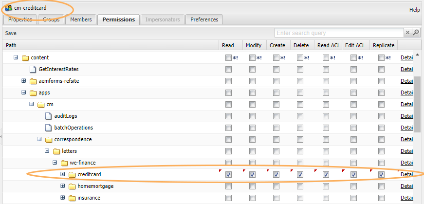

# PUBLICERA INTE rollbaserat användargränssnitt i korrespondenshanteringen {#do-not-publish-role-based-user-interface-in-correspondence-management}

I AEM kan administratören ge rollbaserad åtkomst till olika användargrupper för att utföra olika åtgärder på olika resurser. Funktionerna för att skapa eller redigera dataordlistor kan till exempel bara vara tillgängliga för användare i en viss användargrupp, medan andra användare bara kan visa och använda dataordlistorna.

I AEM-gränssnittet visas alternativ, till exempel för att skapa eller redigera en resurstyp, baserat på en användares åtkomstnivå. Om en användare till exempel inte har behörighet att skapa ett datalexikon visas inte alternativet att skapa ett datalexikon i användargränssnittet.

Även om CRX tillåter att du konfigurerar åtkomsträttigheter för både användar- och gruppkonton handlar den här artikeln om rollbaserade eller användargruppbaserade åtkomsträttigheter.

Mer information om grupper, behörigheter, åtkomstkontrollistor och hur du hanterar användare och grupper finns i [Användaradministration och -säkerhet](/help/sites-administering/security.md).

## Hantera behörigheter {#managing-permissions}

1. Se till att användaren som du vill hantera behörigheterna för läggs till i den relevanta användargruppen.

   Användaren John Doe läggs till i grupperna `agents` och `cm-creditcard`. Mer information finns i Lägga till användare eller grupper i en grupp. Mer information finns i [Hantera användare och användargrupper](/help/communities/users.md).

   

1. Skapa de mappar som passar för de avsedda behörigheterna.

   Om ett företag t.ex. har inteckningar i hemmet, kreditkort och försäkringsavdelningar kan de skapa mappar med namn `HomeMortgage`och `CreditCard,``Insurance` behålla relevanta tillgångar och ge agenterna tillgång till vissa tillgångar som endast är relevanta för deras avdelningar.

1. Gör något av följande för att få åtkomst till AEM WCM-säkerhet:

   1. Klicka på säkerhetsikonen på välkomstskärmen eller olika platser i AEM:

   1. Navigera direkt till `https://[server]:[port]/useradmin`. Se till att du loggar in på AEM som administratör.

      
   I det vänstra trädet visas alla användare och grupper som finns i systemet. Du kan markera de kolumner som du vill visa, sortera innehållet i kolumnerna och till och med ändra ordningen som kolumnerna visas i genom att dra kolumnrubriken till en ny position.

   Flikarna ger åtkomst till olika konfigurationer:

1. Dubbeltryck på namnet på den relevanta gruppen i den vänstra trädlistan och välj sedan fliken Behörigheter.

   Om du vill hitta namnet på gruppen kan du skriva namnet på gruppen i det angivna utrymmet.

1. Gå till den sökväg som du vill lägga till behörigheter i på fliken Behörigheter. Mapparna Correspondence Management finns under `content/apps/cm/` mappen.

   Markera kryssrutan i kolumnen Medlem för de medlemmar som du vill ska ha behörighet till den sökvägen. Avmarkera kryssrutan för den medlem som du vill ta bort behörigheter för. En röd triangel visas i cellen som du har ändrat i.

   

   >[!NOTE]
   >
   >De behörigheter som anges i en mapp ersätter de behörigheter som anges i dess undermappar.

1. Tryck på Spara.
1. Stega text
1. Stega text
1. Stega text

