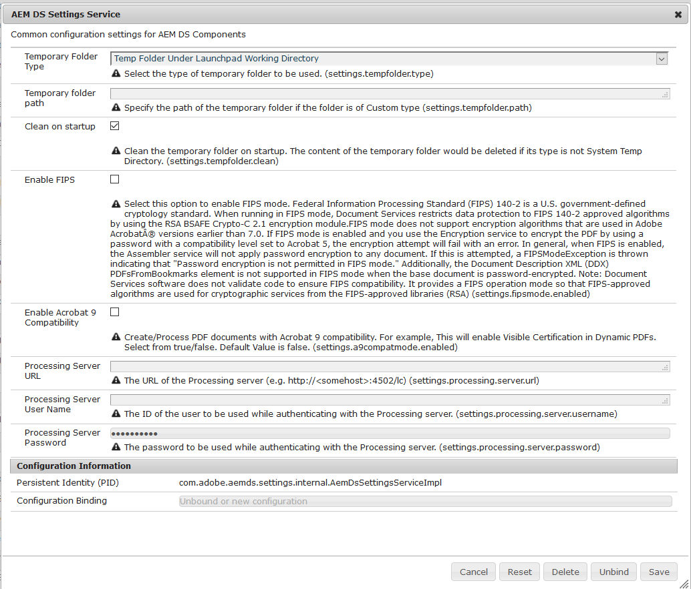

# Konfigurerar AEM DS-inställningar {#configuring-aem-ds-settings}

I den här artikeln beskrivs hur du konfigurerar **AEM DS-inställningstjänsten**. Den här inställningen kan användas i flera scenarier, till exempel:

* I korrespondenshantering

   * För konfigurering av AEM Forms Workflow
   * När du använder formulärportalen för att spara utkast/inskickning på fjärrbasis

* I adaptiva formulär för fall när adaptiv form skickas från publiceringsinstansen

Så här konfigurerar du **[!UICONTROL AEM DS-inställningarna]**:

1. Öppna Configuration Manager på publiceringsinstansen med URL:en:

   *http://localhost:port/system/console/configMgr*.

   

1. I fönstret Konfiguration **[!UICONTROL av]** Adobe Experience Manager Web Console letar du upp och klickar på alternativet **[!UICONTROL AEM DS-inställningar]** .

   

1. I fönstret **[!UICONTROL AEM DS Settings Service]** visas de vanliga konfigurationsinställningarna för AEM DS Components.

   

1. Lägg till följande information i respektive fält:

   **[!UICONTROL Bearbetar server-URL]**: Bearbetningsservern är den server där Forms- eller AEM-arbetsflödet måste aktiveras. Detta kan vara samma som URL:en för AEM-författarinstansen eller den andra server-URL:en (d.v.s. http:// localhost:port/).

   **[!UICONTROL Användarnamn]** för bearbetningsserver: Användarnamn för arbetsflöde [baserat på den server-URL som används]

   **[!UICONTROL Lösenord]** för bearbetningsserver: Lösenord för arbetsflödesanvändare

   >[!NOTE]
   >
   >* När du använder antingen Forms- eller AEM-arbetsflöden måste du konfigurera tjänsten DS-inställningar innan du skickar något från publiceringsservern. I annat fall ska inlämningen av formuläret misslyckas.

