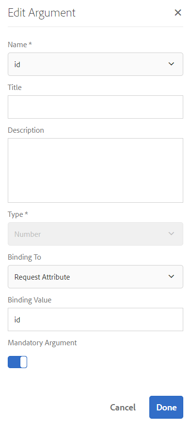

# Självstudiekurs: Skapa formulärdatamodell  {#tutorial-create-form-data-model}

>[!CAUTION]
>
>AEM 6.4 har nått slutet på den utökade supporten och denna dokumentation är inte längre uppdaterad. Mer information finns i [teknisk supportperiod](https://helpx.adobe.com/support/programs/eol-matrix.html). Hitta de versioner som stöds [här](https://experienceleague.adobe.com/docs/).

Den här självstudiekursen är ett steg i [Skapa ditt första adaptiva formulär](/help/forms/using/create-your-first-adaptive-form.md) serie. Vi rekommenderar att du följer serien i kronologisk ordning för att förstå, utföra och demonstrera det fullständiga exemplet på självstudiekurser.

## Om självstudiekursen {#about-the-tutorial}

Med dataintegreringsmodulen i AEM Forms kan du skapa en formulärdatamodell från olika backend-datakällor som AEM användarprofil, RESTful web services, SOAP-baserade webbtjänster, OData services och relationsdatabaser. Du kan konfigurera datamodellsobjekt och datatjänster i en formulärdatamodell och koppla den till ett anpassat formulär. Anpassningsbara formulärfält är bundna till objektegenskaper för datamodell. Med tjänsterna kan du förifylla det anpassningsbara formuläret och skriva skickade formulärdata tillbaka till datamodellobjektet.

Mer information om integration av formulärdata och formulärdatamodell finns i [AEM Forms dataintegrering](/help/forms/using/data-integration.md).

I den här självstudiekursen får du hjälp med att förbereda, skapa, konfigurera och associera en formulärdatamodell med ett adaptivt formulär. I slutet av den här självstudiekursen kan du:

* [Konfigurera MySQL-databasen som datakälla](#config-database)
* [Skapa formulärdatamodell med MySQL-databas](#create-fdm)
* [Konfigurera formulärdatamodell](#config-fdm)
* [Testa formulärdatamodell](#test-fdm)

Formulärdatamodellen ser ut ungefär så här:

**S.** Konfigurerade datakällor **B.** Datakällscheman **C.** Tillgängliga tjänster **D.** Datamodellsobjekt **E.** Konfigurerade tjänster

## Förutsättningar {#prerequisites}

Kontrollera att du har följande innan du börjar:

* MySQL-databas med exempeldata enligt avsnittet Krav i [Skapa ditt första anpassningsbara formulär](/help/forms/using/create-your-first-adaptive-form.md)
* OSGi-paket för MySQL JDBC-drivrutin enligt beskrivningen i [Paketera JDBC-databasdrivrutinen](/help/sites-developing/jdbc.md#bundling-the-jdbc-database-driver)
* Adaptiv form enligt den första självstudiekursen [Skapa ett anpassat formulär](/help/forms/using/create-adaptive-form.md)

## Steg 1: Konfigurera MySQL-databasen som datakälla {#config-database}

Du kan konfigurera olika typer av datakällor för att skapa en formulärdatamodell. I den här självstudiekursen konfigurerar vi MySQL-databasen som du har konfigurerat och fyllt i med exempeldata. Mer information om andra datakällor som stöds och hur du konfigurerar dem finns i [AEM Forms dataintegrering](/help/forms/using/data-integration.md).

Gör följande för att konfigurera MySQL-databasen:

1. Installera JDBC-drivrutin för MySQL-databas som ett OSGi-paket:

   1. Logga in på AEM Forms Author Instance som administratör och gå till AEM webbkonsolpaket. Standardwebbadressen är [http://localhost:4502/system/console/bundles](http://localhost:4502/system/console/bundles).

   1. Tryck **Installera/uppdatera**. An **Ladda upp/installera programpaket** visas.

   1. Tryck **Välj fil** för att bläddra och välja paketet MySQL JDBC driver OSGi. Välj **Startpaket** och **Uppdatera paket** och trycka **Installera eller uppdatera**. Kontrollera att Oraclets JDBC-drivrutin för MySQL är aktiv. Drivrutinen är installerad.

1. Konfigurera MySQL-databasen som en datakälla:

   1. Gå till AEM webbkonsol på [http://localhost:4502/system/console/configMgr](http://localhost:4502/system/console/configMgr).
   1. Sök **Poolad datakälla för Apache Sling-anslutning** konfiguration. Tryck för att öppna konfigurationen i redigeringsläge.
   1. Ange följande information i konfigurationsdialogrutan:

      * **Datakällans namn:** Du kan ange vilket namn som helst. Ange till exempel **WeRetailMySQL**.
      * **Egenskapsnamn för DataSource-tjänst**: Ange namnet på den tjänsteegenskap som innehåller DataSource-namnet. Den anges när datakällinstansen registreras som OSGi-tjänst. Till exempel: **datakälla.namn**.
      * **JDBC-drivrutinsklass**: Ange Java-klassnamnet för JDBC-drivrutinen. För MySQL-databas anger du **com.mysql.jdbc.Driver**.
      * **URI för JDBC-anslutning**: Ange anslutnings-URL för databasen. För MySQL-databaser som körs på port 3306 och schema werail är URL:en: `jdbc:mysql://[server]:3306/weretail?autoReconnect=true&useUnicode=true&characterEncoding=utf-8`
      * **Användarnamn:** Användarnamn för databasen. Det krävs för att JDBC-drivrutinen ska kunna upprätta en anslutning till databasen.
      * **Lösenord:** Lösenord för databasen. Det krävs för att JDBC-drivrutinen ska kunna upprätta en anslutning till databasen.
      * **Test on Borgo:** Aktivera **Testa om Born** alternativ.
      * **Test vid retur:** Aktivera **Test vid retur** alternativ.
      * **Valideringsfråga:** Ange en SELECT-fråga (SQL) för att validera anslutningar från poolen. Frågan måste returnera minst en rad. Till exempel: **markera &amp;senast; från kundinformation**.
      * **Transaktionsisolering**: Ange värdet till **READ_COMMTED**.

      Lämna övriga egenskaper som standard [values](https://tomcat.apache.org/tomcat-7.0-doc/jdbc-pool.html) och trycka **Spara**.
   En konfiguration som liknar följande skapas.

   

## Steg 2: Skapa formulärdatamodell {#create-fdm}

AEM Forms har ett intuitivt användargränssnitt för [skapa en formulärdatamodell](data-integration.md) från konfigurerade datakällor. Du kan använda flera datakällor i en formulärdatamodell. I det här fallet använder vi den konfigurerade MySQL-datakällan.

Gör följande för att skapa formulärdatamodell:

1. I AEM författarinstans går du till **Forms** >  **Dataintegrering** s.
1. Tryck **Skapa** >  **Formulärdatamodell**.
1. I dialogrutan Skapa formulärdatamodell anger du en **name** för formulärdatamodellen. Till exempel: **kundleveransfaktureringsinformation**. Tryck **Nästa**.
1. På skärmen Välj datakälla visas alla konfigurerade datakällor. Välj **WeRetailMySQL** datakälla och knacka **Skapa**.

   

The **kundleveransfaktureringsinformation** formulärdatamodell skapas.

## Steg 3: Konfigurera formulärdatamodell {#config-fdm}

I konfigurationen av formulärdatamodellen ingår:

* lägga till datamodellobjekt och datatjänster
* konfigurera läs- och skrivtjänster för datamodellobjekt

Gör följande för att konfigurera formulärdatamodellen:

1. Navigera AEM författarinstansen till **Forms > Dataintegreringar**. Standardwebbadressen är [http://localhost:4502/aem/forms.html/content/dam/formsanddocuments-fdm](http://localhost:4502/aem/forms.html/content/dam/formsanddocuments-fdm).
1. The **kundleveransfaktureringsinformation** formulärdatamodellen som du skapade tidigare visas här. Öppna den i redigeringsläge.

   Den valda datakällan **WeRetailMySQL** har konfigurerats i formulärdatamodellen.

   

1. Expandera trädet för datakällan WeRailMySQL. Välj följande datamodellsobjekt och -tjänster från **weretail** >  **kundinformation** schema till formulärdatamodell:

   * **Datamodellsobjekt**:

      * id
      * name
      * shippingAddress
      * stad
      * läge
      * zipcode
   * **Tjänster:**

      * get
      * uppdatera

   Tryck **Lägg till markerade** om du vill lägga till valda datamodellsobjekt och datatjänster i formulärdatamodellen.

   

   >[!NOTE]
   >
   >Standardtjänsterna för hämtning, uppdatering och infogning av JDBC-datakällor levereras med formulärdatamodell direkt.

1. Konfigurera läs- och skrivtjänster för datamodellobjektet.

   1. Välj **kundinformation** datamodellsobjekt och tryck **Redigera egenskaper**.
   1. Välj **get** från listrutan Lästjänst. The **id** -argument, som är primärnyckeln i datamodellobjektet för kundinformation, läggs till automatiskt. Tryck  och konfigurera argumentet enligt följande.

      

   1. På samma sätt kan du markera **uppdatera** som skrivtjänst. The **kundinformation** objekt läggs automatiskt till som argument. Argumentet är konfigurerat enligt följande.

      

      Lägg till och konfigurera **id** följande argument.

      

   1. Tryck **Klar** om du vill spara datamodellens objektegenskaper. Tryck sedan på **Spara** för att spara formulärdatamodellen.

      The **get** och **uppdatera** tjänster läggs till som standardtjänster för datamodellobjektet.

      

1. Gå till **Tjänster** och konfigurera **get** och **uppdatera** tjänster.

   1. Välj **get** service och knacka **Redigera egenskaper**. Dialogrutan Egenskaper öppnas.
   1. Ange följande i dialogrutan Redigera egenskaper:

      * **Titel**: Ange tjänstens titel. Till exempel: Hämta leveransadress.
      * **Beskrivning**: Ange en beskrivning som innehåller detaljerad funktionalitet för tjänsten. Till exempel:

         Den här tjänsten hämtar leveransadress och annan kundinformation från MySQL-databasen

      * **Objekt för utdatamodell**: Välj schema som innehåller kunddata. Till exempel:

         kundinformationsschema
      * **Returnera matris**: Inaktivera **Returnera matris** alternativ.
      * **Argument**: Välj argument med namnet **ID**.

      Tryck **Klar**. Tjänsten för att hämta kundinformation från MySQL-databasen har konfigurerats.

      

   1. Välj **uppdatera** service och knacka **Redigera egenskaper**. Dialogrutan Egenskaper öppnas.

   1. Ange följande i dialogrutan Redigera egenskaper:

      * **Titel**: Ange tjänstens titel. Exempel: Uppdatera leveransadress.

      * **Beskrivning**: Ange en beskrivning som innehåller detaljerad funktionalitet för tjänsten. Till exempel:

         Den här tjänsten uppdaterar leveransadress och relaterade fält i MySQL-databasen

      * **Indatamodellsobjekt**: Välj schema som innehåller kunddata. Till exempel:

         kundinformationsschema

      * **Utdatatyp**: Välj **BOOLEAN**.
      * **Argument**: Välj argument med namnet **ID** och **kundinformation**.

      Tryck **Klar**. The **uppdatera** för att uppdatera kundinformation i MySQL-databasen har konfigurerats.

      

Datamodellsobjektet och -tjänsterna i formulärdatamodellen har konfigurerats. Nu kan du testa formulärdatamodellen.

## Steg 4: Testa formulärdatamodell {#test-fdm}

Du kan testa datamodellsobjektet och datatjänsterna för att verifiera att formulärdatamodellen är korrekt konfigurerad.

Gör följande för att köra testet:

1. Gå till **Modell** väljer du **kundinformation** datamodellsobjekt, och tryck **Testmodellobjekt**.
1. I **Testmodell/tjänst** fönster, markera **Läs modellobjekt** från **Välj modell/tjänst** nedrullningsbar meny.
1. I **kundinformation** anger du ett värde för **id** argument som finns i den konfigurerade MySQL-databasen och som trycker **Testa**.

   Kundinformationen som är kopplad till det angivna ID:t hämtas och visas i **Utdata** enligt nedan.

   

1. På samma sätt kan du testa Write-modellobjektet och tjänsterna.

   I följande exempel uppdaterar uppdateringstjänsten adressinformationen för ID 7102715 i databasen.

   

   Om du testar läsmodelltjänsten igen för ID 7107215 hämtas och visas den uppdaterade kundinformationen enligt nedan.

   
