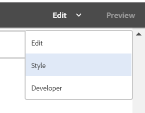
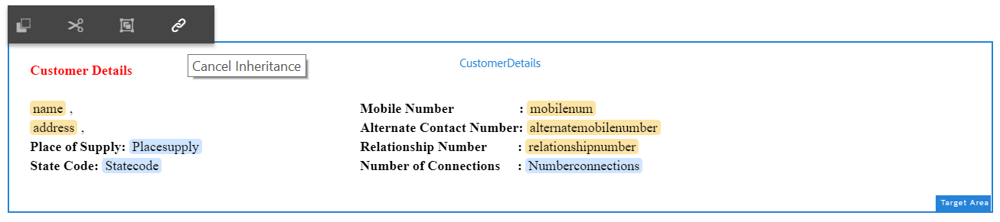

# Självstudiekurs: Skapa interaktiv kommunikation {#tutorial-create-interactive-communication}

Skapa en interaktiv kommunikation med alla byggstenar

Den här självstudiekursen är ett steg i [Skapa din första serie med interaktiv kommunikation](/help/forms/using/create-your-first-interactive-communication.md). Vi rekommenderar att du följer serien i kronologisk ordning för att förstå, utföra och demonstrera det fullständiga exemplet på självstudiekurser.

När du har skapat alla byggstenar, t.ex. formulärdatamodell, dokumentfragment, mallar och teman för webbversionen, kan du börja skapa en interaktiv kommunikation.

Interaktiv kommunikation kan levereras via två kanaler: Tryck och webb. Du kan också skapa en interaktiv kommunikationskanal med utskriftskanalen som överordnad. Med alternativet Skriv ut som överordnad för webbkanalen kan du säkerställa att innehållet, arvet och databindningen för webbkanalen hämtas från Print-kanalen. Det ser också till att ändringarna som görs i utskriftskanalen synkroniseras i webbkanalen. De som skapar interaktiv kommunikation får dock bryta arvet för vissa komponenter i webbkanalen.

I den här självstudiekursen får du hjälp med att skapa interaktiv kommunikation för tryck- och webbkanaler. I slutet av den här självstudiekursen kan du:

* Skapa interaktiv kommunikation för tryckkanalen
* Skapa interaktiv kommunikation för webbkanalen
* Skapa trycksaker och interaktiv webbkommunikation med Överordnad trycksaksproduktion

## Skapa interaktiv kommunikation för tryck och webb utan synkronisering {#create-interactive-communications-for-print-and-web-with-no-synchronization}

### Skapa interaktiv kommunikation för utskriftskanalen {#create-interactive-communication-for-print-channel}

Nedan följer en lista över resurser som redan har skapats i den här självstudiekursen och som behövs när du skapar den interaktiva kommunikationen för utskriftskanalen:

**Utskriftsmall:** [create_first_ic_print_template](/help/forms/using/create-templates-print-web.md)

**Formulärdatamodell:** [FDM_Create_First_IC](create-form-data-model-tutorial.md)

**Dokumentfragment:** [Bill_details_first_ic, customer_details_first_ic, Bill_summary_first_ic, summary_Charts_first_ic](/help/forms/using/create-document-fragments.md)

**Layoutfragment:** [table_lf](/help/forms/using/create-templates-print-web.md)

**bilder:** PayNow och ValueAddedServices

1. Logga in på AEM författarinstans och navigera till **[!UICONTROL Adobe Experience Manager]** > **[!UICONTROL Forms]** > **[!UICONTROL Forms & Documents]**.
1. Tryck på **Skapa** och välj **Interaktiv kommunikation**. Guiden **Skapa interaktiv kommunikation** visas.
1. Ange **create_first_ic** i fältet **Title** och **Name**. Välj **FDM_Create_First_IC** som formulärdatamodell och tryck på **Nästa**.
1. I guiden **Kanaler**:

   1. Ange **create_first_ic_print_template** som utskriftsmall och tryck på **Välj**. Kontrollera att kryssrutan **Använd Skriv ut som Överordnad för webbkanal** inte är markerad.
   1. Ange **Create_First_IC_templates** mapp > **Create_First_IC_Web_Template** som webbmall och tryck på **Välj**.
   1. Tryck på **Skapa**.

   Ett bekräftelsemeddelande visas om att den interaktiva kommunikationen har skapats.

1. Tryck på **Redigera** för att öppna den interaktiva kommunikationen i den högra rutan.
1. Gå till fliken **Resurser** och använd filtret för att endast visa dokumentfragmenten i den vänstra rutan.
1. Dra och släpp följande dokumentfragment till målområdena i interaktiv kommunikation:

   | Dokumentfragment | Målområde |
   |---|---|
   | Bill_details_first_ic | BillDetails |
   | customer_details_first_ic | CustomerDetails |
   | Bill_summary_first_ic | BillSummary |
   | summary_Charts_first_interactive_communication | Avgifter |

   

1. Tryck på **Diagram** målområde och tryck på **+** för att lägga till en **Diagram**-komponent.
1. Tryck på diagramkomponenten och välj  (Configure). Diagramegenskaperna visas i den vänstra rutan:

   1. Ange ett namn för diagrammet.
   1. Välj **Cirkel** i listrutan **Diagramtyp**.
   1. Välj egenskapen **calltype** i **anropen** datamodellens objekttyp i **X-axeln**-avsnittet. Tryck på .
   1. Välj **Frekvens** i listrutan **Funktion**.
   1. Välj egenskapen **calltype** i **anropen** datamodellens objekttyp i avsnittet **Y-axel**. Tryck på .
   1. Tryck på  för att spara diagramegenskaperna.

1. Gå till fliken **Resurser** och använd filtret för att endast visa layoutfragmenten i den vänstra rutan. Dra och släpp **table_lf**-layoutfragmentet till målområdet **Specificerade anrop**.
1. Markera textfältet i kolumnen **Datum** och tryck på  (Configure).
1. Välj **Datamodellobjekt** i listrutan **Bindningstyp** och välj **anrop** > **calldate**. Tryck  två gånger för att spara egenskaperna.

   Skapa på samma sätt bindning med **calltime**, **callnumber**, **callduration** och **calladdar** för textfält i **Time**, **Number**, **Längd** och **Avgifter** kolumner.

1. Tryck på **PayNow** målområde och tryck på **+** för att lägga till en **Image**-komponent.
1. Tryck på Image-komponenten och välj  (Configure). Bildegenskaperna visas i den vänstra rutan:

   1. Ange **PayNow** som namn på bilden i fältet **Namn**.
   1. Tryck på **Överför**, markera bilden som har sparats i det lokala filsystemet och tryck på **Öppna**.
   1. Tryck på  för att spara bildegenskaperna.

1. Upprepa steg 13 och 14 för att lägga till **ValueAddedServices**-bilden i **ValueAddedServices**-målområdet.

### Skapa interaktiv kommunikation för webbkanal {#create-interactive-communication-for-web-channel}

Nedan följer en lista över resurser som redan har skapats i kursen och som behövs när du skapar interaktiv kommunikation för webbkanalen:

**webbmall:** [Create_First_IC_Web_Template](/help/forms/using/create-templates-print-web.md)

**Formulärdatamodell:** [FDM_Create_First_IC](create-form-data-model-tutorial.md)

**Dokumentfragment:** [Bill_details_first_ic, customer_details_first_ic, Bill_summary_first_ic, summary_Charts_first_ic](/help/forms/using/create-document-fragments.md)

**bilder:** PayNowWeb och ValueAddedServicesWeb

1. Logga in på AEM författarinstans och navigera till **[!UICONTROL Adobe Experience Manager]** > **[!UICONTROL Forms]** > **[!UICONTROL Forms & Documents]**.
1. Tryck på **Skapa** och välj **Interaktiv kommunikation**. Guiden **Skapa interaktiv kommunikation** visas.
1. Ange **create_first_ic** i fältet **Title** och **Name**. Välj **FDM_Create_First_IC** som formulärdatamodell och tryck på **Nästa**.
1. I guiden **Kanaler**:

   1. Ange **create_first_ic_print_template** som utskriftsmall och tryck på **Välj**. Kontrollera att kryssrutan **Använd Skriv ut som Överordnad för webbkanal** inte är markerad.
   1. Ange **Create_First_IC_templates** mapp > **Create_First_IC_Web_Template** som webbmall och tryck på **Välj**.
   1. Tryck på **Skapa**.

   Ett bekräftelsemeddelande visas om att den interaktiva kommunikationen har skapats.

1. Tryck på **Redigera** för att öppna den interaktiva kommunikationen i den högra rutan.
1. Tryck på fliken **Kanaler** i den vänstra rutan och tryck på **Webb**.
1. Gå till fliken **Resurser** och använd filtret för att endast visa dokumentfragmenten i den vänstra rutan.
1. Dra och släpp följande dokumentfragment till målområdena i interaktiv kommunikation:

   | Dokumentfragment | Målområde |
   |---|---|
   | Bill_details_first_ic | BillDetails |
   | customer_details_first_ic | CustomerDetails |
   | Bill_summary_first_ic | BillSummary |
   | summary_Charts_first_interactive_communication | Avgifter |

1. Tryck på **Sammanfattning av avgifter** målområde och tryck på **+** för att lägga till en **Diagram**-komponent.
1. Tryck på diagramkomponenten och välj  (Configure). Diagramegenskaperna visas i den vänstra rutan:

   1. Ange ett namn för diagrammet.
   1. Välj **Cirkel** i listrutan **Diagramtyp**.
   1. Välj egenskapen **calltype** i **anropen** datamodellens objekttyp i **X-axeln**-avsnittet. Tryck på .
   1. Välj **Frekvens** i listrutan **Funktion**.
   1. Välj egenskapen **calltype** i **anropen** datamodellens objekttyp i avsnittet **Y-axel**. Tryck på .
   1. Tryck på  för att spara diagramegenskaperna.

1. Välj fliken **Datakällor** i den vänstra rutan och dra och släpp **anropet** datamodellsobjektet till målområdet **Specificerade anrop**. Alla egenskaper i **anropet**-datamodellobjektet visas som tabellkolumner i målområdet **Specificerade anrop** i den högra rutan.

   Baserat på användningsfallet behöver du kolumnerna Samtalsdatum, Samtalstid, Samtalsnummer, Samtalsvaraktighet och Samtalsavgifter i tabellen.

   

1. Välj **Mobilenum** tabellkolumnrubrik och välj **Fler alternativ** > **Ta bort kolumn**. Du kan även ta bort kolumnen **Calltype**.
1. Markera tabellkolumnrubriken **Calldate** och tryck på  (Edit) för att byta namn på texten till **Anropsdatum**. Du kan också byta namn på andra kolumnrubriker i tabellen.
1. Baserat på användningsfallet infogar du en **Pay Now**-knapp i Interactive Communication som ger användaren möjlighet att göra betalningen genom att klicka på knappen. Gör så här för att infoga knappen:

   1. Tryck på **Betala nu** målområde och tryck på **+** för att lägga till en **Text**-komponent.
   1. Tryck på textkomponenten och tryck på  (Edit).
   1. Byt namn på texten till **Betala nu**.
   1. Markera texten och tryck på ikonen Hyperlänk.
   1. Ange betalnings-URL i fältet **Sökväg**.
   1. Välj **Ny flik** i listrutan **Mål**.
   1. Tryck på  för att spara hyperlänksegenskaperna.

1. Välj **Format** i listrutan bredvid alternativet **Förhandsgranska**.

   

1. Gör så här för att formatera hyperlänktexten så att den visas som en knapp i det interaktiva meddelandet:

   1. Tryck på textkomponenten och välj  (Edit).
   1. I avsnittet **Kant** anger du **1.5px** som **Kantbredd**, väljer **Heldragen** som **Kantformat** och anger **46px** som &lt;a 12/>Kantradie **.**
   1. Välj Röd som bakgrundsfärg för knappen i avsnittet **Bakgrund**.
   1. I fältet **Marginal** för **Dimensioner och position** trycker du på ikonen **Redigera samtidigt** och ställer in marginalen **Höger** som **450px**. Fälten Överkant, Underkant och Vänster är tomma.

   

1. Tryck på **Betala nu** målområde och tryck på **+** för att lägga till en **Image**-komponent.
1. Tryck på Image-komponenten och välj  (Configure). Bildegenskaperna visas i den vänstra rutan:

   1. Ange **PayNow** som namn på bilden i fältet **Namn**.
   1. Tryck på **Överför**, markera bilden **PayNowWeb** som är sparad i det lokala filsystemet och tryck på **Öppna**.
   1. Tryck på  för att spara bildegenskaperna.

1. Baserat på användningsexemplet infogar du en **prenumerationsknapp** i Interactive Communication som ger användaren ett alternativ att prenumerera på mervärdesskapande tjänster genom att klicka på knappen.

   Upprepa steg 13-17 om du vill lägga till en **prenumerationsknapp** i **målområdet för värdetillagda tjänster** och lägga till **ValueAddedServicesWeb**-bilden.

## Skapa interaktiv kommunikation för tryck och webb med automatisk synkronisering {#create-interactive-communications-for-print-and-web-with-auto-synchronization}

Du kan också skapa en interaktiv kommunikation genom att aktivera automatisk synkronisering mellan utskrifts- och webbkanaler. Om du vill aktivera automatisk synkronisering väljer du Skriv ut som överordnad när du skapar den interaktiva kommunikationen. Om du väljer alternativet Skriv ut som överordnad kommer webbkanalens innehåll, arv och databindning att härledas från utskriftskanalen. Det ser också till att de ändringar som görs i utskriftskanalen återspeglas i webbkanalen.

Utför följande steg för att härleda webbkanalsinnehållet med hjälp av Print channel:

1. Logga in på AEM författarinstans och navigera till **[!UICONTROL Adobe Experience Manager]** > **[!UICONTROL Forms]** > **[!UICONTROL Forms & Documents]**.
1. Tryck på **Skapa** och välj **Interaktiv kommunikation**. Guiden **Skapa interaktiv kommunikation** visas.
1. Ange **create_first_ic** i fältet **Title** och **Name**. Välj **FDM_Create_First_IC** som formulärdatamodell och tryck på **Nästa**.
1. I guiden **Kanaler**:

   1. Ange **create_first_ic_print_template** som utskriftsmall och tryck på **Välj**.
   1. Markera kryssrutan **Använd Skriv ut som Överordnad för webbkanal**.
   1. Ange **Create_First_IC_templates** mapp > **Create_First_IC_Web_Template** som webbmall och tryck på **Välj**.
   1. Tryck på **Skapa**.

   Ett bekräftelsemeddelande visas om att den interaktiva kommunikationen har skapats.

1. Tryck på **Redigera** för att öppna den interaktiva kommunikationen i den högra rutan.
1. Utför steg 6 - 15 i [Skapa interaktiv kommunikation för utskriftskanalen](#create-interactive-communication-for-print-channel).
1. Tryck på fliken **Kanaler** i den vänstra rutan och tryck på **Webb** för att automatiskt generera innehåll för webbkanalen från Utskriftskanalen.
1. När kryssrutan **Använd Skriv ut som Överordnad för webbkanal** är markerad i steg 4, genereras innehåll och bindningar automatiskt för webbkanalen från utskriftskanalen.

   Utskriftskanalinnehållet infogas under webbkanalens mallinnehåll. Om du vill ändra webbkanalsinnehållet som har genererats automatiskt från utskriftskanalen kan du avbryta arvet för alla målområden.

   Hovra över det relevanta målområdet i webbkanalen och välj  (Cancel Inheritance) och tryck sedan på **Yes** i dialogrutan **Cancel Inheritance**.

   

   Om du har avbrutit arvet av en komponent kan du återaktivera den. Om du vill återaktivera arv håller du pekaren över gränsen för det relevanta målområdet, som innehåller komponenten, och trycker på .

1. Välj fliken **Innehåll** i den vänstra rutan.
1. Dra och släpp det automatiskt genererade webbkanalsinnehållet till de befintliga panelerna i webbmallen med hjälp av innehållsträdet. Nedan följer en lista över komponenter som behöver ordnas om:

   * Fakturainformation-komponent till panelen Faktureringsinformation
   * Kundinformationskomponent till panelen Kundinformation
   * Faktureringssammanfattningskomponent till faktureringssammanfattningspanelen
   * Sammanfattning av avgiftskomponenten till panelen Sammanfattning av avgifter
   * Layoutfragment (tabell) till panelen Specificerade samtal

   

1. Upprepa steg 13-18 av [Skapa interaktiv kommunikation för webbkanal](#create-interactive-communication-for-web-channel) om du vill infoga hyperlänkarna **Betala nu** och **Prenumerera** i webbkanalen för den interaktiva kommunikationen.

