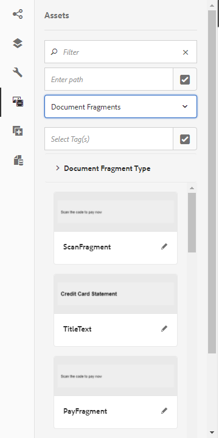

# Skapa en interaktiv kommunikation {#create-an-interactive-communication}

Skapa en interaktiv kommunikation med redigeraren för interaktiv kommunikation. Använd dra-och-släpp-funktionen för att bygga den interaktiva kommunikationen och förhandsgranska både utskrift och webb på olika enhetstyper.

## Översikt {#overview}

Interactive Communications centraliserar och hanterar framtagning, sammanställning och leverans av personaliserade och interaktiva korrespondenser. Använd utskrift som huvudkanal för webben och minimera arbetet med att duplicera webbutdata i den interaktiva kommunikationen.

### Förutsättningar {#prerequisites}

Nedan följer några förutsättningar för att skapa en interaktiv kommunikation:

* Skapa en [formulärdatamodell](/help/forms/using/data-integration.md) som innehåller testdata eller med en faktisk datakälla, till exempel en instans av Microsoft® Dynamics.
* Kontrollera att du har [dokumentfragmenten](/help/forms/using/document-fragments.md).
* Kontrollera att du har [mallar för utskrift och webbkanal](/help/forms/using/web-channel-print-channel.md).
* Kontrollera att du har rätt [tema](/help/forms/using/themes.md) för webbkanalen.

## Skapa interaktiv kommunikation {#createic}

1. Logga in på AEM-författarinstansen och gå till **[!UICONTROL Adobe Experience Manager]** > **[!UICONTROL Formulär]** > **[!UICONTROL Formulär och dokument]**.
1. Tryck på **[!UICONTROL Skapa]** och välj **[!UICONTROL Interaktiv kommunikation]**. Sidan Skapa interaktiv kommunikation visas.

   

1. Ange följande information. :

   * **[!UICONTROL Titel]**: Ange titeln på den interaktiva kommunikationen.
   * **[!UICONTROL Namn*]**: Namnet på den interaktiva kommunikationen hämtas från den titel du anger. Redigera den om det behövs.
   * **[!UICONTROL Beskrivning]**: Ange en beskrivning av den interaktiva kommunikationen.
   * **[!UICONTROL Formulärdatamodell*]**: Bläddra och välj formulärdatamodellen. Mer information om formulärdatamodell finns i [AEM Forms-dataintegrering](/help/forms/using/data-integration.md).
   * **[!UICONTROL Förifyllningstjänst]**: Välj förifyllningstjänsten för att hämta data och fylla i interaktiv kommunikation i förväg.
   * **[!UICONTROL Typ]** av efterbearbetning: Du kan välja arbetsflöde för AEM eller Forms som ska utlösas när den interaktiva kommunikationen skickas. Välj vilken typ av arbetsflöde som ska utlösas.
   * **[!UICONTROL Bokför process]**: Välj namnet på arbetsflödet som ska utlösas. När du väljer AEM-arbetsflöde anger du sökväg till bifogad fil, layoutsökväg, PDF-sökväg, sökväg till utskriftsdata och webbdatasökväg.
   * **[!UICONTROL Taggar]**: Markera taggarna som ska användas i den interaktiva kommunikationen. Du kan också skriva in ett nytt/anpassat taggnamn och trycka på Retur för att skapa det.
   * **[!UICONTROL Författare]**: Författarnamnet hämtas automatiskt från den inloggade användarens användarnamn.
   * **** Publiceringsdatum: Ange det datum då den interaktiva kommunikationen ska publiceras.
   * **[!UICONTROL Avpubliceringsdatum]**: Ange det datum då den interaktiva kommunikationen ska avpubliceras.

1. Tryck på **[!UICONTROL Nästa]**. Skärmen där du anger utskrifts- och webbkanalsinformation visas.
1. Ange följande:

   * **[!UICONTROL Skriv ut]**: Välj det här alternativet om du vill generera tryckkanalen för interaktiv kommunikation.
   * **** Skriv ut mall*: Bläddra och välj en XDP-fil som utskriftsmall.
   * **** Använd Skriv ut som mallsida för webbkanal: Välj det här alternativet om du vill skapa webbkanalen synkroniserad med utskriftskanalen. Om du använder utskriftskanalen som huvudkanal för webbkanalen kan du säkerställa att innehållet och databindningen för webbkanalen hämtas från utskriftskanalen och att ändringarna som görs i utskriftskanalen återspeglas i webbkanalen när du trycker på Synkronisera. Författarna kan dock bryta arvet för specifika komponenter i webbkanalen efter behov. Mer information finns i [Synkronisera webbkanal med skrivarkanal](/help/forms/using/create-interactive-communication.md#synchronize).
   * **** Webb: Välj det här alternativet om du vill generera webbkanalen eller responsiva utdata för interaktiv kommunikation.
   * **** Webbmall för interaktiv kommunikation*: Bläddra och välj webbmallen.
   * **[!UICONTROL Tema]** och **[!UICONTROL välj tema*]**: Bläddra och välj temat för att utforma webbkanalen för den interaktiva kommunikationen. Mer information finns i [Teman i AEM-formulär](/help/forms/using/themes.md).
   Mer information om utskriftskanaler och webbkanaler finns i [Skriva ut kanal och webbkanal](/help/forms/using/web-channel-print-channel.md).

1. Tryck på **[!UICONTROL Skapa]**. Interaktiv kommunikation skapas och en varningsruta visas. Tryck på **[!UICONTROL Redigera]** för att börja skapa innehållet i den interaktiva kommunikationen enligt [Lägg till innehåll med hjälp av användargränssnittet](#step2)för utveckling av interaktiv kommunikation. Du kan också trycka på **[!UICONTROL Klar]** och välja att redigera den interaktiva kommunikationen senare.

## Lägga till innehåll i interaktiv kommunikation {#step2}

När du har skapat en interaktiv kommunikation kan du använda redigeringsgränssnittet för interaktiv kommunikation för att skapa dess innehåll.

Mer information om gränssnittet för utveckling av interaktiv kommunikation finns i Introduktion [till redigering](/help/forms/using/introduction-interactive-communication-authoring.md)av interaktiv kommunikation.

1. Utvecklingsgränssnittet för interaktiv kommunikation startas när du trycker på Redigera enligt [Skapa interaktiv kommunikation](#createic). Du kan också navigera till en befintlig Interactive Communication-resurs på AEM, markera den och trycka på **[!UICONTROL Redigera]** för att starta redigeringsgränssnittet för interaktiv kommunikation.

   Som standard visas den tryckta kanalen i den interaktiva kommunikationen, om inte den interaktiva kommunikationen bara är för webbkanaler. I utskriftskanalen i den interaktiva kommunikationen visas målområdena, som de är tillgängliga i den valda XDP/utskriftskanalmallen. I dessa målområden och fält kan du lägga till komponenter eller resurser.

1. Markera kanalen Skriv ut och välj fliken **[!UICONTROL Komponenter]** . Följande komponenter är tillgängliga i utskriftskanalen:

   | **Komponent** | **Funktionalitet** |
   |---|---|
   | Diagram | Lägger till ett diagram som du kan använda i interaktiv kommunikation för visuell representation av tvådimensionella data som hämtats från en formulärdatamodellsamling. Mer information finns i [Använda diagram i interaktiv kommunikation](/help/forms/using/chart-component-interactive-communications.md). |
   | Dokumentfragment | Gör att du kan lägga till en återanvändbar komponent, som text, lista eller villkor, i en interaktiv kommunikation. Komponenten som läggs till kan antingen vara modellbaserad för formulärdata eller utan en formulärdatamodell. |
   | Bild | Gör att du kan infoga en bild. |

   Dra och släpp komponenterna i din interaktiva kommunikation och konfigurera dem efter behov.

1. När utskriftskanalen är markerad går du till fliken **[!UICONTROL Resurser]** och använder filtret för att visa endast de resurser som du vill se.

   Med hjälp av Assets-webbläsaren kan du även dra och släppa resurser direkt till målområdena för interaktiv kommunikation.

   

1. Dra och släpp dokumentfragmenten i den interaktiva kommunikationen. Här följer de typer av dokumentfragment som du kan använda i tryckkanalen i den interaktiva kommunikationen.

<table> 
 <tbody> 
  <tr> 
   <td><strong>Dokumentfragmenttyp</strong></td> 
   <td><strong>Exempelsyfte</strong></td> 
  </tr> 
  <tr> 
   <td><a href="/help/forms/using/texts-interactive-communications.md" target="_blank">Text</a></td> 
   <td>Text för att lägga till adress, mottagarens e-postadress och brödtext i brevet </td> 
  </tr> 
  <tr> 
   <td><a href="/help/forms/using/conditions-interactive-communications.md" target="_blank">Villkor</a></td> 
   <td>Villkor för att lägga till lämplig rubrikbild i kommunikationen baserat på typen av princip: Standard eller Premium.   </td> 
  </tr> 
  <tr> 
   <td>Lista</td> 
   <td>Grupp med dokumentfragment, inklusive text, villkor, andra listor och bilder.   </td> 
  </tr> 
 </tbody> 
</table>

Mer information om dokumentfragment finns i [Dokumentfragment](/help/forms/using/document-fragments.md).

1. Om du vill ställa in bindning för variabler trycker du på en variabel och väljer  (Configure). Sedan ställer du in bindningsegenskaperna på egenskapspanelen i sidlisten.

   * **[!UICONTROL Ingen]**: Agenten fyller i variabelns värde.
   * **[!UICONTROL Textfragment]**: Om du väljer det här alternativet kan du bläddra och markera ett textdokumentfragment vars innehåll återges i fältet. Endast textdokumentfragment kan bindas till variabler som inte har några variabler inuti.
   * **[!UICONTROL Datamodellobjekt]**: Välj en formulärdatamodellsegenskap vars värde är ifyllt i fältet.
   Du kan också välja att konfigurera det relevanta textdokumentfragmentet. På egenskapspanelen visas en lista med variabler i textdokumentfragmentet. Du kan trycka på  bredvid ett variabelnamn för att visa variabelns inställningar för redigering.

1. Om du vill lägga till en tabell med utskriftskanalen markerad använder du filtret på fliken **[!UICONTROL Resurser]** och bara visar Layoutfragment. Dra och släpp önskat layoutfragment till Interactive Communication. Ett layoutfragment är baserat på en XDP och kan användas för att skapa grafiska layouter eller statiska och dynamiska tabeller i interaktiv kommunikation som fylls i med dynamiska data.

   Exempel: En layouttabell med information om bruttopremie, lojalitetsrabatt % och tillgänglighet för assistans vid nödsituationer för gamla och nya policyer.

   Mer information om layoutfragment finns i [Dokumentfragment](/help/forms/using/document-fragments.md).

1. När utskriftskanalen är markerad använder du filtret på fliken **[!UICONTROL Resurser]** för att visa bilder. Dra-och-släpp de bilder som behövs till Interactive Communication, t.ex. företagslogotyp.

   Hantera dessutom följande i den interaktiva kommunikationen:

   * [Lägga till och konfigurera diagram](/help/forms/using/chart-component-interactive-communications.md)
   * [Synkronisera webbkanalen med utskriftskanalen](/help/forms/using/create-interactive-communication.md#synchronize)

      * Automatisk synkronisering
      * Avbryt arv
      * Återaktivera arv
      * Synkronisera
   * [Bifogade filer och biblioteksåtkomst](/help/forms/using/create-interactive-communication.md#attachmentslibrary)
   * [Egenskaper för XDP-/layoutfält](/help/forms/using/create-interactive-communication.md#xdplayoutfieldproperties)
   * [Lägga till regler i komponenter](/help/forms/using/create-interactive-communication.md#rules)

1. Växla till **[!UICONTROL webbkanal]**. Webbkanalen visas i redigeraren för interaktiv kommunikation. När du byter från Print-kanalen till Web channel för första gången sker den automatiska synkroniseringen. Mer information finns i [Synkronisera webbkanal från utskriftskanalen](/help/forms/using/create-interactive-communication.md#synchronize).

   Eftersom vi använder Skriv ut som master för webben i det här exemplet synkroniseras platshållarna för utskriftskanalen, innehållet och databindningen till webbkanalen. Du kan dock ändra och anpassa det specifika innehållet i webbkanalen efter behov.

   

1. Om du vill lägga till fler komponenter i webbkanalen när webbkanalen är vald trycker du på **[!UICONTROL Komponenter]**. Dra och släpp komponenter i webbkanalen i din interaktiva kommunikation efter behov och fortsätt att konfigurera dem.

   | Komponenter | Funktionalitet |
   |---|---|
   | Diagram | Lägger till ett diagram som du kan använda i interaktiv kommunikation för visuell representation av tvådimensionella data som hämtats från en formulärdatamodellsamling. Mer information finns i [Använda diagramkomponent](/help/forms/using/chart-component-interactive-communications.md). |
   | Dokumentfragment | Gör att du kan lägga till en återanvändbar komponent, text, lista eller villkor i en interaktiv kommunikation. Den återanvändbara komponenten som du lägger till i en interaktiv kommunikation kan antingen vara modellbaserad i form av formulärdata eller utan någon formulärdatamodell. |
   | Bild | Gör att du kan infoga en bild. |
   | Panel | Panelkomponenten är en platshållare för att gruppera andra komponenter och styr hur en grupp komponenter, som dragspelspanel och tabbar, placeras i det interaktiva meddelandet. Med en panelkomponent kan du också göra en grupp komponenter repeterbara för slutanvändaren, t.ex. i flera poster som krävs för att fylla i inloggningsuppgifter. |
   | Tabell | Lägger till en tabell där du kan ordna data i rader och kolumner. |
   | Målområde | Infogar ett målområde i en webbkanal för att ordna de webbkanalsspecifika komponenterna. Målområdet är en ren behållare som gör att du kan gruppera webbkanalsspecifika komponenter. |
   | Text | Lägger till RTF i webbkanalen i en interaktiv kommunikation. Text kan också använda formulärdatamodellsobjekt för att göra innehållet dynamiskt. |

1. Infoga resurser i webbkanalen efter behov.

   Du kan [förhandsgranska din interaktiva kommunikation](#previewic) för att se hur utskrifts- och webbutdata för den interaktiva kommunikationen ser ut och fortsätta att göra de ändringar som behövs.

## Förhandsgranska interaktiv kommunikation {#previewic}

Du kan använda alternativet **[!UICONTROL Förhandsgranska]** för att utvärdera utseendet på den interaktiva kommunikationen. Webbkanalen i Interactive Communication erbjuder också ett alternativ för att emulera upplevelsen av en interaktiv kommunikation för olika enheter. Exempel: iPhone, iPad och Desktop. Du kan använda alternativen **[!UICONTROL Förhandsgranska]** och **[!UICONTROL Emulator]** -  tillsammans för att förhandsgranska webbutdata för enheter med olika skärmstorlekar. Exempeldata i förhandsgranskningen fylls i från den angivna formulärdatamodellen.

1. Markera kanalen (tryck eller webb) om du vill förhandsgranska och trycka på Förhandsgranska. Interaktiv kommunikation visas.

   >[!NOTE]
   >
   >Förhandsgranskningen fylls i med den angivna formulärdatamodellens exempeldata. Mer information om hur du förhandsgranskar interaktiv kommunikation med vissa andra data eller använder förifyllningstjänsten finns i [Använda formulärdatamodell](/help/forms/using/using-form-data-model.md) och [Arbeta med formulärdatamodell](/help/forms/using/work-with-form-data-model.md).

1. För webbkanalen använder du  för att visa hur den interaktiva kommunikationen ser ut på olika enheter.

   

Dessutom kan du [förbereda och skicka interaktiv kommunikation med hjälp av agentgränssnittet](/help/forms/using/prepare-send-interactive-communication.md).

## Konfigurera egenskaper i interaktiv kommunikation {#configuring-properties-in-interactive-communication}

### Bifogade filer och biblioteksåtkomst {#attachmentslibrary}

I utskriftskanalen kan du konfigurera bilagor och biblioteksåtkomst så att agenten kan hantera bilagor i agentgränssnittet för den interaktiva kommunikationen:

1. Markera dokumentbehållaren i utskriftskanalen och tryck på **[!UICONTROL Egenskaper]**.

   

   Panelen Egenskaper visas i sidofältet.

   

1. Expandera **[!UICONTROL bifogade filer]** och ange följande egenskaper:

   * **[!UICONTROL Tillåt biblioteksåtkomst]**: Välj det här alternativet om du vill aktivera biblioteksåtkomst för agenten i agentens användargränssnitt. Om det här alternativet är aktiverat kan agenten lägga till filer från biblioteket när den interaktiva kommunikationen förbereds.
   * **[!UICONTROL Tillåt omsortering av bilagor]**: Välj det här alternativet om du vill att agenten ska kunna ändra ordningen på de bifogade filerna med interaktiv kommunikation.
   * **[!UICONTROL Maximalt antal bifogade filer]**: Ange det maximala antalet bilagor som tillåts med den interaktiva kommunikationen.
   * **[!UICONTROL Filer som ska bifogas]**: Tryck på **[!UICONTROL Lägg till]** och bläddra till de filer som ska bifogas och ange följande:

      * **[!UICONTROL Bifoga den här filen till dokument som standard]**: Du kan ändra det här alternativet om bara bilagan inte är obligatorisk.
      * **** Obligatoriskt: Agenten kan inte ta bort den bifogade filen i agentens användargränssnitt.
   

1. Tryck på **[!UICONTROL Klar]**.

### Egenskaper för XDP-/layoutfält {#xdplayoutfieldproperties}

1. Håll muspekaren över ett fält som är inbyggt i kanalmallen för utskrift när du redigerar Print-kanalen i en interaktiv kommunikation och välj  (Konfigurera).

   Dialogrutan Egenskaper visas i sidlisten.

   

1. Ange följande:

   * **[!UICONTROL Namn]**: JCR-nodnamn.
   * **[!UICONTROL Titel]**: Ange en titel som ska visas för agenten i agentgränssnittet och i dokumentbehållarträdet.
   * **[!UICONTROL Bindningstyp]**: Välj en av följande bindningstyper för fältet.

      * Ingen: Agenten fyller i egenskapens värde.
      * Textfragment: Om du väljer det här alternativet kan du bläddra och markera ett textdokumentfragment vars innehåll återges i fältet.
      * Datamodellobjekt: Välj en formulärdatamodellsegenskap vars värde är ifyllt i fältet.
   * **[!UICONTROL Standardvärden]**: Med standardvärdet säkerställs att fältet inte är tomt när det inte finns något värde från det angivna datamodellsobjektet eller textfragmentet. Om databindningstypen inte är någon fylls standardvärdet i i förväg i fältet.
   * **[!UICONTROL Redigerbar av agent]**: Välj det här alternativet om agenten ska kunna redigera värdet i fältet i agentens användargränssnitt. Den här inställningen gäller inte om bindningstypen är Textfragment.
   * **[!UICONTROL Etikett]**: Ange en textsträng som visas med fältet till agenten i agentens användargränssnitt. Den här inställningen gäller inte om bindningstypen är Textfragment.
   * **[!UICONTROL Verktygstips]**: Ange en textsträng som ska visas när muspekaren förs till agenten i agentgränssnittet. Den här inställningen gäller inte om bindningstypen är Textfragment.
   * **[!UICONTROL Obligatoriskt]**: Välj att göra fältet obligatoriskt för agenten. Den här inställningen gäller inte om bindningstypen är Textfragment.
   * **[!UICONTROL Tillåt flera rader]**: Markera det här fältet om du vill tillåta flera textrader som inmatning i fältet. Den här inställningen gäller inte om bindningstypen är Textfragment.

1. Tryck på .

## Tillämpa regler på komponenter för interaktiv kommunikation {#rules}

Om du vill villkoralisera komponenter eller innehåll i den interaktiva kommunikationen trycker du på komponenten/delen av innehållet och väljer  (Create Rule) för att starta regelredigeraren.

Mer information finns i:

* [Regelredigeraren](/help/forms/using/rule-editor.md)
* [Introduktion till utveckling av interaktiv kommunikation](/help/forms/using/introduction-interactive-communication-authoring.md)

## Använda tabeller {#tables}

### Dynamiska tabeller i interaktiv kommunikation {#dynamic-tables-in-interactive-communication}

Du kan lägga till dynamiska tabeller i interaktiv kommunikation med hjälp av layoutfragment. I följande steg används ett exempel på en kreditkortssats för att illustrera hur ett layoutfragment används för att skapa en dynamisk tabell i ett interaktivt meddelande.

1. Kontrollera att det layoutfragment som krävs för att skapa tabellen är tillgängligt i AEM.
1. Dra och släpp ett layoutfragment (med en tabell med flera kolumner) i ett målområde från resursläsaren i utskriftskanalen i din interaktiva kommunikation.

   

   En tabell visas i layoutområdet Interaktiv kommunikation.

   

1. Ange databindning för alla celler i tabellen. Om du vill skapa en repeterbar rad infogar du egenskaper för formulärdatamodell i raden som tillhör en gemensam samlingsegenskap.

   1. Tryck på en cell i tabellen och välj  (Configure).

      Dialogrutan Egenskaper visas i sidlisten.

      

   1. Konfigurera egenskaperna:

      * **[!UICONTROL Namn]**: JCR-nodnamn.
      * **[!UICONTROL Titel]**: Ange en titel som ska visas i Interactive Communication Editor.
      * **[!UICONTROL Bindnings&amp;typ]**;ast;: Välj en av följande bindningstyper för fältet.

         * **[!UICONTROL Inget]**
         * **[!UICONTROL Datamodellsobjekt]**: En formulärdatamodellegenskaps värde fylls i i fältet.
      * **[!UICONTROL Datamodellobjekt]**: Den formulärdatamodellsegenskap vars värde är ifyllt i fältet.
      * **[!UICONTROL Standardvärde]**: Med standardvärdet säkerställs att fältet inte är tomt när det inte finns något värde från det angivna datamodellsobjektet. Standardvärdet är förifyllt i fältet.
      * **[!UICONTROL Redigerbar av agent]**: Välj det här alternativet om agenten ska kunna redigera värdet i fältet i agentens användargränssnitt.
   1. Tryck på .

1. Förhandsgranska den interaktiva kommunikationen för att se tabellen renderas med data.

   

### Enbart tabeller för webbkanaler {#web-channel-only-tables}

Du kan skapa en dynamisk tabell bara för webbkanaler i en interaktiv kommunikation med hjälp av en datamodellegenskap av typen samling. En sådan tabell är en representation av en samlingsegenskaps underordnade egenskaper. Du kan bara redigera formateringsegenskaperna för de olika cellerna i tabellen.

1. Växla till webbkanalen och välj sedan att visa webbläsaren Datakällor.
1. Dra och släpp en samlingsegenskap i ett delformulär.

   En tabell skapas i delformuläret.

1. Förhandsgranska tabellen i webbförhandsgranskningen av den interaktiva kommunikationen.

## Synkronisera webbkanal med utskriftskanal {#synchronize}

När du väljer Skriv ut som mallsida för webbkanal när du skapar en interaktiv kommunikation skapas webbkanalen synkroniserat med utskriftskanalen och webbkanalens innehåll och databindning hämtas från utskriftskanalen och ändringarna som görs i den visas i webbkanalen när du trycker på Synkronisera.

Författarna kan dock bryta arvet för komponenter i webbkanalen efter behov.
[Klicka för att förstora](assets/printweb_2-3.png)

### Automatisk synkronisering {#auto-sync}

Om du använder Print channel som master för webbkanalen och byter till webbkanalen från Print-kanalen, sker automatisk synkronisering. Den automatiska synkroniseringen tar in platshållare, innehåll och databindning till webbkanalen från utskriftskanalen. Beroende på komplexiteten och innehållet i din interaktiva kommunikation kan automatisk synkronisering ta lite tid.

>[!NOTE]
>
>Synkronisering av kanalerna synkroniserar endast dokumentfragment, bilder, villkor, listor och layoutfragment från tryckkanalen till webbkanalen. Delformulären eller de överordnade noderna som innehåller sådana element synkroniseras inte.

### Avbryt arv {#cancel-inheritance}

I webbkanalen är komponenterna inbäddade i målområdena.

Hovra över det relevanta målområdet i webbkanalen och välj  (avbryt arv) och tryck sedan på **[!UICONTROL Ja]** i dialogrutan Avbryt arv.

Arvet av komponenterna i målområdet avbryts och nu kan du redigera dem efter behov.

### Återaktivera arv {#re-enable-inheritance}

Om du har avbrutit arvet av en komponent i webbkanalen kan du aktivera den igen. Om du vill återaktivera arv håller du pekaren över gränsen för det relevanta målområdet, som innehåller komponenten, och trycker på .

Dialogrutan Återställ arv visas.

Om det behövs väljer du **[!UICONTROL Synkronisera sidan när arvet]** har återställts. Välj det här alternativet om du vill synkronisera hela den interaktiva kommunikationen. Om du inte markerar det här alternativet synkroniseras bara det relevanta målområdet när arvet återställs.

Tryck på **[!UICONTROL Ja]**.

### Synkronisera {#synchronize-1}

Om du använder Skriv ut som mallsida för webbkanal och gör ändringar i utskriftskanalen kan du trycka på Synkronisera för att lägga till de nya ändringarna i webbkanalen.

1. Om du vill synkronisera webbkanalen med skrivarkanalen trycker du på **[!UICONTROL Synkronisera]**.

   Dialogrutan Synkronisera innehåll från huvudkanal visas.

   

1. Tryck på något av följande:

   * **[!UICONTROL Ignorera ändringar]**: Ignorerar alla ändringar som gjorts i webbkanalen oavsett vilka ändringar som gjorts i webbkanalen.
   * **[!UICONTROL Behåll ändringar]**: Synkroniserar endast innehåll för de målområden där arv inte avbryts.

