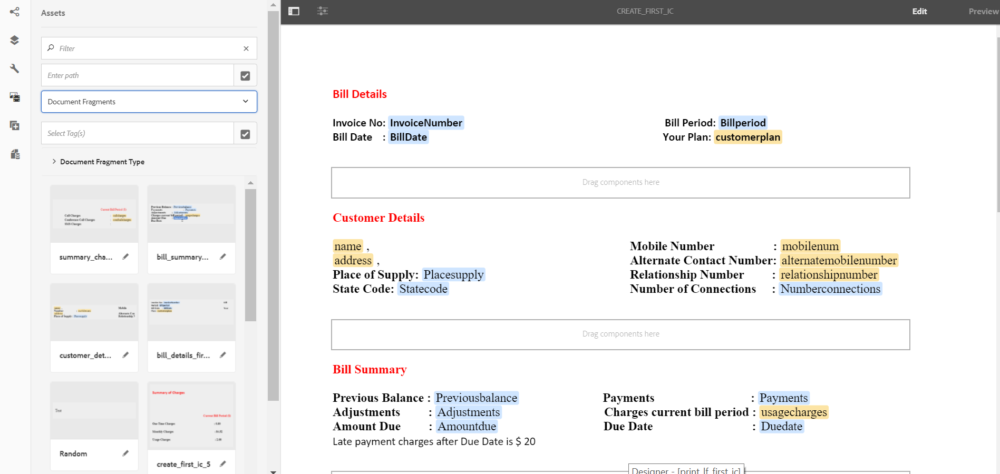
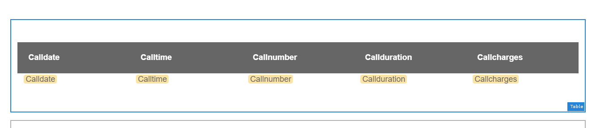
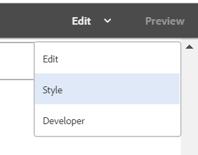
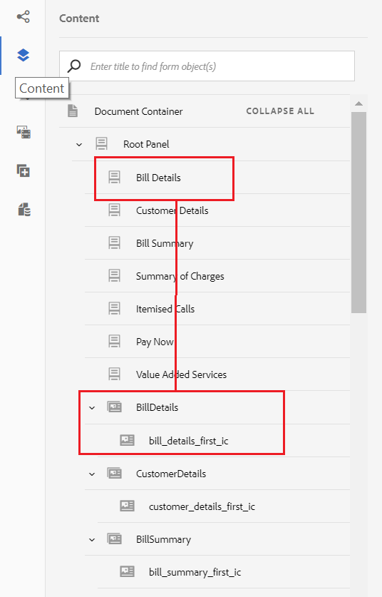

# Självstudiekurs: Skapa interaktiv kommunikation {#tutorial-create-interactive-communication}

Skapa en interaktiv kommunikation med alla byggstenar

Den här självstudiekursen är ett steg i [Skapa din första interaktiva kommunikationsserie](/help/forms/using/create-your-first-interactive-communication.md) . Vi rekommenderar att du följer serien i kronologisk ordning för att förstå, utföra och demonstrera det fullständiga exemplet på självstudiekurser.

När du har skapat alla byggstenar, t.ex. formulärdatamodell, dokumentfragment, mallar och teman för webbversionen, kan du börja skapa en interaktiv kommunikation.

Interaktiv kommunikation kan levereras via två kanaler: Tryck och webb. Du kan också skapa en interaktiv kommunikationskanal med utskriftskanalen som master. Skriv ut som huvudalternativ för webbkanal säkerställer att innehållet, arvet och databindningen för webbkanalen hämtas från utskriftskanalen. Det ser också till att ändringarna som görs i utskriftskanalen synkroniseras i webbkanalen. De som skapar interaktiv kommunikation får dock bryta arvet för vissa komponenter i webbkanalen.

I den här självstudiekursen får du hjälp med att skapa interaktiv kommunikation för tryck- och webbkanaler. I slutet av den här självstudiekursen kan du:

* Skapa interaktiv kommunikation för tryckkanalen
* Skapa interaktiv kommunikation för webbkanalen
* Skapa trycksaker och webbinteraktiv kommunikation med Skriv ut som mall

## Skapa interaktiv kommunikation för tryck och webb utan synkronisering {#create-interactive-communications-for-print-and-web-with-no-synchronization}

### Skapa interaktiv kommunikation för tryckkanaler {#create-interactive-communication-for-print-channel}

Nedan följer en lista över resurser som redan har skapats i den här självstudiekursen och som behövs när du skapar den interaktiva kommunikationen för utskriftskanalen:

**Utskriftsmall:** [create_first_ic_print_template](/help/forms/using/create-templates-print-web.md)

**Formulärdatamodell:** [FDM_Create_First_IC](/help/forms/using/create-form-data-model0.md)

**Dokumentfragment:** Bill_details_first_ic, customer_details_first_ic, Bill_summary_first_ic, summary_Charts_first_ic 

**Layoutfragment:** [table_lf](/help/forms/using/create-templates-print-web.md)

**Bilder:** PayNow och ValueAddedServices

1. Logga in på AEM-författarinstansen och gå till **[!UICONTROL Adobe Experience Manager]** > **[!UICONTROL Formulär]** > **[!UICONTROL Formulär och dokument]**.
1. Tryck på **Skapa** och välj **Interaktiv kommunikation**. Guiden **Skapa interaktiv kommunikation** visas.
1. Ange **create_first_ic** i fälten **Titel** och **Namn** . Välj **FDM_Create_First_IC** som formulärdatamodell och tryck på **Nästa**.
1. I guiden **Kanaler** :

   1. Ange **create_first_ic_print_template** som utskriftsmall och tryck på **Select**. Kontrollera att kryssrutan **Använd Skriv ut som mallsida för webbkanal** inte är markerad.
   1. Ange **mappen Create_First_IC_templates** > **Create_First_IC_Web_Template** som webbmall och tryck på **Select**.
   1. Tryck på **Skapa**.
   Ett bekräftelsemeddelande visas om att den interaktiva kommunikationen har skapats.

1. Tryck på **Redigera** för att öppna den interaktiva kommunikationen i den högra rutan.
1. Gå till fliken **Resurser** och tillämpa filtret för att endast visa dokumentfragmenten i den vänstra rutan.
1. Dra och släpp följande dokumentfragment till målområdena i interaktiv kommunikation:

   | Dokumentfragment | Målområde |
   |---|---|
   | Bill_details_first_ic | BillDetails |
   | customer_details_first_ic | CustomerDetails |
   | Bill_summary_first_ic | BillSummary |
   | summary_Charts_first_interactive_communication | Avgifter |

   

1. Tryck på målområdet för **diagram** och tryck **+** för att lägga till en **diagramkomponent** .
1. Tryck på diagramkomponenten och välj  (Configure). Diagramegenskaperna visas i den vänstra rutan:

   1. Ange ett namn för diagrammet.
   1. Välj **Cirkel** i listrutan **Diagramtyp** .
   1. Välj **calltype** -egenskapen i **anropet** av datamodellens objekttyp i **X-axelavsnittet** . Tryck på .
   1. Välj **Frekvens** i listrutan **Funktion** .
   1. Välj **calltype** -egenskapen i **anropet** av datamodellens objekttyp i avsnittet **Y-axel** . Tryck på .
   1. Tryck på  för att spara diagramegenskaperna.

1. Gå till fliken **Resurser** och tillämpa filtret för att endast visa layoutfragmenten i den vänstra rutan. Dra och släpp layoutfragmentet **table_lf** till målområdet **Specificerade anrop** .
1. Markera textfältet i kolumnen **Datum** och tryck på  (Configure).
1. Välj **Datamodellobjekt** i listrutan **Bindningstyp** och välj **anrop** > **calldate**. Tryck på  två gånger för att spara egenskaperna.

   Du kan på liknande sätt skapa bindning med **calltime**, **callnumber**, **callduration** och **callCharges** för textfält i kolumnerna **Time************** ,¥Number,¥Duration¥ och¥Charges¥.

1. Tryck på målområdet **PayNow** och tryck **+** för att lägga till en **Image** -komponent.
1. Tryck på bildkomponenten och välj  (Configure). Bildegenskaperna visas i den vänstra rutan:

   1. Ange **PayNow** som bildens namn i fältet **Namn** .
   1. Tryck på **Överför**, markera bilden som sparats i det lokala filsystemet och tryck sedan på **Öppna**.
   1. Tryck på  för att spara bildegenskaperna.

1. Upprepa steg 13 och 14 för att lägga till **ValueAddedServices** -bilden i **ValueAddedServices** -målområdet.

### Skapa interaktiv kommunikation för webbkanal {#create-interactive-communication-for-web-channel}

Nedan följer en lista över resurser som redan har skapats i kursen och som behövs när du skapar interaktiv kommunikation för webbkanalen:

**Webbmall:** [Create_First_IC_Web_Template](/help/forms/using/create-templates-print-web.md)

**Formulärdatamodell:** [FDM_Create_First_IC](/help/forms/using/create-form-data-model0.md)

**Dokumentfragment:** Bill_details_first_ic, customer_details_first_ic, Bill_summary_first_ic, summary_Charts_first_ic 

**Bilder:** PayNowWeb och ValueAddedServicesWeb

1. Logga in på AEM-författarinstansen och gå till **[!UICONTROL Adobe Experience Manager]** > **[!UICONTROL Formulär]** > **[!UICONTROL Formulär och dokument]**.
1. Tryck på **Skapa** och välj **Interaktiv kommunikation**. Guiden **Skapa interaktiv kommunikation** visas.
1. Ange **create_first_ic** i fälten **Titel** och **Namn** . Välj **FDM_Create_First_IC** som formulärdatamodell och tryck på **Nästa**.
1. I guiden **Kanaler** :

   1. Ange **create_first_ic_print_template** som utskriftsmall och tryck på **Select**. Kontrollera att kryssrutan **Använd Skriv ut som mallsida för webbkanal** inte är markerad.
   1. Ange **mappen Create_First_IC_templates** > **Create_First_IC_Web_Template** som webbmall och tryck på **Select**.
   1. Tryck på **Skapa**.
   Ett bekräftelsemeddelande visas om att den interaktiva kommunikationen har skapats.

1. Tryck på **Redigera** för att öppna den interaktiva kommunikationen i den högra rutan.
1. Tryck på fliken **Kanaler** i den vänstra rutan och tryck sedan på **Webb**.
1. Gå till fliken **Resurser** och tillämpa filtret för att endast visa dokumentfragmenten i den vänstra rutan.
1. Dra och släpp följande dokumentfragment till målområdena i interaktiv kommunikation:

   | Dokumentfragment | Målområde |
   |---|---|
   | Bill_details_first_ic | BillDetails |
   | customer_details_first_ic | CustomerDetails |
   | Bill_summary_first_ic | BillSummary |
   | summary_Charts_first_interactive_communication | Avgifter |

1. Tryck på målområdet **Sammanfattning av avgifter** och tryck **+** för att lägga till en **diagramkomponent** .
1. Tryck på diagramkomponenten och välj  (Configure). Diagramegenskaperna visas i den vänstra rutan:

   1. Ange ett namn för diagrammet.
   1. Välj **Cirkel** i listrutan **Diagramtyp** .
   1. Välj **calltype** -egenskapen i **anropet** av datamodellens objekttyp i **X-axelavsnittet** . Tryck på .
   1. Välj **Frekvens** i listrutan **Funktion** .
   1. Välj **calltype** -egenskapen i **anropet** av datamodellens objekttyp i avsnittet **Y-axel** . Tryck på .
   1. Tryck på  för att spara diagramegenskaperna.

1. Välj fliken **Datakällor** i den vänstra rutan och dra och släpp **anropsdatamodellsobjektet** till målområdet för **Specificerade samtal** . Alla egenskaper i **anropets** datamodellobjekt visas som tabellkolumner i målområdet **Specificerade anrop** i den högra rutan.

   Baserat på användningsfallet behöver du kolumnerna Samtalsdatum, Samtalstid, Samtalsnummer, Samtalsvaraktighet och Samtalsavgifter i tabellen.

   

1. Välj kolumnrubriken **i tabellkolumnen** Mobilenum och välj **Fler alternativ** > **Ta bort kolumn**. Du kan även ta bort kolumnen **Calltype** .
1. Markera kolumnrubriken **för** anropstabellen och tryck på  (Redigera) för att byta namn på texten till **Anropsdatum**. Du kan också byta namn på andra kolumnrubriker i tabellen.
1. Baserat på användningsfallet infogar du en **Pay Now** -knapp i Interactive Communication som ger användaren möjlighet att göra betalningen genom att klicka på knappen. Gör så här för att infoga knappen:

   1. Tryck på **målområdet Betala nu** och tryck **+** för att lägga till en **Text** -komponent.
   1. Tryck på textkomponenten och tryck på  (Redigera).
   1. Byt namn på texten till **Betala nu**.
   1. Markera texten och tryck på ikonen Hyperlänk.
   1. Ange betalnings-URL i fältet **Sökväg** .
   1. Välj **Ny flik** i listrutan **Mål** .
   1. Tryck på  för att spara hyperlänksegenskaperna.

1. Välj **Format** i listrutan bredvid alternativet **Förhandsgranska** .

   

1. Gör så här för att formatera hyperlänktexten så att den visas som en knapp i det interaktiva meddelandet:

   1. Tryck på textkomponenten och välj  (Redigera).
   1. I avsnittet **Kantlinje** anger du **1,5 px** som **Kantbredd**, väljer **Heldragen** som **Kantformat****** **** och anger¥46px¥ somKantradie¥.
   1. Välj Röd som bakgrundsfärg för knappen i avsnittet **Bakgrund** .
   1. I fältet **Marginal** för avsnittet **Dimensioner och position** trycker du på ikonen **Redigera samtidigt** och anger **högermarginalen** till **450 px**. Fälten Överkant, Underkant och Vänster är tomma.
   

1. Tryck på **målområdet Betala nu** och tryck **+** för att lägga till en **Image** -komponent.
1. Tryck på bildkomponenten och välj  (Configure). Bildegenskaperna visas i den vänstra rutan:

   1. Ange **PayNow** som bildens namn i fältet **Namn** .
   1. Tryck på **Överför**, markera bilden **PayNowWeb** som har sparats i det lokala filsystemet och tryck sedan på **Öppna**.
   1. Tryck på  för att spara bildegenskaperna.

1. Baserat på användningsexemplet infogar du en **prenumerationsknapp** i interaktiv kommunikation som ger användaren ett alternativ att prenumerera på mervärdesskapande tjänster genom att klicka på knappen.

   Upprepa steg 13-17 för att lägga till en **prenumerationsknapp** i målområdet för **Value Added Services** och lägga till **ValueAddedServicesWeb** -bilden.

## Skapa interaktiv kommunikation för tryck och webb med automatisk synkronisering {#create-interactive-communications-for-print-and-web-with-auto-synchronization}

Du kan också skapa en interaktiv kommunikation genom att aktivera automatisk synkronisering mellan utskrifts- och webbkanaler. Om du vill aktivera automatisk synkronisering väljer du Skriv ut som mall när du skapar den interaktiva kommunikationen. Om du väljer alternativet Skriv ut som mallsida kommer innehållet, arvet och databindningen för webbkanalen att härledas från utskriftskanalen. Det ser också till att de ändringar som görs i utskriftskanalen återspeglas i webbkanalen.

Utför följande steg för att härleda webbkanalsinnehållet med hjälp av Print channel:

1. Logga in på AEM-författarinstansen och gå till **[!UICONTROL Adobe Experience Manager]** > **[!UICONTROL Formulär]** > **[!UICONTROL Formulär och dokument]**.
1. Tryck på **Skapa** och välj **Interaktiv kommunikation**. Guiden **Skapa interaktiv kommunikation** visas.
1. Ange **create_first_ic** i fälten **Titel** och **Namn** . Välj **FDM_Create_First_IC** som formulärdatamodell och tryck på **Nästa**.
1. I guiden **Kanaler** :

   1. Ange **create_first_ic_print_template** som utskriftsmall och tryck på **Select**.
   1. Markera kryssrutan **Använd utskrift som mallsida för webbkanal** .
   1. Ange **mappen Create_First_IC_templates** > **Create_First_IC_Web_Template** som webbmall och tryck på **Select**.
   1. Tryck på **Skapa**.
   Ett bekräftelsemeddelande visas om att den interaktiva kommunikationen har skapats.

1. Tryck på **Redigera** för att öppna den interaktiva kommunikationen i den högra rutan.
1. Utför steg 6-15 i [Skapa interaktiv kommunikation för](/help/forms/using/create-interactive-communication0.md#create-interactive-communication-for-print-channel) tryckkanaler.
1. Tryck på fliken **Kanaler** i den vänstra rutan och tryck på **Webb** för att automatiskt generera innehåll för webbkanalen från Print-kanalen.
1. När kryssrutan **Använd utskrift som mallsida för webbkanal** är markerad i steg 4 genereras innehållet och bindningarna automatiskt för webbkanalen från utskriftskanalen.

   Utskriftskanalinnehållet infogas under webbkanalens mallinnehåll. Om du vill ändra webbkanalsinnehållet som har genererats automatiskt från utskriftskanalen kan du avbryta arvet för alla målområden.

   Hovra över det relevanta målområdet i webbkanalen och välj  (avbryt arv) och tryck sedan på **Ja** i dialogrutan **Avbryt arv**.

   

   Om du har avbrutit arvet av en komponent kan du återaktivera den. Om du vill återaktivera arv håller du pekaren över gränsen för det relevanta målområdet, som innehåller komponenten, och trycker på .

1. Välj fliken **Innehåll** i den vänstra rutan.
1. Dra och släpp det automatiskt genererade webbkanalsinnehållet till de befintliga panelerna i webbmallen med hjälp av innehållsträdet. Nedan följer en lista över komponenter som behöver ordnas om:

   * Fakturainformation-komponent till panelen Faktureringsinformation
   * Kundinformationskomponent till panelen Kundinformation
   * Faktureringssammanfattningskomponent till faktureringssammanfattningspanelen
   * Sammanfattning av avgiftskomponenten till panelen Sammanfattning av avgifter
   * Layoutfragment (tabell) till panelen Specificerade samtal
   

1. Upprepa steg 13-18 i [Create Interactive Communication for Web channel](/help/forms/using/create-interactive-communication0.md#create-interactive-communication-for-web-channel) för att lägga in hyperlänkarna **Pay Now** och **Subscribe** i webbkanalen i Interactive Communication.

