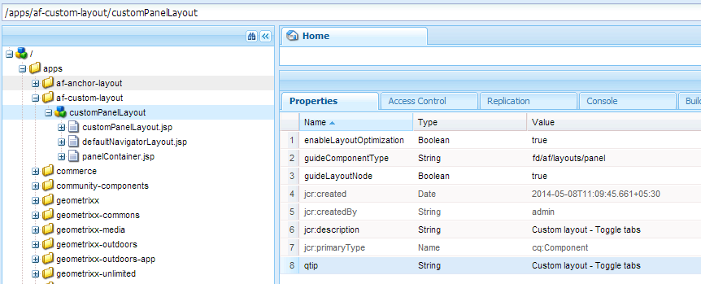

# Skapa anpassade layoutkomponenter för adaptiva formulär {#creating-custom-layout-components-for-adaptive-forms}

## Förutsättning {#prerequisite}

Kunskap om layouter, som gör att du kan skapa/använda en anpassad layout. Se [Ändra panellayout](/help/forms/using/layout-capabilities-adaptive-forms.md).

## Layoutkomponent för anpassad formulärpanel {#adaptive-form-panel-layout-component}

Komponenten Layout på den adaptiva formulärpanelen styr hur adaptiva formulärkomponenter placeras på en panel i förhållande till användargränssnittet.

## Skapa en anpassad panellayout {#creating-a-custom-panel-layout}

1. Navigera till platsen `/crx/de`.
1. Kopiera en panellayout från platsen `/libs/fd/af/layouts/panel` (till exempel `tabbedPanelLayout`) till `/apps` (till exempel `/apps/af-custom-layout`).
1. Byt namn på layouten som du kopierade till `customPanelLayout`. Ändra egenskaperna för noderna `qtip` och `jcr:description`. Du kan till exempel ändra dem till `Custom layout - Toggle tabs`.



>[!NOTE]
>
>Om du ställer in egenskapen `guideComponentType`på värdet `fd/af/layouts/panel` blir layouten en panellayout.

1. Byt namn på filen `tabbedPanelLayout.jsp` under den nya layouten till customPanelLayout.jsp.
1. Om du vill införa nya format och beteenden skapar du ett klientbibliotek under noden `etc`. Skapa till exempel nodens klientbibliotek på platsen /etc/af-custom-layout-clientlib. Låt noden ha kategoriegenskapen af.panel.custom. Den har följande .css- och .js-filer:

   ```css
   /** CSS defining new styles used by custom layout **/
   
   .menu-nav {
       background-color: rgb(198, 38, 76);
       height: 30px;
    width: 30px;
    font-size: 2em;
    color: white;
       -webkit-transition: -webkit-transform 1s;  /* For Safari 3.1 to 6.0 */
    transition: transform 1s;
   }
   
   .tab-content {
    border: 1px solid #08b1cf;
   }
   
   .custom-navigation {
       -webkit-transition: width 1s, height 1s, -webkit-transform 1s;  /* For Safari 3.1 to 6.0 */
    transition: width 1s, height 1s, transform 1s;
   }
   
   .panel-name {
       padding-left: 30px;
       font-size: 20px;
   }
   
   @media (min-width: 992px) {
    .nav-close {
     width: 0px;
       }
   }
   
   @media (min-width: 768px) and (max-width: 991px) {
    .nav-close {
     height: 0px;
       }
   }
   
   @media (max-width: 767px) {
    .menu-nav, .custom-navigation {
        display: none;
       }
   }
   ```

   ```
   /** function for toggling the navigators **/
   var toggleNav = function () {
   
       var nav = $('.custom-navigation');
       if (nav) {
           nav.toggleClass('nav-close');
       }
   }
   
   /** function to populate the panel title **/
   $(window).on('load', function() {
       if (window.guideBridge) {
           window.guideBridge.on("elementNavigationChanged",
           function (evntName, evnt) {
                       var activePanelSom = evnt.newText,
                           activePanel = window.guideBridge._guideView.getView(activePanelSom);
                       $('.panel-name').html(activePanel.$itemNav.find('a').html());
                   }
           );
       }
   });
   ```

1. Om du vill förbättra utseendet och beteendet kan du ta med en `client library`.

   Uppdatera dessutom sökvägarna för inkluderade skript i .jsp-filer. Uppdatera till exempel filen `customPanelLayout.jsp` enligt följande:

   ```
   <%-- jsp encapsulating navigator container and panel container divs --%>
   
   <%@include file="/libs/fd/af/components/guidesglobal.jsp"%>
   <cq:includeClientLib categories="af.panel.custom"/>
   <div>
       <div class="row">
           <div class="col-md-2 col-sm-2 hidden-xs menu-nav glyphicon glyphicon-align-justify" onclick="toggleNav();"></div>
           <div class="col-md-10 col-sm-10 hidden-xs panel-name"></div>
       </div>
       <div class="row">
           <div class="col-md-2 hidden-xs guide-tab-stamp-list custom-navigation">
               <cq:include script = "/apps/af-custom-layout/customPanelLayout/defaultNavigatorLayout.jsp" />
           </div>
           <div  class="col-md-10">
               <c:if test="${fn:length(guidePanel.description) > 0}">
                   <div class="<%=GuideConstants.GUIDE_PANEL_DESCRIPTION%>">
                       ${guide:encodeForHtml(guidePanel.description,xssAPI)}
                           <cq:include script="/libs/fd/af/components/panel/longDescription.jsp"/>
                   </div>
               </c:if>
               <cq:include script = "/apps/af-custom-layout/customPanelLayout/panelContainer.jsp"/>
           </div>
       </div>
   </div>
   ```

   Filen `/apps/af-custom-layout/customPanelLayout/defaultNavigatorLayout.jsp`:

   ```
   <%-- jsp governing the navigation part --%>
   
   <%@include file="/libs/fd/af/components/guidesglobal.jsp"%>
   <%@ page import="com.adobe.aemds.guide.utils.StyleUtils" %>
   <%-- navigation tabs --%>
   <ul id="${guidePanel.id}_guide-item-nav-container" class="tab-navigators tab-navigators-vertical in"
       data-guide-panel-edit="reorderItems" role="tablist">
       <c:forEach items="${guidePanel.items}" var="panelItem">
           <c:set var="isNestedLayout" value="${guide:hasNestablePanelLayout(guidePanel,panelItem)}"/>
           <li id="${panelItem.id}_guide-item-nav" title="${guide:encodeForHtmlAttr(panelItem.navTitle,xssAPI)}" data-path="${panelItem.path}" role="tab" aria-controls="${panelItem.id}_guide-item">
               <c:set var="panelItemCss" value="${panelItem.cssClassName}"/>
               <% String panelItemCss = (String) pageContext.getAttribute("panelItemCss");%>
               <a data-guide-toggle="tab" class="<%= StyleUtils.addPostfixToClasses(panelItemCss, "_nav") %> guideNavIcon nested_${isNestedLayout}">${guide:encodeForHtml(panelItem.navTitle,xssAPI)}</a>
               <c:if test="${isNestedLayout}">
                   <guide:initializeBean name="guidePanel" className="com.adobe.aemds.guide.common.GuidePanel"
                       resourcePath="${panelItem.path}" restoreOnExit="true">
                       <sling:include path="${panelItem.path}"
                                      resourceType="/apps/af-custom-layout/customPanelLayout/defaultNavigatorLayout.jsp"/>
                   </guide:initializeBean>
               </c:if>
               <em></em>
           </li>
       </c:forEach>
   </ul>
   ```

   Uppdaterad `/apps/af-custom-layout/customPanelLayout/panelContainer.jsp`:

   ```
   <%-- jsp governing the panel content --%>
   
   <%@include file="/libs/fd/af/components/guidesglobal.jsp"%>
   
   <div id="${guidePanel.id}_guide-item-container" class="tab-content">
       <c:if test="${guidePanel.hasToolbar && (guidePanel.toolbarPosition == 'Top') }">
           <sling:include path="${guidePanel.toolbar.path}"/>
       </c:if>
   
   <c:forEach items="${guidePanel.items}" var="panelItem">
       <div class="tab-pane" id="${panelItem.id}_guide-item" role="tabpanel">
           <c:set var="isNestedLayout" value="${guide:hasNestablePanelLayout(guidePanel,panelItem)}"/>
           <c:if test="${isNestedLayout}">
               <c:set var="guidePanelResourceType" value="/apps/af-custom-layout/customPanelLayout/panelContainer.jsp" scope="request"/>
           </c:if>
           <sling:include path="${panelItem.path}" resourceType="${panelItem.resourceType}"/>
       </div>
   </c:forEach>
   <c:if test="${guidePanel.hasToolbar && (guidePanel.toolbarPosition == 'Bottom')}">
       <sling:include path="${guidePanel.toolbar.path}"/>
   </c:if>
   </div>
   ```

1. Öppna ett anpassat formulär i redigeringsläget. Panellayouten som du definierade läggs till i listan för att konfigurera panellayouter.

     

Exempel-ZIP för en anpassad panellayout och ett anpassningsbart formulär som använder den.

[Hämta fil](assets/af-custom-layout.zip)
