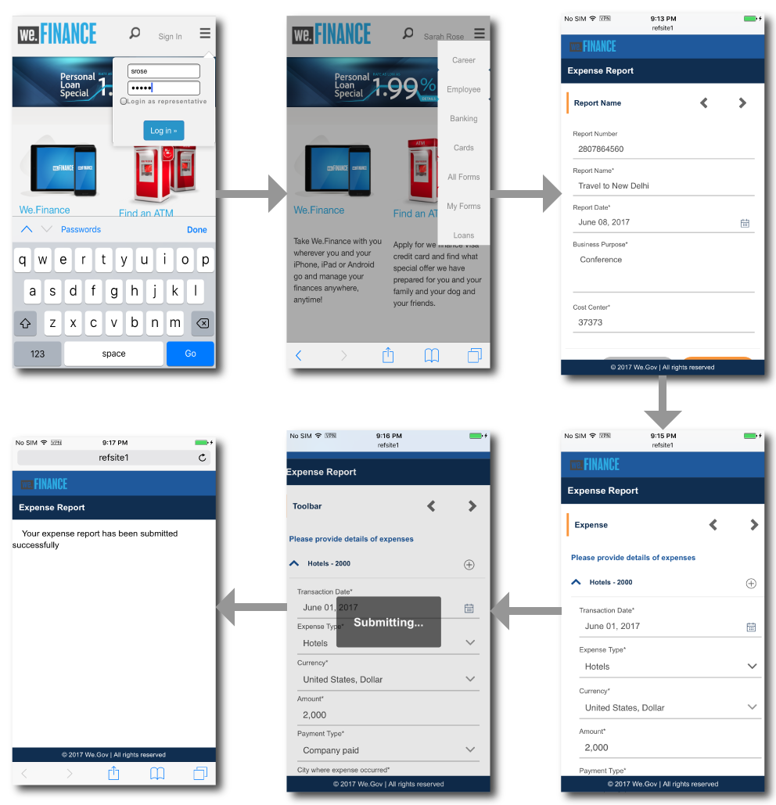

# Genomgång av referenswebbplatser för självbetjäning för medarbetare {#employee-self-service-reference-site-walkthrough}

>[!CAUTION]
>
>AEM 6.4 har nått slutet på den utökade supporten och denna dokumentation är inte längre uppdaterad. Mer information finns i [teknisk supportperiod](https://helpx.adobe.com/support/programs/eol-matrix.html). Hitta de versioner som stöds [här](https://experienceleague.adobe.com/docs/).

## Förutsättning {#prerequisite}

Konfigurera referenswebbplatser enligt beskrivningen i [Konfigurera AEM Forms referenswebbplatser](/help/forms/using/setup-reference-sites.md).

## Översikt {#overview}

Självbetjäningssystem för anställda, som i allmänhet finns på företagets intranät, ger personalen tillgång till en mängd information och tjänster som de kan få från sina skrivbord. Det ger medarbetarna möjlighet och fullständig kontroll att utföra åtgärder som att få tillgång till deras anställningsinformation, ansöka om ledighet och lämna in utgiftsrapporter. Å andra sidan bidrar det till att förbättra effektiviteten i processerna och minska kostnaderna samtidigt som medarbetarna hålls informerade och engagerade.

Självbetjäning för medarbetare visar hur man kan utnyttja AEM Forms för att införa självbetjäningssystemet för medarbetare i organisationen.

>[!NOTE]
>
>Självbetjäningsexempel för anställda finns både på referenswebbplatserna We.Finance och We.Gov. De exempel, bilder och beskrivningar som används i genomgången använder referenswebbplatsen We.Finance. Du kan dock köra de här användningsexemplen och granska artefakter med hjälp av We.Gov också. Om du vill göra det måste du ersätta **vi-finansiering** med **we-gov** i de angivna URL-adresserna.

## Genomgång av enkäter om intressekonflikter {#conflict-of-interest-questionnaire-walkthrough}

Organisationer ber då och då sina anställda att skicka in frågeformulär om intressekonflikter som identifierar externa aktiviteter eller personliga relationer hos deras anställda som kan komma i konflikt med deras organisation.

Övervakningsavdelningen på Sarah har bett medarbetarna att lämna in frågeformuläret Conflict of Interest.

### Sarah lämnar in frågeformuläret om intressekonflikter {#sarah-submits-the-conflict-of-interest-questionnaire}

Sarah går till sin organisations portal, loggar in och klickar på Medarbetare för att komma åt personalens instrumentpanel. Hon hittar frågeformuläret Conflict of Interest på kontrollpanelen för medarbetare och klickar på **[!UICONTROL Apply]**.

**Bild:** *Organisationsportal*

**Bild:** *Instrumentpanel för medarbetare*

Sarah navigerar i formuläret med knappen Nästa och läser igenom avsnitten Introduktion och Definition. Hon svarar på frågorna i avsnittet Frågor. Slutligen skriver hon under och skickar in frågeformuläret.

Organisationsportalen och enkäten är responsiva och mobilvänliga. Följande arbetsflöde visar hur Sarah navigerar genom och skickar in enkäten på sin mobila enhet.

**Så här fungerar det**

Organisationsportalen och personalkontrollpanelen är AEM Sites-sidor. På kontrollpanelen visas flera alternativ för självbetjäning, till exempel frågeformuläret Konflikt. Knappen Använd är länkad till ett anpassat formulär.

Det anpassningsbara formuläret använder regler för att visa/dölja information baserat på svaret som ges på fliken Frågor. Formuläret använder dessutom komponenten Klottra för signering på fliken Deklaration. Granska det anpassade formuläret på `https://[authorHost]:[authorPort]/editor.html/content/forms/af/we-finance/employee/self-service/conflict-of-interest.html`.

**Se det själv**

Gå till `https://[publishHost]:[publishPort]/content/we-finance/global/en/self-service-forms.html` och logga in med `srose/srose` som användarnamn/lösenord för Sarah. Klicka **[!UICONTROL Employee]** för att öppna kontrollpanelen och sedan klicka på **[!UICONTROL Apply]** om frågeformulär om intressekonflikter. Granska och skicka in enkäten.

### Gloria granskar och godkänner enkäten om intressekonflikter {#gloria-reviews-and-approves-the-conflict-of-interest-questionnaire-submission}

Det frågeformulär om intressekonflikter som Sarah har lämnat in tilldelas Gloria Rios för granskning. Gloria arbetar som efterlevnadsansvarig i organisationen. Gloria loggar in på sin AEM Inbox och granskar de uppgifter hon tilldelats. Hon godkänner frågeformuläret som lämnats in av Sarah och fullföljer uppgiften.

**Bild:** *Gloria&#39;s inbox*

**Bild:** *Öppna uppgift*

**Så här fungerar det**

Skicka-åtgärden i frågan om intressekonflikter utlöser ett arbetsflöde som skapar en uppgift i Glorias inkorg för godkännande. Granska Formens Workflow på `https://[authorHost]:[authorPort]/editor.html/conf/global/settings/workflow/models/we-finance/employee/self-service/we-finance-employee-conflict-of-interest.html`

**Se det själv**

Gå till `https://[publishHost]:[publishPort]/content/we-finance/global/en/login.html?resource=/aem/inbox.html` och logga in med `grios/password` som användarnamn/lösenord för Gloria Rios. Öppna uppgiften som har skapats för enkäten om intressekonflikter och godkänn den.

## Genomgång av ansökningar med företagskort {#corporate-card-application-walkthrough}

Sarah reser mycket i jobbet och kräver ett kreditkort för att kunna betala sina räkningar i farten. Hon ansöker om ett företagskort via sin organisations personalportal.

### Sarah skickar ansökan om företagskort {#sarah-submits-the-corporate-card-application}

Sarah går till sin organisations portal, loggar in och klickar **[!UICONTROL Employee]** för att komma åt personalens kontrollpanel. Hon hittar ett Corporate Card-program på personalinstrumentpanelen och klickar på **[!UICONTROL Apply]**.

**Bild:** *Organisationsportal*

**Bild:** *Instrumentpanel för medarbetare*

Hon klickar **[!UICONTROL Apply]** på Corporate Card-applikationen. Ett enkelsidigt program öppnas. Hon fyller i alla detaljer och klickar **[!UICONTROL Apply]** att lämna in ansökan.

**Så här fungerar det**

Organisationsportalen och personalkontrollpanelen är AEM Sites-sidor. På kontrollpanelen visas flera alternativ för självbetjäning, till exempel företagskortsprogrammet. Knappen Använd i programmet är länkad till ett anpassat formulär.

Den adaptiva formen för företagstillämpningar är en enkel, ensidig, responsiv adaptiv form. Den använder grundläggande adaptiva formulärkomponenter som text, telefon, numerisk ruta och nummernummerlista. Gå igenom det anpassade formuläret på:\
`https://[authorHost]:[authorPort]/editor.html/content/forms/af/we-finance/employee/self-service/corporate-card.html`.

**Se det själv**

Gå till `https://[publishHost]:[publishPort]/content/we-finance/global/en/self-service-forms.html` och logga in med `srose/srose` som användarnamn/lösenord för Sarah. Klicka **[!UICONTROL Employee]** för att öppna kontrollpanelen och sedan klicka på **[!UICONTROL Apply]** på ett företagskort. Fyll i uppgifterna och skicka in ansökan.

### Gloria granskar och godkänner ansökan om företagskort {#gloria-reviews-and-approves-the-corporate-card-application}

Den ansökan om företagskort som Sarah har skickat in tilldelas Gloria Rios för granskning. Gloria loggar in på sin AEM Inbox och granskar de uppgifter hon tilldelats. Hon godkänner Sarah ansökan och slutför uppgiften.

**Bild:** *Gloria&#39;s inbox*

**Bild:** *Öppna uppgift*

**Så här fungerar det**

Arbetsflödet för att skicka in med Corporate Card-programmet aktiverar ett Forms-arbetsflöde som skapar en uppgift i Glorias inkorg för godkännande. Granska Formens Workflow på `https://[authorHost]:[authorPort]/editor.html/conf/global/settings/workflow/models/we-finance/employee/self-service/we-finance-employee-corporate-card.html`

**Se det själv**

Gå till `https://[publishHost]:[publishPort]/content/we-finance/global/en/login.html?resource=/aem/inbox.html` och logga in med `grios/password` som användarnamn/lösenord för Gloria Rios. Öppna uppgiften som skapats för Corporate Card-programmet och godkänn den.

## Genomgång av utgiftsrapportinlämning {#expense-report-submission-walkthrough}

När Sarah går på affärsresor måste hon skicka in utgiftsrapporter för godkännande. Med självbetjäningsalternativet i sin organisation kan hon skicka in utgiftsrapporten online.

### Sarah skickar programmet för utgiftsrapport {#sarah-submits-the-expense-report-application}

Sarah går till sin organisations portal, loggar in och klickar **[!UICONTROL Employee]** för att komma åt personalens kontrollpanel. Hon hittar programmet för utgiftsrapport på kontrollpanelen för medarbetare och klickar på **[!UICONTROL Apply]**.

**Bild:** *Organisationsportal*

**Bild:** *Instrumentpanel för medarbetare*

Hon klickar **[!UICONTROL Apply]** i programmet Utgiftsrapport. Ett programformulär öppnas med två flikar - Rapportnamn och Rapportdetaljer. The **+** på fliken Rapportdetaljer kan hon lägga till fler än utgifter i en rapport.

Organisationsportalen och tillämpningarna är responsiva och mobilvänliga. Följande arbetsflöde visar hur Sarah navigerar genom och skickar utgiftsrapporten på sin mobila enhet.

**Så här fungerar det**

Organisationsportalen och personalkontrollpanelen är AEM Sites-sidor. På kontrollpanelen visas flera alternativ för självbetjäning, till exempel programmet Utgiftsrapport. Knappen Använd är länkad till ett anpassat formulär.

Flikarna Rapportnamn och Rapportdetaljer i det adaptiva formuläret är panelkomponenter. Panelen Rapportdetaljer innehåller panelen Utgift. Det är en upprepningsbar panel som gör att du kan lägga till flera utgifter i rapporten. Granska det adaptiva formuläret och dess konfigurationer på `https://[authorHost]:[authorPort]/editor.html/content/forms/af/we-finance/employee/expense-report.html`.

**Se det själv**

Gå till `https://[publishHost]:[publishPort]/content/we-finance/global/en/self-service-forms.html` och logga in med `srose/srose` som användarnamn/lösenord för Sarah. Klicka **[!UICONTROL Employee]** för att öppna kontrollpanelen och sedan klicka på **[!UICONTROL Apply]** på utgiftsrapportprogram. Fyll i uppgifterna och skicka in ansökan.

### Gloria granskar och godkänner utgiftsrapporten {#gloria-reviews-and-approves-the-expense-report}

Utgiftsrapporten från Sarah har tilldelats Gloria Rios för granskning. Gloria loggar in på sin AEM Inbox och granskar de uppgifter hon tilldelats. Hon godkänner Sarah ansökan och slutför uppgiften.

**Bild:** *Gloria&#39;s inbox*

**Bild:** *Öppna uppgift*

**Så här fungerar det**

Arbetsflödet för att skicka in i programmet Utgiftsrapport utlöser ett Forms-arbetsflöde som skapar en uppgift i Glorias inkorg för godkännande. Granska Formens Workflow på `https://[authorHost]:[authorPort]/editor.html/conf/global/settings/workflow/models/we-finance/employee/self-service/we-finance-employee-expense-report-workflow.html`

**Se det själv**

Gå till `https://[publishHost]:[publishPort]/content/we-finance/global/en/login.html?resource=/aem/inbox.html` och logga in med `grios/password` som användarnamn/lösenord för Gloria Rios. Öppna uppgiften som skapats för programmet Utgiftsrapport och godkänn den.

## Lämna programgenomgången {#leave-application-walkthrough}

Sarah planerar en familjesemester nästa månad och vill ansöka om en veckas ledighet från jobbet.

### Sarah lämnar in ledighetsansökan {#sarah-submits-the-leave-application}

Sarah går till sin organisations portal, loggar in och klickar **[!UICONTROL Employee]** för att komma åt personalens kontrollpanel. Hon hittar programmet på personalkontrollpanelen och klickar på **[!UICONTROL Apply]**.

**Bild:** *Organisationsportal*

**Bild:** *Instrumentpanel för medarbetare*

Lämna program öppnas med Sarah namn och anställnings-ID förifyllt i formuläret. Det visar också hennes ledighetsbalans och historia. Hon fyller i ledighetsinformationen och lämnar in ansökan om godkännande.

Organisationsportalen och tillämpningarna är responsiva och mobilvänliga. Följande arbetsflöde visar hur Sarah navigerar genom och skickar programmet på sin mobila enhet.

**Så här fungerar det**

Organisationsportalen och personalkontrollpanelen är AEM Sites-sidor. På kontrollpanelen visas flera självbetjäningsalternativ, till exempel programmet Lämna. Knappen Använd är länkad till ett anpassat formulär.

Det anpassningsbara formuläret för ledighetsansökan baseras på datamodellen Employee Leaves. I avsnittet Lämna saldo fylls tabellen för återstående saldo i med `getLeavesOf` Tjänsten Form Data Model. I start- och slutdatumfälten används regler för att validera att datumvärdena är lika med eller efter det aktuella datumet. Ledighetens varaktighet beräknas med `calcBusinessDays` funktion.

Du kan granska det adaptiva formuläret och formulärdatamodellen på följande platser:

`https://[authorHost]:[authorPort]/editor.html/content/forms/af/we-finance/employee/self-service/leave-application.html`

`https://[authorHost]:[authorPort]/aem/fdm/editor.html/content/dam/formsanddocuments-fdm/db`

**Se det själv**

Gå till `https://[publishHost]:[publishPort]/content/we-finance/global/en/self-service-forms.html` och logga in med `srose/srose` som användarnamn/lösenord för Sarah. Klicka **[!UICONTROL Employee]** för att öppna kontrollpanelen och sedan klicka på **[!UICONTROL Apply]** Lämna programmet. Fyll i uppgifterna och skicka in ansökan.

### Gloria granskar och godkänner ledighetsansökan {#gloria-reviews-and-approves-the-leave-application}

Den ledighetsansökan som Sarah har lämnat in tilldelas Gloria Rios för granskning. Gloria loggar in på sin AEM Inbox och granskar de uppgifter hon tilldelats. Hon godkänner Sarah ansökan och slutför uppgiften.

**Bild:** *Gloria&#39;s inbox*

**Bild:** *Öppna uppgift*

**Så här fungerar det**

Arbetsflödet för att skicka iväg programmet utlöser ett Forms-arbetsflöde som skapar en uppgift i Glorias inkorg för godkännande. Granska Formens Workflow på `https://[authorHost]:[authorPort]/editor.html/conf/global/settings/workflow/models/we-finance/employee/self-service/we-finance-employee-leave-application.html`

**Se det själv**

Gå till `https://[publishHost]:[publishPort]/content/we-finance/global/en/login.html?resource=/aem/inbox.html` och logga in med `grios/password` som användarnamn/lösenord för Gloria Rios. Öppna uppgiften som skapats för att lämna programmet och godkänn den.
