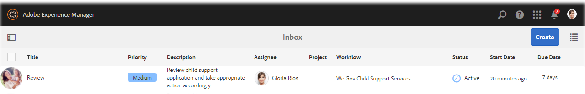
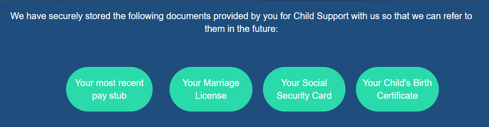

# Genomgång av vår Gov-referenswebbplats {#we-gov-reference-site-walkthrough}

## Krav {#pre-requisite}

Konfigurera din webbsida.Gov-referensplats enligt beskrivningen i [Konfigurera och konfigurera referenswebbplatserna](/help/forms/using/setup-reference-sites.md)för AEM-formulär.

## Referensscenario för webbplats {#reference-site-scenario}

We.Gov är en statlig organisation som låter adoptivföräldrar registrera sig för barnsupport om de använder ett barn. Webbplatsen hanterar följande:

* Berättigande för sökanden, den adopterande föräldern
* Sökandens personliga och yrkesmässiga uppgifter (om sökanden är berättigad till barnstöd)
* Personliga uppgifter om det adopterade barnet

   Sökande kan lämna information om mer än ett barn
* Bankkontouppgifter för den sökande där den sökande kan få barnbidrag
* Återbetalning av ansökningsavgift
* Bedömning av ansökan
* Godkännande av ansökan
* Automatiserad kommunikation med sökanden

När ansökan har lämnats in och avgiften har betalats, får sökanden ett e-postmeddelande från organisationen med en bekräftelse på att ansökan har lämnats in.

Vi.Gov-organisationen tar emot programmet. Organisationen får programmet granskat och godkänner de program som är äkta.

När ansökan har godkänts får den sökande ett e-postmeddelande från webbsidan We.Gov. Alternativet **Visa dokument** i e-postmeddelandet länkar till ett dokument med information om den sökandes registrering.

I bilden nedan visas ett steg-för-steg-arbetsflöde för referenswebbplatsscenariot för Web.Gov.

Scenariot omfattar följande personligheter:

* Sarah Rose, den adoptivförälder som begär barnsupport
* Joe, det adopterade barnet
* Gloria Rios, chef för godkännandeavdelningen, We.Gov
* Conard Simms, fältagenten som hanterar programbedömningen

## Sarah initierar sin behörighetskontroll {#sarah-initiates-her-eligibility-check}

En sökande kan kontrollera om han eller hon är berättigad att ansöka om barnsupportförmåner. På webbplatsen kan användarna besvara frågor för att de ska kunna avgöra om deras program är berättigade till förmåner. Sarah, en adoptivförälder, är en potentiell sökande till det. Formuläret för behörighet ingår i Application for Child Support Services på webbplatsen We.Gov. För att se om hon är berättigad klickar Sarah på **[!UICONTROL Child Support]** på webbsidan We.Gov. På barnsupportsidan klickar Sarah på **[!UICONTROL Check Your eligibility]**.

Förutom ovanstående kan Sarah klicka på **[!UICONTROL Kom igång]** på hemsidan. Sarah navigeras till sidan Alla program, där hon kan klicka på Ansök under **[!UICONTROL Application for Child Support Services]**. Sarah går sedan vidare till behörighetskontrollen.

På sidan Check Eligibility For Child Support (Kontrollera berättigande för barnsupport) tillfrågas Sarah om en uppsättning frågor för att fastställa om hon är berättigad till barnsupport. Genom de olika frågorna får hon frågan:

* Om hon är den överordnade för det underordnade barnet
* Om hon och barnet bor i delstaten GX
* Åldersgruppen för barnets och barnets utbildning.

Sarah svarar på de här frågorna och hennes behörighet är godkänd. Hennes svar avgör om hon är berättigad till barnsupport.

Sarah informeras om att hon är berättigad till barnsupport och ansökningsavgiften är 25 dollar.

### Så här fungerar det {#how-it-works}

Sarah är berättigad till rabatten genom ett behörighetshinder som skapats med regelredigeraren. Med regelredigeraren kan du ange villkor som uppfylls innan en sökande kan fylla i ansökningsformuläret. När Sarah, den sökande, uppfyller alla villkor för behörighet, landar hon på ansökningsformuläret.

Kvalificeringskontrollen är en del av det anpassningsbara formuläret för barnsupportprogrammet. Regeln kontrollerar behörighet när:

* Sökanden är förälder i förvar
* Sökanden och barnet befinner sig i delstaten GX
* Den sökande har barnets viktigaste dagliga omvårdnad
* Åldern då barnet får support är under 16 år.

### Se det själv {#see-it-yourself}

Öppna i webbläsaren `https://<hostname>:<PublishPort>/content/we-gov/en.html`. Klicka på Underordnad support på webbsidan Web.Gov. Klicka på Kontrollera din behörighet på sidan Underordnad support.

Så här ser du reglerna:

1. Öppna formuläret i redigeringsläge på författarinstansen. Webbadress: `https://<hostname>:<AuthorPort>/editor.html/content/forms/af/we-gov/child-support/css.html`.
1. Markera en komponent och klicka på .

   Regelredigeraren öppnas och alla regler som används i formuläret visas.

1. Klicka på regler i den vänstra panelen `passMsg` och `failMsg` se hur behörighetskontrollen fungerar.

## Sarah startar sin ansökan om barnsupport {#sarah-starts-her-application-for-child-support}

Sarah klickar på **[!UICONTROL Starta program]** när hon har informerats om att hon är berättigad till barnsupport.\
På sidan Application For Child Support Services (Application for Child Support Services) ger Sarah information i följande avsnitt:

* **[!UICONTROL Om sökande]**: Låter Sarah ge henne information i det här avsnittet.

* **[!UICONTROL Underordnad information]**: Låter Sarah tillhandahålla information om barn, som omfattas av supporttjänster.

* **[!UICONTROL Betalning]**: Låter Sarah ange sina bankuppgifter där We.Gov kan betala månadsvis supportkompensation.

* **[!UICONTROL Avgiftsbetalning]**: Låter Sarah ange sina kreditkortsuppgifter för att betala för ansökningsavgiften.

Som standard dirigeras Sarah till **[!UICONTROL avsnittet Om sökande]** .

Sarah kan när som helst klicka på **[!UICONTROL Kom tillbaka senare]** och återuppta med sin ansökan. När hon klickar på **[!UICONTROL Kom tillbaka senare]** sparas hennes framsteg som ett utkast och hon får ett alternativ för att skicka utkastet via e-post.

När hon klickar på **[!UICONTROL Skicka e-post]** får hon ett e-postmeddelande med en länk till utkastet till formuläret.

Det underordnade supportformuläret på webbsidan We.Gov använder adaptiva formulär. Hon kan använda länken i sitt e-postmeddelande och fylla i formuläret på sin mobila enhet.

>[!NOTE]
>
>Arbetsflödet från e-post fungerar endast med inloggade användare. I scenariot för referensplatsen ser du till att användaren Sarah Rose läggs till. Sarah inloggningsuppgifter är `srose/password`.

Sarah kan lämna information i vilket avsnitt som helst, men ansökningsavgiften accepteras först efter att hon har lämnat nödvändig information i alla avsnitt. Ett program är ofullständigt utan avgiftsbetalning och fält som är markerade med en asterisk krävs.

### <strong>Sarah ger henne information</strong>{#strong-sarah-provides-her-information-strong}

När Sarah har klickat på **[!UICONTROL Start Application]**(Starta ansökan), kommer hon till informationsdelen för sökande på sidan Application For Child Support Services (Ansökan för barnsupport för barn). Under Information om sökande navigerar Sarah på flikarna och lämnar sina personuppgifter för ansökan. Hon klickar på **[!UICONTROL Nästa]** för att navigera bland flikarna.

Under Information om sökande ombeds hon att lämna uppgifter på följande flikar:

* **[!UICONTROL Grundläggande information]**

Under Grundläggande information tillhandahåller Sarah sitt ID-bevis och hennes personuppgifter. Sara personuppgifter innehåller hennes namn, e-postadress och personnummer.

* **[!UICONTROL Relation]**

   Under Relationship skriver Sarah information om hennes civilstånd.

* **[!UICONTROL Ytterligare information]**

   Under Ytterligare information anger Sarah ett ID-nummer, födelsedatum och aktuell adress och telefonnummer.

### Sarah tillhandahåller information om barn {#sarah-provides-child-information}

När Sarah har lämnat sina personuppgifter och klickat på **[!UICONTROL Nästa]**, kommer hon till barninformationssektionen.

I avsnittet Underordnad information ger hon följande information:

* Antal underordnade som ska göra anspråk på underordnade supporttjänster
* Barnets namn, socialförsäkringsnummer, födelsedatum och födelseort

Om Sarah väljer mer än ett barn får hon fler formulär aktiverade med samma detaljer att fylla i.\
Sarah väljer sitt barn Joe och skriver sitt namn.

### Sarah tillhandahåller betalningsinformation {#sarah-provides-payment-information}

När Sarah har angett information om det adopterade barnet (eller barn) och klickat på **[!UICONTROL Nästa]**, kommer hon till delen **[!UICONTROL Betalningsinformation]** .

I avsnittet Betalningsinformation anger hon i vilket bankkonto hon kan få barnsupportförmånerna.\
Hon anger sitt 10-siffriga bankkontonummer.

## Sarah betalar ansökningsavgiften och signerar formuläret {#sarah-pays-the-application-fee-and-signs-the-form}

När Sarah har godkänt villkoren för ansökan betalar hon ansökningsavgiften på 25 USD. Programavgift krävs för att behandla ansökan.\
Sarah anger sin kreditkortsinformation och klickar på **[!UICONTROL Betala nu]**. När avgifterna har betalats visas en PDF-version av programmet med ett signaturfält.

Sarah kan välja att antingen skriva in, använda draw för hand, infoga en bild av en signatur eller använda mobilens pekskärm för att rita sin signatur. Sarah skriver sitt namn och klickar på Klicka för att signera.

Hennes ansökan skickas till webbsidan We.Gov.

### <strong>Sarah får ett bekräftelsemeddelande via e-post</strong>{#strong-sarah-receives-an-acknowledgement-email-strong}

När Sarah har betalat ansökningsavgiften får hon ett bekräftelsemeddelande från webbsidan We.Gov.\
Vi.Gov behandlar ansökan och Sarah informeras om att hon får en månadskompensation när ansökan har godkänts.

### Så här fungerar det {#how-it-works-1}

I det underordnade stödprogrammet används en kombination av panellayouter, t.ex. den översta fliken, guiden och dragspelspanelen, för att skapa upplevelsen. Den använder en formulärmall som heter Underordnad mall för Web.Gov.

Sökanden kan gå mellan olika avsnitt för att fylla i olika komponenter i formuläret. När den sökande fyller i formuläret, skickar in det, godkänner villkoren och betalar avgiften startas ett anpassat arbetsflöde. Det anpassade arbetsflödet skickar ett automatiskt e-postmeddelande till den som bekräftar att ansökan har skickats in. Ansökan vidarebefordras till den berörda avdelningen inom organisationen för kontroll och godkännande.

Formulärets layout anges i tjänsttemat för Gov Child Support. Formateringen innehåller komponentformat, sidbakgrund, komponenternas feltillståndsformatering och teckensnittsformat.

Behörighetskontrollen använder regler som anges i formuläret. Den använder de valideringskontroller som anges nedan:

`SHOW passMsgWHEN (Does the child live in the state of GX? is equal to Yes) AND (Do you live in the state of GX? is equal to Yes) AND ( (Who has the main day-to-day care of the child? is equal to You) AND (Are you: is equal to The custodial parent) ) AND (Is the child you are applying for: is equal to Under 16 years) ELSE Hide`

`HIDE failMsg WHEN (Does the child lives in the state of GX? is equal to Yes) AND ( (Do you live in the state of GX? is equal to Yes) AND (Who has the main day-to-day care of the child? is equal to You) ) AND (Is the child you are applying for: is equal to Under 16 years) AND (Are you: is equal to The custodial parent) ELSE Show`

### Se det själv {#see-it-yourself-1}

Öppna `https://<hostname>:<PublishPort>/content/forms/af/we-gov/child-support/css.html` och fyll i den information som behövs i webbläsaren. När du skickar in programmet efter att du har fyllt i den obligatoriska informationen, betalat avgifterna och signerat dokumentet får du bekräftelsemeddelandet via e-post.

Se den underordnade mallen för Web.Gov här: `https://<hostname>:<AuthorPort>/editor.html/conf/we-gov/settings/wcm/templates/we-gov-child-template/structure.html`

Se temat här: `https://<hostname>:<AuthorPort>/editor.html/content/dam/formsanddocuments-themes/we-gov/we-gov-theme-A/jcr:content`

Så här ser du alla regler:

1. Öppna formuläret i redigeringsläge.

   Webbadress: `https://<hostname>:<AuthorPort>/editor.html/content/forms/af/we-gov/child-support/css.html`

1. Markera en komponent och tryck på . Alla regler listas i regelredigeraren, inklusive reglerna som listas ovan.

## Gloria tar emot programmet {#gloria-receives-the-application}

Gloria, ansvarig för godkännanden hos We.Gov, kan visa, godkänna eller avvisa skickade ansökningar. Med AEM Inbox kan hon se alla inskickade program på ett och samma ställe.

### Så här fungerar det {#how-it-works-2}

När Sarah fyller i och skickar in det underordnade supportprogrammet skapas en PDF-fil eller ett arkivdokument med programmet och skickas till Inkorgen för Gloria Rios. Gloria kan visa det inskickade programmet och godkänna eller avvisa det.

### Se det själv {#see-it-yourself-2}

Öppna sidan `https://<hostname***>:<PublishPort>/content/we-gov/en.html`. Tryck på **[!UICONTROL Logga in]** på sidan, markera kryssrutan **[!UICONTROL Logga in som representativ]** och logga in i AEM-inkorgen med hjälp av stödraster/lösenord som användarnamn/lösenord för Gloria Rios. Det underordnade supportprogrammet visas. Information om hur du använder AEM Inbox för formulärbaserade arbetsflödesuppgifter finns i [Hantera formulärprogram och uppgifter i AEM Inbox](/help/forms/using/manage-applications-inbox.md).

Gloria kan visa, godkänna eller avvisa programmet från programkontrollpanelen.

### Så här fungerar det {#how-it-works-3}

Gloria, ansvarig för godkännandena på We.Gov, öppnar sin AEM-inkorg. Hon ser en granskningsuppgift i sin lista över uppgifter. Hon öppnar och ser granskningsuppgifterna.

Hon ser en PDF-fil med de uppgifter Sarah angav tillsammans med de överförda dokumenten Sarah.\
Gloria kan godkänna eller avvisa programmet. Gloria klickar dock på **[!UICONTROL Bedömning krävs]** för att få programmet utvärderat.

Sarah program är en startpunkt i AEM-arbetsflödet. Det initierar AEM-arbetsflödet när det underordnade supportansökningsformuläret skickas. AEM-arbetsflödet skapar en uppgift för Gloria som visas i hennes AEM-inkorg. När Gloria begär utvärdering på plats skapas en ny uppgift för fältagenten.

### Se det själv {#see-it-yourself-3}

Om konfigurationen är klar startar AEM-arbetsflödet direkt efter att formuläret har skickats. Logga in på Inkorgen med Glorias inloggningsuppgifter.

Gå till inkorgen på https://&lt;***värdnamn***>:&lt;***PublishPort***>/content/we-gov/en.html. Tryck på **[!UICONTROL Logga in]** på sidan och markera kryssrutan **[!UICONTROL Logga in som representativ]** med Glorias standardautentiseringsuppgifter:

* Användarnamn: gris
* Lösenord:lösenord

I hennes AEM-inkorg läggs Sarah program till som en granskningsuppgift. Välj uppgiften och klicka på **Utvärdering krävs** för att gå vidare till nästa steg.

### Konsolen hämtar utvärderingsaktiviteten {#conard-assessment-task}

När Gloria klickar på **[!UICONTROL Assessment Required]** får Conard granskningsuppgifterna i sin AEM Inbox. Uppgiften är nästa steg i AEM-arbetsflödet som definieras i arbetsflödesmodellen. Han ser granskningsuppdraget och öppnar det.

Conard hämtar den sökandes bedömningsuppgift enligt nedan.

Utvärderingen av det underordnade stödet är ett formulär som är kopplat till uppgiften. Han får information om Sarah tillsammans med tillhörande dokument (bifogade i uppgiftsinformationen). Conard fyller i bedömningsformuläret i fältet på en enhet och lämnar in ansökan om omvärdering.

Conard verifierar alla detaljer Sarah har lämnat och Sarah signerar utvärderingen. AEM Forms kan ta plats och tidsstämpel och lägga till dem i signaturen.

Koncernen klickar på **[!UICONTROL Skicka för omvärdering]** och AEM-arbetsflödet skickar bedömningen till Web.GOV-organisationen.

### Så här fungerar det {#how-it-works-4}

När Gloria begär en utvärdering initieras nästa steg i AEM-arbetsflödet och utvärderingsaktiviteten läggs till i Conards inkorg. Conard är fältarbetarens persona.

Conard besöker Saras plats, verifierar att den information Sarah lämnat är äkta och fyller i bedömningsformuläret. Conard har åtkomst till en PDF av den fullständiga blankett som Sarah fyllt i.

### Se det själv {#see-it-yourself-4}

Öppna AEM-inkorgen på din surfplatta och använd Conards inloggningsuppgifter för att logga in.

Standardautentiseringsuppgifterna för kortet är:

* Användarnamn: csimms
* Lösenord:lösenord

En ny utvärderingsbegärandeuppgift läggs till i inkorgen. Skicka den färdiga bedömningen och fortsätt till nästa steg.

### Gloria granskar utvärderingen och godkänner ansökan {#gloria-reviews-the-assessment-and-approves-the-application}

Efter att Conard lämnat in utvärderingen ser Gloria en granskningsuppgift i sin inkorg. Hon väljer och öppnar **[!UICONTROL Granska]**.

Under Uppgiftsinformation ser Gloria Senaste åtgärd som &quot;Skicka för omvärdering&quot; (av Conard). Gloria ser att Conard Simms utvärderade programmet.

### Så här fungerar det {#how-it-works-5}

Efter att Conard lämnat in utvärderingen ser Gloria en granskningsuppgift i sin inkorg. Hon väljer och öppnar Review. Under Uppgiftsinformation ser Gloria den bedömningskommentar som Conard har gjort, som är&quot;allt som hittats i ordning&quot;.

Gloria godkänner programmet.

### Se det själv {#see-it-yourself-5}

Öppna inkorgen och logga in med Glorias inloggningsuppgifter. En ny uppgift som kallas Granska visas i inkorgen.

Öppna uppgiften för att se status för senaste åtgärd. Godkänn ansökan utifrån bedömningen.

## Sarah får ett e-postmeddelande om godkännande {#sarah-receives-an-approval-email}

När Gloria har godkänt ansökan får Sarah ett e-postmeddelande från We.Gov om att hennes ansökan har godkänts.

Knappen **[!UICONTROL Visa dokument]** i e-postmeddelandet länkar till hennes registreringsinformation. Sarah klickar på **[!UICONTROL Visa dokument.]**

Registreringsdokumentet innehåller information om t.ex. referens-ID, täckning för barn, startdatum, bankkontonummer, betalningsfrekvens och betalningsbelopp.

Sarah kan visa de dokument som hon överförde på samma sida.

### Så här fungerar det {#how-it-works-6}

När Gloria godkänt ansökan får Sarah ett automatiskt mejl med en länk till registreringsdokumentet.

Registreringsdokumentet är en interaktiv kommunikation och kan visas på alla enheter. Den innehåller information om barnsupporten och information som Sarah har tillhandahållit.

### Se det själv {#see-it-yourself-6}

Kontrollera e-postklienten som du konfigurerat för det automatiska e-postmeddelandet med en länk till registreringsdokumentet.

Du kan även öppna dokumentet i webbläsaren: `https://<hostname>:<PublishPort>/content/aemforms-refsite/doclink.html?document=/content/forms/af/we-gov/child-support/enrollment-document&referenceId=[reference-id]&channel=web`

## We.Gov analyserar programmets prestanda {#we-gov-analyzes-the-performance-of-the-application}

Vi.Gov granskar då och då hur deras barnsupportprogram fungerar för att kontrollera om det finns några problem som kunderna kan stöta på. De använder den här analysen för att fatta välgrundade beslut om de ändringar som krävs i barnsupportprogrammet för att förbättra användarupplevelsen, minska avhoppsfrekvensen för formulär och därigenom förbättra konverteringsgraden. De utnyttjar integreringen av AEM Forms med Adobe Analytics för sin analys. Följande bild visar deras kontrollpanel för analys.

### Så här fungerar det {#how-it-works-7}

Prestandamätningar för programformuläret för barnsupport spåras med Adobe Analytics. Mer information om hur du konfigurerar Adobe Analytics och visar rapporter finns i [Konfigurera analyser för formulär och dokument](/help/forms/using/configure-analytics-forms-documents.md).

### Se det själv {#see-it-yourself-7}

För att du ska kunna visa och utforska analysrapporten tillhandahåller vi startdata för programmet för barnsupport på referenswebbplatsen. Innan du använder dirigerade data, se [Konfigurera analys](/help/forms/using/setup-reference-sites.md#configureanalytics). Utför följande steg i författarinstansen för att visa rapporten med startdata:

1. Gå till **[!UICONTROL användargränssnittet för formulär och dokument]** på https://&lt;*värdnamn*>:&lt;*AuthorPort*>/aem/forms.html/content/dam/formSanddocuments.

1. Klicka för att öppna mappen **We.Gov** .
1. Välj **[!UICONTROL Application for Child Support Services]** adaptive form och klicka sedan på **[!UICONTROL Enable Analytics (Aktivera analys]** ) i verktygsfältet.

1. Markera formuläret igen och klicka på **[!UICONTROL Analysrapport]** i verktygsfältet för att generera rapporten. Inledningsvis visas en tom rapport.

Så här genererar du en analysrapport med dirigerade data:

1. I adressläsaren för CRXDE lite skriver du: **/apps/we-gov/demo-artifacts/analyticsTestData/Child support service Analytics Test Data**
1. Startdata markeras i den vänstra sidans katalogstruktur.
1. Dubbelklicka på den markerade filen för att öppna dess innehåll på den högra panelen.
1. Kopiera allt innehåll i testdatafilen.
1. I CRXDE navigerar du till: **/content/dam/formsanddocuments/we-gov/child-support/css/jcr:content/analyticsdatanode/lastsevendays**
1. Klistra in det kopierade innehållet i testdatafilen under Egenskaper i analysdatafältet.
1. Generera en analysrapport igen för **[!UICONTROL Application for Child Support Services]**. Du kan se startvärdesdata i den genererade rapporten.

