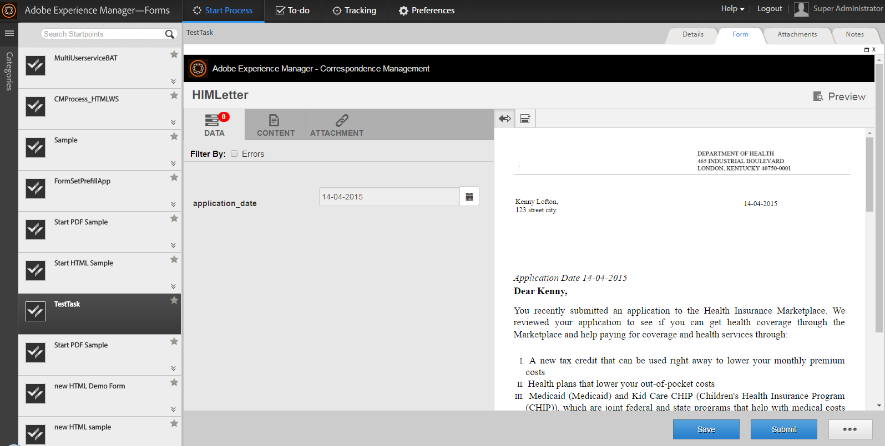

# Integrera tredjepartsprogram i arbetsytan AEM Forms {#integrating-third-party-applications-in-aem-forms-workspace}

Arbetsytan i AEM Forms har stöd för hantering av uppgiftstilldelning och slutförandeaktiviteter för formulär och dokument. Dessa formulär och dokument kan vara XDP Forms, Flex® eller stödlinjer (borttagna) som har återgetts i XDP-, PDF-, HTML- eller Flex-format.

Dessa funktioner har förbättrats ytterligare. AEM Forms har nu stöd för samarbete med tredjepartsprogram som stöder funktioner som liknar arbetsytan i AEM Forms. En vanlig del av den här funktionen är arbetsflödet för tilldelning och efterföljande godkännande av en uppgift. AEM Forms ger en enhetlig upplevelse för AEM Forms Enterprise-användare så att alla sådana uppgiftstilldelningar eller godkännanden för de program som stöds kan hanteras via arbetsytan i AEM Forms.

Låt oss som exempel se Korrespondenshantering som ett exempel på en kandidat för integrering med arbetsytan AEM Forms. Correspondence Management har begreppet&quot;Letter&quot; som kan återges och möjliggöra åtgärder.

## Skapa Correspondence Management-resurser {#create-correspondence-management-assets}

Börja med att skapa en Correspondence Management-exempelmall som renderas på arbetsytan i AEM Forms. Mer information finns i [Skapa en brevmall](/help/forms/using/create-letter.md).

Gå till Correspondence Management-mallen på dess URL för att kontrollera om Correspondence Management-mallen kan återges korrekt. URL:en har ett mönster som liknar `https://[server]:[port]/lc/content/cm/createcorrespondence.html?cmLetterId=encodedLetterId&cmUseTestData=1&cmPreview=0;`

där `encodedLetterId` är det URL-kodade brev-ID:t. Ange samma bokstav-ID när du definierar återgivningsprocessen för arbetsyteaktiviteten i Workbench.

## Skapa en uppgift för att återge och skicka ett brev AEM arbetsytan {#create-a-task-to-render-and-submit-a-letter-in-aem-workspace}

Innan du utför dessa steg måste du kontrollera att du är medlem i följande grupper:

* cm-agent-users
* Arbetsyteanvändare

Mer information finns i [Lägga till och konfigurera användare](/help/forms/using/admin-help/adding-configuring-users.md).

Följ de här stegen för att skapa en uppgift som återger och skickar ett brev AEM arbetsytan:

1. Starta Workbench. Logga in på localhost som administratör.
1. Klicka på Arkiv > Nytt > Program. I fältet Programnamn anger du `CMDemoSample` och klickar sedan på Slutför.
1. Markera `CMDemoSample/1.0` och högerklicka `NewProcess`. Ange `CMRenderer` och klicka sedan på Slutför i namnfältet.
1. Dra aktivitetsväljaren för startpunkten och konfigurera den:

   1. I Presentationsdata väljer du Använd en CRX-resurs.

      

   1. Bläddra efter en resurs. I dialogrutan Välj formulärresurs visas alla bokstäver på servern på fliken Bokstäver.

      

   1. Välj lämplig bokstav och klicka på **OK**.

1. Klicka på Hantera åtgärdsprofiler. Dialogrutan Hantera åtgärdsprofil visas. Kontrollera att Återgivningsprocessen och Skicka process är korrekt markerade.
1. Om du vill öppna brevet med en XML-datafil bläddrar du till och väljer lämplig datafil i Förbered dataprocess.
1. Klicka på OK.
1. Definiera variablerna för startpunktsutdata och uppgiftsbilagor. De definierade variablerna innehåller data för startpunktsutdata och uppgiftsbilagor.
1. (Valfritt) Om du vill lägga till en annan användare i arbetsflödet drar du en aktivitetsväljare, konfigurerar den och tilldelar den till en användare. Skriv en anpassad wrapper (exemplet nedan) eller ladda ned och installera DSC (se nedan) för att extrahera Letter-mallen, startpunktsutdata och uppgiftsbilaga.

   Ett exempel på en anpassad wrapper visas nedan:

   ```java
   public LetterInstanceInfo getLetterInstanceInfo(Document dataXML) throws Exception {
   try {
   if(dataXML == null)
   throw new Exception("dataXML is missing");
   
   CoreService coreService = getRemoteCoreService();
   if (coreService == null)
   throw new Exception("Unable to retrive service. Please verify connection details.");
   Map<String, Object> result = coreService.getLetterInstanceInfo(IOUtils.toString(dataXML.getInputStream(), "UTF-8"));
   LetterInstanceInfo letterInstanceInfo = new LetterInstanceInfo();
   
   List<Document> attachmentDocs = new ArrayList<Document>();
   List<byte[]> attachments = (List<byte[]>)result.get(CoreService.ATTACHMENT_KEY);
   if (attachments != null){
   for (byte[] attachment : attachments)
   { attachmentDocs.add(new Document(attachment)); }
   
   }
   letterInstanceInfo.setLetterAttachments(attachmentDocs);
   
   byte[] updateLayout = (byte[])result.get(CoreService.LAYOUT_TEMPLATE_KEY);
   if (updateLayout != null)
   { letterInstanceInfo.setLetterTemplate(new Document(updateLayout)); }
   
   else
   { throw new Exception("template bytes missing while getting Letter instance Info."); }
   
   return letterInstanceInfo;
   } catch (Exception e)
   { throw new Exception(e); }
   
   }
   ```

   [Hämta DSC för](assets/dscsample.zip)filhämtning: Ett exempel på DSC finns i den `DSCSample.zip` fil som bifogas ovan. Ladda ned och zippa upp `DSCSample.zip` filen. Innan du använder DSC-tjänsten måste du konfigurera den. Mer information finns i [Konfigurera DSC-tjänsten](/help/forms/using/add-action-button-in-create-correspondence-ui.md#p-configure-the-dsc-service-p).

   I dialogrutan Definiera aktivitet väljer du lämplig aktivitet, till exempel getLetterInstanceInfo, och klickar på **OK**.

1. Distribuera programmet. Om du uppmanas att checka in och spara resurserna.
1. Logga in på arbetsytan AEM formulär på `https://[server]:[port]/lc/content/ws`.
1. Öppna den uppgift du lagt till, CMRenderer. Correspondence Management-brevet visas.

   

1. Fyll i de uppgifter som krävs och skicka brevet. Fönstret stängs. I den här processen tilldelas uppgiften den användare som anges i arbetsflödet i steg 9.

   >[!NOTE]
   >
   >Knappen Skicka är inte aktiverad förrän alla obligatoriska variabler i brevet har fyllts i.

