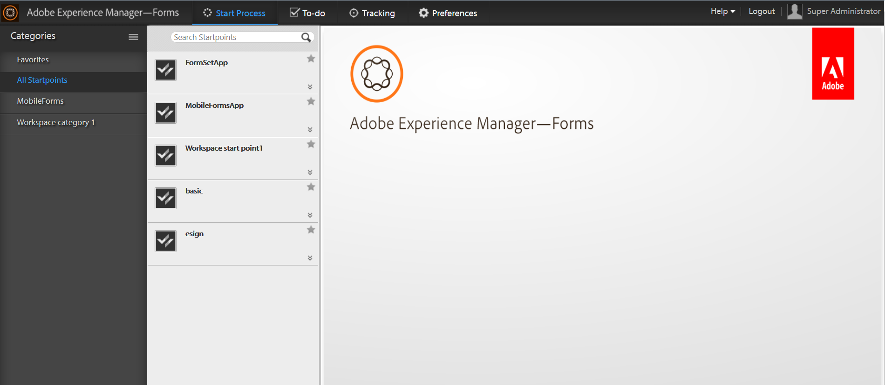

# Introduktion till AEM Forms arbetsyta {#introduction-to-aem-forms-workspace}

>[!CAUTION]
>
>AEM 6.4 har nått slutet på den utökade supporten och denna dokumentation är inte längre uppdaterad. Mer information finns i [teknisk supportperiod](https://helpx.adobe.com/support/programs/eol-matrix.html). Hitta de versioner som stöds [här](https://experienceleague.adobe.com/docs/).

Forms arbetsflöde ökar effektiviteten i organisationen genom att automatisera och ge insyn i viktiga dokument och blankettrelaterade affärsprocesser. Med Process Management-modulen kan du skapa effektiva kompletta arbetsflöden - inklusive människor, system, innehåll och affärsregler - som är tillgängliga online eller offline.Forms-arbetsflödet omfattar AEM Forms arbetsyta. AEM Forms arbetsyta innehåller nya funktioner för att utöka och integrera arbetsytan och göra den mer användarvänlig.

AEM Forms arbetsyta är kompatibel med fler enheter och formfaktorer. Det möjliggör uppgiftshantering för klienter utan Flash® Player och Adobe® Reader®. Det underlättar återgivning av HTML Forms utöver PDF forms.

**Viktiga funktioner**:

* Engagera processdeltagare överallt med dynamiskt PDF forms, mobilgränssnitt och webbapplikationer.
* Integrera enkelt arbetsytekomponenterna med dina webbprogram. Eftersom AEM Forms arbetsyta är ett komponentbaserat program kan det enkelt anpassas och återanvändas.
* Utvidga affärsprocesserna till mobila medarbetare både online och offline med AEM Forms arbetsyta.
* Visa rapporter för att övervaka eftersläpningar, arbetsköer och nyckeltal (KPI). Du kan använda API:er för att extrahera data för ytterligare analys med rapportverktyg från tredje part.
