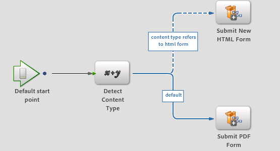

# Ny renderings- och skicka-tjänst {#new-render-and-submit-service}

>[!CAUTION]
>
>AEM 6.4 har nått slutet på den utökade supporten och denna dokumentation är inte längre uppdaterad. Mer information finns i [teknisk supportperiod](https://helpx.adobe.com/support/programs/eol-matrix.html). Hitta de versioner som stöds [här](https://experienceleague.adobe.com/docs/).

## Introduktion {#introduction}

När du definierar en `AssignTask` anger du ett visst formulär (XDP- eller PDF-formulär). Ange även en uppsättning renderings- och Skicka-tjänster via en åtgärdsprofil.

En XDP kan återges som ett PDF-formulär eller ett HTML-formulär. Bland de nya funktionerna finns möjligheten att:

* Återge och skicka ett XDP-formulär som HTML
* Rendera och skicka ett XDP-formulär som PDF på datorn och som HTML på mobila enheter (till exempel en iPad)

### Ny HTML Forms-tjänst {#new-html-forms-service}

Den nya tjänsten HTML Forms utnyttjar den nya funktionen i Forms för att stödja återgivning av XDP-formulär som HTML. Den nya tjänsten HTML Forms har följande metoder:

```java
/*
 * Generates a URL (for the HTML Form) to be passed to client, given a TaskContext. 
 * The output of this API is something like this - /lc/content/xfaforms/profiles/default.ws.html?ContentRoot=repository://Applications/MyApplication/MyFolder&template=MyForm.xdp
 * @param taskContext task context
 * @param profileName Forms servlet URL.
 * @return form URL string
 */
public String generateFormURL(TaskContext taskContext, String profileName);

/*
 * Render the XDP Form as HTML. Can be used directly for updating the runtimeMap in render.
 * It adds the following keys to the map - 
 * hint:new html form = true
 * newHTMLFormURL = the URL returned after calling 'generateFormURL' API.
 * @param TaskContext taskContext
 * @param profileName Forms servlet URL.
 * @param runtimeMap runtime map<string,object> associated with form rendering.
 * return runtimeMap
 */
public Map<String, Object> renderHTMLForm (TaskContext taskContext, String profileName, Map<String,Object> runtimeMap);
```

Mer information om profiler för mobilformulär finns på [Skapa en anpassad profil](/help/forms/using/custom-profile.md).

## Återgivning och skickning av nya formulär i HTML {#new-html-form-render-amp-submit-processes}

För varje AssignTask-åtgärd anger du en renderings- och en Submit-process med formuläret. Dessa processer anropas av TaskManager `renderForm`och `submitForm`API:er som tillåter anpassad hantering. Semantics of these processes for New HTML Form:

### Återge ett nytt HTML-formulär {#render-a-new-html-form}

Den nya processen att återge HTML har, precis som alla återgivningsprocesser, följande I/O-parametrar -

Indata - `taskContext`

Utdata - `runtimeMap`

Utdata - `outFormDoc`

Den här metoden simulerar det exakta beteendet för `renderHTMLForm` API för NewHTMLFormsService. Det anropar `generateFormURL` API för att hämta URL:en för HTML-återgivning av formuläret. Därefter fylls runtimeMap i med följande nyckel eller värden:

new html form = true

newHTMLFormURL = den URL som returneras efter anrop `generateFormURL` API.

### Skicka ett nytt HTML-formulär {#submit-a-new-html-form}

Den här processen för att skicka ett nytt HTML-formulär fungerar med följande I/O-parametrar -

Indata - `taskContext`

Utdata - `runtimeMap`

Utdata - `outputDocument`

Processen anger `outputDocument`till `inputDocument`hämtad från `taskContext`.

## Standardprocesser för återgivning och överföring samt åtgärdsprofiler {#default-render-or-submit-processes-and-action-profiles}

Med standardtjänsterna Återgivning och Skicka kan PDF återges på en stationär dator och HTML på mobila enheter (iPad).

### Standardåtergivningsformulär {#default-render-form}

Den här processen återger ett XDP-formulär på flera plattformar, sömlöst. Processen hämtar användaragenten från `taskContext`och använder data för att anropa processen för att återge antingen HTML eller PDF.


### Standardformulär för att skicka {#default-submit-form}

Den här processen skickar ett XDP-formulär sömlöst på flera plattformar. Den hämtar användaragenten från `taskContext`och använder data för att anropa processen för att skicka antingen HTML eller PDF.



## Byt återgivning av mobilformulär från PDF till HTML {#switch-the-rendering-of-mobile-forms-from-pdf-to-html}

Webbläsare drar gradvis tillbaka stödet för NPAPI-baserade plugin-program, inklusive plugin-program för Adobe Acrobat och Adobe Acrobat Reader. Du kan ändra återgivningen av mobilformulär från PDF till HTML genom att följa följande steg:

1. Logga in i Workbench som en giltig användare.
1. Välj **Fil** > **Hämta program**.

   Dialogrutan Hämta program visas.

1. Markera de program som du vill ändra återgivningen av mobilformulär för och klicka på **OK**.
1. Öppna den process som du vill ändra återgivningen för.
1. Öppna målstartpunkten/målaktiviteten, gå till avsnittet Presentation &amp; Data och klicka på **Hantera åtgärdsprofiler**.

   Dialogrutan Hantera åtgärdsprofiler visas.
1. Ändra standardåtergivningsprofilskonfigurationer från PDF till HTML och klicka på **OK**.
1. Checka in processen.
1. Upprepa stegen för att ändra återgivningen för andra processer.
1. Distribuera det program som är relevant för de processer du har ändrat.

### Standardåtgärdsprofil {#default-action-profile}

Standardåtgärdsprofilen återgav XDP-formuläret som PDF. Det här beteendet har nu ändrats så att standardåtergivningsformuläret och standardskickningsformuläret används.

Några vanliga frågor om åtgärdsprofiler är följande:

 **Vilka återgivnings-/sändningsprocesser kommer att vara tillgängliga direkt?**

* Återgivningsguide (stödlinjer är inaktuella)
* Återge formulärguide
* Rendera formuläret PDF
* Rendera formuläret HTML
* Formuläret Återge nytt HTML (nytt)
* Standardåtergivningsformulär (nytt)

Och likvärdiga sändningsprocesser.

 **Vilka åtgärdsprofiler kommer att vara tillgängliga direkt?**

För XDP Forms:

* Standard (återge/skicka med de nya standardprocesserna för återgivning/sändning)

 **Vad behöver processdesignern göra för att formuläret ska kunna återges i HTML på en enhet och i PDF på en dator?**

Ingenting. Standardåtgärdsprofilen väljs automatiskt och återgivningsläget hanteras automatiskt.

 **Vad behöver göras för att formuläret ska kunna återges i HTML på en dator?**

Användaren måste markera alternativknappen HTML för standardprofilen.

 **Kommer uppgraderingen att påverka hur standardåtgärdsprofilen fungerar?**

Ja, eftersom de tidigare återgivnings- och skicketjänsterna som är kopplade till standardåtgärdsprofilen var olika, behandlas dessa som en anpassning av befintliga formulär. Vid klickning **[!UICONTROL Restore Defaults]**, ställs standardtjänsterna för återgivning och sändning in i stället.

Om du har ändrat de befintliga Rendera- eller Submit PDF Form-tjänsterna eller skapat anpassade tjänster (till exempel custom1), och nu vill använda samma funktioner för HTML-rendering. Du måste replikera den nya renderings- eller skicka-tjänsten (till exempel custom2) och tillämpa liknande anpassningar på dessa. Nu kan du ändra åtgärdsprofilen för XDP-filen så att den börjar använda anpassade2-tjänster i stället för custom1 för rendering eller sändning.

Vad behöver processdesignern göra för att formuläret ska kunna återges i HTML på en enhet och i PDF på en dator?\
Vad behöver processdesignern göra för att formuläret ska kunna återges i HTML på en enhet och i PDF på en dator?
