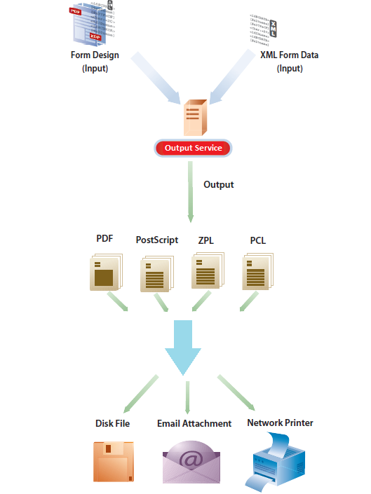

# Utdatatjänst {#output-service}

>[!CAUTION]
>
>AEM 6.4 har nått slutet på den utökade supporten och denna dokumentation är inte längre uppdaterad. Mer information finns i [teknisk supportperiod](https://helpx.adobe.com/support/programs/eol-matrix.html). Hitta de versioner som stöds [här](https://experienceleague.adobe.com/docs/).

## Översikt {#overview}

Utdatatjänsten är en OSGi-tjänst som ingår i AEM Document Services. Utdatatjänsten har stöd för olika utformat och utformningsfunktioner i AEM Forms Designer. Output Service kan konvertera XFA-mallar och XML-data för att generera utskriftsdokument i olika format.

Med Output Service kan du skapa program som gör att du kan:

* Generera slutliga formulärdokument genom att fylla i mallfiler med XML-data.
* Generera utdataformulär i olika format, inklusive icke-interaktiva PDF-, PostScript-, PCL- och ZPL-utskriftsströmmar.
* Generera PDF från XFA-PDF.
* Generera PDF-, PostScript-, PCL- och ZPL-dokument i grupp genom att sammanfoga flera datauppsättningar med medföljande mallar.

>[!NOTE]
>
>Utdatatjänsten är ett 32-bitarsprogram. I Microsoft Windows får 32-bitarsprogram använda maximalt 2 GB minne. Gränsen gäller även för utdatatjänsten.

## Skapa icke-interaktiva formulärdokument {#creating-non-interactive-form-documents}

Vanligtvis skapar du mallar med AEM Forms Designer. The `generatePDFOutput` och `generatePrintedOutput` Med API:er för Output-tjänsten kan du direkt konvertera dessa mallar till olika format, bland annat PDF, PostScript, ZPL och PCL.

The `generatePDFOutput` operationen genererar PDF, medan `generatePrintedOutput` genererar PostScript-, ZPL- och PCL-format. Den första parametern i båda åtgärderna godkänner antingen namnet på mallfilen (till exempel `ExpenseClaim.xdp`) eller ett Document-objekt som innehåller mallen. När du anger namnet på mallfilen anger du också innehållsroten som sökväg till mappen som innehåller mallen. Du kan ange innehållsroten med antingen `PDFOutputOptions` eller `PrintedOutputOptions` parameter. Se Javadoc för mer information om andra alternativ som du kan ange med dessa parametrar.

Den andra parametern accepterar ett XML-dokument som sammanfogas med mallen när utdatadokumentet genereras.

The `generatePDFOutput` kan också acceptera ett XFA-baserat PDF-formulär som indata och returnera en icke-interaktiv version av PDF som utdata.

## Generera icke-interaktiva formulärdokument {#generating-non-interactive-form-documents}

Tänk dig ett scenario där du har en eller flera mallar och flera poster med XML-data för varje mall.

Använd `generatePDFOutputBatch` och `generatePrintedOutputBatch` åtgärder i Output-tjänsten för att generera ett utskriftsdokument för varje post.

Du kan också kombinera posterna i ett enda dokument. Båda åtgärderna har fyra parametrar.

Den första parametern är en karta som innehåller en godtycklig sträng som nyckel och namnet på mallfilen som värde.

Den andra parametern är en annan karta vars värde är ett Document-objekt som innehåller XML-data. Nyckeln är densamma som den som du anger för den första parametern.

Den tredje parametern för `generatePDFOutputBatch` eller `generatePrintedOutputBatch` är av typen `PDFOutputOptions` eller `PrintedOutputOptions` respektive.

Parametertyperna är desamma som parametertyperna för `generatePDFOutput` och `generatePrintedOutput` och har samma effekt.

Den fjärde parametern är av typen `BatchOptions`som du använder för att ange om en separat fil kan genereras för varje post. Standardvärdet för den här parametern är false.

Båda `generatePrintedOutputBatch` och `generatePDFOutputBatch` returnera ett typvärde `BatchResult`. Värdet innehåller en lista med dokument som genererats. Den innehåller också ett metadatadokument i XML-format som innehåller information om varje dokument som genereras.
