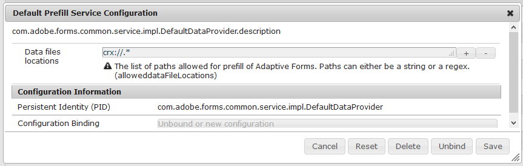

# Förifyll anpassningsbara formulärfält {#prefill-adaptive-form-fields}

>[!CAUTION]
>
>AEM 6.4 har nått slutet på den utökade supporten och denna dokumentation är inte längre uppdaterad. Mer information finns i [teknisk supportperiod](https://helpx.adobe.com/support/programs/eol-matrix.html). Hitta de versioner som stöds [här](https://experienceleague.adobe.com/docs/).

Använd befintliga data för att förifylla fält i ett anpassat formulär.

## Introduktion {#introduction}

Du kan förifylla fälten i ett anpassat formulär med befintliga data. När en användare öppnar ett formulär är värdena för dessa fält förifyllda. Om du vill förifylla data i ett anpassat formulär gör du användardata tillgängliga som förifylld XML/JSON i det format som följer datastrukturen för förifyllda formulär.

## Struktur för förifyllda data {#the-prefill-structure}

Ett anpassningsbart formulär kan ha en blandning av bundna och obundna fält. Bundna fält är fält som dras från fliken Innehållssökare och som inte är tomma `bindRef` egenskapsvärde i dialogrutan för fältredigering. Obundna fält dras direkt från komponentwebbläsaren i Sidespark och har en tom `bindRef` värde.

Du kan förifylla både bundna och obundna fält i ett anpassat formulär. Prefill-data innehåller avsnitten afBoundData och afUnBoundData för att förifylla både bundna och obundna fält i ett adaptivt formulär. The `afBoundData` -avsnittet innehåller förifyllda data för bundna fält och paneler. Dessa data måste vara kompatibla med det associerade formulärmodellschemat:

* För anpassningsbara formulär med [XFA-formulärmall](/help/forms/using/prepopulate-adaptive-form-fields.md)använder du den förifyllda XML-filen som är kompatibel med XFA-mallens dataschema.
* För anpassningsbara formulär som använder [XML-schema](#xml-schema-af)använder du den förifyllda XML-filen som är kompatibel med XML-schemastrukturen.
* För anpassningsbara formulär som använder [JSON-schema](/help/forms/using/prepopulate-adaptive-form-fields.md#json-schema-based-adaptive-forms)använder du JSON-prefyllnad som är kompatibel med JSON-schemat.
* För anpassningsbara formulär med FDM-schema använder du JSON-funktionen för förifyllnad som är kompatibel med FDM-schemat.
* För anpassningsbara formulär med [ingen formulärmodell](/help/forms/using/prepopulate-adaptive-form-fields.md#p-adaptive-form-with-no-form-model-p), finns det inga bundna data. Varje fält är ett obundet fält och är förifyllt med den obundna XML-koden.

### Exempel på XML-struktur för förifyllning {#sample-prefill-xml-structure}

```xml
<?xml version="1.0" encoding="UTF-8"?>
<afData>
  <afBoundData>
     <employeeData>
        .
     </employeeData>
  </afBoundData>

  <afUnboundData>
    <data>
      <textbox>Hello World</textbox>
         .
         .
      <numericbox>12</numericbox>
         . 
         .              
    </data>
  </afUnboundData>
</afData>
```

### Exempel på JSON-struktur för förifyllning {#sample-prefill-json-structure}

```
{
   "afBoundData": {
      "employeeData": { }
   },
   "afUnboundData": {
      "data": {
         "textbox": "Hello World",
         "numericbox": "12"
      }
   }
}
```

För bundna fält med samma bindref-fält eller obundna fält med samma namn fylls data som anges i XML-taggen eller JSON-objektet i alla fält. Två fält i ett formulär mappas till exempel till namnet `textbox` i förifyllda data. Om det första textrutefältet innehåller&quot;A&quot; fylls&quot;A&quot; automatiskt i den andra textrutan under körningen. Denna länkning kallas live-länkning av anpassningsbara formulärfält.

## Anpassat formulär med XFA-formulärmall {#xfa-based-af}

Strukturen för förifylld XML och inskickad XML för XFA-baserade adaptiva formulär är följande:

* **XML-struktur för förifyllning**: XML-förifyllnad för XFA-baserade adaptiva formulär måste vara kompatibelt med XFA-formulärmallens dataschema. Om du vill förifylla obundna fält omsluter du XML-strukturen för förifyllning i `/afData/afBoundData` -tagg.

* **Skickad XML-struktur**: När ingen förifylld XML används innehåller den skickade XML-filen data för både bundna och obundna fält i `afData` wrapper-tagg. Om du använder en XML-förifyllning har den skickade XML-filen samma struktur som XML-förifyllningen. Om XML-förifyllningen börjar med `afData` -taggen har XML-utdata också samma format. Om förifyllnings-XML inte har `afData/afBoundData`wrapper och i stället startar direkt från schemats rottagg som `employeeData`börjar den inskickade XML-filen också med `employeeData` -tagg.

Prefill-Submit-Data-ContentPackage.zip

[Hämta fil](assets/prefill-submit-data-contentpackage.zip)
Exempel som innehåller förifyllda data och inlämnade data

## XML-schemabaserade adaptiva formulär  {#xml-schema-af}

Strukturen för förifylld XML och inskickad XML för adaptiva formulär baserade på XML-schema är följande:

* **XML-struktur för förifyllning**: XML-förifyllningen måste vara kompatibel med tillhörande XML-schema. Om du vill förifylla obundna fält omsluter du XML-strukturen för förifyllning i taggen /afData/afBoundData.
* **Skickad XML-struktur**: om ingen förifylld XML används innehåller den skickade XML-filen data för både bundna och obundna fält i `afData` wrapper-tagg. Om XML-förifyllning används har den skickade XML-filen samma struktur som XML-förifyllningen. Om XML-förifyllningen börjar med `afData` -taggen har XML-utdata samma format. Om förifyllnings-XML inte har `afData/afBoundData` wrapper och i stället börja direkt från schemats rottagg som `employeeData`börjar den inskickade XML-filen också med `employeeData` -tagg.

```xml
<?xml version="1.0" encoding="utf-8" ?> 
<xs:schema targetNamespace="https://adobe.com/sample.xsd"
            xmlns="https://adobe.com/sample.xsd"
            xmlns:xs="https://www.w3.org/2001/XMLSchema">
 
    <xs:element name="sample" type="SampleType"/>
         
    <xs:complexType name="SampleType">
        <xs:sequence>
            <xs:element name="noOfProjectsAssigned" type="xs:string"/>
        </xs:sequence>
    </xs:complexType>
</xs:schema>
```

För fält vars modell är XML-schema är data förifyllda i `afBoundData` -taggen som i XML-exemplet nedan. Den kan användas för att förifylla ett anpassningsbara formulär med ett eller flera obundna textfält.

```xml
<?xml version="1.0" encoding="UTF-8"?><afData>
  <afUnboundData>
    <data>
      <textbox>Ignorance is bliss :) </textbox>
    </data>
  </afUnboundData>
  <afBoundData>
    <data>
      <noOfProjectsAssigned>twelve</noOfProjectsAssigned>
    </data>
  </afBoundData>
</afData>
```

>[!NOTE]
>
>Vi rekommenderar att du inte använder obundna fält i bundna paneler (paneler med icke-tomma paneler) `bindRef` som har skapats genom att dra komponenter från fliken SideKlick eller Datakällor). Det kan orsaka dataförlust för dessa obundna fält. Vi rekommenderar dessutom att fältnamnen är unika i hela formuläret, särskilt för obundna fält.

### Ett exempel utan afData och afBoundData-wrapper {#an-example-without-afdata-and-afbounddata-wrapper}

```xml
<?xml version="1.0" encoding="UTF-8"?><config>
 <assignmentDetails descriptionOfAssignment="Some Science Project" durationOfAssignment="34" financeRelatedProject="1" name="Lisa" numberOfMentees="1"/>
 <assignmentDetails descriptionOfAssignment="Kidding, right?" durationOfAssignment="4" financeRelatedProject="1" name="House" numberOfMentees="3"/>
</config>
```

## JSON schemabaserade adaptiva formulär {#json-schema-based-adaptive-forms}

För adaptiva formulär baserade på JSON-schema beskrivs strukturen för JSON-förifyllnad och skickad JSON nedan. Mer information finns i [Skapa anpassningsbara formulär med JSON-schema](/help/forms/using/adaptive-form-json-schema-form-model.md).

* **JSON-struktur för förifyllning**: JSON för förifyllning måste vara kompatibel med det associerade JSON-schemat. Alternativt kan den kapslas in i /afData/afBoundData-objektet om du även vill förifylla obundna fält.
* **Skickad JSON-struktur**: Om ingen JSON för förifyllnad används innehåller den skickade JSON data för både bundna och obundna fält i afData-wrapper-taggen. Om JSON för förifyllning används har den inskickade JSON samma struktur som JSON för förifyllnad. Om JSON för förifyllning börjar med afData-rotobjektet har utdata-JSON samma format. Om JSON-funktionen för förifyllning inte har wrapper afData/afBoundData och i stället startar direkt från schemarotobjektet, till exempel användaren, börjar den skickade JSON-filen också med användarobjektet.

```
{
    "id": "https://some.site.somewhere/entry-schema#",
    "$schema": "https://json-schema.org/draft-04/schema#",
    "type": "object",
    "properties": {
        "address": {
            "type": "object",
            "properties": { 
    "name": {
     "type": "string"
    },
    "age": {
     "type": "integer"
}}}}}
```

För fält som använder JSON-schemamodell är data förifyllda i afBoundData-objektet, vilket visas i exemplet på JSON nedan. Den kan användas för att förifylla ett anpassningsbara formulär med ett eller flera obundna textfält. Nedan visas ett exempel på data med `afData/afBoundData` wrapper:

```
{
  "afData": {
    "afUnboundData": {
      "data": { "textbox": "Ignorance is bliss :) " }
    },
    "afBoundData": {
      "data": { {
   "user": {
    "address": {
     "city": "Noida",
     "country": "India"
}}}}}}}
```

Nedan visas ett exempel utan `afData/afBoundData` wrapper:

```
{
 "user": {
  "address": {
   "city": "Noida",
   "country": "India"
}}}
```

>[!NOTE]
>
>Använda obundna fält i bundna paneler (paneler med icke-tomma bindRef som har skapats genom att dra komponenter från fliken Sidspark eller Datakällor) **not** rekommenderas eftersom det kan orsaka dataförlust i obundna fält. Du bör ha unika fältnamn i hela formuläret, särskilt för obundna fält.

## Adaptiv form utan formulärmodell {#adaptive-form-with-no-form-model}

För adaptiva formulär utan formulärmodell finns data för alla fält under `<data>` tagg för `<afUnboundData> tag`.

Observera även följande:

XML-taggarna för användardata som skickas för olika fält genereras med fältnamnet. Därför måste fältnamnen vara unika.

```xml
<?xml version="1.0" encoding="UTF-8"?><afData>
  <afUnboundData>
    <data>
      <radiobutton>2</radiobutton>
      <repeatable_panel_no_form_model>
        <numericbox>12</numericbox>
      </repeatable_panel_no_form_model>
      <repeatable_panel_no_form_model>
        <numericbox>21</numericbox>
      </repeatable_panel_no_form_model>
      <checkbox>2</checkbox>
      <textbox>Nopes</textbox>
    </data>
  </afUnboundData>
  <afBoundData/>
</afData>
```

## Konfigurera förifyllningstjänsten med Configuration Manager {#configuring-prefill-service-using-configuration-manager}

Om du vill aktivera förifyllningstjänsten anger du standardkonfigurationen för förifyllningstjänsten i AEM webbkonsolkonfiguration. Gör så här för att konfigurera förifyllningstjänsten:

>[!NOTE]
>
>Konfiguration av förifyllningstjänsten kan användas för adaptiva formulär, HTML5-formulär och HTML5-formuläruppsättningar.

1. Öppna **[!UICONTROL Adobe Experience Manager Web Console Configuration]** genom att använda URL:\
   https://&lt;server>:&lt;port>/system/console/configMgr
1. Söka och öppna **[!UICONTROL Default Prefill Service Configuration]**.

   

1. Ange dataplatsen eller en region (reguljärt uttryck) för **[!UICONTROL Data files locations]**. Exempel på giltiga platser för datafiler är:

   * file:///C:/Users/public/Document/Prefill/.&amp;ast;
   * http://localhost:8000/somesamplexmlfile.xml

   >[!NOTE]
   >
   >Som standard är förifyllning tillåtet via crx-filer för alla typer av adaptiva Forms (XSD, XDP, JSON, FDM och utan formulärmodellbaserad). Förifyll tillåts bara med JSON- och XML-filer.

1. Förifyllningstjänsten har nu konfigurerats för ditt formulär.

   >[!NOTE]
   >
   >CRX-protokollet hanterar förfylld datasäkerhet och är därför tillåtet som standard. Förifyllnad via andra protokoll med generisk regex kan orsaka sårbarhet. I konfigurationen anger du en säker URL-konfiguration för att skydda dina data.

## Det nyfikna fallet med repeterbara paneler {#the-curious-case-of-repeatable-panels}

Vanligtvis skapas bundna (formulärschema) och obundna fält i samma adaptiva form, men följande undantag görs om bindningen är repeterbar:

* Obundna upprepningsbara paneler stöds inte för adaptiva formulär med XFA-formulärmallen, XSD-, JSON-schemat eller FDM-schemat.
* Använd inte obundna fält i bundna repeterbara paneler.

>[!NOTE]
>
>Som tumregel ska du inte blanda bundna och obundna fält om de korsas i data som fylls i av slutanvändaren i obundna fält. Om det är möjligt bör du ändra schemat eller XFA-formulärmallen och lägga till en post för obundna fält, så att den också blir bunden och dess data är tillgängliga som andra fält i skickade data.

## Protokoll som stöds för förifyllning av användardata {#supported-protocols-for-prefilling-user-data}

Anpassningsbara formulär kan förifyllas med användardata i förifyllda dataformat via följande protokoll när de konfigureras med giltig regex:

### crx:// {#the-crx-protocol}

```xml
http://localhost:4502/content/forms/af/xml.html?wcmmode=disabled&dataRef=crx:///tmp/fd/af/myassets/sample.xml
```

Den angivna noden måste ha en egenskap som kallas `jcr:data` och lagra data.

### file://  {#the-file-protocol-nbsp}

```xml
http://localhost:4502/content/forms/af/someAF.html?wcmmode=disabled&dataRef=file:///C:/Users/form-user/Downloads/somesamplexml.xml
```

Den refererade filen måste finnas på samma server.

### https:// {#the-http-protocol}

```xml
http://localhost:4502/content/forms/af/xml.html?wcmmode=disabled&dataRef=http://localhost:8000/somesamplexmlfile.xml
```

### service:// {#the-service-protocol}

```xml
http://localhost:4502/content/forms/af/abc.html?wcmmode=disabled&dataRef=service://[SERVICE_NAME]/[IDENTIFIER]
```

* SERVICE_NAME refererar till namnet på OSGI-förifyllningstjänsten. Referens [Skapa och köra en förifyllningstjänst](/help/forms/using/prepopulate-adaptive-form-fields.md#create-and-run-a-prefill-service).
* IDENTIFIER avser alla metadata som krävs av OSGI-förifyllningstjänsten för att hämta förifyllda data. En identifierare för den inloggade användaren är ett exempel på metadata som kan användas.

>[!NOTE]
>
>Det går inte att skicka autentiseringsparametrar.

### Ställer in dataattribut i slingRequest {#setting-data-attribute-in-slingrequest}

Du kan också ange `data` attribute in `slingRequest`, där `data` -attribut är en sträng som innehåller XML eller JSON, vilket visas i exempelkoden nedan (Exempel är för XML):

```java
<%
           String dataXML="<afData>" +
                            "<afUnboundData>" +
                                "<data>" +
                                    "<first_name>"+ "Tyler" + "</first_name>" +
                                    "<last_name>"+ "Durden " + "</last_name>" +
                                    "<gender>"+ "Male" + "</gender>" +
                                    "<location>"+ "Texas" + "</location>" +
                                    "</data>" +
                            "</afUnboundData>" +
                        "</afData>";
        slingRequest.setAttribute("data", dataXML);
%>
```

Du kan skriva en enkel XML- eller JSON-sträng som innehåller alla data och ange den i slingRequest. Detta kan enkelt göras i JSP för återgivning för alla komponenter som du vill inkludera på sidan där du kan ange dataattributet slingRequest.

Om du till exempel vill ha en särskild design för sidan med en viss typ av sidhuvud. För att uppnå detta kan du skriva en egen `header.jsp`som du kan ta med i sidkomponenten och ange `data` -attribut.

Ett annat bra exempel är ett användningsexempel där du vill förifylla data vid inloggning via sociala konton som Facebook, Twitter eller LinkedIn. I det här fallet kan du inkludera en enkel JSP i `header.jsp`, som hämtar data från användarkontot och ställer in data-parametern.

prefill-page component.zip

[Hämta fil](assets/prefill-page-component.zip)
Exempel på prefill.jsp i sidkomponent

## Anpassad förifyllningstjänst för AEM Forms {#aem-forms-custom-prefill-service}

Du kan använda en anpassad förifyllningstjänst för scenarierna, där du hela tiden läser data från en fördefinierad källa. Förifyllningstjänsten läser data från definierade datakällor och fyller i fälten i det adaptiva formuläret med innehållet i datafilen för förifyllnad. Det hjälper dig även att permanent koppla förfyllda data till ett anpassat formulär.

### Skapa och köra en förifyllningstjänst {#create-and-run-a-prefill-service}

Förifyllningstjänsten är en OSGi-tjänst och paketeras via OSGi-paketet. Du skapar OSGi-paketet, överför det och installerar det i AEM Forms-paket. Innan du börjar skapa paketet:

* [Ladda ned AEM Forms Client SDK](https://helpx.adobe.com/aem-forms/kb/aem-forms-releases.html)
* [Hämta mallpaketet](assets/prefill-sumbit-xmlsandcontentpackage.zip)

* Placera datafilen (förifyllda data) i crx-databasen. Du kan placera filen på valfri plats i mappen \contents i crx-database.

#### Skapa en förifyllningstjänst {#create-a-prefill-service}

Mallpaketet (exempelpaketet för förifyllningstjänsten) innehåller exempelimplementering av AEM Forms förifyllningstjänst. Öppna mallpaketet i en kodredigerare. Öppna till exempel mallprojektet i Eclipse för redigering. När du har öppnat mallpaketet i en kodredigerare gör du följande för att skapa tjänsten.

1. Öppna src\main\java\com\adobe\test\Prefill.java för redigering.
1. I koden anger du värdet:

   * `nodePath:` Nodsökvägsvariabeln som pekar på platsen för crx-databasen innehåller sökvägen till datafilen (prefill). Till exempel /content/prefilldata.xml
   * `label:` Etikettparametern anger tjänstens visningsnamn. Exempel: Standardtjänst för förifyllnad

1. Spara och stäng `Prefill.java` -fil.
1. Lägg till `AEM Forms Client SDK` till byggsökvägen för standardprojektet.
1. Kompilera projektet och skapa .jar-filen för paketet.

#### Starta och använda förifyllningstjänsten {#start-and-use-the-prefill-service}

Starta förifyllningstjänsten genom att överföra JAR-filen till AEM Forms Web Console och aktivera tjänsten. Nu börjar tjänsten visas i en anpassad formulärredigerare. Så här associerar du en förifyllningstjänst till ett anpassat formulär:

1. Öppna det adaptiva formuläret i Forms Editor och öppna egenskapspanelen för formulärbehållaren.
1. Gå till egenskapskonsolen **[!UICONTROL AEM Forms container > Basic > Prefill Service]**.
1. Välj standardtjänsten för förifyllnad och klicka på **[!UICONTROL Save]**. Tjänsten är kopplad till formuläret.
