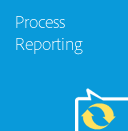

# Introduktion till processrapportering {#introduction-to-process-reporting}

Process Reporting är ett webbläsarbaserat verktyg som du använder för att skapa och visa rapporter om AEM Forms-processer och -uppgifter.

Processrapportering innehåller en uppsättning användningsklara rapporter som gör att du kan filtrera, visa information om långvariga processer, processers varaktighet och arbetsflödesvolym.

Ytterligare processrapportering är ett gränssnitt för att köra ad hoc-frågor och integrera anpassade rapportvyer i användargränssnittet för processrapportering.

En lista över webbläsare som stöds finns i [AEM Forms Supported Platforms](/help/forms/using/aem-forms-jee-supported-platforms.md).

Processrapportering bygger på moduler som:

* Läs processdata från AEM Forms-databasen
* Publicera processdata till en inbäddad Process Reporting-databas
* Tillhandahåller ett webbläsarbaserat användargränssnitt för att visa rapporter

## Nyckelfunktioner {#key-capabilities}

### Alltid aktiverad rapportering {#always-on-reporting}

Visa listan över långvariga processer, processens tidsplaneringsdiagram och kör anpassade frågor med filter.

Med Process Reporting kan du också exportera rapport- och frågedata i CSV-format.

### Ad hoc-rapporter {#adhoc-reports}

Använd filter för att få en specifik vy över dina data.

Du kan söka efter processer eller uppgifter efter ID, varaktighet, start- och slutdatum, processinitierare osv.

Du kan kombinera flera filter för att skapa specifika rapporter.

Du kan sedan spara rapportfiltren så att de kan köras vid ett senare datum eller en senare tidpunkt.

### Process-/aktivitetshistorik {#process-task-history}

AEM Forms-servrar kör flera processer parallellt. Dessa processer fortsätter att gå från ett läge till ett annat. Genom att publicera Forms-data till Process Reporting-databasen med regelbundna intervall, bevarar Process Reporting övergångsinformationen om de processer som körs i AEM Forms.

### Åtkomstkontroll {#access-control-br}

Processrapportering ger behörighetsbaserad åtkomst till användargränssnittet.

Det innebär att bara användare med rapportbehörigheter har åtkomst till användargränssnittet för processrapportering.

