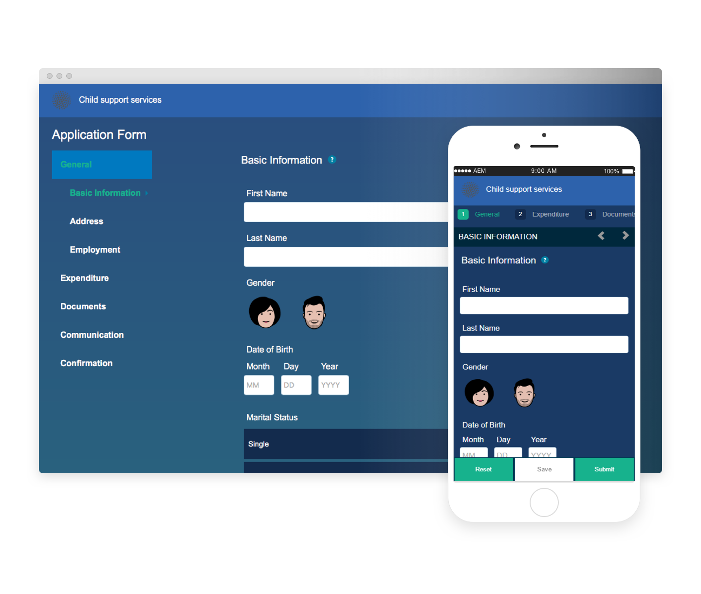

# Referensteman {#reference-themes}

[Med teman](/help/forms/using/themes.md) kan du formatera formulär utan djupa kunskaper om CSS. Förutom standardtemat kan du hämta följande teman genom att installera paketet [AEM-FORMS-6.3-REFERENCE-THEMES](https://www.adobeaemcloud.com/content/marketplace/marketplaceProxy.html?packagePath=/content/companies/public/adobe/packages/cq630/fd/AEM-FORMS-6.3-REFERENCE-THEMES) :

* Beryl
* Kör
* Exec-Light
* Frihet
* Ultramarin
* Urbane
* U.S. Web Design Standards
* Tranquil

Varje tema innehåller en unik och elegant stil som du kan använda för att skapa snygga, anpassningsbara formulär för användarna. Den innehåller en unik formatering för väljare som panel, textruta, numerisk ruta, alternativknapp, tabell och switch. Stilar i dessa teman baseras på krav. I ett visst scenario behöver du till exempel ett minimalistiskt tema med rena teckensnitt. Med Frihetstemat kan du få den där looken.

Teman som ingår i det här paketet är responsiva, och stilen i dessa teman definieras för mobila och stationära skärmar. De flesta moderna webbläsare på en mängd olika enheter kan återge formulär som används med något av dessa teman utan krångel.

Mer information om hur du installerar paketet finns i [Arbeta med paket](/help/sites-administering/package-manager.md).

## Beryl {#beryl}

Beryl-temat används av [We.Gov adaptive form](/help/forms/using/gov-reference-site-walkthrough.md)och betonar användningen av bakgrundsbilder, genomskinlighet och stora, platta ikoner. På skärmbilden nedan ser du hur Beryl-temat ser ut och hur det kan förbättra formateringen av ditt formulär.
[Klicka för att förstora](assets/beryl-1.png)

## Kör {#exec}

Exec-temat undviker heltäckande bakgrundsfyllningar för att framhäva formulärkomponenter. Om du markerar och klickar på komponenter ändras teckenfärgerna. Jämfört med standardtemat för arbetsytan ändras teckenfärgen för texten på den valda fliken till mörkblå. Lägg märke till hur navigerings- och skickaknapparna skiljer sig från Beryl-temat.

[Klicka för att förstora](assets/exec-1.png)

## Exec Light {#exec-light}

Exec Light-temat använder tomrum för att skapa en sömlös upplevelse. Knapparna Nästa och Skicka ger en heltäckande fyllning och 3D-skugga. De markerade flikarna till vänster får en pil i stället för dubbelbockmarkeringar.

[Klicka för att förstora](assets/exec-light-1.png)

## Frihet {#liberty}

Frihetstemat använder en minimalistisk strategi för att lyfta fram det viktiga. Teckensnittsfärgen på den besökta fliken ändras till exempel till grön. Du kan bara se textrutans nedre kontur, som emulerar utseendet på ett pappersbaserat formulär med linjer. Den aktiva textrutan har en svart underkant kontur medan andra får ljusgrå underkontur.

[Klicka för att förstora](assets/liberty-1.png)

## Tranquil {#tranquil}

Med det tillfälliga temat får du ljusa och mörka nyanser av det Tranquil-färgschemat för att framhäva olika komponenter i ett formulär. Alternativknappar, paneler och flikar får till exempel en annan grön ton.

[Klicka för att förstora](assets/tranquil-1.png)

## Ultramarin {#ultramarine}

Ultramarintemat använder djupa blå skuggor för att framhäva komponenter som tabbar, paneler, textrutor och knappar.

## Urbane {#urbane}

Urbane-temat betonar ett minimalistiskt och funktionellt utseende på ditt formulär. När du använder Urbane-temat i ditt formulär ser du att komponenterna är platta. Panelerna får tunna konturer för att skapa ett modernt utseende.

[Klicka för att förstora](assets/urbane-1.png)

## U.S. Web Design Standards {#u-s-web-design-standards}

I temat U.S. Web Design Standards, som namnet antyder, används teckensnitt och format som beskrivs på webbplatsen Draft U.S. Web Design Standards. Webbstandarden används av federala organisationer för att skapa enhetliga webbupplevelser på statliga webbplatser.

[Klicka för att förstora](assets/usgov.png)