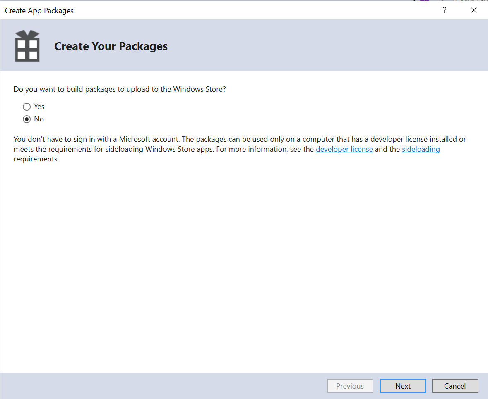

# Konfigurera Visual Studio-projektet och bygg Windows-appen {#set-up-the-visual-studio-project-and-build-the-windows-app}

AEM Forms tillhandahåller den fullständiga källkoden för AEM Forms-appen. Källan innehåller alla komponenter för att skapa ett anpassat arbetsyteprogram. Källkodsarkivet `adobe-lc-mobileworkspace-src-<version>.zip`ingår i `adobe-aemfd-forms-app-src-pkg-<version>.zip` paketet om programvarudistribution.

Så här hämtar du programkällan för AEM Forms:

1. Öppna [programvarudistribution](https://experience.adobe.com/downloads). Du behöver en Adobe ID för att logga in på Software Distribution.
1. Tryck **[!UICONTROL Adobe Experience Manager]** på rubrikmenyn.
1. I **[!UICONTROL Filters]** avsnittet:
   1. Välj **[!UICONTROL Forms]** i **[!UICONTROL Solution]** listrutan.
   2. Välj version och typ för paketet. Du kan också använda alternativet **[!UICONTROL Search Downloads]** för att filtrera resultaten.
1. Tryck på det paketnamn som gäller för ditt operativsystem, markera **[!UICONTROL Accept EULA Terms]** och tryck **[!UICONTROL Download]**.
1. Öppna [Pakethanteraren](https://docs.adobe.com/content/help/en/experience-manager-65/administering/contentmanagement/package-manager.html) och klicka **[!UICONTROL Upload Package]** för att överföra paketet.
1. Markera paketet och klicka på **[!UICONTROL Install]**.

1. Om du vill hämta källkodsarkivet öppnar du `https://<server>:<port>/crx/de/content/forms/mobileapps/src/adobe-lc-mobileworkspace-src-<version>.zip` i webbläsaren.

   Källpaketet hämtas till din enhet.

I följande bild visas det extraherade innehållet i `adobe-lc-mobileworkspace-src-<version>.zip`.

Följande bild visar katalogstrukturen för `windows` mappen i `src` mappen.

## Konfigurera miljön {#setting-up-the-environment}

För Windows-enheter behöver du:

* Microsoft Windows 8.1 eller Windows 10
* Microsoft Visual Studio 2015
* Microsoft Visual Studio Tools for Apache Cordova

## Konfigurera Visual Studio Project för AEM Forms {#setting-up-visual-studio-project-for-aem-forms-app}

Utför följande steg för att konfigurera AEM Forms-appprojektet i Visual Studio.

1. Kopiera `adobe-lc-mobileworkspace-src-<version>.zip` arkivet till `%HOMEPATH%\Projects` mappen i Windows 8.1- eller Windows 10-enheten med Visual Studio 2015 installerat och konfigurerat.
1. Extrahera arkivet i `%HOMEPATH%\Projects\MobileWorkspace` katalogen.
1. Navigate to the `%HOMEPATH%\Projects\MobileWorkspace\adobe-lc-mobileworkspace-src-[versionsrc]\windows` directory.
1. Öppna `CordovaApp.sln` filen med Visual Studio 2015 och fortsätt med att skapa AEM Forms-appen.

## Bygg AEM Forms-app {#build-aem-forms-app}

Utför följande steg för att skapa och distribuera AEM Forms-program.

>[!NOTE]
>
>Data som lagras i Windows-filsystem för AEM Forms-program krypteras inte. Vi rekommenderar att du använder ett tredjepartsverktyg som Windows BitLocker-diskkryptering för att kryptera diskdata.

1. I verktygsfältet Visual Studio Standard väljer du **Frigör** i listrutan för byggläge.

1. Välj Windows-AnyCPU, Windows-x64 eller Windows-x86 baserat på din plattform. Windows-AnyCPU rekommenderas.
1. I Visual Studio Solution Explorer högerklickar du på projektet **CordovaApp.Windows** och väljer **Store > Create AppPackages**.

   

   Guiden Skapa programpaket visas.

   Installationsfilen för CordovaApp.Windows_3.0.2.0_anycpu.appx skapas i katalogen platforms\windows\AppPackages\CordovaApp.Windows_3.0.2.0_anycpu_Test.

   Om du råkar ut för felet `Retarget to windows 8.1 required`högerklickar du på det och väljer **Återmål till Windows 8.1** på snabbmenyn.

   

1. I guiden Skapa appaket väljer du väder eller inte det väder som du vill överföra din app till Windows Store och klickar sedan på **Nästa**.

   

1. Gör önskade ändringar i parametrarna, till exempel version och utdataplats för appbygget.

   

1. När projektet har byggts kan du installera programmet med:

   * Windows PowerShell
   * Visual Studio

   Följande objekt krävs för att installationen ska lyckas: `.appx`

   1. WinJS-bibliotek
   1. Kontrollera att paketet innehåller ett självsignerat certifikat eller ett betrott certifikat som signerats av en utfärdare, till exempel VeriSign.
   1. Utvecklarlicens

   Katalogen Platforms\windows\AppPackages\CordovaApp.Windows_3.0.2.0_anycpu_Test innehåller de fyra huvudkomponenterna:

   1. `.appx` fil
   1. Certifikat (för närvarande är det ett självsignerat certifikat av Apache Cordova)
   1. Beroendemapp
   1. PowerShell-fil (.ps1-tillägg)

## Distribuera ett program med Windows PowerShell {#deploying-an-app-using-windows-powershell}

Det finns två sätt att installera programmet på en Windows-enhet.

### Genom att köpa utvecklarlicensen {#by-acquiring-the-developer-license}

1. Högerklicka på PowerShell-filen ( `Add-AppDevPackage.ps1)`och välj **Kör med PowerShell**.

1. Du uppmanas att skaffa en utvecklarlicens. Använd autentiseringsuppgifter för Microsoft-konto för att hämta utvecklarlicensen.

   Licensen gäller i 30 dagar och du kan förnya den utan kostnad.

1. När du köper utvecklarlicensen installeras det självsignerade certifikatet på datorn och programmet installeras korrekt.

### Genom att använda företagsägda enheter {#by-using-enterprise-owned-devices}

För företagsägda enheter som är anslutna till företagets domän krävs inte att man skaffar en utvecklarlicens.

Företagsägda enheter använder Professional- och Enterprise-utgåvorna av Windows.

Microsoft rekommenderar att du installerar ett betrott certifikat som utfärdats av en utfärdare, till exempel VeriSign.

Så här distribuerar du programmet:

* Kontrollera att enheten är ansluten till företagets domän.
* Aktivera grupprincipinställning.

**Så här aktiverar du grupprincipinställning:**

1. Kör i enheten `gpedit.msc`.
1. Navigera till **Datorkonfiguration > Administrativa mallar > Windows-komponent > App Package Deployment**.
1. Högerklicka på **Tillåt att alla betrodda appar installeras**.
1. Klicka på **Redigera** och välj **Aktiverad**.

1. Click **OK**.

Redigera det Visual Studio-genererade PowerShell-skriptet för att hindra det från att hämta utvecklarlicensen.

Ange variabeln i PowerShell-skriptet: `$NeedDeveloperLicense = $false`.

För enheter som inte är domänanslutna krävs en produktaktiveringsnyckel som laddas sida vid sida. Du kan köpa det från en Windows-återförsäljare.

För Windows 8.1 Home Edition finns det ingen grupprincip, inläsning på företagssidan tillåts inte och du kan inte ansluta den till företagsdomänen. Distribuera appen på en Windows 8.1 Home Edition-enhet med hjälp av en utvecklarlicens.

Klicka [här](https://blogs.msdn.com/b/mvpawardprogram/archive/2014/03/24/side-loading-deployment-of-windows-store-apps-in-enterprises-step-by-step.aspx)om du vill ha mer information.

## Distribuera ett program med Visual Studio {#deploying-an-app-using-visual-studio}

Så här installerar du appen i Windows med Visual Studio:

1. Anslut enheten med fjärrfelsökaren.

   Mer information finns i [Kör Windows Store-appar på en fjärrdator](https://docs.microsoft.com/en-us/visualstudio/debugger/run-windows-store-apps-on-a-remote-machine).

1. Med appen öppen i Visual Studio väljer du Windows-x64, Windows-x86 eller Windows-AnyCPU i listan Solution Platforms och väljer **Remote Machine**.
1. Ditt program distribueras på fjärrdatorn.

