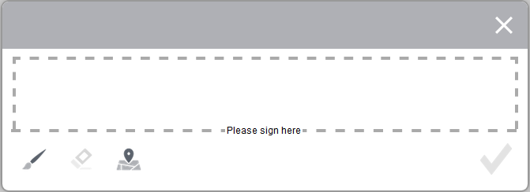

# Använda elektroniska signaturer i ett formulär med hjälp av klottersignaturer {#apply-electronic-signatures-to-a-form-using-scribble-signatures}

>[!CAUTION]
>
>AEM 6.4 har nått slutet på den utökade supporten och denna dokumentation är inte längre uppdaterad. Mer information finns i [teknisk supportperiod](https://helpx.adobe.com/support/programs/eol-matrix.html). Hitta de versioner som stöds [här](https://experienceleague.adobe.com/docs/).

Du kan använda **Klottersignatur** komponenter och **Signatursteg** -komponent för att rita (Klottra) signatur i ett anpassat formulär. Underskriftsstegkomponenten visar en PDF-version av det adaptiva formuläret. Du måste aktivera alternativet Dokument för post eller formulärmallsbaserade adaptiva formulär för att kunna använda signaturstegskomponenten.

Båda komponenterna har ett fönster som visas nedan för att signera ett formulär. Du kan också klicka på ikonen för geopositionering  för att lägga till geopositionering till signaturen.

## Konfigurera ett anpassningsbart formulär att använda en skriptsignatur {#configure-an-adaptive-form-to-use-scribble-signature}

1. Alternativet Skapa ett postdokument aktiverat eller ett anpassat formulär som bygger på en formulärmall. Stegvisa instruktioner finns i [Skapa ett anpassat formulär](/help/forms/using/creating-adaptive-form.md).
1. Dra och släpp **Klottersignatur** från komponentwebbläsaren till det adaptiva formuläret.
1. Tryck på **Konfigurera**  ikon. Egenskaper öppnas i webbläsaren och egenskaper för komponenten Skriptsignatur visas. Konfigurera egenskaper för komponenten Scribble Signature.
1. Dra och släpp signaturstegskomponenten från komponentwebbläsaren till det anpassningsbara formuläret.

   >[!NOTE]
   >
   >Komponenten Signatursteg får full bredd som är tillgänglig för formuläret. Vi rekommenderar att du inte har någon annan komponent i avsnittet som innehåller komponenten Signatursteg.

1. Tryck på **Formulärbehållare** och trycker på **Konfigurera**  ikon. Egenskaper öppnas i webbläsaren och egenskaper för behållare för adaptiva formulär visas. Navigera till **Adaptiv formulärbehållare** > **Elektronisk signatur** och avmarkera **Aktivera Acrobat Sign** alternativ. Tryck på Klar  om du vill spara ändringarna.

   >[!NOTE]
   >
   >När du lägger till en komponent för signatursteg i ett anpassat formulär markeras alternativet Aktivera Acrobat Sign automatiskt.

1. Tryck på **Konfigurera**  ikon. Egenskaper öppnas i webbläsaren och egenskaper för signatursteg visas. Konfigurera följande egenskaper:

   * **Elementnamn**: Ange komponentens namn.
   * **Titel:** Ange komponentens unika namn.
   * **Mallmeddelande:** Ange meddelandet som ska visas medan signaturen PDF läses in. Acrobat Sign tjänster tar lite tid att förbereda och läsa in signaturen PDF.
   * **Underteckningstjänst:** Välj **Klottersignatur** alternativ.
   * **CSS-klass**: Ange CSS-klass för klientbiblioteket, om det finns någon. Det rekommenderas att använda [teman](/help/forms/using/themes.md) och [infogade format](/help/forms/using/inline-style-adaptive-forms.md) i stället för CSS-klassen.

   Tryck på Klar  om du vill spara ändringarna. Signaturen har konfigurerats.

   När du fyller i ett formulär visas nu en PDF-version av ett anpassat formulär och alternativ för att signera PDF-dokumentet finns. Mer information finns i [Signera ett anpassat formulär med Scribble Signature](/help/forms/using/signing-forms-using-scribble.md#p-sign-an-adaptive-form-using-scribble-signature-p).

## Signera ett anpassat formulär med Scribble Signature {#sign-an-adaptive-form-using-scribble-signature}

1. När du har fyllt i ett anpassat formulär och kommit till sidan Signatursteg visas signaturskärmen.

   

1. Klicka på **[!UICONTROL Sign]**. Dialogrutan för klottersignering visas. Signera formuläret och klicka på Klar  -ikonen för att spara signaturen.

   

1. Klicka på Slutför för att slutföra signeringsprocessen.

   

Signaturerna läggs till i formuläret och formulärkontrollen flyttas till nästa panel.
