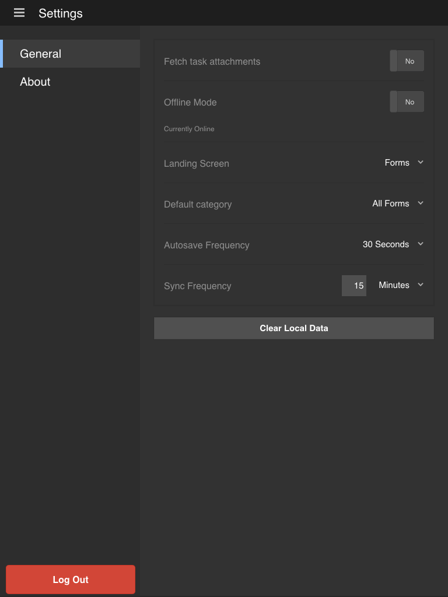

# Uppdaterar allmänna inställningar {#updating-general-settings}

Med de allmänna inställningarna för appen AEM Forms kan du ange inställningar som hämtningsbilagor, offlineläge, landningsskärm, standardkategori och frekvens för autosparande.

## Uppdatera de allmänna inställningarna i din app {#working-with-the-form}

När du synkroniserar din app med AEM Forms-servern hämtas alla formulär och definierade åtgärder till din mobila enhet.

Den färdiga lösningen för AEM Forms-appen hämtar inte de bilagor som är kopplade till varje formulär när appen synkroniseras.

Ändra inställningar för hämtning, offlineläge, landningsskärm, automatiskt sparande och synkronisering på fliken Allmänt. Du kan ändra appens [startskärm](/help/forms/using/home-screen.md) .

**Navigera till fliken Allmänt på inställningsskärmen**

1. Om du vill gå till inställningsskärmen trycker du på knappen Meny längst upp till vänster på startskärmen och sedan på **Inställningar**.
1. Tryck på fliken Allmänt på skärmen Inställningar.

   

   >[!NOTE]
   >
   >Alternativen kan visas på olika mobila enheter.

### Allmänna inställningar {#general-settings}

Du kan göra följande ändringar i inställningarna för ditt program.

* **Hämta uppgiftsbilagor**: Anger om de associerade bilagorna ska hämtas eller inte när varje uppgift hämtas till din app.

* **Offlineläge**: Aktivera eller inaktivera offlinetjänsten för appen AEM Forms. Mer information finns i [Arbeta i offlineläge](/help/forms/using/work-offline-mode.md) .

* **Landningsskärm**: Ange programmets startplats ([hemskärmen](/help/forms/using/home-screen.md)).

   Tillgängliga alternativ:

   * Formulär
   * Uppgifter
   * Favoriter

* **Standardkategori**: Här kan du välja vilken formulärkategori som ska visas på hemskärmen. När du väljer Alla kan du se alla formulär på hemskärmen. Kategorierna fylls i baserat på de formulär som läses in i appen. Formulär är tillgängliga i appen baserat på de formulärinställningar som har angetts på AEM Forms-servern.

* **Spara automatiskt**: För att ange hur ofta [mobilappen sparar formulärdata](/help/forms/using/autosave-data-app.md) lokalt.

* **Synkroniseringsfrekvens**: Anger hur ofta din [mobilapp synkroniseras](/help/forms/using/sync-app.md) med AEM Forms-servern i online-läge.

**Rensa lokala data**: Rensa databasen, inklusive inställningar och lokala data för alla användare och fillagring från enheten.

>[!NOTE]
>
>Om du rensar cachen loggas du omedelbart ut från appen.
>
>Du uppmanas dock att bekräfta rensningen av cachen.
