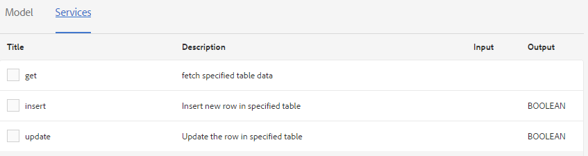
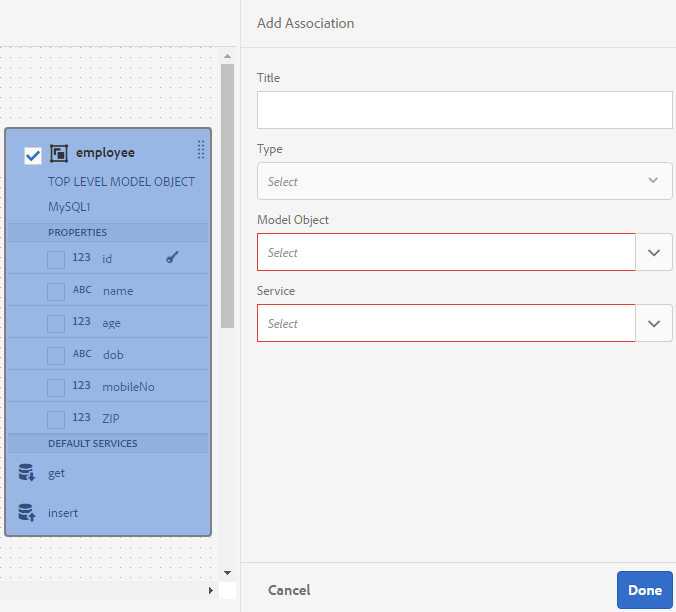

# Arbeta med formulärdatamodell {#work-with-form-data-model}

>[!CAUTION]
>
>AEM 6.4 har nått slutet på den utökade supporten och denna dokumentation är inte längre uppdaterad. Mer information finns i [teknisk supportperiod](https://helpx.adobe.com/support/programs/eol-matrix.html). Hitta de versioner som stöds [här](https://experienceleague.adobe.com/docs/).

Med dataintegrering kan du konfigurera och arbeta med formulärdatamodeller.


Formulärdatamodellredigeraren har ett intuitivt användargränssnitt och verktyg för att redigera och konfigurera en formulärdatamodell. Med redigeraren kan du lägga till och konfigurera datamodellsobjekt, egenskaper och tjänster från associerade datakällor i formulärdatamodellen. Dessutom kan du skapa datamodellsobjekt och -egenskaper utan datakällor och binda dem till respektive datamodellsobjekt och egenskaper senare. Du kan också generera och redigera exempeldata för datamodellsobjektsegenskaper som du kan använda för att förifylla adaptiva formulär och interaktiv kommunikation när du förhandsgranskar. Du kan testa datamodellsobjekt och tjänster som konfigurerats i en formulärdatamodell för att säkerställa att den är korrekt integrerad med datakällor.

Om du inte har använt dataintegrering med Forms tidigare och inte har konfigurerat någon datakälla eller skapat en formulärdatamodell kan du läsa följande avsnitt:

* [AEM Forms dataintegrering](/help/forms/using/data-integration.md)
* [Konfigurera datakällor](/help/forms/using/configure-data-sources.md)
* [Skapa formulärdatamodell](/help/forms/using/create-form-data-models.md)

Läs vidare för mer information om olika åtgärder och konfigurationer som du kan utföra med formulärdatamodellens redigerare.

>[!NOTE]
>
>Du måste vara medlem i båda **fdm-author** och **formuläranvändare** grupper för att kunna skapa och arbeta med formulärdatamodell. Kontakta AEM om du vill bli medlem i grupperna.

## Lägga till datamodellsobjekt och -tjänster {#add-data-model-objects-and-services}

Om du har skapat en formulärdatamodell med datakällor kan du använda redigeraren för formulärdatamodellen för att lägga till datamodellsobjekt och datatjänster, konfigurera deras egenskaper, skapa associationer mellan datamodellsobjekt och testa formulärdatamodellen och -tjänsterna.

Du kan lägga till datamodellsobjekt och datatjänster från tillgängliga datakällor i formulärdatamodellen. När nya datamodellsobjekt visas på fliken Modell visas tillagda tjänster på fliken Tjänster.

Så här lägger du till datamodellsobjekt och -tjänster:

1. Logga in på AEM författarinstans, navigera till **[!UICONTROL Forms > Data Integrations]** och öppna den formulärdatamodell i vilken du vill lägga till datamodellsobjekt.
1. Expandera datakällor i rutan Datakällor för att visa tillgängliga datamodellsobjekt och tjänster.
1. Markera datamodellsobjekt och tjänster som du vill lägga till i formulärdatamodellen och tryck **[!UICONTROL Add Selected]**.

   

   På fliken Modell visas en grafisk representation av alla datamodellsobjekt och deras egenskaper som lagts till i formulärdatamodellen. Varje datamodellobjekt representeras av en ruta i formulärdatamodellen.

   

   >[!NOTE]
   >
   >Du kan hålla kvar och dra runt datamodellsobjektrutor för att ordna dem i innehållsområdet. Alla datamodellsobjekt som läggs till i formulärdatamodellen är nedtonade i rutan Datakällor.

   Fliken Tjänster visar tillagda tjänster.

   

   >[!NOTE]
   >
   >Förutom datamodellsobjekt och -tjänster innehåller OData-tjänstens metadatadokument navigeringsegenskaper som definierar associationen mellan två datamodellsobjekt. Mer information finns i [Arbeta med navigeringsegenskaper för OData-tjänster](#work-with-navigation-properties-of-odata-services).

1. Tryck **[!UICONTROL Save]** för att spara formulärmodellobjektet.

   >[!NOTE]
   >
   >Du kan anropa tjänster som du har konfigurerat på fliken Tjänster i en formulärdatamodell med hjälp av adaptiva formulärregler. De konfigurerade tjänsterna är tillgängliga i åtgärden Anropa tjänster i regelredigeraren Mer information om hur du använder dessa tjänster i adaptiva formulärregler finns i Anropa tjänster och Ange värdet för regler i [regelredigerare](/help/forms/using/rule-editor.md).

## Skapa datamodellsobjekt och underordnade egenskaper {#create-data-model-objects-and-child-properties}

### Skapa datamodellsobjekt {#create-data-model-objects}

Du kan lägga till datamodellsobjekt från konfigurerade datakällor, men du kan också skapa datamodellsobjekt eller -enheter utan datakällor. Det är särskilt användbart om du inte har konfigurerat datakällor i formulärdatamodellen.

Så här skapar du ett datamodellsobjekt utan datakällor:

1. Logga in på AEM författarinstans, navigera till **[!UICONTROL Forms > Data Integrations]** och öppna den formulärdatamodell i vilken du vill skapa ett datamodellsobjekt eller en datamodell.
1. Tryck på **[!UICONTROL Create Entity]**.
1. I dialogrutan Skapa datamodell anger du ett namn för datamodellobjektet och trycker på **[!UICONTROL Add]**. Ett datamodellsobjekt läggs till i formulärdatamodellen. Observera att det nya datamodellsobjektet inte är bundet till en datakälla och inte har några egenskaper som visas i följande bild.

   

Därefter kan du lägga till underordnade egenskaper i obundna datamodellsobjekt.

### Lägg till underordnade egenskaper {#child-properties}

Med formulärdatamodellredigeraren kan du skapa underordnade egenskaper i ett datamodellsobjekt. Egenskapen när den skapas är inte bunden till någon egenskap i en datakälla. Du kan senare binda den underordnade egenskapen med en annan egenskap i det innehållande datamodellobjektet.

Så här skapar du en underordnad egenskap:

1. Markera ett datamodellsobjekt i en formulärdatamodell och tryck på **[!UICONTROL Create Child Property]**.
1. I **[!UICONTROL Create Child Property]** anger du ett namn och en datatyp för egenskapen i dialogrutan **[!UICONTROL Name]** och **[!UICONTROL Type]** fält. Du kan också ange en titel och en beskrivning för egenskapen.
1. Aktivera beräknad om egenskapen är en beräknad egenskap. Värdet för en beräknad egenskap utvärderas baserat på en regel eller ett uttryck. Mer information finns i [Redigera egenskaper](#edit-properties).
1. Om datamodellobjektet är bundet till en datakälla, binds den tillagda underordnade egenskapen automatiskt till egenskapen för det överordnade datamodellobjektet med samma namn och datatyp.

   Om du vill binda en underordnad egenskap manuellt med en datamodellsobjektegenskap trycker du på bläddringsikonen bredvid **[!UICONTROL Bind Reference]** fält. The **[!UICONTROL Select Object]** visas alla egenskaper från det överordnade datamodellobjektet. Välj en egenskap som du vill binda med och tryck på bockikonen. Observera att du bara kan välja en egenskap av samma datatyp som den underordnade egenskapen.

1. Tryck **[!UICONTROL Done]** för att spara egenskapen child och trycka **[!UICONTROL Save]** för att spara formulärdatamodellen.. Egenskapen child läggs nu till i datamodellsobjektet.

När du har skapat datamodellsobjekt och egenskaper kan du fortsätta att skapa anpassningsbara formulär och interaktiv kommunikation baserat på formulärdatamodellen. När du har datakällor tillgängliga och konfigurerade kan du senare binda formulärdatamodellen till datakällor. Bindningen uppdateras automatiskt i tillhörande adaptiva formulär och interaktiv kommunikation. Mer information om hur du skapar adaptiva formulär och interaktiv kommunikation med hjälp av formulärdatamodell finns i [Använd formulärdatamodell](/help/forms/using/using-form-data-model.md).

### Binda datamodellsobjekt och egenskaper {#bind-data-model-objects-and-properties}

När datakällorna som du vill integrera med formulärdatamodellen är tillgängliga kan du lägga till dem i formulärdatamodellen enligt beskrivningen i [Uppdatera datakällor](/help/forms/using/create-form-data-models.md#update). Gör sedan följande för att binda obundna datamodellsobjekt och egenskaper:

1. Välj den obundna datakälla som du vill binda till en datakälla i formulärdatamodellen.
1. Tryck på **[!UICONTROL Edit Properties]**.
1. I **[!UICONTROL Edit Properties]** trycker du på bläddringsikonen bredvid **[!UICONTROL Binding]** fält. Den öppnar **[!UICONTROL Select Object]** som visar datakällor som lagts till i formulärdatamodellen.

   

1. Expandera trädet för datakällor och markera ett datamodellsobjekt som du vill binda med och tryck på ikonen för att kryssa.
1. Tryck **[!UICONTROL Done]** för att spara egenskaperna och sedan trycka **[!UICONTROL Save]** för att spara formulärdatamodellen. Datamodellobjektet är nu bundet till en datakälla. Observera att datamodellobjektet inte längre är markerat som Obundet.

   

## Konfigurera tjänster {#configure-services}

Så här konfigurerar du läs- och skrivtjänster för att läsa och skriva data för ett datamodellsobjekt:

1. Markera kryssrutan högst upp i ett datamodellsobjekt för att markera det och trycka på **[!UICONTROL Edit Properties]**.

   

   Redigera egenskaper för att konfigurera läs- och skrivtjänster för ett datamodellsobjekt

   Dialogrutan Redigera egenskaper öppnas.

   

   Dialogrutan Redigera egenskaper

   >[!NOTE]
   >
   >Förutom datamodellsobjekt och -tjänster innehåller OData-tjänstens metadatadokument navigeringsegenskaper som definierar associationen mellan två datamodellsobjekt. När du lägger till en OData-tjänstdatakälla i en formulärdatamodell finns det en tjänst tillgänglig i formulärdatamodellen för alla navigeringsegenskaper i ett datamodellsobjekt. Du kan använda den här tjänsten för att läsa navigeringsegenskaperna för motsvarande datamodellsobjekt.
   >
   >Mer information om hur du använder tjänsten finns i [Arbeta med navigeringsegenskaper för OData-tjänster](#work-with-navigation-properties-of-odata-services).

1. Växla **[!UICONTROL Top Level Object]** för att ange om datamodellobjektet är ett modellobjekt på den översta nivån.

   Datamodellsobjekt som har konfigurerats i en formulärdatamodell är tillgängliga för användning på fliken Datamodellsobjekt i innehållsläsaren för ett adaptivt formulär baserat på formulärdatamodellen. När du lägger till en association mellan två datamodellsobjekt kapslas datamodellsobjektet som du associerar med under datamodellsobjektet på fliken Datamodellsobjekt. Om den kapslade datamodellen är ett objekt på den översta nivån visas den också separat på fliken Datamodellsobjekt. Därför kommer du att se två poster i den, en inuti och en utanför den kapslade hierarkin, vilket kan förvirra formulärförfattarna. Om du vill att det associerade datamodellsobjektet bara ska visas i den kapslade hierarkin inaktiverar du egenskapen Objekt på översta nivån.

1. Välj Läs- och skrivtjänster för de markerade datamodellsobjekten. Argumenten för tjänsterna visas.

   

   Läs- och skrivtjänster har konfigurerats för personaldatakälla

1. Tryck  för lästjänstargumentet för att binda argumentet till ett användarprofilattribut, begärandeattribut eller litteralvärde och ange bindningsvärdet. Det binder tjänstargumentet till det angivna bindningsattributet eller det literala värdet, som skickas till tjänsten som ett argument för att hämta information som är associerad med det angivna värdet från datakällan.

   I det här exemplet `id` argumentet får värdet av `empid` användarprofilens attribut och skicka det som ett argument till lästjänsten. Det läser och returnerar värden för associerade egenskaper från `employee` datamodellobjekt för den angivna `empid`. Om du anger 00250 i dialogrutan `empid` i formuläret kommer lästjänsten att läsa information om medarbetaren med 00250 employee id.

   Du kan dessutom göra ett argument obligatoriskt eller valfritt.

   

   Binda id-argumentet till empid-attributet för AEM användarprofil

1. Tryck **[!UICONTROL Done]** för att spara argumentet, **[!UICONTROL Done]** för att spara egenskaperna och sedan **[!UICONTROL Save]** för att spara formulärdatamodellen.

## Lägg till associationer {#add-associations}

Vanligtvis finns det kopplingar mellan datamodellsobjekt i en datakälla. Associationen kan vara en-till-en eller en-till-många. Det kan till exempel finnas flera beroenden som är kopplade till en medarbetare. Det kallas en-till-många-association och framställs av `1:n` på den linje som förbinder associerade datamodellsobjekt. Om en association returnerar ett unikt medarbetarnamn för ett givet medarbetar-ID kallas den en-till-en-association.

När du lägger till associerade datamodellobjekt i en datakälla i en formulärdatamodell behålls deras associationer och visas som kopplade med pilrader. Du kan lägga till associationer mellan datamodellsobjekt över olika datakällor i en formulärdatamodell.

>[!NOTE]
>
>Fördefinierade associationer i en JDBC-datakälla sparas inte i formulärdatamodellen. Du måste skapa dem manuellt.

Så här lägger du till en association:

1. Markera kryssrutan högst upp i ett datamodellsobjekt för att markera det och trycka på **[!UICONTROL Add Association]**. Dialogrutan Lägg till association öppnas.

   

   >[!NOTE]
   >
   >Förutom datamodellsobjekt och -tjänster innehåller OData-tjänstens metadatadokument navigeringsegenskaper som definierar associationen mellan två datamodellsobjekt. Du kan använda de här navigeringsegenskaperna när du lägger till associationer i formulärdatamodellen. Mer information finns i [Arbeta med navigeringsegenskaper för OData-tjänster](#work-with-navigation-properties-of-odata-services).

   Dialogrutan Lägg till association öppnas.

   

   Dialogrutan Lägg till association

1. I rutan Lägg till association:

   * Ange en titel för associationen.
   * Välj associationstyp - en till en eller en till många.
   * Markera datamodellsobjektet som du vill associera med.
   * Markera lästjänsten för att läsa data från det markerade modellobjektet. Lästjänstargumentet visas. Redigera om du vill ändra argumentet, om det behövs, och binda det till egenskapen för datamodellobjektet som ska associeras.

   I följande exempel är standardargumentet för läsningstjänsten för datamodellobjektet Beroende `dependentid`.

   

   Standardargumentet för tjänsten för läsning av beroenden är beroendestyrt

   Argumentet måste dock vara en vanlig egenskap mellan det associerade datamodellobjektet, vilket i det här exemplet är `Employeeid`. Därför är `Employeeid` argument måste bindas till `id` egenskapen för Employee-datamodellobjektet för att hämta associerade beroendedetaljer från datamodellobjektet Dependents.

   

   Uppdaterat argument och bindning

   Tryck **[!UICONTROL Done]** för att spara argumentet.

1. Tryck **[!UICONTROL Done]** för att spara associationen och sedan **[!UICONTROL Save]** för att spara formulärdatamodellen.
1. Upprepa stegen för att skapa fler associationer efter behov.

>[!NOTE]
>
>Den tillagda kopplingen visas i datamodellens objektruta med den angivna titeln och en linje som förbinder de associerade datamodellsobjekten.
>
>Du kan redigera en association genom att markera kryssrutan mot den och trycka på **[!UICONTROL Edit Association]**.


## Redigera egenskaper {#properties}

Du kan redigera egenskaper för datamodellsobjekt, deras egenskaper och tjänster som lagts till i formulärdatamodellen.

Så här redigerar du egenskaper:

1. Markera kryssrutan bredvid ett datamodellsobjekt, en egenskap eller en tjänst i formulärdatamodellen.
1. Tryck på **[!UICONTROL Edit Properties]**. The **[!UICONTROL Edit Properties]** för det valda modellobjektet, egenskapen eller tjänsten öppnas.

   * **Datamodellsobjekt**: Ange läs- och skrivtjänster och redigeringsargument.
   * **Egenskap**: Ange typ, undertyp och format för egenskapen. Du kan också ange om den valda egenskapen är primärnyckeln för datamodellobjektet.
   * **Tjänst**: Ange tjänstens indatamodell, utdatatyp och argument. För en Get-tjänst kan du ange om den förväntas returnera en array.

   

   Dialogrutan Redigera egenskaper för en get-tjänst

1. Tryck **[!UICONTROL Done]** för att spara egenskaper och sedan **[!UICONTROL Save]** för att spara formulärdatamodellen.

### Skapa beräknade egenskaper {#computed}

En beräknad egenskap är den vars värde beräknas baserat på en regel eller ett uttryck. Med hjälp av en regel kan du ange värdet för en beräknad egenskap till en litteral sträng, ett tal, resultatet av ett matematiskt uttryck eller värdet för en annan egenskap i formulärdatamodellen.

Du kan till exempel skapa en beräknad egenskap **FullName** vars värde är ett resultat av sammanfogning av den befintliga **FirstName** och **LastName** egenskaper. Så här gör du:

1. Skapa en ny egenskap med namnet `FullName` vars datatyp är String.
1. Aktivera **[!UICONTROL Computed]** och trycka **[!UICONTROL Done]** för att skapa egenskapen.

   

   Den beräknade egenskapen FullName skapas. Lägg märke till ikonen bredvid egenskapen för att avbilda en beräknad egenskap.

   

1. Välj egenskapen FullName och tryck på **[!UICONTROL Edit Rule]**. Ett regelredigeringsfönster öppnas.
1. I regelredigeringsfönstret trycker du på **[!UICONTROL Create]**. A **[!UICONTROL Set Value]** regelfönstret öppnas.

   I listrutan Välj alternativ väljer du **[!UICONTROL Mathematical Expression]**. Andra tillgängliga alternativ är **[!UICONTROL Form Data Model Object]** och **[!UICONTROL String]**.

1. I det matematiska uttrycket väljer du **[!UICONTROL FirstName]** och **[!UICONTROL LastName]** i första och andra objektet. Välj **[!UICONTROL plus]** som -operatorn.

   Tryck **[!UICONTROL Done]** och sedan trycka **[!UICONTROL Close]** för att stänga regelredigeringsfönstret. Regeln ser ut ungefär så här.

   

1. Tryck på **[!UICONTROL Save]**. Den beräknade egenskapen är konfigurerad.

## Arbeta med navigeringsegenskaper för OData-tjänster {#work-with-navigation-properties-of-odata-services}

I OData-tjänster används navigeringsegenskaper för att definiera associationer mellan två datamodellsobjekt. Dessa egenskaper definieras för en entitetstyp eller en komplex typ. I följande utdrag från metadatafilen för exemplet [TripPin](https://www.odata.org/blog/trippin-new-odata-v4-sample-service/) Exempeltjänster för OData, personenheten innehåller tre navigeringsegenskaper - Vänner, BestFriend och Resor.

Mer information om navigeringsegenskaper finns i [OData-dokumentation](https://docs.oasis-open.org/odata/odata/v4.0/errata03/os/complete/part3-csdl/odata-v4.0-errata03-os-part3-csdl-complete.html#_Toc453752536).

```xml
<edmx:Edmx xmlns:edmx="https://docs.oasis-open.org/odata/ns/edmx" Version="4.0">
<script/>
<edmx:DataServices>
<Schema xmlns="https://docs.oasis-open.org/odata/ns/edm" Namespace="Microsoft.OData.Service.Sample.TrippinInMemory.Models">
<EntityType Name="Person">
<Key>
<PropertyRef Name="UserName"/>
</Key>
<Property Name="UserName" Type="Edm.String" Nullable="false"/>
<Property Name="FirstName" Type="Edm.String" Nullable="false"/>
<Property Name="LastName" Type="Edm.String"/>
<Property Name="MiddleName" Type="Edm.String"/>
<Property Name="Gender" Type="Microsoft.OData.Service.Sample.TrippinInMemory.Models.PersonGender" Nullable="false"/>
<Property Name="Age" Type="Edm.Int64"/>
<Property Name="Emails" Type="Collection(Edm.String)"/>
<Property Name="AddressInfo" Type="Collection(Microsoft.OData.Service.Sample.TrippinInMemory.Models.Location)"/>
<Property Name="HomeAddress" Type="Microsoft.OData.Service.Sample.TrippinInMemory.Models.Location"/>
<Property Name="FavoriteFeature" Type="Microsoft.OData.Service.Sample.TrippinInMemory.Models.Feature" Nullable="false"/>
<Property Name="Features" Type="Collection(Microsoft.OData.Service.Sample.TrippinInMemory.Models.Feature)" Nullable="false"/>
<NavigationProperty Name="Friends" Type="Collection(Microsoft.OData.Service.Sample.TrippinInMemory.Models.Person)"/>
<NavigationProperty Name="BestFriend" Type="Microsoft.OData.Service.Sample.TrippinInMemory.Models.Person"/>
<NavigationProperty Name="Trips" Type="Collection(Microsoft.OData.Service.Sample.TrippinInMemory.Models.Trip)"/>
</EntityType>
```

När du konfigurerar en OData-tjänst i en formulärdatamodell blir alla navigeringsegenskaper i en entitetsbehållare tillgängliga via en tjänst i formulärdatamodellen. I det här exemplet på tjänsten TripPin OData finns tre navigeringsegenskaper i `Person` enhetsbehållaren kan läsas med en `GET LINK` i formulärdatamodellen.

Följande visar `GET LINK of Person /People` i formulärdatamodellen, som är en kombinerad tjänst för de tre navigeringsegenskaperna i `Person` enhet för TripPin OData-tjänsten.


När du har lagt till `GET LINK` på fliken Tjänster i formulärdatamodellen kan du redigera egenskaperna för att välja utdatamodellsobjektet och navigeringsegenskapen som ska användas i tjänsten. Till exempel följande `GET LINK of Person /People` i följande exempel används Trip som utdatamodell och navigeringsegenskapen som Trips.


>[!NOTE]
>
>De värden som finns i **[!UICONTROL Default Value]** fält för **NavigationPropertyName** -argumentet beror på läget för **[!UICONTROL Return array?]** växlingsknapp. När den är aktiverad visas navigeringsegenskaper av samlingstyp.

I det här exemplet kan du även välja utdatamodellsobjektet som Person och navigeringsegenskapsargument som Friends eller BestFriend (beroende på om **[!UICONTROL Return array?]** är aktiverat eller inaktiverat).


På samma sätt kan du välja en `GET LINK` och konfigurera navigeringsegenskaperna när du lägger till associationer i formulärdatamodellen. För att kunna välja en navigeringsegenskap måste du dock se till att **[!UICONTROL Binding To field]** är inställd på **[!UICONTROL Literal]**.


## Generera och redigera exempeldata {#sample}

Med formulärdatamodellredigeraren kan du generera exempeldata för alla datamodellsobjektsegenskaper, inklusive beräknade egenskaper, i en formulärdatamodell. Det är en uppsättning slumpmässiga värden som överensstämmer med den datatyp som konfigurerats för varje egenskap. Du kan också redigera och spara data, som behålls även om du genererar om exempeldata.

Så här genererar och redigerar du exempeldata:

1. Öppna en formulärdatamodell och tryck **[!UICONTROL Edit Sample Data]**. Den genererar och visar exempeldata i fönstret Redigera exempeldata.

   

1. I **[!UICONTROL Edit Sample Data]** fönster, redigera data efter behov och trycka **[!UICONTROL Save]**.

Därefter kan du använda exempeldata för att fylla i och testa interaktiv kommunikation i förväg baserat på formulärdatamodellen. Mer information finns i [Använd formulärdatamodell](/help/forms/using/using-form-data-model.md).

## Testa datamodellsobjekt och -tjänster {#test-data-model-objects-and-services}

Din formulärdatamodell är konfigurerad, men innan den används kanske du vill testa om de konfigurerade datamodellsobjekten och -tjänsterna fungerar som förväntat. Så här testar du datamodellsobjekt och -tjänster:

1. Markera ett datamodellsobjekt eller en tjänst i formulärdatamodellen och tryck **[!UICONTROL Test Model Object]** eller **[!UICONTROL Test Service]**, respektive.

   Fönstret Testa formulärdatamodell öppnas.

   

1. I fönstret Testa formulärdatamodell väljer du datamodellsobjektet eller datatjänsten som ska testas i rutan Indata.

1. Ange ett argumentvärde i testkoden och tryck på **[!UICONTROL Test]**. Ett lyckat test returnerar utdata i utdatapanelen.

   

På samma sätt kan du testa andra datamodellsobjekt och -tjänster i formulärdatamodellen.

## Nästa steg {#next-steps}

Du har en arbetsmodell för formulärdata som nu är klar att användas i anpassningsbara formulär och arbetsflöden för interaktiv kommunikation. Mer information finns i [Använd formulärdatamodell](/help/forms/using/using-form-data-model.md).
