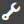

# Använda Acrobat Sign i en adaptiv form {#using-adobe-sign-in-an-adaptive-form}

>[!CAUTION]
>
>AEM 6.4 har nått slutet på den utökade supporten och denna dokumentation är inte längre uppdaterad. Mer information finns i [teknisk supportperiod](https://helpx.adobe.com/support/programs/eol-matrix.html). Hitta de versioner som stöds [här](https://experienceleague.adobe.com/docs/).

Möjliggör arbetsflöden för e-signaturer (Acrobat Sign) för ett adaptivt formulär för att automatisera signeringsarbetsflöden, förenkla processer för enstaka signaturer och för att signera formulär elektroniskt från mobila enheter.

Acrobat Sign möjliggör e-signaturarbetsflöden för anpassningsbara formulär. E-signaturer förbättrar arbetsflödena för att bearbeta dokument inom juridik, försäljning, löneadministration, personaladministration och andra områden.

I ett typiskt Acrobat Sign-scenario och ett scenario med adaptiva formulär fyller en användare i ett adaptivt formulär som kan användas för en tjänst. Till exempel kräver en ansökan om inteckning och kreditkort juridiska signaturer från alla låntagare och medsökande. Om du vill aktivera arbetsflöden för elektroniska signaturer för liknande scenarier kan du integrera Acrobat Sign med AEM Forms. Några exempel till är:

* Slut avtal från vilken enhet som helst med fullt automatiserade processer för förslag, offerter och kontrakt.
* Slutför HR-processerna snabbare och ge medarbetarna de digitala upplevelserna.
* Minska kontraktscyklerna och anlita era leverantörer snabbare.
* Skapa digitala arbetsflöden som automatiserar vanliga processer.

Acrobat Sign-integrering med AEM Forms har stöd för:

* Arbetsflöden för signering för en och flera användare
* Sekventiella och samtidiga signeringsarbetsflöden
* Underteckna i form och i form
* Signera formulär som anonym eller inloggad användare
* Dynamiska signeringsprocesser (integration med AEM Forms-arbetsflöde)
* Autentisering via kunskapsbas, telefon och sociala profiler

Lär dig [bästa sättet att använda Acrobat Sign med anpassningsbara formulär](https://medium.com/adobetech/using-adobe-sign-to-e-sign-an-adaptive-form-heres-the-best-way-to-do-it-dc3e15f9b684) för att skapa bättre signeringsupplevelser.

## Förutsättningar {#prerequisites}

Innan du använder Acrobat Sign i en adaptiv form:

* Kontrollera att AEM Forms molntjänst är konfigurerad att använda Acrobat Sign. Mer information finns i [Integrera Acrobat Sign med AEM Forms](/help/forms/using/adobe-sign-integration-adaptive-forms.md).
* Håll listan med signerare klar. Du måste ange minst en e-postadress för varje signerare.

## Konfigurera Acrobat Sign för ett adaptivt formulär {#configure-adobe-sign-for-an-adaptive-form}

Så här konfigurerar du Acrobat Sign för ett anpassat formulär:

1. [Redigera anpassningsbara formuläregenskaper för Acrobat Sign](#enableadobesign)
1. [Lägga till Acrobat Sign-fält i ett anpassat formulär](#addadobesignfieldstoanadaptiveform)
1. [Aktivera Acrobat Sign för ett anpassat formulär](#enableadobsignforanadaptiveform)
1. [Välj Acrobat Sign-Cloud Service för ett anpassat formulär](#selectadobesigncloudserviceforanadaptiveform)

1. [Lägga till Acrobat Sign-signerare i ett anpassat formulär](#addsignerstoanadaptiveform)
1. [Välj Skicka åtgärd för ett anpassat formulär](#selectsubmitactionforanadaptiveform)

### Redigera anpassningsbara formuläregenskaper för Acrobat Sign {#enableadobesign}

Konfigurera anpassningsbara formuläregenskaper för Acrobat Sign för ett befintligt eller nytt anpassbart formulär.

[Skapa ett anpassningsbart formulär för Acrobat Sign](/help/forms/using/working-with-adobe-sign.md#create-an-adaptive-form-for-adobe-sign) beskriver stegen för att skapa ett grundläggande anpassat formulär. Se [Skapa ett anpassat formulär](/help/forms/using/creating-adaptive-form.md) för andra alternativ som är tillgängliga när du skapar ett adaptivt formulär.

#### Skapa ett anpassningsbart formulär för Acrobat Sign {#create-an-adaptive-form-for-adobe-sign}

Så här skapar du ett anpassat formulär för Acrobat Sign:

1. Navigera till **[!UICONTROL Adobe Experience Manager]** > **[!UICONTROL Forms]** > **[!UICONTROL Forms & Documents]**.
1. Tryck **[!UICONTROL Create]** och markera **[!UICONTROL Adaptive Form]**. En lista med mallar visas. Markera mallen och tryck på **[!UICONTROL Next]**.
1. I **[!UICONTROL Basic]** tab:

   1. Ange **Namn** och **Titel** för den adaptiva formen.
   1. Välj [konfigurationsbehållare](/help/forms/using/adobe-sign-integration-adaptive-forms.md#configure-adobe-sign-with-aem-forms) skapades när Acrobat Sign konfigurerades med AEM Forms.

      >[!NOTE]
      >
      >The **[!UICONTROL Acrobat Sign Cloud Service]** listrutan visar de molntjänster som är konfigurerade i den konfigurationsbehållare som du väljer i det här fältet. The **[!UICONTROL Acrobat Sign Cloud Service]** listrutan är tillgänglig i **[!UICONTROL Electronic Signature]** när du väljer **[!UICONTROL Enable Acrobat Sign]** alternativ.

1. I **[!UICONTROL Form Model]** väljer du något av följande alternativ:

   * Välj **[!UICONTROL Associate form template as the Document of Record template]** och välj en dokumentmall. Om du använder ett formulärmallsbaserat adaptivt formulär visar dokumenten som skickas för signering endast de fält som är baserade på den associerade formulärmallen. Alla fält i det adaptiva formuläret visas inte.
   * Välj **[!UICONTROL Generate Document of Record]** alternativ. Om du använder ett anpassat formulär med alternativet Dokument för post aktiverat, visas alla fält i det adaptiva formuläret i det dokument som skickats för signering.

1. Tryck **[!UICONTROL Create.]** Ett signeringsaktiverat anpassat formulär skapas, som kan användas för att lägga till Acrobat Sign-fält.

#### Redigera ett adaptivt formulär för Acrobat Sign {#editafsign}

Utför följande steg för att använda Acrobat Sign i en befintlig adaptiv form:

1. Navigera till **[!UICONTROL Adobe Experience Manager]** > **[!UICONTROL Forms]**> **[!UICONTROL Forms & Documents]**.
1. Välj det adaptiva formuläret och tryck på **[!UICONTROL Properties]**.
1. I **[!UICONTROL Basic]** väljer du [konfigurationsbehållare](/help/forms/using/adobe-sign-integration-adaptive-forms.md#configure-adobe-sign-with-aem-forms) skapades när Acrobat Sign konfigurerades med AEM Forms.
1. I **[!UICONTROL Form Model]** väljer du något av följande alternativ:

   * Välj **[!UICONTROL Associate form template as the Document of Record template]** och välj en dokumentmall. Om du använder ett formulärmallsbaserat adaptivt formulär visar dokumenten som skickas för signering endast de fält som är baserade på den associerade formulärmallen. Alla fält i det adaptiva formuläret visas inte.
   * Välj **[!UICONTROL Generate Document of Record]** alternativ. Om du använder ett anpassat formulär med alternativet Dokument för post aktiverat, visas alla fält i det adaptiva formuläret i det dokument som skickats för signering.

1. Tryck på **[!UICONTROL Save & Close]**. Det adaptiva formuläret är aktiverat för Acrobat Sign.

### Lägga till Acrobat Sign-fält i ett anpassat formulär {#addadobesignfieldstoanadaptiveform}

Acrobat Sign har olika fält som kan placeras i ett anpassat formulär. Dessa fält accepterar olika typer av data som signaturer, initialer, företag eller titel och hjälper till att samla in extra information vid signering, tillsammans med signaturerna. Du kan använda Acrobat Sign-komponenten Blockera för att placera Acrobat Sign-fält på olika platser i ett anpassat formulär.

Utför följande steg för att lägga till fält i ett adaptivt formulär och anpassa olika alternativ för dessa fält:

1. Dra och släppa **Acrobat Sign Block** från komponentwebbläsaren till det adaptiva formuläret. Komponenten Acrobat Sign Block har alla Acrobat Sign-fält som stöds. Som standard läggs en **Signatur** till det anpassningsbara formuläret.

   

   Som standard visas inte Acrobat Sign-blocket i det publicerade adaptiva formuläret. Den visas bara i signeringsdokumenten. Du kan ändra synligheten för Acrobat Sign Block från egenskaperna för Acrobat Sign-komponenten Blockera.

   >[!NOTE]
   >
   >* Det är inte obligatoriskt att använda Acrobat Sign-block för att använda Acrobat Sign i en anpassningsbar form. Om du inte använder Acrobat Sign-block och lägger till fält för signerare, visas standardsignaturfältet längst ned i signeringsdokumenten.
   >* Använd endast Acrobat Sign-block för de hjälpformulär som automatiskt genererar arkivdokument. Om du använder en anpassad XDP för att generera ett anpassat formulär för arkivhandlingar eller ett formulärmallsbaserat formulär krävs inte Acrobat Sign-block.

1. Välj **Acrobat Sign Block** och tryck på **Redigera**  ikon. Här visas alternativ för att lägga till fält och formatera utseende för ett fält.

   

   **S.** Markera och lägg till Acrobat Sign-fält. **B.** Expandera Acrobat Sign-blocket till helskärmsläge

1. Tryck på **Acrobat Sign Field**  ikon. Här visas alternativ för att markera och lägga till Acrobat Sign-fält.

   Expandera **Typ** för att välja ett Acrobat Sign-fält och trycka på Klar  om du vill lägga till det markerade fältet i Acrobat Sign-blocket. The **Typ** nedrullningsbara fält innehåller signatur, signerarinformation och datafälttyper. Acrobat Sign-integrering med AEM Forms supportfält listas endast i listrutan Typ. Mer information om Acrobat Sign-fält finns i [Acrobat Sign-dokumentation](https://helpx.adobe.com/sign/help/field-types.html).

   

   Du måste ange ett unikt namn för ett fält. Du kan också markera ett obligatoriskt fält genom att välja önskat alternativ. Förutom **Namn** och **Obligatoriskt** finns det fler alternativ i vissa fält i Acrobat Sign. Till exempel mask och flera rader. Ange dessutom ett unikt namn för varje Acrobat Sign-fält oavsett om fälten finns i samma eller olika Acrobat Sign-block.

### Aktivera Acrobat Sign för ett anpassat formulär {#enableadobsignforanadaptiveform}

Acrobat Sign är inte aktiverat för anpassningsbara formulär. Gör så här för att aktivera den:

1. Tryck på **Formulärbehållare** och trycker på **Konfigurera**  ikon. Egenskaper öppnas i webbläsaren och egenskaper för behållare för adaptiva formulär visas.
1. Utöka **Elektronisk signatur** och välj **Aktivera Acrobat Sign** alternativ. Det gör att Acrobat Sign kan skapa en anpassningsbar blankett.

### Välj Acrobat Sign Cloud Service och signeringsordning {#selectadobesigncloudserviceforanadaptiveform}

Du kan konfigurera flera Acrobat Sign-tjänster för en instans av AEM Forms. Det är tillrådligt att ha en separat uppsättning tjänster för varje funktion (personal, ekonomi med mera). Det gör det enklare att spåra och rapportera signerade dokument. En bank har till exempel flera avdelningar. Du kan ha en separat konfiguration för varje avdelning för bättre spårning av dokumenten.

Ett dokument kan också ha flera signerare. Ett kreditkortsprogram kan t.ex. ha flera sökande. En bank kräver signaturer från alla sökande innan ansökan behandlas. I scenarier med flera signerare kan du välja att signera dokumentet i sekventiell eller samtidig ordning.

Gör så här för att välja en molntjänst och signeringsordning:

1. Tryck på **Formulärbehållare** och trycker på **Konfigurera**  ikon. Egenskaper öppnas i webbläsaren och egenskaper för behållare för adaptiva formulär visas.
1. Utöka **Elektronisk signatur** och välj **Aktivera Acrobat Sign** alternativ. Det gör att Acrobat Sign kan skapa en anpassningsbar blankett.
1. Välj en molntjänst i den redan konfigurerade listan över Acrobat Sign-Cloud Services.

   Om **Acrobat Sign Cloud Service** listan är tom, följ [Konfigurera Acrobat Sign med AEM Forms](/help/forms/using/adobe-sign-integration-adaptive-forms.md) artikel som konfigurerar tjänsten.

   I listrutan visas de molntjänster som finns i `global` mapp i Verktyg > **[!UICONTROL Cloud Services]** > **[!UICONTROL Acrobat Sign]**. Listrutan innehåller även en lista över de molntjänster som finns i den mapp du har valt i **[!UICONTROL Configuration Container]** när du skapar ett anpassat formulär.

1. Välj signeringsordning på menyn **Signerare kan signera** -dialogrutan. Acrobat Sign-signerare kan signera ett adaptivt formulär **Sekventiellt** - en efter en annan signerare, eller **Samtidigt** - i valfri ordning.

   I sekventiell ordning tar en signerare emot formuläret för signering i taget. När en signerare har slutfört signeringen av dokumentet skickas formuläret till nästa signerare och så vidare.

   Flera signerare kan signera ett formulär samtidigt i en och samma ordning.

1. [Lägga till signerare i ett anpassat formulär](#addsignerstoanadaptiveform) och tryck på ikonen Klar för att spara ändringarna.

### Lägga till signerare i ett anpassat formulär {#addsignerstoanadaptiveform}

Du kan bara ha en eller flera signerare för ett anpassat formulär. När du lägger till en signerare kan du även konfigurera autentiseringsinformation för signeraren. Du kan också välja om formuläranvändaren och signeraren ska vara samma person. Utför följande steg för att lägga till och ange olika detaljer om en signerare:

1. Tryck på **Formulärbehållare** och trycker på **Konfigurera**  ikon. Egenskapsläsaren öppnas med egenskaper för adaptiv formulärbehållare.
1. Utöka **Elektronisk signatur** och välj **Aktivera Acrobat Sign** alternativ. Det gör att Acrobat Sign kan skapa en anpassningsbar blankett.
1. Tryck **Lägg till signerare** under **Konfiguration av signerare.** Den lägger till en signerare i det adaptiva formuläret. Du kan lägga till flera Acrobat Sign-signerare i ett anpassat formulär.
1. 

   Klicka på **Redigera**  om du vill ange följande information om signeraren:

   * **Titel:** Ange en titel som unikt identifierar en signerare.
   * **Är signeraren och den person som fyller i formuläret densamma?:** Välj **Ja**, om formuläranvändaren och den första signeraren är samma person. Om alternativet är inställt på **Nej,** ska du inte använda signaturstegskomponenten i det adaptiva formuläret. Om formuläret innehåller en komponent för signatursteg ställs fältet automatiskt in på Ja.
   * **Undertecknarens e-postadress:** Ange signerarens e-postadress. Signeraren får signerade dokument/formulär på den angivna e-postadressen. Du kan välja att använda en e-postadress som finns i ett formulärfält, i AEM användarprofil för den inloggade användaren eller manuellt ange en e-postadress. Det är ett obligatoriskt steg. Observera också att om du bara har konfigurerat en signerare kontrollerar du att signerarens e-postadress inte är identisk med det Acrobat Sign-konto som används för att konfigurera AEM-molntjänster.
   * **Autentiseringsmetod för signerare:** Ange metoden för att autentisera en användare innan ett formulär öppnas för signering. Du kan välja mellan telefon, kunskapsbas och social ID-baserad autentisering.

   >[!NOTE]
   >
   >* Som standard har den sociala identitetsbaserade autentiseringen ett alternativ för att autentisera med Facebook, Google och LinkedIn. Du kan kontakta Acrobat Sign support för att aktivera andra leverantörer av social autentisering.

   * **Acrobat Sign-fält som ska fyllas i eller signeras:** Markera Acrobat Sign-fält för signeraren. Ett anpassningsbart formulär kan ha flera Acrobat Sign-fält. Du kan välja att aktivera specifika fält för en signerare. I fältet visas alla tillgängliga Acrobat Sign-block. När du markerar ett block markeras alla fält i blocket. Du kan använda X-ikonen för att avmarkera ett fält.

   

   I bilden ovan finns två exempel på Acrobat Sign Blocks: Personlig information och kontorsinformation

   Tryck på Klar  ikon. Undertecknaren läggs till och konfigureras.

### Välj Skicka åtgärd för ett anpassat formulär {#selectsubmitactionforanadaptiveform}

När du har lagt till Acrobat Sign-fält i ett anpassat formulär, aktiverat Acrobat Sign från formulärbehållaren, valt Acrobat Sign-Cloud Service och lagt till Acrobat Sign Signers, väljer du en lämplig överföringsåtgärd för det anpassade formuläret. Detaljerad information om hur du skickar formulär med adaptiva funktioner finns i [Konfigurera åtgärden Skicka](/help/forms/using/configuring-submit-actions.md).

Dessutom skickas ett adaptivt formulär som aktiveras av Acrobat Sign först när alla signerare har signerat formuläret. Du kan hitta delvis signerade formulär i avsnittet Väntande signering på formulärportalen. Acrobat Sign Configuration Service fortsätter att avfråga Acrobat Sign-servern på [regelbundna intervall](/help/forms/using/adobe-sign-integration-adaptive-forms.md) för att verifiera signaturernas status. Om alla signerare signerar formuläret, startas tjänsten för att skicka och formuläret skickas. Om du använder en anpassad sändningsåtgärd och formuläret använder Acrobat Sign, ska du uppdatera din anpassade sändningsåtgärd så att du kan använda åtgärdstjänsten Skicka.

>[!NOTE]
>
>Data i det adaptiva formuläret lagras tillfälligt på Forms Portal. Det rekommenderas att använda [anpassad lagring för Forms Portal](/help/forms/using/configuring-draft-submission-storage.md). Den ser till att PII-data (personligt identifierbar information) inte lagras på AEM servrar.

Din formulärsigneringsupplevelse är klar. Du kan förhandsgranska formuläret för att verifiera signeringsprocessen. På det publicerade formuläret visas Acrobat Sign-blockfält när en signerare tar emot formuläret för signering via ett e-postmeddelande. Den här upplevelsen kallas även signeringsupplevelse som inte är i form. Du kan även konfigurera en signeringsupplevelse i formulär för den första signeraren, för detaljerade steg se [Skapa signeringsupplevelser i form av formulär](/help/forms/using/working-with-adobe-sign.md#create-in-form-signing-experience).

## Konfigurera molnsignaturer för ett anpassat formulär {#configure-cloud-signatures-for-an-adaptive-form}

Molnbaserade digitala signaturer eller fjärrsignaturer är en ny generation digitala signaturer som fungerar på både dator, mobil och webben - och som uppfyller de högsta efterlevnads- och säkerhetsnivåerna för autentisering av signerare. Du kan signera ett anpassat formulär med molnbaserade digitala signaturer.

Efter [redigera adaptiva formuläregenskaper för Acrobat Sign](#enableadobesign)utför du följande steg för att lägga till molnsignaturfält i ett anpassat formulär:

1. Dra och släppa **Acrobat Sign Block** från komponentwebbläsaren till det adaptiva formuläret. Komponenten Acrobat Sign Block har alla Acrobat Sign-fält som stöds. Som standard läggs en **Signatur** till det anpassningsbara formuläret.

   

1. Välj **Acrobat Sign Block** och tryck på **Redigera**  ikon. Här visas alternativ för att lägga till fält och formatera utseende för ett fält.

   

   **S.** Markera och lägg till Acrobat Sign-fält. **B.** Expandera Acrobat Sign-blocket till helskärmsläge

1. Tryck på **Acrobat Sign Field**  ikon. Här visas alternativ för att markera och lägga till Acrobat Sign-fält.

   Expandera **Typ** nedrullningsbart fält att välja **Digital signatur** och tryck på Klart  om du vill lägga till det markerade fältet i Acrobat Sign-blocket.

   

   Du måste ange ett unikt namn för ett fält.

   Använd digitala signaturer på det anpassade formuläret med:

   * Molnsignaturer: Signera med en [digitalt ID](https://helpx.adobe.com/sign/kb/digital-certificate-providers.html) som hanteras av en betrodd tjänsteleverantör.
   * Adobe Acrobat eller Reader: Hämta och öppna dokumentet med Adobe Acrobat eller Reader för att signera med ett smartkort, en USB-token eller ett filbaserat digitalt ID.

   När du har lagt till fältet för molnsignatur i det adaptiva formuläret utför du följande steg för att slutföra konfigurationsprocessen:

   * [Aktivera Acrobat Sign för ett anpassat formulär](#enableadobsignforanadaptiveform)
   * [Välj Acrobat Sign-Cloud Service för ett anpassat formulär](#selectadobesigncloudserviceforanadaptiveform)
   * [Lägga till Acrobat Sign-signerare i ett anpassat formulär](#addsignerstoanadaptiveform)
   * [Välj Skicka åtgärd för ett anpassat formulär](#selectsubmitactionforanadaptiveform)

## Skapa signeringsupplevelser i form av formulär {#create-in-form-signing-experience}

Användaren kan också signera ett anpassat formulär medan han/hon fyller i formuläret. Den här upplevelsen kallas även signering i form av formulär. Signeringsfunktionen i form är bara tillgänglig för den första signeraren i en miljö med flera signerare. Utför följande steg för att skapa en signeringsupplevelse i ett anpassat formulär:

1. [Lägg till och konfigurera komponenten Signatursteg](#add-and-configure-the-signature-step-component).
1. [Lägg till komponenten Sammanfattningssteg](#configure-the-thank-you-page-or-summary-step-component).

### Lägg till och konfigurera komponenten Signatursteg {#add-and-configure-the-signature-step-component}

Använd komponenten Signatursteg för att ange ett område där det ifyllda formuläret ska signeras elektroniskt. När avsnittet med signaturstegskomponenten återges visas en signerbar PDF-version av det ifyllda formuläret. Komponenten Signatursteg får full bredd som är tillgänglig för formuläret. Vi rekommenderar att du inte har någon annan komponent i avsnittet som innehåller komponenten Signatursteg.

Utför följande steg för att konfigurera signaturstegskomponenten:

1. Dra och släpp **Signatursteg** -komponenten från komponentwebbläsaren till formuläret.
1. Markera den nya signaturstegskomponenten och tryck på **Konfigurera**  ikon. Egenskaper öppnas i webbläsaren och egenskaper för signatursteg visas. Konfigurera följande egenskaper:

   * **Elementnamn**: Ange komponentens namn.
   * **Titel:** Ange komponentens unika namn.
   * **Mallmeddelande:** Ange meddelandet som ska visas medan signaturen PDF läses in. Acrobat Sign tjänster tar lite tid att förbereda och läsa in signaturen PDF.
   * **Underteckningstjänst:** Välj **Acrobat Sign** alternativ.
   * **Använd äldre e-signeringskomponent**: Om du använder respektive adaptiva formulär i [AEM Forms Workspace](/help/forms/using/introduction-html-workspace.md), AEM Forms-appen eller det underliggande adaptiva formuläret har en äldre e-signeringskomponent, välj **Använd äldre e-signeringskomponent** alternativ.
   * **Konfiguration**: Välj en konfiguration (Acrobat Sign Cloud Service). Listrutan är bara tillgänglig om **Använd äldre e-signeringskomponent** är aktiverat.

   Tryck på Klar  om du vill spara ändringarna.

   

   >[!NOTE]
   >
   >* När du drar och släpper **[!UICONTROL Signature Step]** -komponenten till formuläret, **[!UICONTROL Is the signer and the person filling the form same?]** option is automatically set to **Ja**. Det krävs för att formuläret ska fungera.
   >* Anpassningsbara Acrobat Sign-formulär stöder inte användning av Skicka-knappen i avsnittet eller panelen med signaturstegskomponenten. Du kan lägga till ett sammanfattningssteg efter signatursteget för manuell överföring eller så aktiveras en automatisk överföring efter det intervall som anges med [Konfigurationstjänst för Acrobat Sign](/help/forms/using/adobe-sign-integration-adaptive-forms.md#configure-adobe-sign-scheduler-to-sync-the-signing-status).

### Konfigurera tacksidan eller sammanfattningssteget {#configure-the-thank-you-page-or-summary-step-component}

The **Sammanfattningssteg** skickar automatiskt formuläret, fyller i informationen på den anpassade sammanfattningssidan och visar sammanfattningen av det skickade formuläret. Den hämtar även den information som krävs i returkartan. Komponenten Sammanfattningssteg får full bredd som är tillgänglig för formuläret. Vi rekommenderar att du inte har någon annan komponent i avsnittet som innehåller komponenten Sammanfattningssteg.

Nu är signeringsupplevelsen i form av formulär klar. Du kan förhandsgranska formuläret för att verifiera signeringsprocessen.

## Vanliga frågor {#frequently-asked-questions}

**F: Du kan bädda in ett anpassat formulär i ett annat anpassat formulär. Kan det inbäddade adaptiva formuläret vara Acrobat Sign-aktiverat?**

**Ans:** Nej, AEM Forms har inte stöd för att använda ett adaptivt formulär som bäddar in ett adaptivt formulär som kan användas i Acrobat Sign för signering.

**F: När jag skapar ett adaptivt formulär med den avancerade mallen och öppnar det för redigering visas ett felmeddelande om att elektroniska signaturer eller signerare inte är korrekt konfigurerade. visas. Hur löser jag felmeddelandet?**

**Ans:** Anpassningsbart formulär som skapats med den avancerade mallen är konfigurerat att använda Acrobat Sign. Lös felet genom att skapa och välja en molnkonfiguration för Acrobat Sign och konfigurera en Acrobat Sign-signerare för det adaptiva formuläret.

**F: Kan jag använda Acrobat Sign texttaggar i en statisk textkomponent i ett anpassat formulär?**

**Ans:** Ja, du kan använda texttaggar i en textkomponent för att lägga till Acrobat Sign-fält i en [Dokument](/help/forms/using/generate-document-of-record-for-non-xfa-based-adaptive-forms.md) (Endast automatiskt genererat dokument med postalternativ) anpassat formulär. Mer information om proceduren och reglerna för att skapa en texttagg finns i [Acrobat Sign Documentation](https://experienceleague.adobe.com/docs/document-cloud-learn/sign-learning-hub/admin-set-up/advanced-tasks-admins/adobe-sign-text-tagging.html). Dessutom har adaptiva formulär begränsat stöd för texttaggar. Du kan använda texttaggarna för att skapa endast de fält som stöds av Acrobat Sign Block.

**F: AEM Forms tillhandahåller både Acrobat Sign-komponenter för block och signering. Kan dessa användas samtidigt i anpassningsbar form?**

**Ans:** Du kan använda båda komponenterna samtidigt i ett formulär. Här följer några rekommendationer för hur du använder dessa komponenter:

**Acrobat Sign Block:** Du kan använda Acrobat Sign Block för att lägga till Acrobat Sign-fält var som helst i det adaptiva formuläret. Det hjälper även till att tilldela specifika fält till signerare. När ett anpassat formulär förhandsgranskas eller publiceras visas inte Acrobat Sign Block som standard. De här blocken aktiveras bara i signeringsdokumentet. I signeringsdokumentet aktiveras bara de fält som tilldelats en signerare. Acrobat Sign-block kan användas med första och efterföljande signerare.

**Underskriftsstegskomponent:** Du kan använda signaturstegskomponenten för att skapa signeringsupplevelser i formulär. Endast den första signeraren kan signera medan formuläret fylls i. När avsnittet med signaturstegskomponenten återges visas en signerbar PDF-version av formuläret. Det är vanligtvis det sista eller näst sista avsnittet följt av en sammanfattningskomponent i ett formulär.
