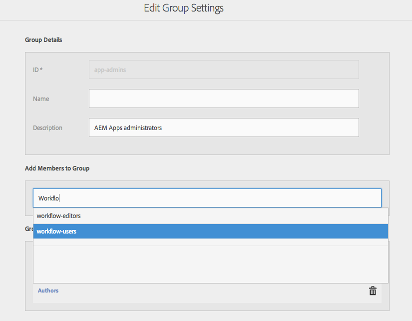

# Konfigurera dina användare och användargrupper {#configure-your-users-and-user-groups}

>[!NOTE]
>
>Adobe rekommenderar att du använder SPA Editor för projekt som kräver ramverksbaserad klientåtergivning för en sida (t.ex. Reagera). [Läs mer](/help/sites-developing/spa-overview.md).

I det här kapitlet beskrivs användarrollerna och hur du konfigurerar användare och grupper så att de kan hantera redigering och hantering av dina mobilappar.

## Användare och gruppadministration av AEM Mobile-program {#aem-mobile-application-users-and-group-administration}

Följande två grupper är tillgängliga för att hjälpa till att organisera och hantera behörighetsmodellen för AEM-appar:

* appadministratörer för appadministratörer
* appförfattare för appförfattare

### AEM Mobile Application Content Authors (app-author group) {#aem-mobile-application-content-authors-app-author-group}

Medlemmar i gruppen som skapar appar ansvarar för att skapa innehåll för AEM-mobilappar, inklusive sidor, text, bilder och videor.

#### Gruppkonfiguration - programförfattare {#group-configuration-app-authors}

1. Skapa en ny användargrupp med namnet&quot;app-authors&quot;:

   Navigera till Admin Console för användare: [http://localhost:4502/libs/granite/security/content/groupadmin.html](http://localhost:4502/libs/granite/security/content/groupadmin.html)

   I användargruppkonsolen väljer du plusknappen (+) för att skapa en grupp.

   Ange ID:t för den här gruppen som&quot;appförfattare&quot; för att ange att det är en specifik typ av författaranvändargrupp som är specifik för utveckling av mobilprogram i AEM.

1. Lägg till medlem i grupp: Författare

   

   Lägg till appförfattare i gruppen Författare

1. Nu när du har skapat användargruppen för programförfattare kan du lägga till enskilda teammedlemmar i den nya gruppen via [användaradministratörskonsolen](http://localhost:4502/libs/granite/security/content/useradmin.md).

   

   Redigera användargrupper

1. Navigera till [behörighetskonsolen](http://localhost:4502/useradmin) och lägg till behörigheter för att administrera molntjänster

   * (Läs) på /etc/cloudServices
   >[!NOTE]
   >
   >Programförfattare utökar standardgruppen för innehållsförfattare (författare) från AEM och ärver därmed möjligheten att skapa innehåll under /content/phonegap

### AEM Mobile Application Administrators Group (app-admins group) {#aem-mobile-application-administrators-group-app-admins-group}

Medlemmar i gruppen app-admins kan skapa programinnehåll med samma behörigheter som finns i appförfattarna **AND** ansvarar även för:

* Konfigurera PhoneGap Build och Adobe Mobile Services-molntjänster i AEM
* Mellanlagring, publicering och rensning av uppdateringar av innehållssynkronisering, OTA

>[!NOTE]
>
>Behörigheterna avgör tillgängligheten för vissa användaråtgärder i AEM App Command Center.
>
>Du kommer att märka att vissa alternativ inte är tillgängliga för appförfattare som är tillgängliga för appadministratörer.

#### Gruppkonfiguration - programadministratörer {#group-configuration-app-admins}

1. Skapa en ny grupp som kallas appadministratörer.
1. Lägg till följande grupper i den nya gruppen för programadministratörer:

   * innehållsförfattare
   * arbetsflöde-användare
   

1. Navigera till [behörighetskonsolen](http://localhost:4502/useradmin) och lägg till behörigheter för att administrera molntjänster

   * (Läs, Ändra, Skapa, Ta bort, Replikera) på /etc/cloudServices/mobiltjänster
   * (Läs, Ändra, Skapa, Ta bort, Replikera) på /etc/cloudservices/phonegap-build

1. På samma behörighetskonsol lägger du till behörigheter på scenen, publicerar och rensar appinnehållsuppdateringar

   * (Läs, Ändra, Skapa, Ta bort, Replikera) på /etc/packages/mobileapp
   * (Läs) på /var/contentsync
   >[!NOTE]
   >
   >Paketreplikering används för att publicera appuppdateringar från författarinstansen till publiceringsinstansen

   >[!CAUTION]
   >
   >/var/contentsync-åtkomst nekas OTB.
   >
   >Om du utelämnar läsbehörigheten kan tomma uppdateringspaket skapas och replikeras.

1. Lägg till medlemmar i den här gruppen efter behov

## Behörigheter för paneler {#dashboard-tile-permissions}

Instrumentpaneler kan visa olika åtgärder baserat på de behörigheter som användaren har. Nedan beskrivs vilka åtgärder som är tillgängliga för varje platta.

Förutom dessa behörigheter kan en åtgärd också visas/döljas baserat på hur det aktuella programmet är konfigurerat. Det finns t.ex. ingen punkt som visar åtgärden &#39;Remote Build&#39; om en PhoneGap-molnkonfiguration inte har tilldelats programmet. De listas nedan under **Konfigurationsvillkor**.

### Hantera apppanel {#manage-app-tile}

Panelen har för närvarande inga åtgärder som kräver behörigheter, men informationssidan för programmet har följande åtgärder:

* *Redigera* för app-author och app-admin (UI-utlösare - jcr:write - on /content/phonegap/{suffix})
* *Hämta* för app-author och app-admin (UI-utlösare - på /content/phonegap/{suffix})

Bilden nedan visar hämtnings- och redigeringsalternativen för ett program:

