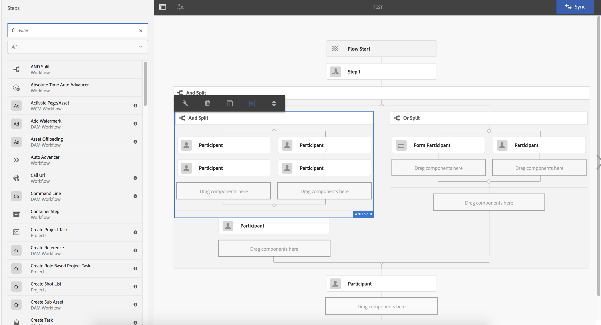

# Allmän versionsinformation för Adobe Experience Manager 6.4 {#general-release-notes-for-adobe-experience-manager}

## Versionsinformation {#release-information}

| Produkt | Adobe Experience Manager |
|---|---|
| Version | 6.4 |
| Typ | Större release |
| Allmänt tillgänglighetsdatum | 4 april 2018 |
| Rekommenderade uppdateringar | Se [AEM och uppdateringar](https://helpx.adobe.com/experience-manager/aem-releases-updates.html) |

### Trivia {#trivia}

Versionscykeln för den här versionen av Adobe Experience Manager började 27 april 2017, genomgick 22 versioner av kvalitetssäkring och felkorrigering och slutade 22 mars 2018. Det totala antalet kundrelaterade problem, inklusive förbättringar och nya funktioner som har korrigerats i den här versionen, är 704.

Adobe Experience Manager 6.4 är allmänt tillgängligt sedan 4 april 2018.

>[!NOTE]
>
>Adobe rekommenderar att du installerar det senaste Service Pack-versionen eftersom alla nya funktionspaket endast levereras via [Service Pack](https://helpx.adobe.com/experience-manager/maintenance-releases-roadmap.html).

## Nyheter {#what-s-new}

Adobe Experience Manager 6.4 är en uppgraderingsversion till Adobe Experience Manager 6.3-kodbasen. Den innehåller nya och förbättrade funktioner, viktiga kundkorrigeringar, högprioriterade kundförbättringar och allmänna felkorrigeringar som är inriktade på produktstabilisering. Det innehåller även merparten av alla Adobe Experience Manager 6.3-funktionspaket, snabbkorrigeringar och Service Pack-versioner.

Listan nedan innehåller en översikt, medan de efterföljande sidorna innehåller fullständig information.

### Experience Manager Foundation {#experience-manager-foundation}

Fullständig lista över ändringar i [AEM](wcm-platform.md).

Plattformen för Adobe Experience Manager 6.4 bygger på uppdaterade versioner av det OSGi-baserade ramverket (Apache Sling och Apache Felix) och Java Content Repository: Apache Jackrabbit Oak 1.8.2.

Quickstart använder Eclipse Jetty 9.3.22 som servermotor.

#### Användargränssnitt {#user-interface}

Ett antal förbättringar har gjorts i användargränssnittet för att göra det mer produktivt och enklare att använda.

* [Ny innehållsträd](/help/sites-authoring/basic-handling.md#content-tree) för att snabbt navigera i en hierarki. I kombination med listvyn återställs interaktionsmodellen för klassiskt användargränssnitt.
* Förbättrad bläddringsupplevelse på kort- och listvyn för stora mappar.
* [Förbättrad interaktion med sökresultaten](/help/sites-authoring/search.md) - knappen Bakåt återställer det tidigare sökresultatet.
* [Ytterligare kortkommandon](/help/sites-authoring/keyboard-shortcuts.md), för de flesta vanliga åtgärder, till exempel att öppna en viss räl, för att redigera, flytta och ta bort objekt eller för att öppna egenskaper.
* [Möjlighet att inaktivera kortkommandon](/help/sites-authoring/user-properties.md) (aktivera/inaktivera i Inställningar).
* [Sluta visa tidsstämplar i hela användargränssnittet](/help/sites-authoring/user-properties.md) relativt efter 7 dagar (ange som standard i Inställningar).

Se [Redigeringsdokumentation](/help/sites-authoring/home.md) för mer information om dessa funktioner.

>[!CAUTION]
>
>Adobe planerar inte att göra fler förbättringar av det klassiska användargränssnittet. AEM 6.4 har det klassiska användargränssnittet och kunder som uppgraderar från tidigare versioner kan fortsätta använda det som det är. Observera att Classic-användargränssnittet fortfarande stöds fullt ut när det är inaktuellt. [Läs mer](/help/sites-deploying/ui-recommendations.md).

#### Innehållsdatabas {#content-repository}

* Snabbare och effektivare komprimering med onlineredigering. Interna tester visar att den nya svansen är upp till 10 gånger snabbare och kan frigöra mer diskutrymme med mindre IOPS jämfört med AEM 6.3. Detta resulterar i mindre prestandapåverkan när onlinerevideringsrensningen körs. Mer information finns på [dokumentationssidan](/help/sites-deploying/revision-cleanup.md#full-and-tail-compaction-modes).

* Continuous Revision Cleanup for MongoMK ersätter planerat rensningsunderhåll
* Förbättrad effektivitet vid rensning av revisioner i dokumentnoder

#### Sökning och indexering {#search-indexing}

* Förbättrat stöd för indexering via ekkörning (CLI):

   * Konsekvenskontroll för index
   * Indexeringsstatistik
   * Import eller export av indexkonfiguration
   * Omindexering

* Minskad Lucene-relaterad databastillväxt för bättre systemprestanda

Mer information finns på [den här dokumentationssidan](/help/sites-deploying/indexing-via-the-oak-run-jar.md).

#### Övervakning {#monitoring}

* En ny [Systemöversikt](/help/sites-administering/operations-dashboard.md#system-overview) ger en ögonblicksbild av alla prestandarelaterade systemstatus och aktiviteter.
* En ny uppsättning [Hälsokontroller](/help/sites-administering/operations-dashboard.md#health-checks) runt indexering, frågor och underhåll

#### Projekt och arbetsflöden {#projects-and-workflows}

* Helt nya [Arbetsflödesredigeraren för att skapa och redigera arbetsflödesmodeller](/help/sites-developing/workflows-models.md).

#### Uppgradera från tidigare version {#upgrade-from-earlier-version}

* [Bakåtkompatibilitet](/help/sites-deploying/backward-compatibility.md): Bakåtkompatibla funktioner i 6.4 hjälper din anpassade kod att förbli kompatibel i de flesta fall och minskar uppgraderingsbehovet.
* [Utvärdering av komplexitet för uppgradering](/help/sites-deploying/pattern-detector.md): Det nya mönsteravkännarverktyget kontrollerar komplexiteten hos dina uppgraderingar innan du uppgraderar.
* [Omstrukturering av lager](/help/sites-deploying/repository-restructuring.md): betydande omstrukturering (främst /etc) för att underlätta enklare uppgraderingar och främja bästa praxis för genomförandet
* Mer allmän information om uppgraderingar finns i [den här sidan](/help/sites-deploying/upgrade.md) för mer information.

### Experience Manager Sites {#experience-manager-sites}

Fullständig lista över ändringar i [AEM Sites och tillägg](sites.md).

#### Flytande upplevelser {#fluid-experiences}

Införandet av flytande upplevelser i början av 2017, med stöd av innehållsfragment, upplevelsefragment och innehållstjänster som bas, var början till en innehållshantering som tar flera kanaler i första rummet. AEM 6.4 sträcker sig betydligt över vart och ett av områdena:

**[Innehållsfragment](/help/assets/content-fragments.md)**

Nytt i 6.4 är en visuell [innehållsmodell](/help/assets/content-fragments-models.md) redigerare och en ny [konfigurerbar komponent](https://experienceleague.adobe.com/docs/experience-manager-core-components/using/components/content-fragment-component.html) för att tillhandahålla flexibla HTML-utdata och JSON som ska ingå i Content Services.

**Experience Fragments**

Tack vare funktionen Byggblock kan du nu skapa variationer i ett fragment med samma innehåll men med olika layout mer effektivt. Förutom att skicka Experience Fragments till Facebook och Pinterest går det nu att skicka dem till Adobe Target som erbjudande.

**Innehållstjänster**

Olika förbättringar av Sling Model Exporter och Core Components ingår för att tillhandahålla stabila JSON-utdata för att bädda in innehåll i mobilappar och upplevelser som byggs med single page-appar.

#### Snabbare hämtning av webbplatser {#gettings-sites-built-quicker}

AEM 6.4 slutför omvandlingen till nästa generations komponentmodell. Core Components-konceptet som introducerades i AEM 6.3, och nu förenas med Style System, är ett effektivt sätt att bygga nya och utöka befintliga webbplatser.

Rekommenderad självstudiekurs för att lära dig hur du bäst utnyttjar den nya komponentmodellen: [Komma igång med AEM Sites - WKND självstudiekurs](https://experienceleague.adobe.com/docs/experience-manager-learn/getting-started-wknd-tutorial-develop/overview.html)

#### Tillägget Skärmar {#screens-add-on}

AEM Screens står för att leverera ett enhetligt budskap i alla marknadsföringskanaler, inklusive digitala signaturer och kiosknätverk. AEM 6.4 har stöd för att köra signeringsspelaren på maskinvaran i Microsoft Windows och Google Chrome OS. Dessutom finns det förbättringar av enhetshantering och scheman (grupper av kanaler) på fjärrbasis.

Mer information om skärmuppdateringar finns i [AEM Screens Användarhandbok](https://experienceleague.adobe.com/docs/experience-manager-screens/user-guide/aem-screens-introduction.html).

### Experience Manager Communities {#experience-manager-communities}

AEM 6.4 innehåller många nya funktioner och förbättringar för Communities. En fullständig lista över ändringarna finns i [AEM Communities](communities-release-notes.md). Högdagrar för den här versionen är:

#### Förbättringar av moderering {#enhancements-to-moderation}

**Automatisk identifiering av skräppost**

Ny motor för skräppostavkänning har tillhandahållits för att filtrera bort oönskat användargenererat innehåll på communitywebbplatser och grupper. När den har aktiverats från system/console/configMgr markeras ett användargenererat innehåll som skräppost baserat på en fördefinierad uppsättning skräppostord. Mer information om skräppostavkänningsmotorn finns i [som genererar innehåll för användare inom bilbranschen](/help/communities/moderate-ugc.md#spam-detection).

**Nya filter för QnA**

Nya filter, som heter Answered och Not Answered, har lagts till i masmodereringskonsolen för att filtrera QnA-frågor. Om du vill veta hur statusfiltren för svar och obesvarade fungerar läser du [massmoderera användargenererat innehåll](/help/communities/moderation.md#main-pars-note-521961797).

**Kontrollfilter för bokmärken**

Det finns möjlighet att bokmärka de fördefinierade modereringsfiltren på modereringskonsolen. Dessa filter läggs till i slutet av URL-strängen och kan därför delas, återanvändas och granskas senare. Se hur du bokmärker filter i [masmodereringskonsol](/help/communities/moderation.md#main-pars-note-429176623).

#### Ta bort användarprofiler och användarprofiler {#delete-ugc-and-user-profiles}

AEM 6.4 Communities visar [färdiga API:er](/help/communities/user-ugc-management-service.md) och exempel [servlet](https://github.com/Adobe-Marketing-Cloud/aem-communities-ugc-migration/tree/master/bundles/communities-ugc-management-servlet) för att ge slutanvändarna kontroll över sina data. Dessa API:er gör det även möjligt för databehandlings- och datakontrollorganisationer att hantera EU:s GDPR-kompatibilitetsbegäran.

#### Förbättringar av plats- och grupphantering {#enhancements-to-site-and-group-management}

**Skapa grupper med flera språkområden i ett enda steg**

Möjlighet att skapa flerspråkiga grupper med en enda åtgärd har tillhandahållits. Om du vill skapa sådana grupper kan användarna navigera till gruppsamlingen för den önskade communitywebbplatsen från webbplatskonsolen. Skapa en grupp och ange önskade språk på mallsidan för communitygrupper. Mer information om den här funktionen finns i [community groups console](/help/communities/groups.md).

**[Ta bort communitysajter och grupper med ett klick](/help/communities/groups.md)**

Ikonen Ta bort är nu tillgänglig på respektive webbplats och i respektive grupp, vid navigering från global navigering. Med den här ikonen tas alla objekt och allt innehåll som är kopplat till platsen eller gruppen bort, och alla användarassociationer tas bort. Mer information om den här funktionen finns i [hantera communitysajter](/help/communities/create-site.md#main-pars-text-fe17) och [hantera communitygrupper](/help/communities/groups.md#main-pars-text-5e8c).

#### Förbättringar av aktivering {#enhancements-to-enablement}

Tilldelnings- och katalogfunktionerna är nu tillgängliga i grupper. Detta gör att utbildningsinnehåll kan skapas, hanteras och publiceras för en viss uppsättning målgruppsmedlemmar. Mer information om hur du aktiverar communitygrupper finns i [hantera aktiveringsresurser](/help/communities/resource.md).

### Experience Manager Assets {#experience-manager-assets}

AEM 6.4 innehåller flera nya funktioner och förbättringar av Assets, bland annat ny, förbättrad Creative Cloud-integrering, viktiga innovationer inom artificiell intelligens, förbättrad metadatahantering, förbättrade rapporter och förbättringar av användarupplevelsen. En fullständig lista över de ändringar som är tillgängliga i [AEM Assets](assets.md). Versionens högdagrar är:

**Adobe Asset Link**

Adobe Asset Link i Creative Cloud for enterprise effektiviserar samarbetet mellan kreatörer och marknadsförare vid framtagningen av innehåll. Det är en ny inbyggd funktion i Creative Cloud for enterprise som kopplar Photoshop, Illustrator och InDesign till AEM - utan att kreatörerna behöver lämna sina valverktyg.

Om du vill veta mer om den här funktionen, förutsättningarna och hur du får tillgång till den kan du läsa [Adobe Asset Link](https://www.adobe.com/creativecloud/business/enterprise/adobe-asset-link.html).

**AEM**

AEM har uppdaterats till version 1.8, som är kompatibel med AEM 6.4. Den fullständiga listan över ändringar för AEM program finns i en [Versionsinformation för AEM](https://experienceleague.adobe.com/docs/experience-manager-desktop-app/using/release-notes.html) -dokument.

De förbättringar som har gjorts sedan AEM 6.3-versionen omfattar möjligheten att överföra hierarkiska mappar i bakgrunden, ett nytt användargränssnitt för att övervaka bakgrundsåtgärder för resurser, förbättrad cachelagring, nätverk och inloggning samt övergripande stabilitetsförbättringar. Dokumentationen innehåller även en [metodguide](https://experienceleague.adobe.com/docs/experience-manager-desktop-app/using/using.html).

**Adobe Sensei Services**

De nya funktionerna är bland annat Förbättrade smarta taggar, med möjlighet att lära sig kundens taxonomi, att automatiskt tagga digitala resurser med kundspecifika taggar och Smart Translation Search, som förbättrar upptäckbarheten på flera språk genom att översätta söktermer direkt. Mer information om den här funktionen finns i [Förbättrade smarta taggar](/help/assets/enhanced-smart-tags.md).

**Metadata**

Ett antal förbättringar är möjligheten att importera och exportera metadata samtidigt för ett stort antal resurser och avancerade metadatakonstruktioner, till exempel [Överlappande metadata](/help/assets/cascading-metadata.md).

**Rapporter**

Resursrapporteringen genomgick en stor översyn i AEM 6.4 med nya rapporteringsramverk, användarupplevelser och fler OOTB-rapporter för kundanvändningsfall. Mer information om hur du skapar olika rapporter finns i [Resursrapporter](/help/assets/asset-reports.md).

**Användarupplevelse**

Flera förbättringar som förbättrar surfning, sökning och administration för Assets-användare som bläddring, bakåtsökning, förbättrade sökfilter och mycket annat. Den fullständiga listan finns i [AEM Assets](assets.md).

**Brand Portal**

Olika förbättringar inom områden som metadata, rapportering, digitala rättigheter, inloggningsupplevelser och publiceringsprestanda för mediedistribution. Mer information om de nya förbättringarna och funktionerna finns i [Nyheter i AEM Assets Brand Portal](https://experienceleague.adobe.com/docs/experience-manager-brand-portal/using/introduction/whats-new.html).

#### Dynamic Media Add-on {#dynamic-media-add-on}

AEM 6.4 innehåller många nya funktioner och förbättringar av Dynamic Media. Den fullständiga listan finns i [AEM Assets](assets.md). Viktiga högdagrar är följande:

**Smart beskärning**

Smart Crop, som drivs av Adobe Sensei, ger automatiskt icke-förstörande beskärning av bilder och bevarar intressepunkten för responsiv design. Du kan förhandsgranska förslag på beskurna bilder och manuellt justera dem om det behövs. Den här funktionen möjliggör även automatisk generering av färgrutor för produktbilder.

Se [Bildprofiler](/help/assets/image-profiles.md) om du vill veta mer om hur du använder Smart Crop.

Se [Lägga till Dynamic Media-resurser på sidor](/help/assets/adding-dynamic-media-assets-to-pages.md) om du vill veta mer om hur du arbetar med Smart Crop i Dynamic Media-komponenten.

**Smart bildbehandling**

Smart bildbehandling utnyttjar varje användares unika visningsegenskaper för att automatiskt leverera bilder som är optimerade för sin upplevelse, vilket ger bättre prestanda och engagemang.

Se [Smart bildbehandling](/help/assets/imaging-faq.md) dokumentation som lär dig mer.

**Förbättringar av nya media och visningsprogram**

Med nya visningsprogram, bland annat panoraman och VR, kan du skapa mer engagerande upplevelser.

Se [Panoramabilder](/help/assets/panoramic-images.md) dokumentation som lär dig mer.

### Experience Manager Forms {#experience-manager-forms}

AEM 6.4 Forms har flera nya funktioner och förbättringar. Högdagrarna är följande:

* Interaktiv kommunikation i flera kanaler
* Förifyll interaktiv kommunikation från affärsapplikationer
* Modernisering av arbetsflödet och stöd för mobila arbetare
* Lazy loading av fragment
* Uppgradering från LiveCycle till Experience Manager Forms 6.4

Mer information om [AEM Forms](forms.md) versionsinformation. Se även [Sammanfattning av nya funktioner och förbättringar i AEM 6.4 Forms](/help/forms/using/whats-new.md) för information om nya och förbättrade funktioner och dokumentationsresurser.

### Experience Manager Livefyre {#experience-manager-livefyre}

Du kan integrera Livefyre med AEM 6.4-instansen. Information om hur du integrerar Livefyre med AEM finns här:

* [Integrera Livefyre](https://experienceleague.adobe.com/docs/experience-manager-64/administering/integration/livefyre.html)

### Utnyttja kundfokuserad utveckling {#leverage-customer-focused-development}

Adobe använder en kundfokuserad utvecklingsmodell som gör det möjligt för kunderna att bidra till alla faser i utvecklingsprocessen, under specifikation, utveckling och testning. Vi tackar alla kunder och partners som deltar i den här processen.

Adobe har de rutiner och processer som behövs för att kunna samla in, prioritera och spåra kundfokuserade fellösningar och utveckla förbättringsförfrågningar. The [Adobe Marketing Cloud supportportal](https://helpx.adobe.com/se/contact/enterprise-support.ec.html) är integrerat med Adobe Enhancement &amp; Defect Tracking System. Kundfrågor identifieras och löses med kundtjänst där det är möjligt. När den eskaleras till FoU hämtas all kundinformation in och används för prioritering och rapportering. Vid utveckling ges prioritet åt betald support och garantifrågor samt betalda kundförbättringar.

Denna prioriteringsprocess har resulterat i över 500 kundfokuserade förändringar som fastslagits i AEM 6.4.

## Lista över filer som ingår i releasen {#list-of-files-that-are-part-of-the-release}

**Foundation**

* Fristående QuickStart: cq-quickstart-6.4.0.jar
* Snabbstart för programserver: cq-quickstart-6.4.0.war
* Skicka 4.3.1 eller senare för olika webbservrar och plattformar. Se [ladda ned länk](https://experienceleague.adobe.com/docs/experience-manager-dispatcher/using/getting-started/release-notes.html).
* Plugin för Eclipse IDE. [Läs mer och ladda ned](/help/sites-developing/aem-eclipse.md).

* Tillägg för Brackets Code Editor. [Läs mer och ladda ned](/help/sites-developing/aem-brackets.md).
* Maven/Gradle-beroenden. Se [ladda ned länk](https://repo.adobe.com/nexus/content/repositories/releases/com/adobe/aem/uber-jar/6.1.0/).

**Sites**

* Kärnkomponenter ([GitHub-projekt](https://github.com/Adobe-Marketing-Cloud/aem-core-wcm-components))
* Implementering av referens för Vi.butik ([läs mer](/help/sites-developing/we-retail.md))
* Project Blueprint Archetype ([GitHub-projekt](https://github.com/Adobe-Marketing-Cloud/aem-project-archetype))
* AEM Screens Players for various target platforms ([ladda ned](https://download.macromedia.com/screens/))
* Språkmodeller för smart innehåll. Engelska är förinstallerat - fler språk kan hämtas

   * [Tyska](https://experience.adobe.com/#/downloads/content/software-distribution/en/aem.html?package=/content/software-distribution/en/details.html/content/dam/aem/public/adobe/packages/cq630/product/smartcontent-model-de)
   * [Spanska](https://experience.adobe.com/#/downloads/content/software-distribution/en/aem.html?package=/content/software-distribution/en/details.html/content/dam/aem/public/adobe/packages/cq630/product/smartcontent-model-es)
   * [Italienska](https://experience.adobe.com/#/downloads/content/software-distribution/en/aem.html?package=/content/software-distribution/en/details.html/content/dam/aem/public/adobe/packages/cq630/product/smartcontent-model-it)
   * [Franska](https://experience.adobe.com/#/downloads/content/software-distribution/en/aem.html?package=/content/software-distribution/en/details.html/content/dam/aem/public/adobe/packages/cq630/product/smartcontent-model-fr)

* [AEM](/help/sites-developing/modernization-tools.md) för att migrera Classic UI-komponenter till Coral 3

**Assets**

* Adobe Experience Manager-datorprogram ([läs mer](https://experienceleague.adobe.com/docs/experience-manager-desktop-app/using/using.html) och [ladda ned](https://experienceleague.adobe.com/docs/experience-manager-desktop-app/using/release-notes.html))

* Paket för att lägga till utökad PDF rastrerare ([läs mer](/help/assets/aem-pdf-rasterizer.md) och [ladda ned](https://experience.adobe.com/#/downloads/content/software-distribution/en/aem.html?package=/content/software-distribution/en/details.html/content/dam/aem/public/adobe/packages/cq640/product/assets/aem-assets-pdf-rasterizer-pkg))

* Paket för att lägga till utökat stöd för RAW-bilder ([läs mer](/help/assets/camera-raw.md))

**Forms**

* Paket för AEM Forms:

   * [adobe-aemfd-aix-pkg](https://experienceleague.adobe.com/docs/experience-manager-release-information/aem-release-updates/forms-updates/aem-forms-releases.html)
   * [adobe-aemfd-linux-pkg](https://experienceleague.adobe.com/docs/experience-manager-release-information/aem-release-updates/forms-updates/aem-forms-releases.html)
   * [adobe-aemfd-solaris-pkg](https://experienceleague.adobe.com/docs/experience-manager-release-information/aem-release-updates/forms-updates/aem-forms-releases.html)
   * [adobe-aemfd-win-pkg](https://experienceleague.adobe.com/docs/experience-manager-release-information/aem-release-updates/forms-updates/aem-forms-releases.html)
   * [adobe-aemfd-osx-pkg](https://experienceleague.adobe.com/docs/experience-manager-release-information/aem-release-updates/forms-updates/aem-forms-releases.html)

## Språk {#languages}

Användargränssnittet finns på följande språk:

* Engelska
* Tyska
* Franska
* Spanska
* Italienska
* Brasiliansk portugisiska
* Japanska
* Förenklad kinesiska
* Traditionell kinesiska (begränsat stöd)
* Koreanska

Experience Manager 6.4 har certifierats för GB18030-2005 CITS för att använda den kinesiska kodningsstandarden.

## Installera och uppdatera {#install-update}

Se [installationsanvisningar](/help/sites-deploying/custom-standalone-install.md) för installationskrav.

Se [uppgraderingsdokumentation](/help/sites-deploying/upgrade.md) för detaljerade anvisningar.

## Plattformar som stöds {#supported-platforms}

Den fullständiga matrisen med plattformar som stöds finns här. Supportnivå på [AEM 6.4 Tekniska krav](/help/sites-deploying/technical-requirements.md).

>[!NOTE]
>
>Oraclet har flyttat till en LTS-modell (Long Term Support) för Oracle Java SE-produkter. Java 9 och 10 är icke-LTS-versioner som Oracle (se [Oracle Java SE - supportöversikt](https://www.oracle.com/technetwork/java/eol-135779.html)). Adobe tillhandahåller endast stöd för LTS-versioner av Java för AEM i produktionen. Därför är Java 8 den rekommenderade versionen som ska användas med AEM 6.4.

## Föråldrade och borttagna funktioner {#deprecated-and-removed-features}

Adobe utvärderar ständigt funktionerna i produkten och planerar att ersätta funktioner med kraftfullare versioner, eller bestämmer sig för att omimplementera utvalda delar så att de blir bättre förberedda för framtida förväntningar eller tillägg.

För Adobe Experience Manager 6.4 [läs listan över borttagna funktioner](deprecated-removed-features.md). Sidan innehåller även förhandsmeddelanden om ändringar under 2019 och viktiga meddelanden för kunder som uppdaterar från tidigare versioner.

## Detaljerade ändringslistor {#detailed-changes-lists}

[AEM Sites](sites.md)

[AEM Assets](assets.md)

[AEM Communities](communities-release-notes.md)

[AEM Forms](forms.md)

[AEM](wcm-platform.md)

## Kända fel {#known-issues}

[Lista över kända fel](known-issues.md)

### Nedladdning och support av produkter (begränsade platser) {#product-download-and-support-restricted-sites}

Dessa webbplatser är bara tillgängliga för kunder. Om du är kund och behöver åtkomst kontaktar du din kontoansvarige på Adobe.

* [Produktnedladdning på licensing.adobe.com](https://licensing.adobe.com/).
* Produktuppdateringar, patchar och paket för ytterligare funktionalitet i [Programvarudistribution](https://experience.adobe.com/#/downloads/content/software-distribution/en/aem.html).
* [Kundsupport via Admin Console](https://adminconsole.adobe.com/). Mer information finns i [Ny Adobe-upplevelse för kundsupport](https://experienceleague.adobe.com/docs/customer-one/using/home.html).
