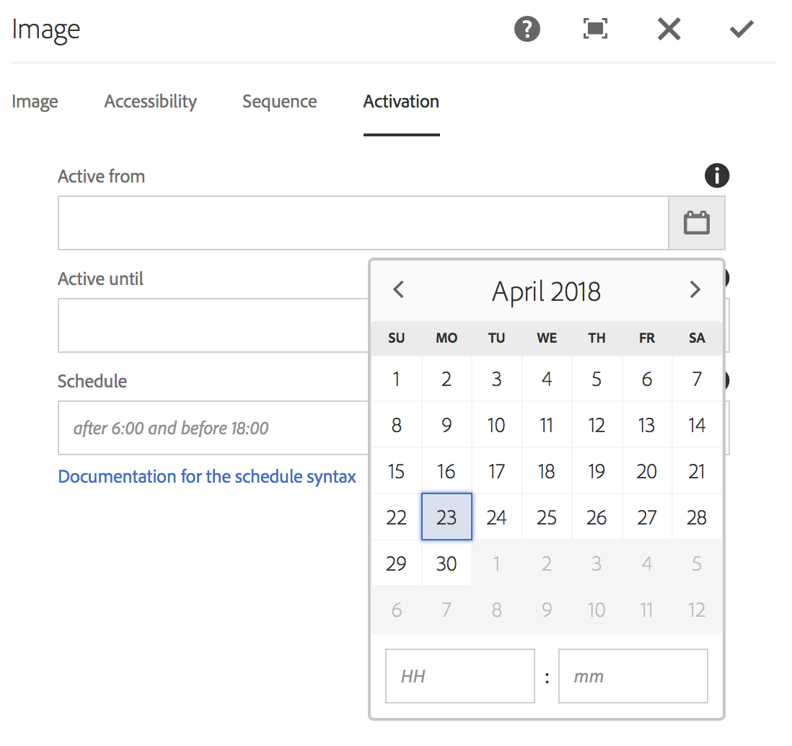

# Schemaläggning på tillgångsnivå {#asset-level-scheduling}

I det här avsnittet beskrivs schemaläggning på tillgångsnivå för de resurser som används i kanaler.

Följande ämnen behandlas i detta avsnitt:

* Översikt
* Använda schemaläggning på tillgångsnivå
* Hantera återkommande i resurser
* Schemaläggning av flera resurser

>[!CAUTION]
>
>Den här AEM-skärmfunktionen är bara tillgänglig om du har installerat AEM 6.3 Feature Pack 3 eller AEM 6.4 Screens Feature Pack 1.
>
>Om du vill få tillgång till det här funktionspaketet måste du kontakta Adobes support och begära åtkomst. När du har behörighet kan du hämta den från paketresursen.

## Översikt {#overview}

***Med Schemaläggning*** på tillgångsnivå kan du aktivera en viss resurs i en kanal för en schemalagd tidsram i spelarens lokala tidszon. Detta är tillgängligt för bilder, videoklipp, övergångar, sidor och inbäddade kanaler (dynamiska eller statiska).

*Du vill till exempel* att en specialkampanj endast ska visas under en glad timme (2:00 till 5:00) på måndagar och onsdagar.

Med den här funktionen kan du inte bara ange start- och slutdatum och sluttid utan även ett upprepningsmönster.

## Använda schemaläggning på tillgångsnivå {#using-asset-level-scheduling}

Resursnivåschemaläggning görs genom att fliken **Aktivering** konfigureras samtidigt som egenskaperna för en resurs hämtas.

Följ stegen nedan för att utföra planering på tillgångsnivå:

1. Markera en kanal och klicka på **Redigera** i åtgärdsfältet för att lägga till eller redigera innehåll i kanalen.

   

   >[!NOTE]
   >
   >Mer information om hur du
   >
   >* Skapa ett projekt, se [Skapa ett nytt projekt](creating-a-screens-project.md).
   >* Skapa och lägga till innehåll i en kanal, se [Hantera kanaler](managing-channels.md).

1. Klicka på **Redigera** för att öppna kanalredigeraren och markera en resurs som du vill använda schemaläggningen på.

   

1. Markera resursen och klicka på ikonen **Konfigurera** överst till vänster för att öppna bildens egenskaper.

   Klicka på fliken **Aktivering** .

   

1. Du kan ange datumet från datumväljaren i fälten **Aktiv från** och **Aktiv till** .

   Om du väljer alternativet** Aktiv från** och **Aktiv till** datum och tid visas och upprepas resursen endast mellan startdatumet/tiden respektive slutdatumet/tiden.

   

## Hantera återkommande i resurser {#handling-recurrence-in-assets}

Du kan schemalägga att mediefiler ska återkomma med vissa intervall på daglig, veckovis eller månadsbasis efter behov.

Anta att du bara vill visa en bild på fredag från 1:00 till 10:00. Du kan använda fliken Aktivering för att ange önskat intervall för resursen.

### Lägga till en återkommande händelse för resursen {#adding-a-recurring-event-for-your-asset}

1. Markera resursen och klicka på ikonen **Konfigurera** för att öppna dialogrutan Egenskaper.
1. När du har angett startdatum/tid och slutdatum/tid kan du använda ett cron-uttryck eller en naturlig textversion för att ange upprepningsschemat.

   Du kan söka på webben efter en generator för kostnadsfria cron-uttryck och sedan kopiera och klistra in cron-uttrycket i **Schedule** så visas resursen för det angivna intervallet för dag och tid.

   *I stället* för att använda cron-uttryck kan du använda den naturliga textversionen, till exempel *efter 6:00 och före 18:00* på fredag, för att utföra uppgiften. Ange texten i **Schemalägg** för att visa resursen.

## Schemaläggning av flera resurser {#multi-asset-scheduling}

>[!CAUTION]
>
>Funktionen **Schemaläggning** av flera resurser är bara tillgänglig om du har installerat AEM 6.3 Feature Pack 5 eller AEM 6.4 Feature Pack 3.

***Schemaläggning*** av flera resurser gör det möjligt för användaren att välja flera resurser och tillämpa ett uppspelningsschema för alla markerade resurser.

### Förutsättningar {#prerequisites}

Om du vill använda schemaläggning på flera tillgångsnivåer för dina resurser skapar du ett AEM-skärmsprojekt med en sekvenskanal. I följande exempel visas implementeringen av funktionen:

* Skapa ett AEM Screens-projekt med namnet **MultiAssetDemo**
* Skapa en kanal med namnet **MultiAssetChannel** och lägg till innehåll i kanalen, enligt bilden nedan

Följ stegen nedan för att välja flera resurser och schemalägga hur de ska visas i ett AEM-skärmsprojekt:

1. Välj **MultiAssetChannel** och klicka på **Redigera** i åtgärdsfältet för att öppna redigeraren.

   

1. Markera flera resurser i redigeraren och klicka på **Redigera aktivering** (ikonen längst upp till vänster).

   

1. Välj datum och tid i **Aktiv från** och **Aktiv till **i dialogrutan **Komponentaktivering** . Klicka på bockmarkeringsikonen när du är klar med att välja scheman.

   

1. Klicka på Uppdatera för att kontrollera de resurser som används i ett schema för flera resurser.

   >[!NOTE]
   >
   >Schemaikonen visas i det övre högra hörnet för de resurser som har schemaläggning av flera resurser.

   

