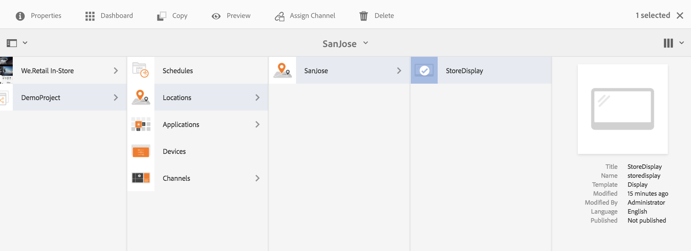

# Kanaltilldelning {#channel-assignment}

Detta avsnitt behandlar följande ämnen:

* **Tilldela en kanal**
* **Förstå egenskaper för dialogrutan Kanaltilldelning**
* **Dayparting**

När du har definierat en skärm måste du tilldela en kanal till en skärm.

På den här sidan visas hur du tilldelar en kanal till dina skärmar.

**Krav**:

* [Konfigurera och distribuera skärmar](/help/screens/configuring-screens-introduction.md)
* [Skapa och hantera skärmsprojekt](/help/screens/creating-a-screens-project.md)
* [Skapa och hantera kanaler](/help/screens/managing-channels.md)
* [Skapa och hantera platser](/help/screens/managing-locations.md)
* [Skapa och hantera bildskärmar](/help/screens/managing-displays.md)

## Tilldela en kanal {#assign-a-channel}

Följ stegen nedan för att tilldela en kanal till en skärm:

1. Navigera till önskad visning, till exempel **DemoProject** > **Locations** > **SanJose** > **StoreDisplay**.

   

1. Tryck/klicka på **Tilldela kanal** i åtgärdsfältet

   Eller

   Tryck/klicka på **** Kontrollpanelen och klicka på **+Tilldela kanal** på panelen **TILLDELADE KANALER** för att öppna dialogrutan **Kanaltilldelning** .

   

   Du kan konfigurera följande egenskaper i dialogrutan **Kanaltilldelning** :

   **Kanalroll**:

   Kanalrollen definierar visningssammanhanget. Rollen är inriktad på olika åtgärder och är oberoende av den faktiska kanal som uppfyller rollen.

   **Referenskanal**:

   Med referenskanalen kan du ange en referens till den önskade kanalen, antingen efter kanalnamn eller efter kanalsökväg.

   * **efter sökväg**: du anger en explicit referens med kanalens absoluta sökväg.
   * **efter namn**: Du anger namnet på den kanal som ska matchas mot en faktisk kanal efter kontext. Med den här funktionen kan du skapa en lokal version av en kanal för att dynamiskt matcha platsspecifikt innehåll. Exempel: en kanal med *dagens* namnaffärer, där det faktiska innehållet skulle vara annorlunda i två städer, men du har fortfarande den tillräkneliga kanalrollen på alla skärmar.
   **Prioritet:**

   Prioritet används för att ordna tilldelningarna om flera matchar uppspelningsvillkoren. Den som har det högsta värdet har alltid företräde framför de lägre värdena. Om det till exempel finns två kanaler A och B. A har prioriteten 1 och B har prioriteten 2, och sedan visas kanal B eftersom den har högre prioritet än A.

   Prioriteten för en kanal anges som ett tal (1 för minimum) i dialogrutan **Kanaltilldelning **som nämns ovan. Dessutom sorteras de tilldelade kanalerna baserat på fallande prioritet.

   **Händelser** som stöds:

   * **Inledande inläsning**: läser in kanalen när spelaren startas. Den kan tilldelas flera kanaler i kombination med ett schema
   * **Inaktiv skärm**: läses in när skärmen är inaktiv. Den kan tilldelas flera kanaler i kombination med ett schema
   * **Timer**: måste anges när ett schema anges
   * **Användarinteraktion**: spelaren växlar till den angivna kanalen, om det finns en användarinteraktion på skärmen (pekning) i en inaktiv kanal och kommer att läsas in när skärmen rörs
   **Schema**:

   Med Schema kan du ange en beskrivning i text när kanalen ska visas. Här kan du också definiera ett startdatum (**aktivt från**) och ett slutdatum (**aktivt till**) för den kanal som ska visas. Syntaxen för schemauttrycket baseras på text och cron-syntax i later.js:

   * [https://bunkat.github.io/later/parsers.html#text](https://bunkat.github.io/later/parsers.html#text)
   * [https://bunkat.github.io/later/parsers.html#cron](https://bunkat.github.io/later/parsers.html#cron)
   **Visa funktionsbeskrivning**:

   Show Attaction tooltip (Visa beskrivning av attraktionsverktyg) anger om verktygstipset (&quot;*Peka var som helst för att börja*&quot;) ska visas eller inte medan kanalen körs.

1. Klicka på **Spara** för att tilldela den skapade kanalen till en visning.

## Dayparting {#dayparting}

När scheman kombineras med **Dayparting** kan du ange ett globalt schema med flera kanaler som körs vid specifika tidpunkter på dygnet och återanvända inställningarna för alla skärmar samtidigt.

DayParting innebär att dela upp en dag i tidskortplatser och ange vilket innehåll som spelas upp vid önskad tidpunkt. Med AEM Screens kan ni schemalägga kanaler utifrån hur de skickas varje dag, vecka eller månad efter behov.

I följande exempel förklaras hur dagdelning sker i kanaler i tre olika scenarier:

### Spela upp innehåll på en dag uppdelat i flera tidsplatser {#playing-content-on-a-single-day-divided-into-multiple-time-slots}

I det här exemplet visas hur en Restaurant använder dagseparering för att visa sin frukost-, lunch- och middagsmeny.

Här delar vi upp varje dag i tre olika tidsplatser, så att kanalinnehållet spelas upp enligt den angivna tiden på dagen:

| **Kanal** | **Roll** | **Prioritet** | **Schema** |
|---|---|---|---|
| Meny_A | Frukosten |  | efter 6:00 och före 11:00 |
| Meny_B | Lunch |  | efter 11:00 och före 15:00 |
| Meny_C | Middag |  | efter 15:00 och före 20:00 |

#### Spela upp innehåll en viss veckodag {#playing-content-on-a-particular-day-of-the-week}

I det här exemplet visas hur det går till på dagen i ett kasino där live-event inträffar varje helg från kl. 20.00 till 23.00 och erbjudanden är tillgängliga för middagsmeny efter kl. 10.00 till kl. 13.00.

<table> 
 <tbody> 
  <tr> 
   <td><strong>Kanal</strong></td> 
   <td><strong>Roll</strong></td> 
   <td><strong>Prioritet</strong></td> 
   <td><strong>Schema</strong></td> 
  </tr> 
  <tr> 
   <td>LiveConvert</td> 
   <td>Weekend</td> 
   <td> </td> 
   <td>21 okt 2017 - 22 okt 2017   efter 20:00 före 22:00</td> 
  </tr> 
  <tr> 
   <td>SpecialMiddag</td> 
   <td>Weekend</td> 
   <td> </td> 
   <td>21 okt 2017 - 22 okt 2017   efter 22:00 före 13:00</td> 
  </tr> 
 </tbody> 
</table>

### Spela upp innehåll under en viss månad/månad {#playing-content-for-a-particular-month-months}

I det här exemplet visas dagen för en butik som visar sin sommarsamling från juni till augusti och höstsamlingen från september till slutet av oktober.

Här skapar du datumdelning per månad så att kanalinnehållet spelas upp enligt årets angivna månader.

| **Kanal** | **Roll** | **Prioritet** | **Schema** |
|---|---|---|---|
| SummerCollection | Sommar |  | 1 juni 2017 - 31 aug 2017 |
| FallCollection | Höst |  | 1 september 2017 - 30 oktober 2017 |

>[!NOTE]
>
>Dessutom kan du definiera ***prioritet*** för var och en av kanalerna. Om till exempel två kanaler är inställda för samma dag och tid eller för samma månad, spelas den kanal som har högre prioritet upp först. Minimivärdet för prioritet kan anges till 0.

### Spela upp innehåll för kanaler med samma prioritet {#playing-content-for-channels-with-same-priority}

I det här exemplet visas dagen för en butik som visar sin vintersamling med samma schema under december-månaden. Men eftersom kanal B har prioriteten 2, under den veckan, Kanal B spelar upp innehållet i stället för kanal A.

| **Kanal** | **Roll** | **Prioritet** | **Schema** |
|---|---|---|---|
| A | Vinter | 1 | 1 dec 2017 - 31 dec 2017 |
| B | Jul | 2 | 24 dec 2017 - 31 dec 2017 |

