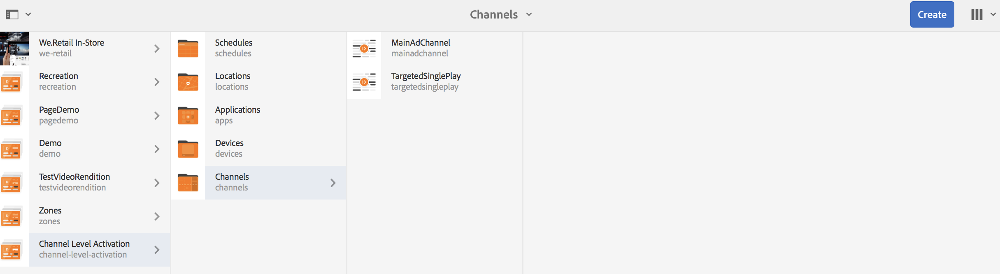
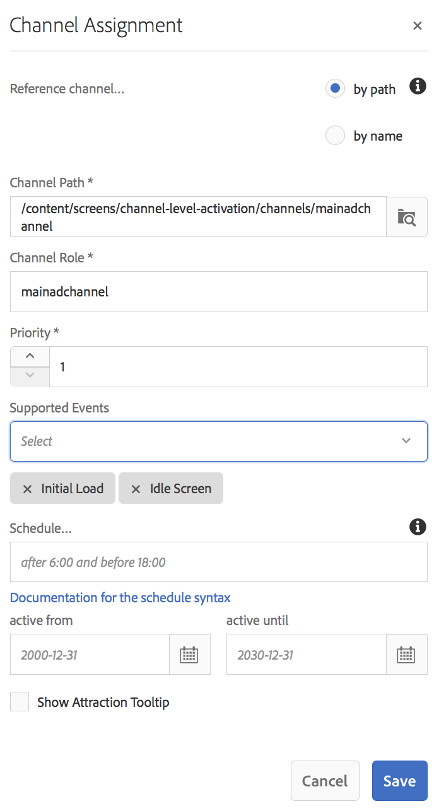

# Aktivering på kanalnivå - uppspelning av enstaka händelse{#channel-level-activation-single-event-playback}

Användning av Kanalnivåaktivering omfattar följande ämnen:

* **[Översikt](/help/screens/channel-level-activation.md#overview)**
* **[Använda kanalnivåaktivering som en enda händelseuppspelning](/help/screens/channel-level-activation.md#using-channel-level-activation)**

   * **[Förutsättningar](/help/screens/channel-level-activation.md#prerequisites)**
   * **[Implementering](/help/screens/channel-level-activation.md#implementation)**

* **[Visa resultaten](/help/screens/channel-level-activation.md#viewing-the-results)**

## Översikt {#overview}

***Kanalnivåaktivering*** gör att kanalerna kan växla efter ett visst angivet schema. Den enskilda händelsekanalen ersätter huvudkanalen efter ett angivet schema och spelas upp en viss tid tills huvudkanalen spelar upp innehållet igen.

I följande exempel får du en lösning genom att fokusera på följande nyckeltermer:

* en ***huvudsekvenskanal*** för den globala sekvensen
* en ***enda händelsekanal*** som bara körs en gång i taget
* ett ***angivet schema och prioritet*** för den enda uppspelningshändelsen som inträffar inuti huvudsekvenskanalen

## Använda aktivering på kanalnivå {#using-channel-level-activation}

I följande avsnitt beskrivs hur du skapar en enda händelseuppspelning i en kanal för ett AEM Screens-projekt.

### Förutsättningar {#prerequisites}

Innan du börjar implementera den här funktionen bör du kontrollera att du har följande krav klara att börja implementera aktivering på kanalnivå:

* Skapa ett AEM-skärmsprojekt (i det här exemplet **Kanalnivåaktivering**)

* Skapa en kanal som **MainAdChannel** under mappen **Kanaler**

* Skapa en annan kanal som **TargetedSinglePlay** under mappen **Kanaler**

* Lägg till relevanta resurser i båda kanalerna

Följande bild visar **kanalnivåaktiveringsprojektet** med kanalerna **MainAdChannel** och **TargetedSinglePlay** i mappen **Channel** .

>[!NOTE]
>
>Mer information om hur du skapar ett projekt och hur du skapar en sekvenskanal finns i resurserna nedan:
>
>* [Skapa och hantera projekt](/help/screens/creating-a-screens-project.md)
   >
   >
* [Hantera en kanal](/help/screens/managing-channels.md)
>

### Implementering {#implementation}

Implementering av aktivering på kanalnivå i ett AEM-skärmsprojekt innefattar tre viktiga uppgifter:

1. **Konfigurera Project-taxonomin inklusive kanaler, platser och bildskärmar**
1. **Tilldela kanaler att visa**
1. **Konfigurera ett schema och en prioritet**

Följ stegen nedan för att implementera funktionen:

1. **Skapa en plats**

   Navigera till mappen **Platser** i ditt AEM Screens-projekt och skapa en plats som **Region**.

   

   >[!NOTE]
   >
   >Mer information om hur du skapar en plats finns i **[Skapa och hantera platser](/help/screens/managing-locations.md)**.

1. **Skapa visning under plats**

   1. Navigera till **Kanalnivåaktivering** > **Platser** > **Region**.
   1. Välj **Region** och klicka på **+ Skapa** i åtgärdsfältet.
   1. Välj **Visning** i guiden och skapa en visning med namnet **RegionDisplay.**
   

1. **Tilldela kanaler att visa**

   För **MainAdChannel:**

   1. Navigera till **Kanalnivåaktivering** > **Platser** > **Region** > **RegionDisplay** och klicka på **Tilldela kanal** i åtgärdsfältet.
   1. **Dialogrutan Kanaltilldelning** öppnas.
   1. Välj **referenskanal**.. efter bana.
   1. Välj **kanalsökvägen** som **Kanalnivåaktivering** —> ***Kanaler*** —> ***MainAdChannel***.
   1. Kanalrollen **** fylls i som **huvudkanal**.
   1. Välj **Prioritet** som **1**.
   1. Välj **händelser** som stöds som **Inledande inläsning** och **Inaktiv skärm**.
   1. Click **Save**.
   

   >[!NOTE]
   >
   >Du kan också tilldela en kanal från kontrollpanelen genom att gå till **Kanalnivåaktivering** —> **Platser** —> **Region** —> **RegionDisplay** och klicka på **Kontrollpanelen** i åtgärdsfältet. Klicka på **+ Tilldela kanal** på panelen **TILLDELADE KANALER &amp; SCHEMAT** .

   Tilldela på liknande sätt kanalen **TargetedSinglePlay** för visning**:

   1. Navigera till **Kanalnivåaktivering** —> **Platser** —> **Region** —> **RegionDisplay** och klicka på **Tilldela kanal** i åtgärdsfältet.
   1. **Dialogrutan Kanaltilldelning** öppnas.
   1. Välj **referenskanal**.. efter bana.
   1. Välj **kanalsökvägen** som **kanalnivåaktivering*** —> ***Kanaler*** —> ***TargetedSinglePlay***.*
   1. Kanalrollen **** fylls i som **målenskild**.
   1. Ange **Prioritet** som **2**.
   1. Välj **Händelser** som stöds som **Inledande laddning**, **Inaktivitetsskärm** och **Timer***, *enligt bilden nedan.
   1. Välj **aktivt datum från** och med 27 november 2018 klockan 11:59 och **aktivt till** och med 28 november 2018 kl. 12:05.**
   1. Click **Save**.*
*
   >[!CAUTION]
   Du måste ange prioriteten för **kanalen TargetedSinglePlay** som är högre än **MainAdSegment** -kanalen.

   

   >[!NOTE]
   Om du vill välja samma dag måste du markera nästa dag och manuellt redigera datumet till samma dag, men för en senare tid. Detta hindrar användaren från att välja ett tidigare datum. Se exemplet nedan:

   

## Visa resultaten {#viewing-the-results}

När du har konfigurerat kanalerna och visningen är klar startar du AEM Screens Player för att visa innehållet.

Spelaren visar innehållet i **MainAdChannel** och exakt klockan 23.59 (enligt schemat), visar **TargetSinglePlay** -kanalen innehållet fram till 12.05 och sedan **MainAdChannel** återupptar uppspelningen av innehållet igen.

>[!NOTE]
Läs mer om AEM Screen Player här:
* [**AEM Screens Player - nedladdningar **](https://download.macromedia.com/screens/)
* [**Arbeta med AEM Screens Player **](/help/screens/working-with-screens-player.md)

