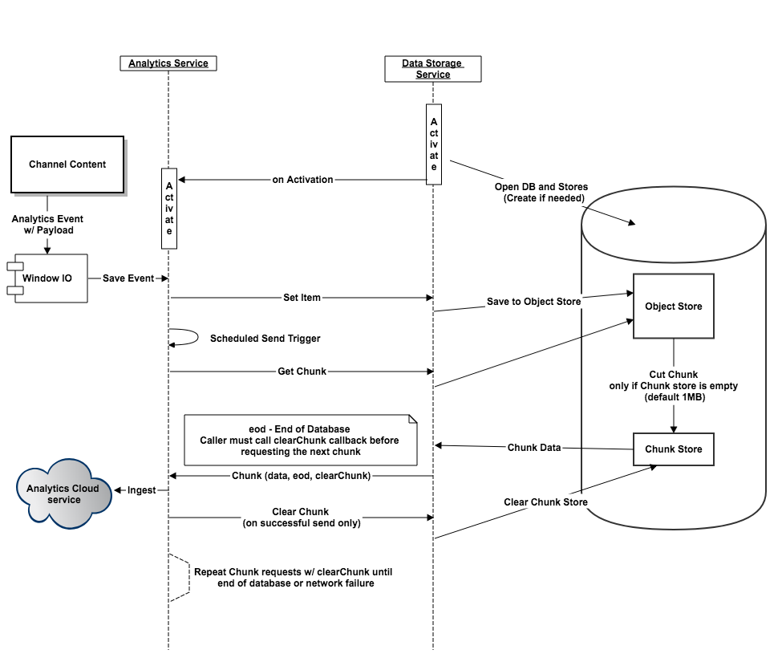

# Konfigurera Adobe Analytics med AEM-skärmar{#configuring-adobe-analytics-with-aem-screens}

>[!CAUTION]
>
>Den här AEM-skärmfunktionen är bara tillgänglig om du har installerat AEM 6.4.2 Feature Pack 2 och AEM 6.3.3 Feature Pack 4.

>Om du vill få tillgång till något av dessa funktionspaket måste du kontakta Adobes support och begära åtkomst. När du har behörighet kan du hämta den från paketresursen.
>
Detta avsnitt behandlar följande ämnen:

* **Sekvenser i Adobe Analytics med AEM Screens**
* **Skicka anpassade händelser med hjälp av Adobe Analytics offline**
* **Mappning av begäranden**

## Sekvenser i Adobe Analytics med AEM Screens {#sequencing-in-adobe-analytics-with-aem-screens}

Sekvensprocessen ****** börjar med datalagringstjänsten som aktiverar tjänsten Adobe Analytics. Kanalinnehåll skickar Adobe Analytics-händelser med lön, det vill säga datatestning till Windows I/O och stannar-händelser aktiveras. Händelserna sparas i indexdatabasen och placeras sedan i objektarkivet. Baserat på schemat klipper administratören in data från objektarkivet och överför dem vidare till segmentlagret. Den försöker skicka maximalt med data när den är ansluten.

### Sekvensdiagram {#sequencing-diagram}

I följande sekvensdiagram förklaras Adobe Analytics-integreringen med AEM-skärmar:

## Skicka anpassade händelser med hjälp av Adobe Analytics offline {#sending-custom-events-using-offline-adobe-analytics}

I följande tabell sammanfattas standarddatamodellen för händelser. Här listas alla fält som skickas till Adobe Analytics:

<table> 
 <tbody>
  <tr>
   <td><strong>Avsnitt</strong></td> 
   <td><strong>Egenskapsetikett</strong></td> 
   <td><strong>Egenskapsnamn/nyckel</strong></td> 
   <td><strong>Krävs</strong></td> 
   <td><strong>Datatyp</strong></td> 
   <td><strong>Egenskapstyp</strong>  </td> 
   <td><strong>Beskrivning</strong></td> 
  </tr>
  <tr>
   <td><strong><em>Core/Event</em></strong></td> 
   <td>Händelse-GUID</td> 
   <td>event.guid</td> 
   <td>rekommenderas</td> 
   <td>string</td> 
   <td>UUID</td> 
   <td>Unikt ID som identifierar en instans av en händelse</td> 
  </tr>
  <tr>
   <td> </td> 
   <td>Datum och tid för insamling av händelse</td> 
   <td>event.coll_dts</td> 
   <td>valfritt</td> 
   <td>string</td> 
   <td>tidsstämpel - UTC</td> 
   <td>Datum och tid för samling</td> 
  </tr>
  <tr>
   <td> </td> 
   <td>Datum och tid för händelse (start)</td> 
   <td>event.dts_start</td> 
   <td>rekommenderas</td> 
   <td>string</td> 
   <td>tidsstämpel - UTC</td> 
   <td>Händelsens startdatum och starttid, om du INTE anger detta, antas händelsetiden vara den tidpunkt då den togs emot av servern</td> 
  </tr>
  <tr>
   <td> </td> 
   <td>Datum och tid för händelse (slut)</td> 
   <td>event.dts_end</td> 
   <td>valfritt</td> 
   <td>string</td> 
   <td>tidsstämpel - UTC</td> 
   <td>Datum och tid för slutförande av händelse</td> 
  </tr>
  <tr>
   <td> </td> 
   <td>Arbetsflöde</td> 
   <td>event.workflow</td> 
   <td>rekommenderas</td> 
   <td>string</td> 
   <td> </td> 
   <td>Arbetsflödets namn (skärmar)</td> 
  </tr>
  <tr>
   <td> </td> 
   <td>Main DMe Category</td> 
   <td>event.category</td> 
   <td>required</td> 
   <td>string</td> 
   <td> </td> 
   <td>Huvudkategori (DATOR, MOBIL, WEB, PROCESS, SDK, SERVICE, ECOSYSTEM) - Gruppering av händelsetyper - <strong>Vi skickar spelare</strong></td> 
  </tr>
  <tr>
   <td> </td> 
   <td>Underkategori</td> 
   <td>event.subcategory</td> 
   <td>rekommenderas</td> 
   <td>string</td> 
   <td> </td> 
   <td>Underkategori - Avsnitt i ett arbetsflöde eller område på en skärm osv. (Senaste filer, CC-filer, mobila arbeten osv.)</td> 
  </tr>
  <tr>
   <td> </td> 
   <td>Typ av händelse/åtgärd</td> 
   <td>event.type</td> 
   <td>required</td> 
   <td>string</td> 
   <td> </td> 
   <td>Händelsetyp (återge, klicka, nypa, zooma) - åtgärd för primär användare</td> 
  </tr>
  <tr>
   <td> </td> 
   <td>Undertyp</td> 
   <td>event.subtype</td> 
   <td>rekommenderas</td> 
   <td>string</td> 
   <td> </td> 
   <td>Händelsetyp (skapa, uppdatera, ta bort, publicera osv.) - Ytterligare information om användaråtgärden</td> 
  </tr>
  <tr>
   <td> </td> 
   <td>Offline</td> 
   <td>event.offline</td> 
   <td>valfritt</td> 
   <td>boolean</td> 
   <td> </td> 
   <td>Händelsen genererades när åtgärden var offline/online (true/false)</td> 
  </tr>
  <tr>
   <td> </td> 
   <td>Användaragent</td> 
   <td>event.user_agent</td> 
   <td>rekommenderas (webbegenskaper)</td> 
   <td>string</td> 
   <td> </td> 
   <td>Användaragent</td> 
  </tr>
  <tr>
   <td> </td> 
   <td>Språk/språk</td> 
   <td>event.language</td> 
   <td>rekommenderas</td> 
   <td>string</td> 
   <td> </td> 
   <td>Användarens språkområde är en sträng som baseras på konventionerna för språktaggning i RFC 3066 (t.ex. en-US, fr-FR eller es-ES)</td> 
  </tr>
  <tr>
   <td> </td> 
   <td>Enhets-GUID</td> 
   <td>event.device_guid</td> 
   <td>valfritt</td> 
   <td>string  </td> 
   <td>UUID</td> 
   <td>Identifierar enhets-GUID (t.ex. dator-ID eller hash för IP-adressen + nätmasken + nätverks-ID + användaragent) - Här skickar vi användarnamnet för spelaren som genereras vid registreringen.</td> 
  </tr>
  <tr>
   <td> </td> 
   <td>Count</td> 
   <td>event.count</td> 
   <td>valfritt</td> 
   <td>tal</td> 
   <td> </td> 
   <td>Antal gånger händelsen har inträffat - Här skickar vi videons längd</td> 
  </tr>
  <tr>
   <td> </td> 
   <td>Värde</td> 
   <td>event.value</td> 
   <td>valfritt</td> 
   <td>string</td> 
   <td> </td> 
   <td>Händelsens värde (t.ex. på/av-inställningar)</td> 
  </tr>
  <tr>
   <td> </td> 
   <td>Sidnamn</td> 
   <td>event.pagename</td> 
   <td>krävs för AA</td> 
   <td>string</td> 
   <td> </td> 
   <td>Stöd för anpassade sidnamn i Adobe Analytics</td> 
  </tr>
  <tr>
   <td> </td> 
   <td>Webbadress</td> 
   <td>event.url</td> 
   <td>valfritt</td> 
   <td>string</td> 
   <td> </td> 
   <td>URL för webbegenskapen eller mobilschemat - måste innehålla en fullständigt kvalificerad URL</td> 
  </tr>
  <tr>
   <td> </td> 
   <td>Felkod</td> 
   <td>event.error_code</td> 
   <td> </td> 
   <td>string</td> 
   <td> </td> 
   <td>Felkod</td> 
  </tr>
  <tr>
   <td> </td> 
   <td>Feltyp</td> 
   <td>event.error_type</td> 
   <td> </td> 
   <td>string</td> 
   <td> </td> 
   <td>Feltyp</td> 
  </tr>
  <tr>
   <td> </td> 
   <td>Felbeskrivning</td> 
   <td>event.error_description</td> 
   <td> </td> 
   <td>string</td> 
   <td> </td> 
   <td>Felbeskrivning  </td> 
  </tr>
  <tr>
   <td><strong><em>Källa/ursprunglig produkt</em></strong></td> 
   <td>Namn</td> 
   <td>source.name</td> 
   <td>required</td> 
   <td>string</td> 
   <td> </td> 
   <td>Programnamn (AEM-skärmar)</td> 
  </tr>
  <tr>
   <td> </td> 
   <td>Version</td> 
   <td>source.version</td> 
   <td>required</td> 
   <td>string</td> 
   <td> </td> 
   <td>Firmware-version</td> 
  </tr>
  <tr>
   <td> </td> 
   <td>Plattform</td> 
   <td>source.platform</td> 
   <td>required</td> 
   <td>string</td> 
   <td> </td> 
   <td>navigator.platform</td> 
  </tr>
  <tr>
   <td> </td> 
   <td>Enhet</td> 
   <td>source.device</td> 
   <td>obligatoriska w/Exceptions</td> 
   <td>string</td> 
   <td> </td> 
   <td>Spelarnamn</td> 
  </tr>
  <tr>
   <td> </td> 
   <td>OS-version</td> 
   <td>source.os_version</td> 
   <td>obligatoriska w/Exceptions</td> 
   <td>string</td> 
   <td> </td> 
   <td>O/S-version</td> 
  </tr>
  <tr>
   <td><strong><em>Innehåll</em></strong></td> 
   <td>Åtgärd</td> 
   <td>content.action</td> 
   <td>required</td> 
   <td>string</td> 
   <td> </td> 
   <td>URL:en till resursen inklusive återgivningen som spelades upp</td> 
  </tr>
  <tr>
   <td> </td> 
   <td>Mime-typ</td> 
   <td>content.mimeType</td> 
   <td>valfritt</td> 
   <td>string</td> 
   <td> </td> 
   <td>Innehållets Mime-typ</td> 
  </tr>
  <tr>
   <td><strong><em>Transaktion</em></strong></td> 
   <td>Transaktionsnummer</td> 
   <td>trn.number</td> 
   <td>required</td> 
   <td>string</td> 
   <td>UUID</td> 
   <td>Unikt ID som helst följer UUID v4</td> 
  </tr>
  <tr>
   <td> </td> 
   <td>Produktbeskrivning</td> 
   <td>trn.product</td> 
   <td>required</td> 
   <td>string</td> 
   <td> </td> 
   <td>URL:en till resursen (exklusive återgivning)</td> 
  </tr>
  <tr>
   <td> </td> 
   <td>Kvantitet</td> 
   <td>trn.quantity</td> 
   <td>required</td> 
   <td>string</td> 
   <td> </td> 
   <td>Uppspelningens längd</td> 
  </tr>
 </tbody>
</table>

## Mappning av begäranden {#request-mapping}

I följande tabell mappas analysstandarddatamodellfält till AEM Screens-data:

<table> 
 <tbody>
  <tr>
   <td><strong>Attribut för analysstandarddatamodell</strong></td> 
   <td><strong>Skärmdata mappade till standarddatamodell</strong></td> 
   <td><strong>Fylls i av</strong></td> 
  </tr>
  <tr>
   <td>content.action</td> 
   <td>
URL för den faktiska återgivningen av den resurs som spelas upp.
 
En video kan till exempel ha många återgivningar. Detta pekar på den rendering som faktiskt spelas upp.
 </td> 
   <td>Kanal</td> 
  </tr>
  <tr>
   <td>content.category</td> 
   <td>Visning som är associerad med spelaren</td> 
   <td>Firmware</td> 
  </tr>
  <tr>
   <td>content.type</td> 
   <td>Typ av resurs som spelas upp (bild/video)</td> 
   <td>Kanal</td> 
  </tr>
  <tr>
   <td>event.category</td> 
   <td>Player</td> 
   <td>Firmware</td> 
  </tr>
  <tr>
   <td>event.colldts</td> 
   <td>Tidsstämpel för samlingen av den här händelsen</td> 
   <td>Kanal</td> 
  </tr>
  <tr>
   <td>event.count</td> 
   <td>Spelets längd</td> 
   <td>Kanal</td> 
  </tr>
  <tr>
   <td>event.device_gui</td> 
   <td>Spelarens användar-ID i AEM</td> 
   <td>Firmware</td> 
  </tr>
  <tr>
   <td>event.dts_end</td> 
   <td>Tidsstämpeln för händelsens slut</td> 
   <td>Kanal</td> 
  </tr>
  <tr>
   <td>event.dts_start</td> 
   <td>Tidsstämpeln för den här händelsens start</td> 
   <td>Kanal</td> 
  </tr>
  <tr>
   <td>event.language</td> 
   <td>Språkinställningen som den rapporteras av spelaren</td> 
   <td>Firmware</td> 
  </tr>
  <tr>
   <td>event.subtype</td> 
   <td>end (anger slutet på uppspelningen av en resurs)</td> 
   <td>Kanal</td> 
  </tr>
  <tr>
   <td>event.type</td> 
   <td>play (Denoting proof of play)</td> 
   <td>Kanal</td> 
  </tr>
  <tr>
   <td>event.user_agent</td> 
   <td>spelarens användaragent</td> 
   <td>Firmware</td> 
  </tr>
  <tr>
   <td>event.value</td> 
   <td>En sträng som beskriver hur lång uppspelningen är</td> 
   <td>Kanal</td> 
  </tr>
  <tr>
   <td>event.workflow</td> 
   <td>Skärmar</td> 
   <td>Firmware</td> 
  </tr>
  <tr>
   <td>source.device</td> 
   <td>Spelarens egna namn som anges när spelaren registreras</td> 
   <td>Firmware</td> 
  </tr>
  <tr>
   <td>source.name</td> 
   <td>AEM-skärmar</td> 
   <td>Firmware</td> 
  </tr>
  <tr>
   <td>source.platform</td> 
   <td>Spelarens operativsystem</td> 
   <td>Firmware</td> 
  </tr>
  <tr>
   <td>source.version</td> 
   <td>Firmware-version</td> 
   <td>Firmware</td> 
  </tr>
  <tr>
   <td>trn.amount</td> 
   <td>0 (för spelbevis)</td> 
   <td>Kanal</td> 
  </tr>
  <tr>
   <td>trn.number</td> 
   <td>Unikt ID för den här händelsen</td> 
   <td>Firmware</td> 
  </tr>
  <tr>
   <td>trn.product</td> 
   <td>Den ursprungliga resursens URL (inte en återgivning)</td> 
   <td>Kanal</td> 
  </tr>
  <tr>
   <td>trn.quantity</td> 
   <td>Uppspelningens längd</td> 
   <td>Kanal</td> 
  </tr>
 </tbody>
</table>

>[!NOTE]
De fält som markeras som** Fylls i av** &quot;Kanal&quot; kan behöva fyllas i om du skickar en anpassad händelse i stället för ett spelbevis. Spelaren lägger automatiskt till alla fält som anges av den inbyggda programvaran.

