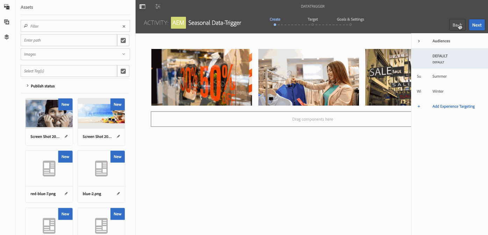

# Ändring av utlöst resurs{#data-triggered-asset-change}

## Använd fallbeskrivning {#use-case-description}

I det här exemplet med användningsexempel beskrivs hur du kan uppnå personaliserat innehåll baserat på ditt lokala väder.

Följande AEM Screens-projekt utnyttjar AEM-personalisering som inkluderar ContextHub, segmenteringsmotorn och gränssnittet för målanpassning för innehåll.

Det här användningsexemplet levererar innehåll som är personaliserat baserat på det aktuella vädret på varje plats, om vädret är:

* *soligt, det visar sommarkläder*
* *kalla, visa vinterkläder*

>[!NOTE]
>
>I demonstrationssyfte fångar det här användningsexemplet din geografiska plats för att visa innehållsuppdateringen. Du kan uppdatera utdata manuellt i vyn Geo-location i olika scenarier.

### Förhandsvillkor {#preconditions}

Innan du börjar använda det här användningsexemplet måste du förstå:

* [Personanpassning](/help/sites-administering/personalization.md)
* [ContextHub konfigureras](/help/sites-administering/contexthub-config.md)
* [Konfigurera segmentering med ContextHub](/help/sites-administering/segmentation.md)
* [Skapa riktat innehåll med målläge](/help/sites-authoring/content-targeting-touch.md)

### Primära aktörer {#primary-actors}

Innehållsförfattare

## Grundläggande flöde:Konfigurera projektet {#basic-flow-setting-up-the-project}

Följ stegen nedan för att konfigurera ett projekt som visar data som utlöser en resursändring:

1. Skapa ett AEM-skärmsprojekt med namnet **DataTriggerAsset**, enligt nedan.

   

1. **Skapa en sekvenskanal**

   1. Välj mappen **Kanaler** och klicka på **Skapa** för att öppna guiden och skapa en kanal.
   1. Välj **Sequence Channel** i guiden och skapa kanalen **DataTrigger**.
   

1. **Lägga till innehåll i sekvenskanalen**

   1. Välj kanalen **DataTrigger**.
   1. Klicka på **Redigera** i åtgärdsfältet för att öppna redigeraren. Dra och släpp några resurser i kanalen.
   

   >[!NOTE]
   >
   >Du får bara lägga till standardbilderna i redigeraren. De bilder du vill ersätta måste läggas till i redigeraren när du växlar till målläget i steg 6.

1. **Ställa in ContextHub och målinställningar**

   1. Navigera till **DataTriggerAsset** —> **Channels** —> **DataTrigger** och klicka på **Properties** i åtgärdsfältet.
   1. Klicka på fliken **Personalisering** .
   

1. **Lägga till ContextHub och målinställningar**

   1. Hämta innehållspaketet nedan om du vill se en demo.
   1. När du har hämtat paketet till din AEM-instans måste du ange ContextHub och Segments Path:
   * För **ContextHub** anger du sökvägen till: ***/libs/settings/cloudsettings/legacy/contexthub***
   * För **Segmentbana** anger du sökvägen till: ***/conf/data-triggers/settings/wcm/segments***
   Datautlösare

   [Hämta fil](assets/data-triggers-1_00.zip)

   >[!NOTE]
   >
   >Mer information om hur du konfigurerar ContextHub och Segmentation finns i:
   >
   >* [ContextHub konfigureras](/help/sites-administering/contexthub-config.md)
   >* [Konfigurera segmentering med ContextHub](/help/sites-administering/segmentation.md)

   

   Klicka på **Spara och stäng**.

1. **Växla till målläge**

   1. Navigera till **DataTriggerAsset** > **Channels** > **DataTrigger** och klicka på **Edit** i åtgärdsfältet.
   1. Välj **Mål** på menyraden under **Redigera**.
   

1. **Lägga till målinnehåll**

   1. Välj **Datutlösare** i **VARUMÄRKE** och **Säsongsutlösare **i **AKTIVITET**.
   1. Klicka på **Start Targeting**
   

1. **Definiera den riktade komponenten**

   1. Markera den komponent som du vill ha riktat innehåll för.
   1. Klicka på knappen **Mål** för att aktivera mål för den komponenten.
   1. Definiera innehållet för varje variation genom att välja variationen i **publikerna** i sidospåret och justera innehållet efter behov.
   >[!NOTE]
   >
   >Om du vill dölja panelen **Resurser** i redigeraren måste du klicka på vänsterpilen på den högra panelen, vilket visas i bilden nedan.

   

## Visa resultaten {#viewing-the-results}

När du har slutfört de föregående stegen följer du vidare för att förhandsgranska och visa resultaten:

1. Klicka på **Förhandsgranska** i redigeraren.

   

1. Om du vill visa hur bilden kommer att ändras, beroende på platsen och temperaturen i ditt område, kan du manuellt klicka på ContextHub-ikonen, som visas nedan.

   När du uppdaterar platsen hämtas temperaturen i det området och bilden uppdateras med vintervalet och ersätter sommarbilden.

   

