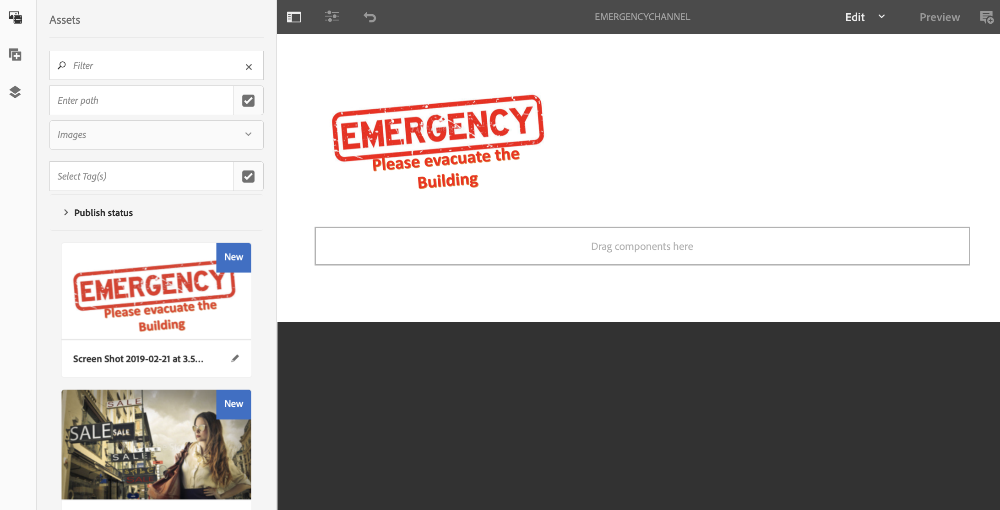

# Nödkanal{#emergency-channel}

## Använd fallbeskrivning {#use-case-description}

I det här avsnittet beskrivs ett exempel på hur du använder ett användningsexempel som fokuserar på att skapa och hantera en nödkanal som innehållsförfattaren kan växla från en sekvenskanal om ett villkor uppfylls.

### Förhandsvillkor {#preconditions}

Innan du börjar med det här användningsexemplet måste du förstå hur du gör:

* **[Skapa och hantera kanaler](/help/screens/managing-channels.md)**
* **[Skapa och hantera platser](/help/screens/managing-locations.md)**
* **[Skapa och hantera scheman](/help/screens/managing-schedules.md)**
* **[Enhetsregistrering](/help/screens/device-registration.md)**

### Primära aktörer {#primary-actors}

Innehållsförfattare

## Grundläggande flöde:Konfigurera projektet {#basic-flow-setting-up-the-project}

Följ stegen nedan för att konfigurera en nödkanal:

1. Skapa ett AEM-skärmsprojekt som heter **EmergencyChannel**, enligt nedan.

   >[!NOTE]
   >
   >Mer information om hur du skapar och hanterar projekt i AEM-skärmar finns i Skapa ett projekt.

   

1. **Skapa en sekvenskanal**

   1. Välj mappen **Kanaler** och klicka på **Skapa** för att öppna guiden och skapa en kanal.
   1. Välj **Sequence Channel **i guiden och skapa kanalen **MainAdChannel**.
   

1. **Lägga till innehåll i sekvenskanalen**

   1. Markera kanalen (**MainAdChannel**).
   1. Klicka på **Redigera** i åtgärdsfältet för att öppna redigeraren. Dra och släpp några resurser i kanalen.
   

1. **Skapa en nödkanal**

   1. Markera mappen **Kanaler** .
   1. Klicka på **Skapa** för att öppna guiden och skapa en kanal.
   1. Välj **Sequence Channel **i guiden och skapa kanalen **EmergencyChannel**.
   >[!NOTE]
   >
   >Normalt läggs din nödkanal till i ditt befintliga produktionsprojekt.

   

1. **Lägga till innehåll i en nödkanal**

   1. Markera kanalen (**Nödkanal)**.
   1. Klicka på **Redigera** i åtgärdsfältet för att öppna redigeraren. Dra och släpp den resurs som du vill ska köras i en nödsituation till kanalen.
   

1. **Skapa en plats**

   1. Navigera till mappen **Platser** .
   1. Klicka på **Skapa** i åtgärdsfältet och skapa en plats med namnet **Store** i guiden.
   

1. **Skapar bildskärmar på din plats**

   Navigera till platsen (**Store**) och klicka på **Skapa** i åtgärdsfältet. Följ guiden för att skapa två **skärmar** med namnen **StoreFront** och **StoreRear**.

   

1. **Skapa ett schema**

   1. Navigera till mappen **Scheman** .
   1. Klicka på **Skapa** i åtgärdsfältet. Följ guiden för att skapa ett schema med namnet **StoreSchedule**.
   

1. Tilldela båda skärmarna till ditt schema och ange prioriteter

   1. Välj schemat** (StoreSchedule)** och klicka på **Dashboard** i åtgärdsfältet.
   1. Klicka på **+ Tilldela kanal** på panelen **TILLDELADE KANALER** .
   1. I dialogrutan **Kanaltilldelning** :

      1. Markera sökvägen till **MainAdChannel**
      1. Ange **prioritet** som 2
      1. Ange att händelser som stöds ska vara **Inledande inläsning** och **Inaktiv skärm**.
      1. Click **Save**
      På samma sätt måste du utföra samma steg igen för att tilldela **EmergencyChannel** och ange dess **prioritet**.
   >[!NOTE]
   >
   >Prioritet används för att ordna tilldelningarna om flera matchar uppspelningsvillkoren. Den som har det högsta värdet har alltid företräde framför de lägre värdena.

   

1. 

   1. Klicka på **+ Tilldela kanal** på panelen **TILLDELADE KANALER** .
   1. I dialogrutan **Kanaltilldelning** :

      1. Välj sökvägen till **EmergencyChannel**
      1. Ange **prioritet** som 1
      1. Ange att händelser som stöds ska vara **Inledande inläsning**, **Inaktivitetsskärm** och **Användarinteraktion**
      1. Click **Save**
   

   Du kan visa de tilldelade kanalerna från **kontrollpanelen StoreSchedule** .

   

1. **Tilldela schema till varje skärm**

   1. Navigera till varje skärm, till exempel **EmergencyChannel** —> **Locations** —> **Store **—>**StoreFront**.
   1. Klicka på **Kontrollpanel** i åtgärden för att öppna kontrollpanelen.
   1. **Klicka**.. på panelen **TILLDELADE KANALER OCH SCHEMALÄGG** och ytterligare klicka på **+Tilldela schema**.
   1. Välj sökvägen till schemat (här, till exempel **EmergencyChannel** —> **Scheman** —>**StoreSchedule**).
   1. Click **Save**.
   Du kan visa det tilldelade schemat för visningen från **kontrollpanelen StoreSchedule** .

   

1. **Enhetsregistrering**

   Slutför registreringsprocessen och när du har registrerat dig ser du följande utdata på din AEM Screens Player.

   

## Växla till nödkanal {#switching-to-emergency-channel}

I händelse av en kris utför du följande steg:

1. Gå till **EmergencyChannel** —> **Schedules** —> **StoreSchedule** och välj **Dashboard** i åtgärdsfältet.

   

1. Välj **EmergencyChannel** på **StoreSchedule** -kontrollpanelen och klicka på **Redigera tilldelning**.

   

1. Uppdatera **Prioritet** för **EmergencyChannel** till **3** i dialogrutan **Kanaltilldelning** och klicka på **Spara**.

   

1. Så snart kanalens prioritet har uppdaterats visar alla AEM Screens-spelare **innehållet i EmergencyChannel** , vilket visas nedan.

   

### Slutsats {#conclusion}

Nödkanalen **** fortsätter att visa sitt innehåll tills innehållsförfattaren återställer prioritetsvärdet till 1.

När innehållsförfattaren får instruktionerna om att nödläget har rensats bör han/hon uppdatera prioriteten för **MainAdChannel** , vilket gör att den normala uppspelningen återupptas.
