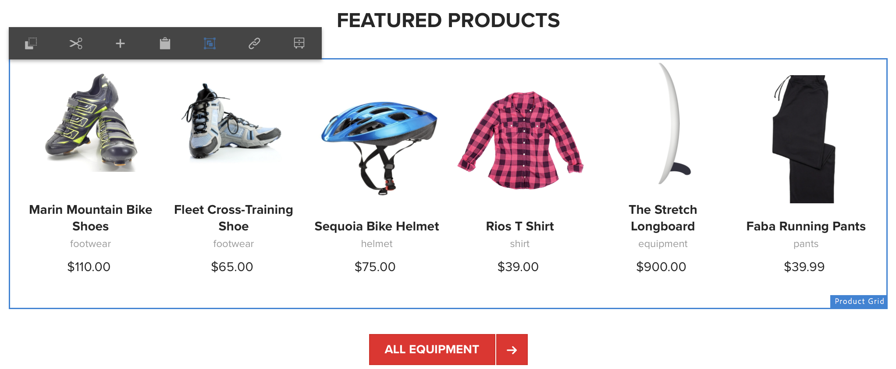
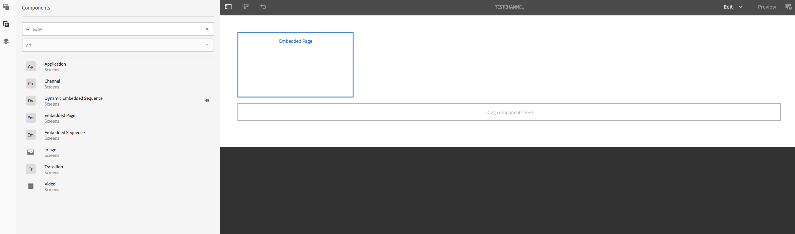
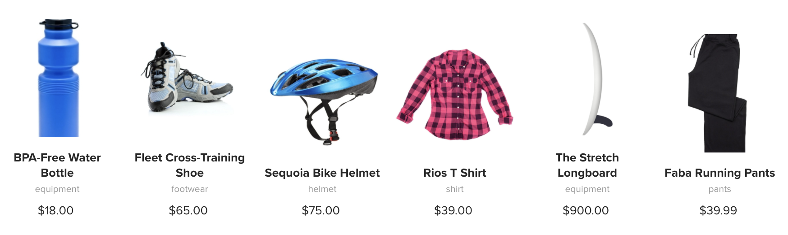

# Använda Experience Fragments{#using-experience-fragments}

Användning av Experience Fragments omfattar följande ämnen:

* **Översikt**
* **Använda upplevelsefragment i AEM-skärmar**
* **Sprider ändringar från mallsidan**

## Översikt {#overview}

Ett ***Experience Fragment*** är en grupp med en eller flera komponenter, inklusive innehåll och layout, som kan refereras till på sidor. Experience fragments kan innehålla alla komponenter, till exempel en eller flera komponenter som kan innehålla vad som helst i ett styckesystem, som refereras till den fullständiga upplevelsen eller begärs av en tredje slutpunkt.

## Använda upplevelsefragment i AEM-skärmar {#using-experience-fragments-in-aem-screens}

>[!NOTE]
>
>I följande exempel används **We.Retail** som ett demoprojekt där Experience Fragment används från en **Sites** -sida till ett AEM Screens-projekt.

I följande arbetsflöde demonstreras användningen av upplevelsefragment från We.Retail i Sites. Du kan välja en webbsida och använda det innehållet i din AEM Screens-kanal i något av dina projekt.

### Krav {#pre-requisites}

**Skapa ett demoprojekt med en kanal**

***Skapa ett projekt***

1. Klicka på Skärmar och välj **Skapa** —> **Skapa projekt **för att skapa ett nytt projekt.

1. Välj **Skärmar **i guiden **Skapa skärmsprojekt **.

1. Ange titeln som **DemoProject**.
1. Klicka på **Skapa**.

Ett **DemoProject** läggs till på dina AEM-skärmar.  ***Skapa en kanal***

1. Navigera till det **demoprojekt** du har skapat och markera mappen **Kanaler** .

1. Klicka på **Skapa** i åtgärdsfältet (se bilden nedan). En guide öppnas.
1. Välj **sekvenskanal** och klicka på **Nästa**.

1. Ange **titeln** som **TestChannel** och klicka på **Skapa**.

En **TestChannel** läggs till i ditt **DemoProject**.\

>[!NOTE]
>
>Mer information om hur du skapar ett projekt och skapar en kanal finns i [Skapa ett projekt](creating-a-screens-project.md) och [Hantera kanaler](managing-channels.md) .

### Skapa ett upplevelsefragment {#creating-an-experience-fragment}

Följ stegen nedan för att utnyttja innehållet från **We.Retail** till din **TestChannel** i **DemoProject**.

1. **Navigera till en Sites-sida i We.Retail**

   1. Gå till Sites och välj **We.Retail **->** United States **->**English **och välj **Equipment** page för att använda detta som ett upplevelsefragment för din skärmkanal.
   1. Klicka på **Redigera** i åtgärdsfältet för att öppna sidan som du vill använda som ett upplevelsefragment för skärmkanalen.
   

1. **Återanvända innehållet**

   1. Markera det fragment som du vill inkludera i kanalen.
   1. Klicka på den sista ikonen till höger för att öppna dialogrutan **Konvertera till upplevelsefragment** .
   

1. **Skapa Experience fragment**

   1. Välj **åtgärden** som **Skapa ett nytt Experience Fragment**.
   1. Markera den **överordnade sökvägen**.
   1. Select the **Template**. Välj mallen **We.Retail** här.
   1. Ange **Fragment Title **as **ScreensFragment**.
   1. Klicka på bockmarkeringen för att slutföra skapandet av ett nytt upplevelsefragment.
   

1. **Skapa Live Copy of Experience Fragment**

   1. Gå till AEM-startsidan.
   1. Välj **Experience Fragments** och markera **ScreensFragment** och klicka på **Variation som live-Copy**, vilket visas i bilden nedan:
   

   c. Välj** ScreensFragment **från** guiden Skapa Live-kopia** och klicka på **Nästa**.

   
d. Ange **Rubrik** och **Namn** som **skärmar**.

   e. Klicka på **Skapa** för att skapa Live-kopian.

   

1. **Använda Experience Fragment i skärmkanal**

   1. Navigera till kanalen Skärmar där du vill använda fragmentet **Skärmar** .
   1. Markera **TestChannel** och klicka på **Redigera** i fältet.
   1. Klicka på komponentikonen på sidofliken.
   1. Dra och släpp den **inbäddade sidan** i kanalen.
   

   e. Markera komponenten **Inbäddad sida** och välj ikonen längst upp till vänster (skiftnyckel) för att öppna dialogrutan **Sida** .

   f. Markera **skärmens** aktiva kopia av fragmentet som du skapade i *steg 3* i fältet **Sökväg **.

   

   h. Ange sekunder i fältet** Varaktighet**.

   
i. Klicka på bockmarkeringen för att slutföra processen.

   

### Validerar resultatet {#validating-the-result}

När du har slutfört föregående steg kan du validera ditt upplevelsefragment i **TestChannel** genom att:

1. Navigera till **TestChannel**.
1. Välj **Förhandsgranska** i åtgärdsfältet.

Du kan visa innehållet från **webbplatssidan** (live-copy av upplevelsefragmentet) i din kanal, vilket visas i bilden nedan:\

## Sprider ändringar från mallsidan {#propagating-changes-from-the-master-page}

***Live-kopia*** refererar till kopian (av källan), som underhålls av synkroniseringsåtgärder enligt definitionen i utrullningskonfigurationerna.

Sedan Experience Fragment har vi skapat en live-kopia från **Sites** -sidorna, så om du gör ändringar i det aktuella fragmentet från mallsidan kan du visa ändringarna i kanalen eller målet där du har använt Experience Fragment.

>[!NOTE]
>
>Mer information om Live Copy finns i [Återanvända innehåll: Multi Site Manager och Live Copy](/help/sites-administering/msm.md).

Följ stegen nedan för att sprida ändringar från huvudkanalen till målkanalen:

1. Välj Experience Fragment på **webbplatssidan** (mallsida) och klicka på pennikonen för att redigera objekten i Experience Fragment.

   

1. Välj Experience Fragment och klicka på skiftnyckelsikonen för att öppna dialogrutan för att redigera bilderna.

   

1. Dialogrutan **Produktstödraster** öppnas.

   

1. Du kan redigera alla bilder. Här ersätts t.ex. den första bilden i det här avsnittet.

   

1. Välj Experience Fragment och klicka på ikonen Rollout för att sprida ändringarna till det fragment som används i din kanal.

   

1. Klicka på Överrullning för att bekräfta ändringarna.

   Du ser att ändringarna har rullats ut.

   

### Validerar ändringarna {#validating-the-changes}

Följ stegen nedan för att bekräfta ändringarna i din kanal:

1. Navigera till **Skärmar** -> **Kanaler** -> **Testkanal**.

1. Klicka på **Förhandsgranska** i åtgärdsfältet för att bekräfta ändringarna.

Följande bild visar förändringarna i din **TestChannel**:\

