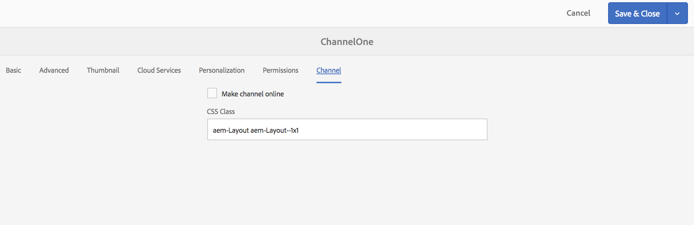

# Skapa och hantera kanaler{#creating-and-managing-channels}

En kanal visar en sekvens med innehåll och visar bilder och videoklipp, men de kan också visa en webbplats eller ett ensidigt program.

På den här sidan visas hur du skapar och hanterar kanaler för skärmar.

**Krav**:

* [Konfigurera och distribuera skärmar](configuring-screens-introduction.md)
* [Skapa och hantera skärmsprojekt](creating-a-screens-project.md)

## Skapa en ny kanal {#creating-a-new-channel}

När du har skapat ett projekt för skärmar följer du stegen nedan för att skapa en ny kanal för ett skärmsprojekt:

1. Välj länken Adobe Experience Manager (överst till vänster) och sedan Skärmar. Du kan även navigera direkt från `http://localhost:4502/screens.html/content/screens`
1. Navigera till Skärmprojekt och klicka på **Kanaler**.
1. Klicka på **Skapa** bredvid plusikonen i åtgärdsfältet. En guide öppnas (*mer information* finns i Kanaltyper).

1. Välj mallen i guiden och klicka på **Nästa**.
1. Ange egenskaperna för **Titel och Taggar**, **Fler titlar och beskrivningar**, **På/Av-tid** och **Vanity-URL**.

1. Klicka på **Skapa** så skapas kanalen och läggs till i kanalmappen.

### Kanaltyper {#channel-types}

Följande mallalternativ är tillgängliga när du använder guiden, till exempel:

| **Mallalternativ** | **Beskrivning** |
|---|---|
| Mappen Kanaler | Gör att du kan skapa en mapp för lagring av kanalsamlingar. |
| Sekvenskanal | Gör att du kan skapa en kanal som spelar upp komponenterna sekventiellt (en i taget i ett bildspel). |
| Programkanal | Gör att du kan visa ditt anpassade webbprogram i skärmspelaren. |
| 1x1 Delad skärmkanal | Gör att komponenten kan visas i en enda zon. |
| 1x2 Delad skärmkanal | Gör att resurserna kan visas i två zoner (delas vågrätt). |
| 2x2 Delad skärmkanal | Gör det möjligt att visa resurserna i fyra zoner (dela vågrätt och lodrätt i en matris). |
| 2 till 3 kanaler för delad skärm | Gör att resurserna kan visas i två zoner (delas vågrätt) där en av zonerna är större än den andra. |

>[!NOTE]
>
>Kanalerna för delad skärm delar upp visningen i flera zoner så att du kan spela upp flera upplevelser samtidigt, sida vid sida. Upplevelserna kan antingen vara statiska resurser/text eller inbäddade sekvenser.

I följande exempel visas hur en Sequence Channel **ChannelOne** skapas för ett skärmsprojekt **DemoProject**.

>[!NOTE]
>
>Du kan skapa olika zoner med hjälp av mallalternativen 1x2, 2x2 eller 2 till 3 delade skärmkanaler som nämns ovan.

***Viktigt***:

När du har skapat och lagt till innehåll i kanalen är nästa steg att skapa en plats följt av att skapa en skärm. Dessutom måste du tilldela den kanalen till en skärm. Läs mer i resurserna nedan i slutet av avsnittet.

## Arbeta med kanaler {#working-with-channels}

Du kan redigera, visa egenskaper och kontrollpanel, kopiera, förhandsgranska och ta bort en kanal.

>[!NOTE]
>
>Klicka på ikonen till vänster för att markera ett objekt. Klicka t.ex. på ikonen för kanal och utför följande åtgärder enligt bilden nedan.

### Lägga till/redigera innehåll i en kanal {#adding-editing-content-to-a-channel}

Följ stegen nedan om du vill lägga till eller redigera innehåll i en kanal:

1. Klicka på den kanal som du vill redigera (se bilden ovan).
1. Klicka på **Redigera** i åtgärdsfältets övre vänstra hörn för att redigera kanalegenskaperna. Redigeraren öppnas och du kan lägga till resurser/komponenter i kanalen som du vill publicera.

**Överföra videoklipp till kanalen** Följ stegen nedan för att överföra videoklipp till kanalen:

1. Markera kanalen där du vill överföra videon.
1. Klicka på **Redigera** i åtgärdsfältet för att öppna redigeraren.
1. Välj **Videofilmer** under Resurser och dra och släpp önskade videoklipp.

>[!NOTE]
>
>Om du får problem med att överföra videoklipp i din kanal kan du läsa [Felsöka videoklipp](troubleshoot-videos.md) under Administrera skärmar.

### Visningsegenskaper {#viewing-properties}

Följ stegen nedan om du vill visa eller redigera egenskaper för en kanal:

1. Klicka på den kanal som du vill redigera.
1. Klicka på **Egenskaper **i åtgärdsfältet för att visa/redigera kanalegenskaperna. På följande flikar kan du ändra alternativen.

### Visa instrumentpanel {#viewing-dashboard}

Följ stegen nedan för att visa kontrollpanelen för en kanal:

1. Klicka på den kanal som du vill redigera.
1. Klicka på **Visa instrumentpanel** i åtgärdsfältet för att visa instrumentpanelen. Panelen **KANALINFORMATION** och **TILLDELADE VISNINGAR** öppnas enligt bilden nedan:

### Kanalinformation {#channel-information}

Panelen Kanalinformation beskriver kanalegenskaperna tillsammans med förhandsvisningen av kanalen. Dessutom innehåller det information om huruvida kanalen är offline eller online.

Klicka på (**...**) i åtgärdsfältet **Kanalinformation** för att visa egenskaper, redigera innehållet eller för att uppdatera cache-minnet (offlineinnehåll) för kanalen.

### Online- och offlinekanaler {#online-and-offline-channels}

>[!NOTE]
>
>Som standard är kanalen offline när du skapar en kanal.

När du skapar en kanal kan den antingen definieras som en online- eller offlinekanal.

En ***onlinekanal*** visar det uppdaterade innehållet i realtidsmiljön, medan en ***offlinekanal*** visar det cachelagrade innehållet.

Följ stegen nedan för att göra kanalen online:

1. Navigera till kanalen **TestChannel** från mappen **Channels** i **TestProject**.

   Markera kanalen.

   

   Klicka på **Visa instrumentpanel** i åtgärdsfältet för att visa spelarens status. **CHANNEL INFORMATION **panel ger information om huruvida kanalen är online eller offline.

   

1. Klicka på **Egenskaper** i åtgärdsfältet och navigera till fliken **Kanal** enligt nedan:

   

1. Markera **Gör kanalen online** för att göra kanalen online.

   Klicka på **Spara och stäng** för att spara alternativet.

   

   Kanalkontrollpanelen visas och **panelen KANALINFORMATION** visar spelarens onlinestatus.

   

#### Automatiska eller manuella uppdateringar från enhetskontrollpanelen {#automatic-versus-manual-updates-from-the-device-dashboard}

I följande tabell sammanfattas de händelser som är associerade med de automatiska och manuella uppdateringarna från kontrollpanelen för enheter.

<table> 
 <tbody> 
  <tr> 
   <td><strong>Händelse</strong></td> 
   <td><strong>Automatisk uppdatering av enhet</strong></td> 
   <td><strong>Manuell uppdatering av enhet</strong></td> 
  </tr> 
  <tr> 
   <td>Ändring i onlinekanal</td> 
   <td>Innehåll uppdateras automatiskt</td> 
   <td>
Innehåll uppdaterat på "Enhet: Push Config"
 
Eller
 
Innehåll uppdaterat på <strong><i>enhet:Starta om</i></strong>
 </td> 
  </tr> 
  <tr> 
   <td>Ändring i offlinekanal, men kanalen "push-innehåll" aktiveras INTE (inget offlinepaket återskapas)</td> 
   <td>Ingen innehållsuppdatering</td> 
   <td>Ingen innehållsuppdatering</td> 
  </tr> 
  <tr> 
   <td>Ändringen i offlinekanalen och kanalen "push-innehåll" aktiveras (nytt offlinepaket)</td> 
   <td>Innehåll uppdateras automatiskt</td> 
   <td>
Innehåll uppdaterat på <strong><i>enhet: Push-konfiguration</i></strong>
 
Eller
 
Innehåll uppdaterat på <strong><i>enhet:Starta om</i></strong>
 </td> 
  </tr> 
  <tr> 
   <td>
Ändringar i konfiguration
 
    <ul> 
     <li>Visning (tvingad kanal)</li> 
     <li>Enhet</li> 
     <li>Kanaltilldelningar (ny kanal, borttagen kanal)</li> 
     <li>Kanaltilldelning (roll, händelse, planering)</li> 
    </ul> </td> 
   <td>Konfigurationen uppdateras automatiskt</td> 
   <td>
Konfigurationen har uppdaterats på <strong><i>enheten: Push-konfiguration</i></strong>
 
Eller
 
Konfigurationen har uppdaterats på <strong><i>enheten:Starta om</i></strong>
 </td> 
  </tr> 
 </tbody> 
</table>

### Tilldelade bildskärmar {#assigned-displays}

Den tilldelade visningspanelen visar den visning som är associerad med kanalen. Den innehåller en ögonblicksbild av den tilldelade visningen tillsammans med upplösningen.

De associerade skärmarna visas på panelen **Tilldelade skärmar** enligt nedan:

>[!NOTE]
>
>Mer information om hur du skapar en visning på en plats finns i:
>
>* [Skapa och hantera platser](managing-locations.md)
>* [Skapa och hantera bildskärmar](managing-displays.md)
>

Klicka dessutom på visningen på panelen **TILLDELADE** VISNINGAR för att visa visningsinformationen enligt nedan:

### Nästa steg {#the-next-steps}

Nästa steg när du har skapat en kanal och lagt till/redigerat innehåll i din kanal är att lära dig hur du skapar en plats och visar. Tilldela sedan en kanal till den visningen.

Se följande resurser för nästa steg:

* [Skapa och hantera kanaler](managing-channels.md)
* [Skapa och hantera platser](managing-locations.md)
* [Skapa och hantera bildskärmar](managing-displays.md)