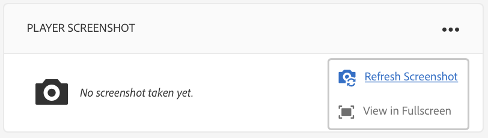

# Felsökning av Device Control Center{#troubleshooting-device-control-center}

Du kan övervaka och felsöka prestanda för din aktivitet och enhet för skärmuppspelning med hjälp av kontrollpanelen för enheter. Den här sidan innehåller information om hur du övervakar och felsöker upplevda prestandaproblem för skärmspelaren och de tilldelade enheterna.

## Övervaka och felsök från Device Control Center {#monitor-and-troubleshoot-from-device-control-center}

Du kan övervaka aktiviteten och därmed felsöka skärmspelaren med Device Dashboard.

### Instrumentpanel för enhet {#device-dashboard}

Följ stegen nedan för att navigera till kontrollpanelen för enheter:

1. Navigera till enhetskonsolen från ditt projekt, till exempel ***Testa projekt*** —> ***Enheter***.

   Välj **Enheter** och **Enhetshanteraren** i åtgärdsfältet.

   

1. Välj den enhet som du vill övervaka.

   

1. På sidan visas enhetsinformation, aktivitet och enhetsinformation som gör att du kan övervaka enhetsaktiviteter och -funktioner.

   

### Övervaka enhetsaktivitet {#monitor-device-activity}

På **aktivitetspanelen** visas den senaste pingen av skärmspelaren med tidsstämpeln. Den senaste penseln motsvarar den senaste gången som enheten kontaktade servern.

Klicka dessutom på **Samla in loggar** i det övre högra hörnet av **aktivitetspanelen** för att visa loggarna för spelaren.

### Uppdatera enhetsinformation {#update-device-details}

Gå till panelen **Enhetsinformation** för att visa enhetens IP-adress, lagringsanvändning, version av inbyggd programvara och uppspelningstid för enheten.

Klicka dessutom på **Rensa cacheminne** och **Uppdatera** för att rensa cacheminnet för enheten och uppdatera versionen av den [inbyggda programvaran](screens-glossary.md) från den här panelen.

**Klicka också på**.. i det övre högra hörnet av panelen **Enhetsinformation** för att starta om eller uppdatera spelarens status.

### Uppdatera enhetsinformation {#update-device-information}

Kontrollera panelen **ENHETSINFORMATION** för att visa konfigurationsuppdateringen, enheten, plattformen, versionen och den visning som är kopplad till enheten.

Klicka dessutom på (**...**) i det övre högra hörnet av panelen Enhetsinformation för att visa egenskaper eller uppdatera enheten.

Klicka på **Egenskaper** för att visa dialogrutan **Enhetsegenskaper** . Du kan redigera enhetens titel eller välja alternativet för konfigurationsuppdateringar som **Manuell** eller **Automatisk**.

>[!NOTE]
>
>Mer information om de händelser som är associerade med enhetens automatiska eller manuella uppdateringar finns i avsnittet ***Automatiska jämfört med Manuella uppdateringar från enhetskontrollpanelen*** i [Hantera kanaler](managing-channels.md).

### View Player Screenshot {#view-player-screenshot}

Du kan visa skärmbilden för spelaren från enheten på **PLAYER SCREENSHOT **panelen.

Klicka (**...**) i det övre högra hörnet av panelen Skärmbild i spelaren och välj **Uppdatera skärmbild **för att visa ögonblicksbilden av spelaren som körs.

### Hantera inställningar {#manage-preferences}

På panelen **INSTÄLLNINGAR** kan användaren ändra inställningarna för **administratörsgränssnittet**, **kanalväljaren** och **fjärrfelsökning** för enheten.

>[!NOTE]
>
>Mer information om detta finns i [AEM Screens Player](working-with-screens-player.md).

Klicka dessutom på **Visa inställningar** i det övre högra hörnet för att uppdatera server-URL:en och upplösningen.

## Felsöka OSGI-inställningar {#troubleshoot-osgi-settings}

Du måste aktivera den tomma referenten för att enheten ska kunna skicka data till servern. Om t.ex. den tomma refereraregenskapen är inaktiverad, kan enheten inte publicera en skärmdump.

Vissa av dessa funktioner är för närvarande bara tillgängliga om *Apache Sling Referrer-filtret Tillåt tomt* är aktiverat i OSGI-konfigurationen. Kontrollpanelen kan visa en varning om att skyddsinställningarna kan förhindra vissa av dessa funktioner från att fungera.

Följ stegen nedan för att aktivera filtret Tillåt tomt för Apache Sling Referrer-filtret

1. Gå till [Adobe Experience Manager Web Console Configuration](http://localhost:4502/system/console/configMgr/org.apache.sling.security.impl.ReferrerFilter).
1. Markera alternativet **allow.empty **.
1. Click **Save**.

### Rekommendationer {#recommendations}

I följande avsnitt rekommenderas övervakning av nätverkslänkar, servrar och spelare för att förstå hälsan och reagera på problem.

AEM har inbyggd övervakning för:

* *Varannan sekund som visar att AEM Screens Player är i drift visas* .
* *Skärmbild* från spelaren som visar vad som för närvarande visas i spelaren.
* Den version av *AEM Screens Player Firmware* som är installerad i spelaren.
* *Ledigt lagringsutrymme* i spelaren.

Rekommendationer för fjärrövervakning med programvara från tredje part:

* CPU-användning för spelare.
* Kontrollera om AEM Screens Player-processen körs.
* Fjärrstarta om/starta om spelaren.
* Realtidsmeddelanden.

Vi rekommenderar att du driftsätter Player-maskinvaran och operativsystemet på ett sätt som gör att fjärrinloggning kan diagnostisera problem och starta om spelaren.

#### Additional Resources {#additional-resources}

Se Konfigurera och felsöka [videouppspelning](troubleshoot-videos.md) för att felsöka och felsöka videoklipp som spelas upp i din kanal.
