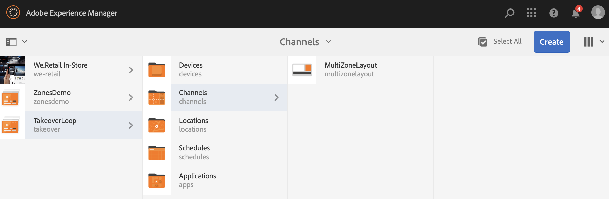

# Upptagningsloop för flera zoner till en zon{#single-zoneto-multizone}

## Använd fallbeskrivning {#use-case-description}

I det här avsnittet beskrivs ett exempel på hur du kan använda ett exempel som betonar hur du ställer in en flerzonslayoutkanal som växlar med en enda zonlayoutkanal. Varje kanal har sekvensbilder/videomaterial.

### Förhandsvillkor {#preconditions}

Innan du börjar med det här användningsexemplet måste du förstå hur du gör:

* **[Skapa och hantera kanaler](/help/screens/managing-channels.md)**
* **[Skapa och hantera platser](/help/screens/managing-locations.md)**
* **[Skapa och hantera scheman](/help/screens/managing-schedules.md)**
* **[Enhetsregistrering](/help/screens/device-registration.md)**

### Primära aktörer {#primary-actors}

Innehållsförfattare

## Konfigurera projektet {#setting-up-the-project}

Följ stegen nedan för att konfigurera ett projekt:

1. Skapa ett AEM-skärmsprojekt med namnet **TakeoverLoop**, enligt nedan.

   >[!NOTE]
   >
   >Mer information om hur du skapar och hanterar projekt i AEM-skärmar finns i [Skapa ett projekt](/help/screens/creating-a-screens-project.md).

   

1. **Skapa en delad skärmkanal**

   1. Välj mappen **Kanaler** och klicka på **Skapa** i åtgärdsfältet för att öppna guiden och skapa en kanal.
   1. Välj **Delad skärmkanal** för vänster-L-streck i guiden och skapa kanalen **MultiZoneLayout**.

      

   1. Markera **MultiZoneLayout** -kanalen och klicka på **Redigera** i åtgärdsfältet för att öppna redigeraren. Dra och släpp resurserna till var och en av zonerna. I följande exempel visas en video, bild och en textbanderoll i kanalen, vilket visas nedan.
      

1. **Skapa en 2X2-kanal med fyra bilder**

   1. Välj mappen **Kanaler** och klicka på **Skapa** i åtgärdsfältet för att öppna guiden och skapa en kanal.

   1. Välj **2X2 Split Screen Channel** i guiden och skapa kanalen **TwobyTwoChannel**.

      
   1. Markera kanalen och klicka på **Redigera** i åtgärdsfältet för att öppna redigeraren och dra och släppa fyra bilder (fyra olika zoner) till den kanalen, så som visas nedan.
      

1. **Skapa en 1X2-kanal för delad skärm med två bilder**

   1. Välj mappen **Kanaler** och klicka på **Skapa** i åtgärdsfältet för att öppna guiden och skapa en kanal.

   1. Välj **1X2 Delad** skärmkanal i guiden och skapa kanalen **OnebyTwoChannel**.

      
   1. Markera kanalen och klicka på **Redigera** i åtgärdsfältet för att öppna redigeraren och dra och släppa två bilder (två olika zoner) till den kanalen, så som visas nedan.
      

1. **Skapa en kanal med en helskärmsvideo**

   1. Välj mappen **Kanaler** och klicka på **Skapa** i åtgärdsfältet för att öppna guiden och skapa en kanal.

   1. Välj mallen **Sequence Channel** i guiden och skapa kanalen **FullScreensVideo**.

      
   1. Markera kanalen och klicka på **Redigera** i åtgärdsfältet för att öppna redigeraren, dra och släppa videokomponenten till den kanalen och lägg sedan till önskad video, enligt bilden nedan.
      