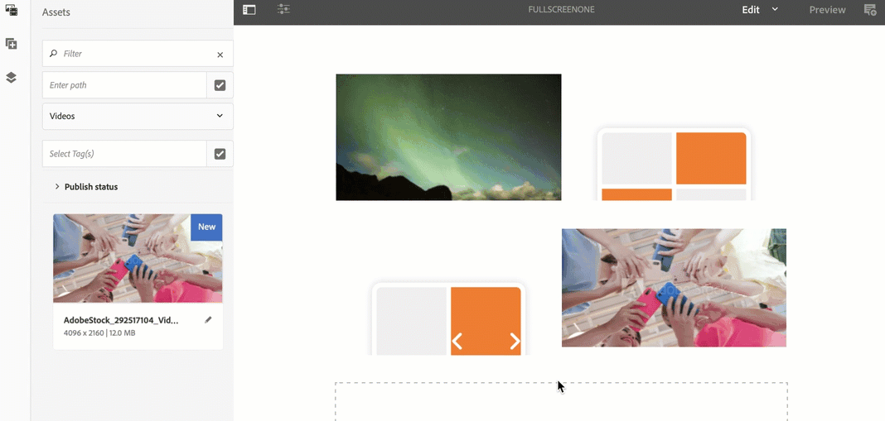

# Övertagande av en zon till flera zoner {#single-zoneto-multizone}

## Använd fallbeskrivning {#use-case-description}

I det här avsnittet beskrivs ett exempel på hur du kan använda ett exempel som betonar hur du ställer in en flerzonslayoutkanal som växlar med en enda zonlayoutkanal. Varje kanal har sekvensbilder/videomaterial.

### Förhandsvillkor {#preconditions}

Innan du börjar med det här användningsexemplet måste du förstå hur du gör:

* **[Skapa och hantera kanaler](/help/screens/managing-channels.md)**
* **[Skapa och hantera platser](/help/screens/managing-locations.md)**
* **[Skapa och hantera scheman](/help/screens/managing-schedules.md)**
* **[Enhetsregistrering](/help/screens/device-registration.md)**

### Primära aktörer {#primary-actors}

Innehållsförfattare

## Konfigurera projektet {#setting-up-the-project}

Följ stegen nedan för att konfigurera ett projekt:

1. Skapa ett AEM-skärmsprojekt med namnet **ZonesDemo**, enligt nedan.

   >[!NOTE]
   >
   >Mer information om hur du skapar och hanterar projekt i AEM-skärmar finns i [Skapa ett projekt](/help/screens/creating-a-screens-project.md).

   

1. **Skapa en sekvenskanal med en bild**

   1. Välj mappen **Kanaler** och klicka på **Skapa** i åtgärdsfältet för att öppna guiden och skapa en kanal.
   1. Välj **Sequence Channel** i guiden och skapa kanalen **FullScreenOne**.

      
   1. Markera kanalen och klicka på **Redigera** i åtgärdsfältet för att öppna redigeraren och dra och släppa en bild i den kanalen, så som visas nedan.
      

1. **Skapa en 2X2-kanal med fyra bilder**

   1. Välj mappen **Kanaler** och klicka på **Skapa** i åtgärdsfältet för att öppna guiden och skapa en kanal.

   1. Välj **2X2 Split Screen Channel** i guiden och skapa kanalen **TwobyTwoChannel**.

      
   1. Markera kanalen och klicka på **Redigera** i åtgärdsfältet för att öppna redigeraren och dra och släppa fyra bilder (fyra olika zoner) till den kanalen, så som visas nedan.
      

1. **Skapa en 1X2-kanal för delad skärm med två bilder**

   1. Välj mappen **Kanaler** och klicka på **Skapa** i åtgärdsfältet för att öppna guiden och skapa en kanal.

   1. Välj **1X2 Delad** skärmkanal i guiden och skapa kanalen **OnebyTwoChannel**.

      
   1. Markera kanalen och klicka på **Redigera** i åtgärdsfältet för att öppna redigeraren och dra och släppa två bilder (två olika zoner) till den kanalen, så som visas nedan.
      

1. **Skapa en kanal med en helskärmsvideo**

   1. Välj mappen **Kanaler** och klicka på **Skapa** i åtgärdsfältet för att öppna guiden och skapa en kanal.

   1. Välj mallen **Sequence Channel** i guiden och skapa kanalen **FullScreensVideo**.

      
   1. Markera kanalen och klicka på **Redigera** i åtgärdsfältet för att öppna redigeraren, dra och släppa videokomponenten till den kanalen och lägg sedan till önskad video, enligt bilden nedan.
      

## Ställa in överföringskanalen för övergång från en zon till flera zoner {#takeover-channel-setup}

1. **Redigera Single Zone-kanalen för övertagande av flera zoner**

   1. Markera kanalen (**FullScreenOne)** som du skapade i steg 1.
   1. Klicka på **Redigera** i åtgärdsfältet för att öppna redigeraren. Dra och släpp två kanalkomponenter och en videokomponent till redigeraren.
   

1. **Fylla i komponenter som lagts till i FullScreenOne-kanalen**

   1. Markera den första kanalkomponenten i redigeraren för **FullScreenOne** och klicka på **Konfigurera** för att peka på den kanal som skapades i föregående steg. Lägg till sökvägen till kanalen i **Kanalsökväg** till både kanalkomponenterna och dra och släpp videon till videokomponenten enligt nedan.
   

1. **Ställa in tidslängden för kanalerna vid övergång**

   >[!NOTE]
   >
   >Som standard övergår resurserna efter var 8:e sekund, men om du vill att resurserna ska övergå efter en viss tidslängd följer du steget nedan.

   1. Välj den andra kanalkomponenten i **FullskärmOne** -redigeraren och klicka på **Inställningar** för att konfigurera tidslängden för den här kanalen. Ange på samma sätt tidslängden för den andra kanalen enligt nedan.
I det här exemplet är tiden inställd på 3 sekunder.
   

## Förhandsgranska resultatet {#previewing-result}

Du kan klicka på **Förhandsgranska** i redigeraren och kontrollera hur resurserna kommer att övergå från en zon till flera.

