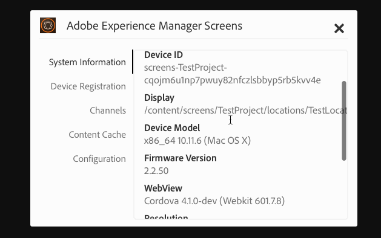

# Arbeta med AEM Screens Player{#working-with-aem-screens-player}

Du kan hantera kanalinnehållet och andra inställningar i AEM Screens Player.

>[!NOTE]
>
>Tryck på ***Ctrl+Cmd+F*** för att avsluta helskärmsläget för OS X AEM Screens Player.

När du har tilldelat en kanal till en skärm visas innehållet i AEM Screens Player. Du kan antingen konfigurera inställningar för spelaren med hjälp av inställningarna för administratörsgränssnittet (från kontrollpanelen) eller från spelaren.

## Använda enhetskontrollpanelen {#using-the-device-dashboard}

Du kan konfigurera inställningar för enheten från enhetskontrollpanelen, som du kommer åt via din AEM-redigeringsinstans.

1. Navigera till enhetskonsolen från ditt projekt, till exempel ***Testa projekt*** —> ***Enheter***.

   Välj **Enheter** och **Enhetshanteraren** i åtgärdsfältet.

   

1. Klicka på enheten för att öppna enhetens kontrollpanel.

   

1. Markera panelen **INSTÄLLNINGAR** . Du kan aktivera/inaktivera **administratörsgränssnittet** och **kanalväljaren** för spelaren bland dessa två alternativ.

   

### Användargränssnittet för administratörer {#the-admin-ui}

Om du aktiverar **administratörsgränssnittet** från inställningspanelen kan användaren öppna administratörsinställningarna från skärmspelaren. Om du inaktiverar det här alternativet från enhetspanelen kan användaren inte öppna administratörsgränssnittet från spelaren.

Om du vill visa administratörsgränssnittet från Skärmspelaren trycker du länge på det övre vänstra hörnet för att öppna Admin-menyn, på den AEM Screens-spelare som har aktiverats med pekfunktion eller med en mus. Den visar information när registreringen är klar och kanalerna har lästs in.

>[!NOTE]
>
>Dessutom kan du visa AEM Screens Player-appens drifttid för att kontrollera programmets hälsostatus.

Om du väljer alternativet **Konfiguration** på menyn kan du även återställa **firmware**, **Inställningar** eller **Till fabrik** i den här dialogrutan.

Dessutom kan du ange det maximala antalet loggfiler som ska behållas för en AEM Screens-spelare i **Max antal. loggfiler som ska behållas**. Se skärmbilden nedan för mer information.

>[!NOTE]
>
>Alternativet **Uppdatera inbyggd** programvara fungerar bara på cordova, till exempel Android-spelare.

Du kan rensa cache för kanaler och program från administratörsgränssnittet i AEM Screens Player.

Uppdatera cacheminnet genom att välja **innehållscacheminnet** på sidospåret.

### Kanalväxlaren {#the-channel-switcher}

Om du aktiverar **kanalväljaren** från panelen Inställningar kan användaren öppna kanalvalet/inställningarna från skärmspelaren.

Om du inaktiverar det här alternativet från enhetspanelen kan användaren inte styra kanalinställningarna från Skärmspelaren.

Du kan växla och styra inställningarna för kanalen från skärmspelaren.

Om du vill visa kanalväljaren från spelaren trycker du länge på det nedre vänstra hörnet för att öppna kanalväljaren som tillåter växling av kanaler och andra funktioner.

>[!NOTE]
>
>Du kan också aktivera eller inaktivera admin-menyn och kanalväljaren för spelaren från skärmspelaren.
>
>(Se *Ändra inställningar från Skärmspelaren* enligt avsnittet nedan.)

### Hantera inställningar från AEM Screens Player {#managing-preferences-from-the-aem-screens-player}

Du kan också ändra inställningarna för administratörsgränssnittet och kanalväljaren från själva spelaren.

Följ de här stegen för att ändra inställningarna för spelaren:

1. Tryck länge på det övre vänstra hörnet i den inaktiva kanalen för att öppna administrationspanelen.
1. Navigera till **Konfiguration** på den vänstra åtgärdsmenyn.
1. Aktivera/inaktivera konfiguration för **administratörsgränssnitt** eller **kanalväxlare**.

## Felsöka AEM Screens Player {#troubleshooting-aem-screens-player}

Du kan felsöka olika problem i samband med AEM Screens Player (maskinvara och programvara):

| **Problem** | **Rekommendationer** |
|---|---|
| Spelarlagringen är full | Eliminera onödiga filer |
| Spelaren förlorade nätverket | Använd katt-5/katt-6-kabel. För wifi ska du minska avståndet från routern till spelarenheten |
| AEM Screens Player kraschade | Vi rekommenderar att du har en övervakningsapp som ser till att AEM Screens Player alltid körs |
| AEM Screens Player förlorade inställningar | Kontrollera anslutningen till AEM-servern |
| AEM Screens Player startar inte automatiskt efter att spelaren startats om/startats om | Kontrollera operativsystemets startmapp eller initieringsprocedur |
| AEM Screens Player visar fel/gammalt innehåll | Kontrollera nätverksanslutning |

### Uppdateringar för AEM Screens Player {#updates-for-aem-screens-player}

Det finns två typer av uppdateringar för AEM Screens Player:

| **Metod** | **Information** | **via fjärranslutning** | **Automatiserad** | **0 Driftavbrott** |
|---|---|---|---|---|
| Uppdatering av inbyggd programvara | Används på befintliga installerade spelare via fjärrkommando. Efter uppdateringen läses Player in automatiskt igen med det befintliga innehållet. | Ja | Anpassat | Nästan - 1-3 sekunder |
| Uppdateringar för spelargränssnitt | Det här är en ny körbar fil som ska distribueras på spelaren. Detta kräver att du fjärrkopierar en ny binär fil i spelaren och stoppar den pågående körningen och startar den nya versionen. Detta kan kräva att du hämtar förinläsningen av paketen igen. | Ja (via fjärrgränssnitt) | Anpassat | Nej |

