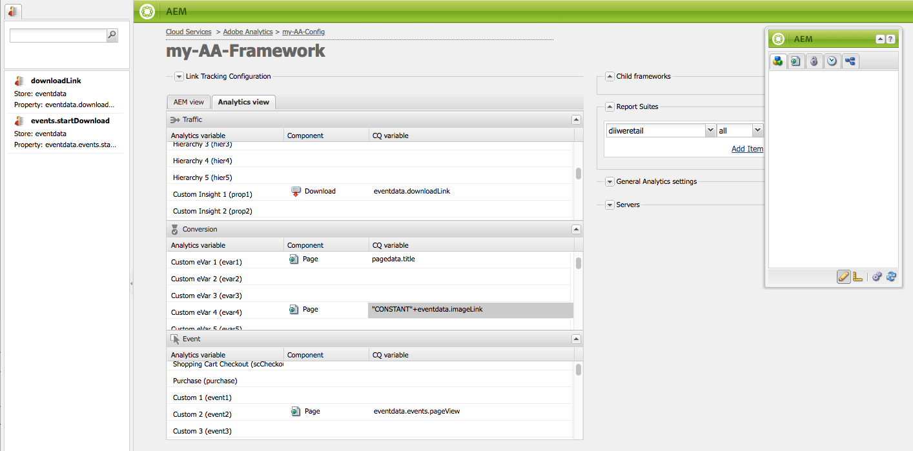

# Mappa komponentdata med Adobe Analytics-egenskaper{#mapping-component-data-with-adobe-analytics-properties}

Lägg till komponenter i ramverket som samlar in data som ska skickas till Adobe Analytics. Komponenter som är utformade för att samla in analysdata lagrar data i lämplig **CQ-variabel**. När du lägger till en sådan komponent i ett ramverk visas en lista med CQ-variabler så att du kan använda alla till rätt **Analytics-variabel**.

När **AEM-vyn** är öppen visas Analytics-variablerna i innehållssökaren.

Du kan mappa flera Analytics-variabler med samma **CQ-variabel**.

Mappade data skickas till Adobe Analytics när sidan läses in och följande villkor uppfylls:

* Sidan är kopplad till ramverket.
* Sidan använder de komponenter som har lagts till i ramverket.

Använd följande procedur för att mappa CQ-komponentvariabler med Adobe Analytics rapportegenskaper.

1. I **AEM-vyn** drar du en spårningskomponent från sidosparken till ramverket. Dra till exempel komponenten **Sida** från kategorin **Allmänt** .

   

   Det finns flera standardkomponentgrupper: **General**, **Commerce**, **Communities**, **Search&amp;Promote** och **Other**. Din AEM-instans kan vara konfigurerad att visa olika grupper och komponenter.

1. Om du vill mappa Adobe Analytics-variabler till variabler som är definierade i komponenten drar du en **Analytics-variabel** från innehållssökaren till ett fält i spårningskomponenten. Dra till exempel `Page Name (pageName)` till `pagedata.title`.

   

   >[!NOTE]
   >
   >Det Report Suite-ID (RSID) som valts för ramverket avgör vilka Adobe Analytics-variabler som visas i innehållssökaren.

1. Upprepa de två föregående stegen för andra komponenter och variabler.

   >[!NOTE]
   >
   >Du kan mappa flera Analytics-variabler (t.ex. `props`, `eVars`, `events`) till samma CQ-variabel (t.ex. `pagedata.title`)

   >[!CAUTION]
   >
   >Vi rekommenderar starkt följande:
   >
   >* `eVars` och mappas `props` till CQ-variabler som börjar med antingen `pagedata.X` eller `eventdata.X`
   >* Händelser bör mappas till variabler som börjar med `eventdata.events.X`

1. Om du vill göra ramverket tillgängligt på publiceringsinstansen på webbplatsen öppnar du fliken **Page **sidespark och klickar på **Activate Framework.**

## Mappa produktrelaterade variabler {#mapping-product-related-variables}

AEM använder en konvention för att namnge produktrelaterade variabler och händelser som ska mappas till produktrelaterade egenskaper i Adobe Analytics:

| CQ-variabel | Analytics Variable | Beskrivning |
|---|---|---|
| `product.category` | `product.categor`y (konverteringsvariabel) | Produktkategorin. |
| `product.sku` | `product.sku` (konverteringsvariabel) | Produktens sku. |
| `product.quantity` | `product.quantity` (konverteringsvariabel) | Antalet produkter som köpts. |
| `product.price` | `product.price` (konverteringsvariabel) | Produktpriset. |
| `product.events.*eventName*` | Vilka lyckade händelser som ska kopplas till produkten i din rapport. | `product.events` är prefixet för händelser med namnet *eventName.* |
| `product.evars.*eVarName*` | Konverteringsvariablerna ( `eVar`) som ska associeras med produkten. | `product.evars` är prefixet för eVar-variabler med namnet *eVarName.* |

Flera AEM Commerce-komponenter använder dessa variabelnamn.

>[!NOTE]
>
>Mappa inte egenskapen Adobe Analytics Products till en CQ-variabel. Konfigurering av produktrelaterade mappningar enligt beskrivningen i tabellen motsvarar i princip mappning av variabeln Produkter.

## Kontrollera rapporter om Adobe Analytics {#checking-reports-on-adobe-analytics}

1. Logga in på Adobes Analytics webbplats med samma inloggningsuppgifter som du fått från AEM.
1. Se till att det RSID som du valde är det som användes i föregående steg.
1. I **Rapporter** (till vänster på sidan) väljer du **Anpassad konvertering**, sedan **Anpassad konvertering 1-10** och väljer variabeln som motsvarar `eVar7`

1. Beroende på vilken version av Adobe Analytics du använder måste du vänta i genomsnitt 45 minuter tills rapporten uppdateras med söktermen som används. t.ex. äggplanta i exemplet

## Använda Content Finder (cf#) med ramverken i Adobe Analytics {#using-the-content-finder-cf-with-adobe-analytics-frameworks}

När du först öppnar ett Adobe Analytics-ramverk innehåller innehållssökaren fördefinierade Analytics-variabler under:

* Trafik

* Konvertering

* Händelser

När ett RSID är markerat läggs alla variabler som tillhör det RSID till i listan.\
Detta `cf#` behövs för att mappa Analytics-variabler till CQ-variablerna som finns i de olika spårningskomponenterna. Se Konfigurera ett ramverk för grundläggande spårning.

Beroende på vilken vy som har valts för ramverket fylls innehållssökaren i av antingen Analytics-variabler (i AEM-vyn) eller CQ-variabler (i Analytics-vyn).

Listan kan ändras på följande sätt:

1. I **AEM-vyn** kan listan filtreras beroende på vilken variabeltyp som väljs med hjälp av de tre filterknapparna:

   * Om *ingen knapp* är markerad visas den fullständiga listan i listan.
   * Om knappen **Trafik** är markerad visas bara de variabler som tillhör trafikavsnittet i listan
   * Om knappen **Konvertera** är markerad visas endast de variabler som tillhör avsnittet Konvertering.
   * Om knappen **Händelser** är markerad visas bara de variabler som tillhör avsnittet Händelser i listan.
   >[!NOTE]
   >
   >Endast en filterknapp kan vara aktiv samtidigt.

   >[!NOTE]
   >
   >Search&amp;Promote-variabler tillhör även avsnittet Konvertering.

   1. Listan har också en sökfunktion som filtrerar elementen efter den text som anges i sökfältet.
   1. Om ett filteralternativ är aktiverat när du söker efter element i listan, filtreras även de resultat som visas enligt den aktiva knappen.
   1. Listan kan läsas in igen när som helst med hjälp av pilknappen.
   1. Om flera RSID är markerade i ramverket visas alla variabler i listan med alla etiketter som används i de markerade RSID:erna.

1. I vyn Adobe Analytics visar Content Finder alla CQ-variabler som tillhör spårningskomponenterna som dras i CQ-vyn.

   * Om till exempel **Download-komponenten **är den *enda som dras* i CQ-vyn (som har två mappningsbara variabler *eventdata.downloadLink* och *eventdata.events.startDownload*) ser Content Finder ut så här när du växlar till Adobe Analytics-vyn:
   

   * Variablerna kan dras &amp;släppas till alla Adobe Analytics-variabler som tillhör någon av de tre variabelavsnitten (**Trafik**, **Konvertering** och **Händelser**).
   * När du drar en ny spårningskomponent till ramverket i CQ-vyn läggs de CQ-variabler som tillhör komponenten automatiskt till i Content Finder(cf#) i Adobe Analytics-vyn.
   >[!NOTE]
   >
   >Endast en CQ-variabel kan mappas till en Adobe Analytics-variabel samtidigt

## Använda AEM-vyn och Analytics-vyn {#using-aem-view-and-analytics-view}

Man kan när som helst växla mellan två sätt att se på Adobe Analytics-mappningarna när man är på en ramverkssida. De två vyerna ger en bättre översikt över mappningarna inom ramverket, från två olika perspektiv.

### AEM-vy {#aem-view}

Om du tar bilden ovan som exempel har **AEM-vyn** följande egenskaper:

1. Det här är standardvyn när ramverket öppnas.
1. Vänster sida: Innehållssökaren (cf#) fylls i med Adobe Analytics-variabler baserat på de RSID(n) som valts.
1. Flikrubriker (**AEM-vyn** och **Analytics-vyn**): använder du dessa för att växla mellan de två vyerna.

1. **AEM-vy**:

   1. Om ramverket har komponenter som ärvs från dess överordnade, visas de här tillsammans med variablerna som mappas till komponenterna.

      1. Ärvda komponenter är låsta.
      1. Om du vill låsa upp en ärvd komponent dubbelklickar du på hänglåset bredvid komponentens namn
      1. För att kunna återställa arvet måste du ta bort den olåsta komponenten; därefter återfår den sin låsta status.
   1. **Dra komponenterna hit för att inkludera dem i analysramverket**: Komponenter kan dras från Sidekick och släppas här.
   1. Du kan hitta alla komponenter som för närvarande ingår i analysramverket:

      1. Om du vill lägga till en komponent drar du den från sidosparkens komponentflik
      1. Om du vill ta bort en komponent och alla dess mappningar väljer du Ta bort på komponentens snabbmeny och accepterar sedan borttagningen i bekräftelsedialogrutan.
      1. Tänk på att en komponent bara kan tas bort från ramverket som den skapades i och inte kan tas bort från underordnade ramverk i traditionell mening (de kan bara skrivas över).

### Analytics View {#analytics-view}

1. Du kommer åt den här vyn genom att växla till fliken **Analytics-vy** i ramverket.
1. Vänster sida: Content Finder (cf#) ifylld av CQ-variabler baserade på de komponenter som dras till ramverket i CQ-vyn.
1. Flikrubriker (**AEM-vyn** och **Analytics-vyn**): använder du dessa för att växla mellan de två vyerna.

1. I de tre tabellerna (Traffic, Conversion, Event) listas alla tillgängliga Adobe Analytics-variabler. som tillhör de markerade RSID:erna. Mappningarna som visas här ska vara desamma som i AEM-vyn:

   * **Trafik**:

      * Trafikvariabel ( `prop1`) mappad till en CQ-variabel ( `eventdata.downloadLink`)
      * När komponenten har en Padlock bredvid sig innebär det att den ärvs från ett överordnat ramverk och därför inte kan redigeras
   * **Konvertering**:

      * Konverteringsvariabel ( `eVar1`) mappad till en CQ-variabel ( `pagedata.title`)
      * Konverteringsvariabel ( `eVar3`) mappad till ett javascript-uttryck som lagts till textbundet genom att dubbelklicka på CQ-variabelfältet och ange koden manuellt
   * **Händelse**:

      * Händelsevariabel ( `event1`) mappad till en CQ-händelse ( `eventdata.events.pageView`)

>[!NOTE]
>
>CQ-variabelkolumnen för en tabell kan även fyllas i genom att dubbelklicka på fältet och lägga till text. Dessa fält accepterar javascript som indata.
>
>* t.ex. bredvid `prop3` du kan lägga till
>* `'`* `Adobe:'+pagedata.title+':'+pagedata.sitesection`\
   >  om du vill skicka *titeln* på en sida som är sammanfogad med dess *platskarta* med *:* (kolon) och prefix med *Adobe* som `prop3`

>[!CAUTION]
>
>Endast en CQ-variabel kan mappas till en Adobe Analytics-variabel åt gången.

